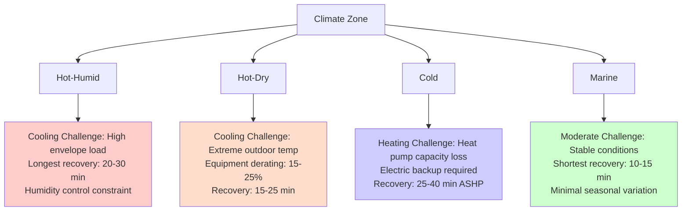
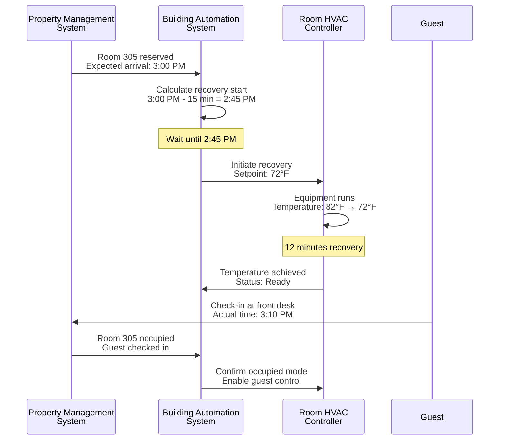
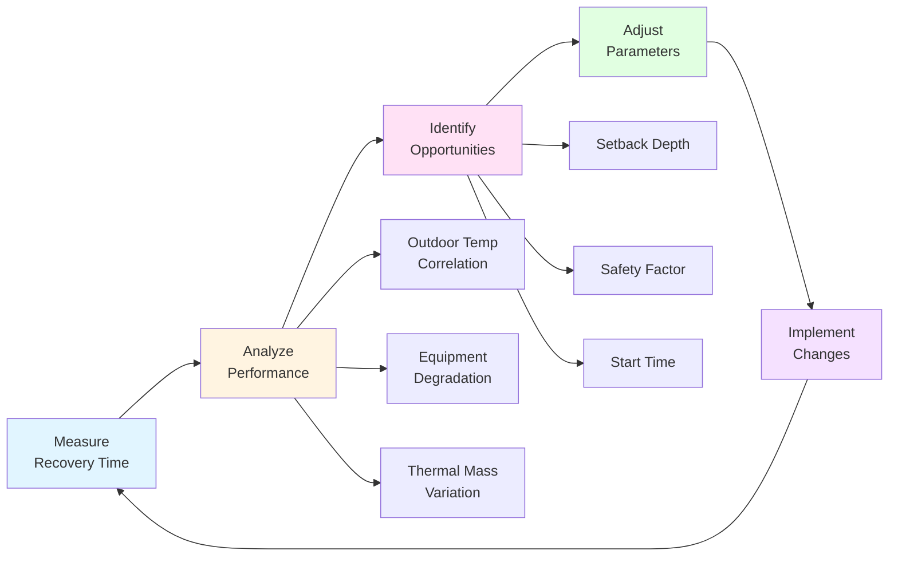

## Recovery Time Fundamentals

Recovery time represents the duration required to restore guest room temperature from setback conditions to comfort setpoint before guest arrival. This critical parameter determines when pre-conditioning must begin and directly impacts both energy savings potential and guest satisfaction. Insufficient recovery time causes guests to encounter uncomfortable conditions; excessive pre-conditioning wastes energy by maintaining comfort mode during extended vacant periods.

The recovery process involves heating or cooling not only room air but all thermal mass within the space—furniture, bedding, walls, flooring, and building contents. These elements store significant thermal energy, creating lag between air temperature changes and actual comfort conditions. Room air temperature may reach setpoint within minutes while furniture surfaces remain at setback temperature, continuing to extract heat from occupants and creating discomfort perception despite thermostat indication of acceptable conditions.

## Recovery Time Calculation Methods

### Simplified Analytical Approach

Calculate minimum recovery time using first-law thermodynamic analysis accounting for air mass, thermal mass of contents, and envelope heat transfer:

$$t_{recovery} = \frac{M_{air} C_{p,air} \Delta T + \sum M_{mass} C_{p,mass} \Delta T}{Q_{equip} - Q_{envelope}}$$

where:
- $M_{air}$ = room air mass (lb)
- $M_{mass}$ = mass of furnishings and building components (lb)
- $C_{p}$ = specific heat capacity (Btu/lb-°F)
- $\Delta T$ = temperature change from setback to comfort (°F)
- $Q_{equip}$ = HVAC equipment net capacity (Btu/hr)
- $Q_{envelope}$ = envelope heat gain/loss during recovery (Btu/hr)

The numerator represents total sensible energy required to change temperature of all mass in the space. The denominator represents net heating or cooling capacity available after accounting for simultaneous envelope loads that oppose the recovery process.

### Detailed Calculation Example

**Room Characteristics**:
- Dimensions: 14 ft × 20 ft × 9 ft ceiling = 2,520 ft³
- Air mass: $2,520 \times 0.075 = 189$ lb
- Furnishings equivalent thermal mass: 40% of air mass = 76 lb air equivalent
- Total effective mass: $189 + 76 = 265$ lb

**Cooling Recovery** (from 82°F setback to 72°F comfort):
- Temperature change: $\Delta T = 82 - 72 = 10°F$
- Energy removal required: $265 \times 0.24 \times 10 = 636$ Btu
- Equipment capacity: 12,000 Btu/hr (rated)
- Outdoor temperature: 95°F (design condition)
- Envelope solar gain: 4,200 Btu/hr
- Envelope conduction: 1,800 Btu/hr
- Total envelope load: 6,000 Btu/hr
- Net capacity: $12,000 - 6,000 = 6,000$ Btu/hr
- Recovery time: $636 \div 6,000 = 0.106$ hr = 6.4 minutes

**Heating Recovery** (from 55°F setback to 70°F comfort):
- Temperature change: $\Delta T = 70 - 55 = 15°F$
- Energy addition required: $265 \times 0.24 \times 15 = 954$ Btu
- Equipment capacity: 15,000 Btu/hr (rated)
- Outdoor temperature: 10°F (design condition)
- Envelope heat loss: 8,500 Btu/hr
- Net capacity: $15,000 - 8,500 = 6,500$ Btu/hr
- Recovery time: $954 \div 6,500 = 0.147$ hr = 8.8 minutes

### Safety Factor Application

Apply safety factors to calculated recovery time accounting for real-world variations:

| Condition | Safety Factor | Application |
|-----------|--------------|-------------|
| Standard design conditions | 1.3-1.5× | Accounts for filter loading, minor refrigerant undercharge |
| Extreme weather (>100°F or <0°F) | 1.5-2.0× | Equipment capacity degradation at temperature extremes |
| Aging equipment (>10 years) | 1.5-1.8× | Capacity loss from compressor wear, heat exchanger fouling |
| High thermal mass rooms | 1.4-1.7× | Suites with extensive furnishings, thick carpet, heavy drapes |
| Variable occupancy timing | 1.2-1.4× | Ensures adequate buffer for arrival time uncertainty |

For the previous examples, applying 1.4× safety factor:
- Cooling recovery design time: $6.4 \times 1.4 = 9$ minutes
- Heating recovery design time: $8.8 \times 1.4 = 12$ minutes

Target initiating recovery 10-12 minutes before expected guest arrival for this typical room under design conditions.

### Empirical Verification Methods

Validate calculated recovery times through field measurement during commissioning:

**Step 1 - Controlled Testing**: Select representative rooms on different building orientations (north, south, east, west) and test under various outdoor temperature conditions. Install temporary dataloggers recording air temperature at 1-minute intervals.

**Step 2 - Trigger Recovery**: Command equipment from full setback (82°F cooling or 55°F heating) to comfort setpoint (72°F cooling or 70°F heating) while monitoring outdoor temperature and solar conditions.

**Step 3 - Measure Response**: Record time required for room temperature to reach within 2°F of setpoint and stabilize (derivative <0.5°F per 10 minutes).

**Step 4 - Calculate Coefficient**: Determine ratio of measured to calculated recovery time:

$$k_{empirical} = \frac{t_{measured}}{t_{calculated}}$$

**Step 5 - Apply Correction**: Use property-specific coefficient for all subsequent recovery time estimates, accounting for actual thermal mass, envelope characteristics, and equipment performance specific to the facility.

## Factors Affecting Recovery Time

### Equipment Capacity and Degradation

HVAC equipment rated capacity represents performance at standard rating conditions (typically 95°F outdoor for cooling, 47°F for heating). Actual capacity varies significantly with operating conditions:

**Cooling Capacity Temperature Dependence**:
$$Q_{cool,actual} = Q_{cool,rated} \times \left(1 - k_{temp}(T_{outdoor} - 95)\right)$$

where $k_{temp} \approx 0.015$ per °F for typical DX equipment. At 105°F outdoor temperature:
$$Q_{cool,actual} = Q_{rated} \times (1 - 0.015 \times 10) = 0.85 \times Q_{rated}$$

Equipment delivers only 85% of rated capacity at extreme outdoor temperature, extending recovery time by approximately 18% solely from capacity degradation before considering increased envelope loads.

**Heating Capacity Air-Source Heat Pump**:
$$Q_{heat,actual} = Q_{heat,rated} \times \left(1 + k_{temp}(T_{outdoor} - 47)\right)$$

where $k_{temp} \approx -0.025$ per °F. At 10°F outdoor temperature:
$$Q_{heat,actual} = Q_{rated} \times (1 - 0.025 \times 37) = 0.075 \times Q_{rated}$$

Heat pump capacity plummets to only 7.5% of rated at severe cold conditions, making heat pump-based systems unsuitable for cold climate applications requiring rapid recovery. Electric resistance or hydronic heating maintains constant capacity regardless of outdoor temperature.

### Thermal Mass Characterization

Room thermal mass significantly impacts recovery time but varies widely based on finishes and furnishings:

| Component | Mass (lb/ft² floor) | Thermal Capacity (Btu/ft² floor-°F) | Impact |
|-----------|---------------------|-------------------------------------|---------|
| Air (9 ft ceiling) | 0.68 | 0.16 | Baseline |
| Lightweight furnishings | 0.30 | 0.12 | +75% thermal mass |
| Standard hotel room | 0.50 | 0.20 | +125% thermal mass |
| Luxury suite | 0.80 | 0.32 | +200% thermal mass |
| Heavy furniture/stone | 1.20 | 0.48 | +300% thermal mass |

Luxury suites with extensive furnishings, stone countertops, and thick carpet/padding require 2-3× longer recovery time than lightweight economy rooms of identical HVAC equipment capacity. Customize recovery timing by room type rather than applying uniform property-wide values.

### Envelope Load Magnitude

Envelope heat transfer during recovery opposes equipment operation, reducing net capacity available for temperature change:

**Peak Envelope Cooling Load Components**:
- **Solar gain**: 20-50 Btu/hr-ft² window area (west-facing, no shading)
- **Conduction**: 5-15 Btu/hr-ft² exterior wall area (depends on R-value, ΔT)
- **Infiltration**: 0.3-0.6 ACH typical, 2-4 Btu/hr-ft² floor area

Total envelope load during recovery ranges from 3,000-8,000 Btu/hr for typical 300 ft² guest room, consuming 25-65% of equipment capacity before any temperature change occurs.

**Mitigation Strategies**:
- **Window coverings**: Automated blackout shades deployed during setback reduce solar gain by 60-80%
- **Envelope improvements**: Higher R-value walls/windows reduce conduction proportionally
- **Infiltration sealing**: Weatherstripping and gasket improvements reduce air leakage 40-60%

### Climate Zone Effects

Recovery time varies seasonally and by climate zone:



Design recovery capacity for worst-case seasonal conditions rather than annual average. Properties in hot climates require adequate cooling capacity during peak summer; cold climate properties need supplemental heating to compensate for heat pump capacity degradation.

## Equipment Selection for Fast Recovery

### Capacity Oversizing Considerations

Equipment sized strictly to design cooling/heating load may provide inadequate recovery capacity. Consider intentional oversizing specifically to enable rapid temperature recovery:

**Standard Load-Based Sizing**:
$$Q_{equip} = Q_{load,design} \times 1.15$$

This 15% safety factor provides margin for calculation uncertainty but insufficient capacity for rapid recovery from deep setback.

**Recovery-Based Sizing**:
$$Q_{equip} = \max\left(Q_{load,design} \times 1.15, \frac{Q_{recovery}}{t_{target}}\right)$$

where:
$$Q_{recovery} = \frac{M_{total} C_{p} \Delta T_{setback}}{t_{target}} + Q_{envelope,peak}$$

**Example Calculation**:
- Design cooling load: 10,000 Btu/hr
- Recovery thermal capacity: 636 Btu (from previous example)
- Target recovery time: 10 minutes = 0.167 hr
- Recovery capacity required: $636 \div 0.167 = 3,808$ Btu/hr
- Envelope peak load: 6,000 Btu/hr
- Total recovery capacity: $3,808 + 6,000 = 9,808$ Btu/hr
- Standard sizing: $10,000 \times 1.15 = 11,500$ Btu/hr ✓
- Recovery check: $11,500 > 9,808$ ✓ (adequate)

Standard load-based sizing provides adequate recovery for this lightweight room with 10°F setback. Deep setback (82°F to 70°F = 12°F) or heavy thermal mass rooms may require deliberate oversizing:

- Deep setback recovery: 764 Btu thermal capacity
- Recovery capacity: $764 \div 0.167 + 6,000 = 10,575$ Btu/hr
- Standard sizing: 11,500 Btu/hr ✓ (marginal)
- 20% upsize: $10,000 \times 1.20 = 12,000$ Btu/hr ✓ (preferred)

### System Type Comparison

Different HVAC system types provide varying recovery performance characteristics:

| System Type | Typical Capacity | Response Time | Recovery Time | Suitability |
|-------------|------------------|---------------|---------------|-------------|
| **PTAC** | 7,000-15,000 Btu/hr | Immediate | 12-18 min | Good - fast response, simple control |
| **PTHP** | 7,000-15,000 Btu/hr | Immediate | 15-25 min cool<br/>25-40 min heat | Fair - slow heating in cold climates |
| **2-Pipe Fan Coil** | 400-800 CFM | 2-5 min | 10-15 min | Excellent - constant capacity source |
| **4-Pipe Fan Coil** | 400-800 CFM | 2-5 min | 8-12 min | Excellent - simultaneous heat/cool |
| **VRF Indoor Unit** | 7,000-18,000 Btu/hr | 3-8 min | 10-18 min | Excellent - modulating capacity |
| **Mini-Split** | 9,000-24,000 Btu/hr | 2-5 min | 8-15 min | Excellent - oversized for recovery |

**Key Observations**:

**PTACs/PTHPs**: Self-contained units provide immediate response (no delay for chilled/hot water distribution) but limited capacity. Heating via heat pump suffers severe capacity degradation in cold weather, extending recovery time to unacceptable levels below 20°F outdoor temperature. Properties in cold climates should specify PTHPs with electric resistance supplemental heat or use electric-only heating PTACs.

**Fan Coils**: Central water systems deliver excellent recovery performance when water temperature maintained during setback periods. Two-pipe systems switching between heating and cooling seasonally provide consistent capacity. Four-pipe systems with simultaneous heating/cooling capability enable shoulder season optimization and fastest recovery (can heat thermal mass while cooling air or vice versa).

**VRF Systems**: Variable refrigerant flow provides excellent recovery through modulating capacity and ability to temporarily operate at 120-130% rated capacity during pulldown. Advanced VRF systems with refrigerant boost mode can deliver up to 150% capacity for short periods (10-15 minutes) specifically for rapid recovery applications.

**Mini-Splits**: Ductless mini-split systems frequently installed at higher capacity than strictly required for load (to reduce runtime and improve efficiency at part-load). This inherent oversizing provides exceptional recovery performance, typically fastest among all system types.

### Staged Capacity Systems

Multi-stage or modulating equipment provides optimal balance between recovery performance and operational efficiency:

**Two-Stage Systems**:
- Stage 1 (low): 60-70% capacity for normal operation
- Stage 2 (high): 100% capacity for recovery and peak load
- Control logic: Activate high stage during recovery, revert to low stage when within 2°F of setpoint

**Variable Speed Compressors**:
- Normal operation: 40-100% capacity modulation matching load
- Recovery mode: 100-120% capacity (overcurrent rating allows temporary boost)
- Transition: Gradual ramp-down as room approaches setpoint prevents overshoot

Multi-stage operation reduces recovery time 30-40% compared to single-stage equipment of identical maximum capacity by maintaining high-stage operation throughout recovery period rather than cycling on/off.

## Pre-Arrival Notification Integration

### Property Management System Communication

Integration with property management system (PMS) provides deterministic guest arrival prediction based on reservation data and check-in transactions:

**Standard PMS Data Fields**:
- Reservation number and guest name
- Expected check-in date and time
- Room number assignment
- Check-in status (reserved, early arrival, checked in)
- Checkout date and status
- Special requests and VIP indicators

**BAS-PMS Communication Protocol**:



**Communication Timing**: PMS updates transmitted to BAS at configurable intervals:
- **1-minute polling**: Real-time response, high network traffic
- **5-minute polling**: Standard configuration, acceptable delay
- **Event-driven**: PMS pushes updates immediately upon transaction, optimal responsiveness

### Mobile App Pre-Conditioning

Modern hotel mobile applications enable guests to trigger room conditioning in advance of arrival:

**Guest-Initiated Pre-Conditioning Workflow**:

1. **Geofencing Detection**: Mobile app detects guest entering geofence radius (5-10 miles from property)
2. **Notification Prompt**: App notifies guest "You're approaching [Hotel Name]. Would you like your room prepared?"
3. **Guest Confirmation**: Guest taps confirmation button
4. **App-to-Cloud Communication**: Mobile app transmits pre-condition request to cloud service
5. **Cloud-to-BAS Integration**: Cloud platform communicates with hotel BAS via API
6. **Recovery Initiation**: BAS commands room HVAC to comfort mode
7. **Status Notification**: Guest receives confirmation "Room 305 is being prepared"
8. **Completion Notification**: App notifies guest when room reaches comfort temperature

**Benefits**:
- **Energy Optimization**: Conditions only upon confirmed guest approach versus statistical prediction
- **Guest Experience**: Empowers guest control and communicates attentiveness
- **Arrival Accuracy**: Geofencing provides 15-30 minute arrival warning, precise for recovery timing

**Implementation Complexity**: Requires mobile app development, cloud platform integration, API development for BAS connectivity, and ongoing cloud service subscription costs. Cost typically $50,000-150,000 initial development plus $10,000-30,000 annual cloud/maintenance fees for mid-size hotels.

### Building Automation System Logic

Implement pre-arrival conditioning through BAS control sequences integrating multiple data sources:

**Decision Tree Logic**:

```
IF room_status = "Reserved" THEN
    arrival_time = PMS_expected_checkin

    IF mobile_app_precondition_request THEN
        recovery_start = NOW
        priority = HIGH
    ELSE IF current_time >= (arrival_time - recovery_time - safety_margin) THEN
        recovery_start = current_time
        priority = NORMAL
    ELSE
        recovery_start = (arrival_time - recovery_time - safety_margin)
        priority = NORMAL
    END IF

    # Dynamic recovery time based on conditions
    recovery_time = base_recovery_time × outdoor_temp_factor × time_of_day_factor

    # Initiate recovery
    HVAC_mode = COMFORT
    cooling_setpoint = 72°F
    heating_setpoint = 70°F
    fan_mode = AUTO

ELSE IF room_status = "Vacant" THEN
    HVAC_mode = SETBACK
    cooling_setpoint = 82°F
    heating_setpoint = 55°F

END IF
```

**Adaptive Recovery Timing**: System learns actual recovery duration by outdoor temperature bin and room type, adjusting future recovery start times to optimize performance:

$$t_{recovery,adjusted} = t_{recovery,base} \times f_{outdoor}(T_{outdoor}) \times f_{learned}$$

where $f_{learned}$ represents correction factor from historical performance data.

## Guest Arrival Prediction Methods

### Statistical Analysis of Check-In Patterns

Analyze historical check-in data to develop probabilistic arrival models:

**Data Collection Requirements**:
- Minimum 12 months of PMS check-in transaction data
- Fields: Reserved check-in time, actual check-in time, day of week, season, group/transient designation
- Sample size: >5,000 check-ins for statistically significant analysis

**Arrival Distribution Development**:

For properties with 3:00 PM standard check-in, typical distribution:

| Time Window | Percentage | Cumulative | Strategy |
|-------------|------------|------------|----------|
| Before 1:00 PM | 5% | 5% | Early arrival - manual override |
| 1:00-2:00 PM | 8% | 13% | Begin recovery for early cluster |
| 2:00-3:00 PM | 22% | 35% | Peak early arrivals |
| 3:00-4:00 PM | 30% | 65% | Scheduled check-in peak |
| 4:00-5:00 PM | 18% | 83% | Late arrivals |
| 5:00-6:00 PM | 10% | 93% | After-work arrivals |
| After 6:00 PM | 7% | 100% | Evening/night arrivals |

**Optimization Target Selection**:

**Conservative Approach** (80th percentile): Initiate recovery targeting 80% of guests encounter ready rooms. For distribution above, 80th percentile = 4:30 PM. Start recovery at 4:15 PM (assuming 15-minute recovery time).
- 80% of guests experience immediate comfort
- 20% tolerate brief recovery period
- Moderate energy waste from early conditioning

**Balanced Approach** (50th percentile): Target median arrival (50% before, 50% after). Median arrival = 3:30 PM. Start recovery at 3:15 PM.
- 50% immediate comfort, 50% brief wait
- Minimizes total energy consumption
- Acceptable for standard service properties

**Aggressive Approach** (30th percentile): Minimal pre-conditioning, targeting only early arrivals. Start recovery at 2:30 PM for 3:00 PM target.
- Only 30% immediate comfort
- Maximum energy savings
- Risk guest dissatisfaction

### Day-of-Week and Seasonal Variations

Arrival patterns vary systematically by day of week and season:

**Business Hotel Weekday Pattern**:
- Monday-Thursday: Late afternoon peak (5:00-7:00 PM) as business travelers arrive after work
- Friday: Early afternoon shift (2:00-4:00 PM) as weekend leisure guests arrive
- Saturday: Variable arrival spread throughout day
- Sunday: Evening arrivals (4:00-8:00 PM) for early Monday meetings

**Resort Weekend Pattern**:
- Friday: Late afternoon/evening arrivals (4:00-8:00 PM)
- Saturday: Minimal check-ins (mostly turnovers from Friday)
- Sunday: Afternoon checkout, evening arrivals (6:00-9:00 PM)

**Seasonal Effects**:
- **Summer vacation season**: Family arrivals concentrated mid-afternoon (2:00-4:00 PM)
- **Winter holiday**: Later arrivals after travel delays (5:00-8:00 PM)
- **Conference season**: Tight clustering around event start times

Implement day-of-week and seasonal adjustment factors in recovery timing algorithms:

$$t_{recovery\_start} = t_{checkin,expected} - t_{recovery} - \Delta t_{dayofweek} - \Delta t_{seasonal}$$

### Group Booking Coordination

Group arrivals (conferences, tours, weddings) require coordinated recovery for multiple rooms:

**Group Handling Strategies**:

**Sequential Recovery**: Stagger recovery start times by 2-3 minutes per room to prevent electrical demand spike and HVAC system simultaneous loading.

Example: 50-room group arriving 5:00 PM, 12-minute recovery required:
- Rooms 1-10: Recovery start 4:45 PM
- Rooms 11-20: Recovery start 4:47 PM
- Rooms 21-30: Recovery start 4:49 PM
- Rooms 31-40: Recovery start 4:51 PM
- Rooms 41-50: Recovery start 4:53 PM

All rooms achieve comfort by 5:00 PM while spreading electrical load over 20-minute period instead of instantaneous spike.

**Priority-Based Recovery**: Condition VIP rooms, suites, and preferred members first, followed by standard rooms:
- VIP/Suite: Recovery start 4:30 PM (earliest)
- Preferred member: Recovery start 4:40 PM
- Standard guest: Recovery start 4:45 PM

**Zone-Based Sequencing**: Coordinate recovery by building zone to balance HVAC central plant loading:
- North wing: 4:30-4:40 PM
- South wing: 4:40-4:50 PM
- East wing: 4:50-5:00 PM

Prevents overloading chilled water or heating hot water distribution when large room counts recover simultaneously.

## Optimal Setback Depth vs Recovery Time Tradeoff

### Energy-Comfort Optimization

Setback depth directly determines energy savings magnitude and recovery time requirement—deeper setback increases savings but extends recovery duration and risks guest discomfort:

**Cooling Setback Analysis**:

| Setback Depth | Setback Temp | Savings | Recovery Time | Risk Level |
|---------------|--------------|---------|---------------|------------|
| Conservative | 78°F (6°F) | 20-25% | 8-10 min | Minimal |
| Standard | 80°F (8°F) | 30-35% | 10-14 min | Low |
| Moderate | 82°F (10°F) | 35-40% | 12-18 min | Moderate |
| Aggressive | 84°F (12°F) | 40-50% | 18-25 min | High |
| Extreme | 86°F (14°F) | 45-55% | 25-35 min | Very High |

**Heating Setback Analysis**:

| Setback Depth | Setback Temp | Savings | Recovery Time | Risk Level |
|---------------|--------------|---------|---------------|------------|
| Conservative | 62°F (8°F) | 20-28% | 10-12 min | Minimal |
| Standard | 60°F (10°F) | 28-35% | 12-16 min | Low |
| Moderate | 58°F (12°F) | 35-42% | 16-22 min | Moderate |
| Aggressive | 55°F (15°F) | 42-55% | 22-30 min | High |
| Extreme | 52°F (18°F) | 50-60% | 30-45 min | Very High |

### Decision Framework

Select optimal setback depth using multi-criteria evaluation:

**Criteria Weighting**:
1. **Energy Cost**: Quantify annual savings per room: $\Delta E \times rate \times hours_{vacant}$
2. **Guest Satisfaction**: Assign cost to temperature complaints and negative reviews
3. **Equipment Stress**: Evaluate maintenance cost increase from extended high-capacity operation
4. **Humidity Control**: Assess mold risk in humid climates from elevated setback temperatures
5. **Arrival Uncertainty**: Factor variability in actual vs. predicted check-in times

**Optimization Equation**:

$$Objective = \max\left(Savings_{energy} - Cost_{comfort\_risk} - Cost_{equipment} - Cost_{humidity}\right)$$

Subject to constraints:
- $t_{recovery} \leq t_{max,acceptable}$ (typically 20-25 minutes)
- $RH_{setback} \leq 60\%$ (mold prevention)
- $T_{setback,heat} \geq T_{freeze\_protection}$ (pipe protection)

**Example Application**:

Property parameters:
- Energy rate: $0.14/kWh
- Average vacancy: 55% of hours
- Equipment: PTAC 12,000 Btu/hr cooling
- Climate: Hot-humid (Southeast US)
- Recovery time tolerance: 15 minutes maximum

Evaluate 80°F vs. 82°F cooling setback:

**80°F Setback**:
- Energy savings: 32% = 950 kWh/year = $133/room-year
- Recovery time: 12 minutes (acceptable)
- Humidity: Peak 58% RH (acceptable)
- Guest complaints: <0.5% of arrivals

**82°F Setback**:
- Energy savings: 38% = 1,130 kWh/year = $158/room-year
- Recovery time: 18 minutes (marginal)
- Humidity: Peak 62% RH (mold risk)
- Guest complaints: 1.2% of arrivals (increased service calls)

**Conclusion**: Select 80°F setback for this property—additional $25/year energy savings from 82°F setback offset by humidity risk and increased guest complaints. Hot-humid climate makes moisture control limiting factor.

Alternative property in hot-dry climate (desert Southwest):
- 82°F setback humidity: 45% RH (acceptable)
- Mold risk: None
- **Conclusion**: Select 82°F setback to maximize energy savings without humidity constraint

### Dynamic Setback Adjustment

Implement variable setback depth based on real-time conditions:

**Weather-Responsive Setback**:
```
IF outdoor_temp < 85°F THEN
    cooling_setback = 82°F  # Deep setback in mild weather
ELSE IF outdoor_temp >= 85°F AND outdoor_temp < 95°F THEN
    cooling_setback = 80°F  # Moderate setback
ELSE IF outdoor_temp >= 95°F THEN
    cooling_setback = 78°F  # Conservative setback in extreme heat
END IF
```

Rationale: Equipment capacity and envelope loads challenge recovery during extreme weather. Reduce setback depth when outdoor conditions most severe to maintain acceptable recovery time despite equipment derating.

**Occupancy-Responsive Setback**:
```
IF property_occupancy < 40% THEN
    setback_depth = AGGRESSIVE  # Deep setback when low occupancy
ELSE IF property_occupancy >= 40% AND property_occupancy < 75% THEN
    setback_depth = STANDARD
ELSE IF property_occupancy >= 75% THEN
    setback_depth = CONSERVATIVE  # Shallow setback when high occupancy
END IF
```

Rationale: High occupancy periods increase likelihood of early arrivals, late checkouts, and arrival time uncertainty. Conservative setback provides buffer ensuring room availability. Low occupancy periods enable aggressive savings with minimal guest impact risk.

## Recovery Time Monitoring and Optimization

### Performance Metrics

Track recovery system effectiveness through quantitative measurement:

**Primary Metrics**:
- **Average Recovery Time**: Mean duration from setback to comfort across all recovery events
- **Recovery Success Rate**: Percentage of guest arrivals encountering comfortable conditions (within ±2°F of setpoint)
- **Energy Savings Realization**: Actual kWh reduction versus theoretical maximum
- **Guest Complaint Rate**: Temperature-related service calls per 1,000 room-nights

**Diagnostic Metrics**:
- **Recovery Time by Outdoor Temperature**: Bin analysis identifying equipment capacity limitations
- **Recovery Time by Room Type**: Compare standard rooms vs. suites vs. specialty rooms
- **Recovery Time by System Age**: Track degradation indicating maintenance needs
- **Pre-Conditioning Lead Time Accuracy**: Difference between predicted and required recovery duration

### Continuous Improvement Process

Implement closed-loop optimization:



**Quarterly Review Cycle**:

1. **Data Compilation** (Week 1): Extract BAS trend data for recovery events, PMS check-in data, guest complaint logs
2. **Statistical Analysis** (Week 2): Calculate metrics, regression analysis correlating recovery time with outdoor temperature, occupancy patterns
3. **Optimization Opportunities** (Week 3): Identify rooms with excessive recovery time, evaluate setback depth adjustment potential
4. **Implementation** (Week 4): Update BAS control parameters, commission changes, document baseline for next review

**Machine Learning Enhancement**: Advanced BAS platforms incorporate machine learning algorithms that automatically optimize recovery parameters:

- **Input Variables**: Outdoor temperature, outdoor humidity, room type, time since last occupancy, day of week, season
- **Output Prediction**: Required recovery time for specific conditions
- **Training Data**: Historical recovery events with actual measured duration
- **Continuous Learning**: Model updates daily as new data collected, improving accuracy over time

Systems achieve 90-95% accuracy predicting recovery time within ±2 minutes after 6-12 months training period, versus 70-80% accuracy for static calculation-based approaches.

Optimal recovery time design balances energy savings potential from deep setback against guest satisfaction requirements for immediate comfort upon arrival. Properly sized equipment, accurate arrival prediction, and adaptive control algorithms enable hotels to achieve 35-45% HVAC energy savings while maintaining room availability and comfort standards expected by modern travelers.
