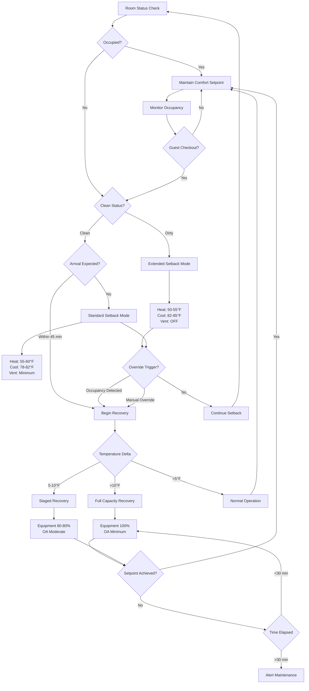

## Setback Strategy Fundamentals

Temperature setback strategies in hotel guest rooms balance energy conservation during unoccupied periods with rapid comfort recovery when guests return. Properly implemented setback reduces HVAC energy consumption by 20-35% while maintaining readiness for immediate occupancy.

The core principle involves relaxing temperature control limits when rooms are unoccupied, then actively restoring comfort conditions before or immediately upon guest arrival. This requires coordination between occupancy detection, control algorithms, and equipment capacity.

## Heating Setback Depth and Limits

Heating setback reduces room temperature during unoccupied periods while preventing conditions that compromise building envelope, furnishings, or recovery time.

**Setback Temperature Selection:**

The heating setback temperature $T_{sb,heat}$ must satisfy:

$$T_{sb,heat} = T_{occ,heat} - \Delta T_{sb}$$

where $T_{occ,heat}$ is the occupied heating setpoint (typically 68-72°F) and $\Delta T_{sb}$ is the setback depth (typically 8-15°F).

**Climate-Based Heating Limits:**

- **Cold climates (HDD65 > 5000):** Setback to 55-60°F to prevent condensation on windows and maintain recovery capability
- **Moderate climates (HDD65 2000-5000):** Setback to 50-58°F with longer recovery allowance
- **Warm climates (HDD65 < 2000):** Setback to 45-55°F or disable heating entirely in shoulder seasons

**Absolute Minimum Constraints:**

- Never below 45°F to prevent pipe freezing in perimeter walls
- Maintain 10°F above dewpoint to prevent condensation on building envelope
- Limit setback to maintain recovery time under 30-45 minutes

## Cooling Setforward Strategies

Cooling setforward allows room temperature to rise during unoccupied periods, reducing compressor runtime and energy consumption.

**Setforward Temperature Selection:**

The cooling setforward temperature $T_{sf,cool}$ follows:

$$T_{sf,cool} = T_{occ,cool} + \Delta T_{sf}$$

where $T_{occ,cool}$ is the occupied cooling setpoint (typically 72-76°F) and $\Delta T_{sf}$ is the setforward depth (typically 6-12°F).

**Climate-Based Cooling Limits:**

- **Hot-humid climates:** Limited setforward (6-8°F) to control latent loads and mold risk
- **Hot-dry climates:** Aggressive setforward (10-15°F) with humidity less critical
- **Moderate climates:** Seasonal adjustment with deeper setforward in mild conditions

**Humidity-Constrained Setforward:**

Maximum setforward temperature must satisfy:

$$T_{sf,max} = T_{dewpoint} + 20°F$$

This 20°F margin prevents condensation on cooled surfaces during recovery and limits mold growth on furnishings and textiles.

## Ventilation Reduction During Setback

Unoccupied rooms require minimal ventilation to maintain air quality and building pressurization while reducing fan energy and thermal loads.

**Ventilation Setback Levels:**

| Operating Mode | Outside Air | Recirculation | Application |
|---|---|---|---|
| Occupied | 25-30 CFM | Full | Guest present |
| Unoccupied-Ready | 5-10 CFM | Minimum | Clean checkout |
| Unoccupied-Extended | 0 CFM | Off | Multi-day vacancy |
| Pre-occupancy Flush | 50-100 CFM | Full | 15 min before arrival |

**Energy Impact:**

Ventilation reduction saves both fan energy and conditioning energy. For a typical hotel room:

$$E_{save,vent} = \dot{V}_{OA} \cdot \rho \cdot c_p \cdot (T_{OA} - T_{room}) \cdot t_{unocc}$$

where $\dot{V}_{OA}$ is the outside airflow rate reduction (CFM), $\rho$ is air density (0.075 lb/ft³), $c_p$ is specific heat (0.24 Btu/lb·°F), and $t_{unocc}$ is unoccupied duration (hours).

## Humidity Control During Unoccupied Periods

Humidity management during setback prevents mold growth, material degradation, and guest discomfort while minimizing energy consumption.

**Humidity Setback Limits:**

- **Heating season:** Allow RH up to 60% during setback (prevents excessive humidification energy)
- **Cooling season:** Maintain RH below 60% even during setback (prevents mold in 48-72 hours)
- **Humid climates:** Active dehumidification may continue during cooling setforward to maintain RH < 55%

**Dew Point Control Strategy:**

Instead of controlling relative humidity, advanced systems limit dewpoint temperature:

$$T_{dewpoint,max} = 60°F \text{ (to prevent mold)}$$

This allows temperature to float during setback while preventing moisture accumulation on surfaces.

**Periodic Conditioning Cycles:**

In extended vacancy (>3 days), run conditioning cycles:

- Cool to 72°F for 2 hours every 24 hours to remove moisture
- Prevents musty odors and maintains material condition
- Energy cost justified by improved guest satisfaction

## Seasonal Setback Adjustments

Setback strategies must adapt to seasonal outdoor conditions and occupancy patterns.

**Winter Season Strategy:**

- Deeper heating setback (10-15°F) due to larger indoor-outdoor temperature difference
- Longer acceptable recovery time (cold air feels less objectionable initially)
- Reduced ventilation to minimize cold air infiltration
- Activate setback immediately after checkout

**Summer Season Strategy:**

- Moderate cooling setforward (6-10°F) limited by humidity concerns
- Shorter recovery time requirement (warm, humid rooms create immediate discomfort)
- Continued dehumidification even during setforward in humid climates
- Pre-cooling before predicted arrival

**Shoulder Season Strategy:**

- Minimal setback/setforward (4-6°F) with free cooling/heating opportunities
- Maximize use of outside air economizer during recovery
- May disable mechanical cooling/heating entirely during mild conditions
- Extended acceptable recovery times

## Override and Comfort Recovery Triggers

Effective setback systems include multiple override mechanisms and recovery strategies to ensure guest comfort.

**Recovery Initiation Triggers:**

1. **Scheduled arrival:** Begin recovery 30-45 minutes before reservation check-in time
2. **Card lock access:** Immediate recovery when guest enters room (may start in setback)
3. **Occupancy sensor:** Recovery within 5 minutes of detected occupancy
4. **Guest manual override:** Immediate response to thermostat adjustment
5. **Periodic preview:** Brief recovery cycle before predicted arrival window

**Recovery Control Logic:**

The system determines recovery start time $t_{start}$ based on:

$$t_{start} = t_{arrival} - t_{recovery}$$

where recovery time $t_{recovery}$ is estimated from:

$$t_{recovery} = \frac{(T_{target} - T_{current}) \cdot m \cdot c_p}{Q_{capacity} \cdot 60}$$

with $m$ being the room air mass (lb), $c_p$ specific heat (Btu/lb·°F), and $Q_{capacity}$ equipment capacity (Btu/h).

**Recovery Performance Requirements:**

- Achieve setpoint within 30 minutes for standard rooms (300-400 ft²)
- Achieve 90% of temperature correction within 15 minutes
- Prioritize sensible cooling to provide immediate comfort perception
- Modulate equipment to full capacity during recovery

## Recommended Setback Temperatures by Climate

| Climate Zone | Heating Setback | Cooling Setforward | Max RH Setback | Recovery Time |
|---|---|---|---|---|
| **Very Cold (1-3)** | 55-58°F | 78-80°F | 60% | 30-45 min |
| **Cold (4-5)** | 58-62°F | 78-82°F | 60% | 25-35 min |
| **Mixed (6)** | 60-65°F | 80-82°F | 55% | 20-30 min |
| **Hot-Dry (7)** | 65-68°F | 82-85°F | 60% | 20-30 min |
| **Hot-Humid (8-9)** | 65-70°F | 78-80°F | 50% | 25-35 min |

**Energy Savings Potential:**

Annual energy savings from setback implementation:

$$E_{save,annual} = \sum_{season} \frac{24 \cdot \Delta T_{sb} \cdot UA \cdot HDD_{season}}{1000} + \frac{24 \cdot \Delta T_{sf} \cdot UA \cdot CDD_{season}}{1000 \cdot SEER}$$

where $UA$ is the room envelope conductance (Btu/h·°F), HDD and CDD are degree days, and SEER is seasonal efficiency. Typical savings range from 2,500-4,500 kWh per room annually for full-service hotels with 60-70% average occupancy.

## Implementation Considerations

**Control System Requirements:**

- Integration with property management system (PMS) for arrival/departure data
- Reliable occupancy sensing (PIR, door contacts, or card locks)
- Override capability accessible to guests and staff
- Trend logging to verify savings and optimize setback schedules

**Commissioning and Tuning:**

- Measure actual recovery times for different conditions and adjust start times
- Verify humidity control maintains limits during extended setback
- Test override response and guest interface
- Monitor energy savings against baseline to validate performance

Properly implemented setback strategies deliver substantial energy savings while maintaining the immediate comfort expectation of hotel guests, making them among the most cost-effective energy conservation measures in hospitality facilities.
