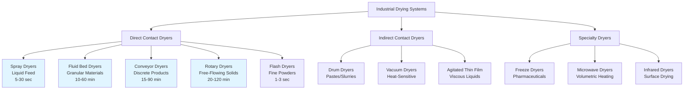

# Industrial Drying Systems

Industrial drying systems remove moisture from materials using controlled thermal and airflow processes. These specialized HVAC applications require precise integration of heat transfer, mass transfer, and psychrometric principles to achieve target moisture content while maintaining product quality and energy efficiency.

## Dryer Classification and System Types

## Fundamental Drying Principles

### Heat and Mass Transfer Mechanisms

Drying occurs through simultaneous heat and mass transfer processes governed by thermodynamic and transport phenomena.

**Convective Heat Transfer:**

The heat flux from hot air to material surface follows:

$$q = hA(T_{air} - T_{surface})$$

Where:
- $q$ = heat transfer rate (W)
- $h$ = convective heat transfer coefficient (10-500 W/m²·K)
- $A$ = surface area (m²)
- $T_{air}$, $T_{surface}$ = air and surface temperatures (°C or K)

**Mass Transfer:**

Moisture removal rate is governed by:

$$\dot{m}_{evap} = h_m A(C_{surface} - C_{air})$$

Where:
- $\dot{m}_{evap}$ = evaporation rate (kg/s)
- $h_m$ = mass transfer coefficient (m/s)
- $C_{surface}$, $C_{air}$ = moisture concentration at surface and in air (kg/m³)

**Evaporative Heat Requirement:**

Total heat for moisture evaporation:

$$Q_{evap} = \dot{m}_{evap} \cdot h_{fg}$$

Where $h_{fg}$ = latent heat of vaporization ≈ 2,260 kJ/kg at atmospheric pressure

### Drying Rate Periods

**Constant-Rate Period:**

During this initial phase, the drying rate remains constant:

$$N = \frac{h_c(H_s - H_{air})}{\lambda}$$

Where:
- $N$ = drying rate (kg/m²·s)
- $h_c$ = convective mass transfer coefficient (kg/m²·s)
- $H_s$ = humidity at saturated surface (kg/kg)
- $H_{air}$ = humidity of drying air (kg/kg)
- $\lambda$ = latent heat of vaporization (kJ/kg)

Surface remains saturated with free moisture and temperature equals wet-bulb temperature of drying air.

**Falling-Rate Period:**

After critical moisture content $X_c$ is reached:

$$\frac{dX}{dt} = -k(X - X_e)$$

Where:
- $X$ = moisture content (kg water/kg dry solid)
- $X_e$ = equilibrium moisture content
- $k$ = drying constant (1/s)
- $t$ = time (s)

Internal moisture diffusion becomes rate-limiting; material temperature rises toward air temperature.

### Psychrometric Relationships

**Absolute Humidity Change:**

Air moisture content increases across the dryer:

$$\Delta W = \frac{\dot{m}_{water}}{\dot{m}_{dry\ air}}$$

Where $W$ = humidity ratio (kg water/kg dry air)

**Air Enthalpy Change:**

$$\Delta h = c_p \Delta T + W \cdot h_{fg}$$

This represents the combined sensible and latent heat components absorbed by the air stream.

## Industrial Dryer Types

### Spray Dryers

**Operating Principle:**
Liquid feed atomized into fine droplets contacts hot gas stream, producing rapid evaporation and dried powder particles.

**Key Design Parameters:**
- Inlet air temperature: 150-300°C
- Outlet air temperature: 80-120°C (controls final moisture)
- Atomization methods: pressure nozzles (10-30 MPa), rotary atomizers (10,000-30,000 rpm)
- Droplet diameter: 10-200 μm
- Residence time: 5-30 seconds

**Applications:**
- Milk powder, coffee, detergents
- Pharmaceuticals, ceramics
- Chemical products requiring fine particle size

**Advantages:**
- Continuous operation with high throughput
- Short residence time preserves heat-sensitive materials
- Direct control of particle size and morphology

**Limitations:**
- High capital and energy costs
- Large footprint requirements
- Particle loss through fines generation

### Fluid Bed Dryers

**Operating Principle:**
Particles suspended and fluidized by upward-flowing hot air, maximizing surface area contact and heat transfer efficiency.

**Design Criteria:**
- Minimum fluidization velocity: U_mf = (d_p²(ρ_p - ρ_g)g) / (150μ)
- Operating velocity: 1.5-3 × U_mf for stable fluidization
- Bed depth: 0.3-1.0 m typical
- Air temperature: 50-150°C (material dependent)

**Applications:**
- Granular materials (pharmaceuticals, food ingredients)
- Polymer pellets
- Crystalline chemicals

**Advantages:**
- Excellent heat and mass transfer (h = 100-500 W/m²·K)
- Uniform particle temperature
- Compact design with high capacity

**Limitations:**
- Particle size constraints (50 μm - 5 mm)
- Attrition can produce fines
- Complex scale-up from pilot to production

### Conveyor (Belt) Dryers

**Operating Principle:**
Material conveyed through multiple zones on perforated belts with controlled air temperature, humidity, and velocity profiles.

**Configuration Options:**
- Through-circulation: Air passes perpendicular through product bed
- Impingement: High-velocity air jets directed at product surface
- Multi-stage: Progressive reduction in air temperature and humidity

**Typical Parameters:**
- Belt speed: 0.5-5 m/min
- Bed depth: 20-100 mm
- Air velocity: 0.5-3 m/s
- Residence time: 15-90 minutes

**Applications:**
- Fruits, vegetables (dehydration)
- Extruded products
- Coated materials requiring gentle handling

**Advantages:**
- Versatile for various product forms
- Independent zone control optimizes quality
- Visual monitoring throughout process

**Limitations:**
- Large floor space requirement
- Batch size variability affects performance
- Belt maintenance and cleaning

### Rotary Dryers

**Operating Principle:**
Material tumbles through rotating cylindrical shell while contacted by hot gas flow (co-current or counter-current).

**Design Specifications:**
- Length-to-diameter ratio: 4:1 to 10:1
- Rotation speed: 4-8 rpm
- Shell slope: 0-5°
- Residence time: τ = L / (N × D × S × 0.19)
  - L = length (m), N = rpm, D = diameter (m), S = slope (m/m)

**Applications:**
- Minerals, sand, aggregates
- Biomass and wood products
- Chemical salts and fertilizers

**Advantages:**
- High capacity for free-flowing materials
- Robust construction handles abrasive materials
- Lower capital cost per unit capacity

**Limitations:**
- Higher energy consumption than alternative designs
- Product size degradation through mechanical action
- Dust generation requires collection systems

## Dryer Type Comparison

### Performance Characteristics

| Parameter | Spray Dryer | Fluid Bed | Conveyor | Rotary |
|-----------|-------------|-----------|----------|--------|
| **Feed Form** | Liquid/slurry | Granular/powder | Discrete pieces | Free-flowing solids |
| **Drying Time** | 5-30 seconds | 10-60 minutes | 15-90 minutes | 20-120 minutes |
| **Heat Transfer Coeff (W/m²·K)** | 50-150 | 100-500 | 20-80 | 10-50 |
| **Thermal Efficiency (%)** | 40-60 | 60-80 | 50-70 | 40-60 |
| **Capital Cost** | High | Medium | Medium-High | Low-Medium |
| **Footprint** | Large | Small | Large | Medium |
| **Product Temperature Control** | Excellent | Excellent | Good | Moderate |
| **Particle Size Range** | 10-200 μm | 50 μm-5 mm | 5-100 mm | 0.1-50 mm |

### Application Matrix

| Industry/Product | Spray | Fluid Bed | Conveyor | Rotary | Key Requirements |
|------------------|-------|-----------|----------|--------|------------------|
| **Dairy powder** | ● | ○ | — | — | Fine particles, food safety |
| **Pharmaceuticals** | ● | ● | ○ | — | Sterility, precise control |
| **Minerals** | — | ○ | ● | ● | High capacity, abrasion |
| **Food dehydration** | ○ | ● | ● | ○ | Quality preservation |
| **Chemical salts** | ● | ● | ○ | ● | Crystalline structure |
| **Biomass/wood** | — | ○ | ● | ● | Fire safety, dust control |

● Primary choice | ○ Suitable alternative | — Not recommended

## Drying Rate Calculations

### Material Balance

**Moisture Removal Rate:**

$$\dot{m}_{evap} = \dot{m}_{product} \times \frac{X_{initial} - X_{final}}{1 + X_{initial}}$$

Where:
- $\dot{m}_{evap}$ = evaporation rate (kg/s)
- $\dot{m}_{product}$ = wet product feed rate (kg/s)
- $X$ = moisture content (kg water/kg dry solids)

### Energy Balance

**Total Heat Requirement:**

$$Q_{total} = Q_{evap} + Q_{product} + Q_{losses}$$

**Evaporative Heat:**

$$Q_{evap} = \dot{m}_{evap} \times h_{fg}$$

Typically 2,260-2,400 kJ/kg depending on pressure and temperature.

**Product Sensible Heat:**

$$Q_{product} = \dot{m}_{dry} \times c_p \times (T_{final} - T_{initial})$$

**Specific Energy Consumption:**

$$SEC = \frac{Q_{total}}{\dot{m}_{evap}} \text{ (kJ/kg water)}$$

Target SEC values: 3,000-6,000 kJ/kg for efficient industrial dryers; theoretical minimum ≈ 2,260 kJ/kg.

### Airflow Requirements

**Air Mass Flow Rate:**

$$\dot{m}_{air} = \frac{\dot{m}_{evap}}{W_{outlet} - W_{inlet}}$$

Where $W$ = absolute humidity (kg water/kg dry air)

**Volumetric Flow Rate:**

$$Q_{air} = \dot{m}_{air} \times v_{specific}$$

Specific volume obtained from psychrometric chart at operating temperature and humidity.

## Process Engineering Standards

### Design References

- **ASME BPE:** Bioprocessing Equipment standards for pharmaceutical drying
- **NFPA 61:** Fire protection for agricultural product drying
- **API 686:** Machinery Installation and Installation Design for petroleum applications
- **3-A Sanitary Standards:** Food processing equipment requirements

### Safety Considerations

**Fire and Explosion Prevention:**
- Minimum ignition temperature (MIT) testing for dust clouds
- Maintain oxygen concentration below limiting oxygen concentration (LOC) when required
- Explosion venting or suppression systems per NFPA 68/69

**Temperature Control:**
- Maximum product temperature limits prevent degradation, scorching, or ignition
- Thermal runaway prevention through automated shutdown systems

### Performance Monitoring

**Key Performance Indicators:**
- Evaporation rate (kg/hr)
- Specific energy consumption (kJ/kg_water)
- Product moisture uniformity (coefficient of variation)
- Thermal efficiency (useful heat / total heat input)
- Uptime and throughput consistency

## Energy Efficiency and Process Integration

### Heat Recovery Systems

**Exhaust Air Heat Recovery:**

Effectiveness of heat exchangers:

$$\varepsilon = \frac{T_{exhaust,in} - T_{exhaust,out}}{T_{exhaust,in} - T_{fresh,in}}$$

Typical effectiveness: 50-75% for air-to-air plate heat exchangers, up to 85% for rotary heat wheels.

**Multi-Stage Drying:**
- Progressive temperature reduction across stages
- First stage: high-temperature evaporation (constant-rate period)
- Final stages: lower temperature finishing (falling-rate period)
- Energy savings: 20-40% compared to single-stage operation

### Process Integration Strategies

| Strategy | Energy Savings | Capital Cost | Complexity | Applications |
|----------|----------------|--------------|------------|--------------|
| **Exhaust heat recovery** | 20-40% | Medium | Low | All dryer types |
| **Heat pump integration** | 30-60% | High | Medium | Low-temp (<80°C) |
| **Multi-stage drying** | 15-35% | Medium-High | High | Large installations |
| **Air recirculation** | 10-30% | Low | Low | Non-contaminated exhaust |
| **Steam recompression** | 40-70% | Very High | High | Spray dryers |

### Advanced Control Systems

**Real-Time Moisture Monitoring:**
- Near-infrared (NIR) spectroscopy: ±0.1% moisture accuracy
- Microwave resonance sensors: non-contact measurement
- Loss-on-drying correlations for feedback control

**Cascade Control Architecture:**
- Primary loop: product moisture setpoint
- Secondary loop: outlet air humidity/temperature
- Tertiary loop: inlet air temperature/flow rate

**Recirculation Optimization:**

Optimal recirculation ratio balances energy cost against product quality:

$$R_{opt} = \frac{\text{Recirculated air flow}}{\text{Total air flow}}$$

Economic optimum typically 30-70% depending on fuel costs and humidity tolerance.

## Standards and Safety Requirements

### Design References

- **ASME BPE:** Bioprocessing Equipment (pharmaceutical drying)
- **NFPA 61:** Fire and Dust Explosion Prevention (agricultural products)
- **NFPA 68/69:** Explosion Protection Systems
- **API 686:** Machinery Installation (petroleum/chemical applications)
- **3-A Sanitary Standards:** Food processing equipment
- **ASHRAE Handbook - HVAC Applications:** Chapter on Industrial Drying

### Safety Considerations

**Explosion Prevention:**
- Minimum ignition temperature (MIT) testing for dust clouds
- Maintain oxygen concentration below limiting oxygen concentration (LOC) when handling combustible materials
- Implement explosion venting per NFPA 68 or suppression per NFPA 69

**Temperature Limits:**
- Monitor maximum product temperature to prevent degradation, scorching, or auto-ignition
- Thermal runaway protection through automated shutdown interlocks

Industrial drying system design requires rigorous application of thermodynamic, psychrometric, and transport phenomena principles combined with material-specific knowledge to achieve specified moisture targets while optimizing energy efficiency, product quality, and process safety.
