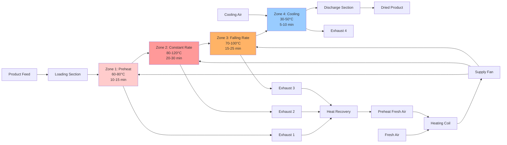

# Conveyor Dryers: Belt Speed & Temperature Control

Conveyor dryers provide continuous moisture removal through controlled exposure of materials to heated air zones. System performance depends on precise coordination of belt speed, air temperature distribution, and residence time to achieve target final moisture content while maintaining product quality and energy efficiency.

## Fundamental Heat Transfer Mechanisms

Heat and mass transfer in conveyor dryers occurs through convection from hot air to the product surface and diffusion of moisture from the product interior to the surface.

### Convective Heat Transfer

The convective heat flux from air to product surface:

$$q_{conv} = h \cdot A \cdot (T_{air} - T_{surface})$$

Where:
- $q_{conv}$ = Convective heat transfer rate (W)
- $h$ = Convective heat transfer coefficient (W/m²·K)
- $A$ = Product surface area exposed to airflow (m²)
- $T_{air}$ = Bulk air temperature (°C)
- $T_{surface}$ = Product surface temperature (°C)

The heat transfer coefficient varies with air velocity and flow configuration:

$$h = C \cdot v^n$$

Where:
- $C$ = Configuration constant (8-25 for through-flow, 30-60 for impingement)
- $v$ = Air velocity at product surface (m/s)
- $n$ = Velocity exponent (0.6-0.8 typical)

### Moisture Evaporation Energy

The energy required to evaporate moisture from the product:

$$q_{evap} = \dot{m}_{water} \cdot h_{fg}$$

Where:
- $q_{evap}$ = Evaporation energy rate (W)
- $\dot{m}_{water}$ = Mass flow rate of evaporated water (kg/s)
- $h_{fg}$ = Latent heat of vaporization (2450 kJ/kg at 50°C, 2260 kJ/kg at 100°C)

### Overall Energy Balance

Energy supplied must equal sensible heating plus evaporation:

$$\dot{m}_{air} \cdot c_{p,air} \cdot (T_{in} - T_{out}) = \dot{m}_{product} \cdot c_{p,product} \cdot \Delta T_{product} + \dot{m}_{water} \cdot h_{fg}$$

Where:
- $\dot{m}_{air}$ = Mass flow rate of drying air (kg/s)
- $c_{p,air}$ = Specific heat of air (1.006 kJ/kg·K)
- $T_{in}, T_{out}$ = Air inlet and outlet temperatures (°C)
- $\dot{m}_{product}$ = Product mass flow rate (kg/s dry basis)
- $c_{p,product}$ = Product specific heat (kJ/kg·K)

## Belt Speed and Residence Time Calculations

Belt speed determines the residence time available for drying in each temperature zone.

### Residence Time Relationship

Total residence time in a zone:

$$t_{residence} = \frac{L_{zone}}{v_{belt}}$$

Where:
- $t_{residence}$ = Residence time in zone (s)
- $L_{zone}$ = Zone length along belt direction (m)
- $v_{belt}$ = Belt linear velocity (m/s)

For multi-zone dryers, total residence time:

$$t_{total} = \sum_{i=1}^{n} \frac{L_i}{v_{belt}}$$

### Required Belt Length

To achieve target moisture reduction, the required belt length:

$$L_{required} = v_{belt} \cdot t_{drying}$$

Where $t_{drying}$ is determined from drying rate equations based on product characteristics and air conditions.

### Belt Speed Selection

Belt speed must satisfy throughput requirements:

$$v_{belt} = \frac{\dot{m}_{product}}{\rho_{product} \cdot w_{belt} \cdot h_{layer}}$$

Where:
- $\rho_{product}$ = Product bulk density (kg/m³)
- $w_{belt}$ = Belt width (m)
- $h_{layer}$ = Product layer depth on belt (m)

Typical belt speeds range from 0.3-3.0 m/min (0.005-0.05 m/s) depending on product drying characteristics.

## Temperature Zone Configuration

Multi-zone temperature profiles optimize drying rate while preventing product degradation.

### Temperature Profile Design

**Zone 1 - Preheating:** Rapid heating without moisture removal
- Temperature: 60-80°C for heat-sensitive products
- Purpose: Raise product temperature to begin surface moisture evaporation
- Residence time: 10-15% of total

**Zone 2 - Constant Rate Drying:** Maximum evaporation rate
- Temperature: 80-120°C depending on product limits
- Purpose: Remove surface and free moisture at maximum rate
- Residence time: 40-50% of total

**Zone 3 - Falling Rate Drying:** Internal moisture migration limited
- Temperature: 70-100°C (reduced from Zone 2)
- Purpose: Allow internal moisture to migrate to surface
- Residence time: 30-40% of total

**Zone 4 - Cooling:** Return to handling temperature
- Temperature: 30-50°C (ambient or cooled air)
- Purpose: Prevent condensation and temperature shock
- Residence time: 10-15% of total

### Temperature Control Strategy

Zone temperature is controlled to maintain constant air temperature:

$$T_{supply} = T_{setpoint} + \Delta T_{product}$$

Where $\Delta T_{product}$ compensates for heat absorbed by the product load.

## Conveyor Dryer Operation Diagram

## Drying Parameters by Material

Different materials require specific temperature, belt speed, and residence time combinations.

### Food Products

| Material | Layer Depth (mm) | Belt Speed (m/min) | Zone 2 Temp (°C) | Total Residence (min) | Initial MC (%) | Final MC (%) |
|----------|-----------------|-------------------|------------------|----------------------|----------------|--------------|
| Vegetable slices (carrot, potato) | 25-40 | 0.5-1.0 | 60-70 | 45-90 | 80-85 | 8-12 |
| Fruit pieces (apple, mango) | 20-35 | 0.4-0.8 | 55-65 | 60-120 | 75-80 | 18-22 |
| Pasta/noodles | 50-80 | 0.8-1.5 | 70-80 | 30-45 | 30-35 | 10-12 |
| Breakfast cereals | 30-50 | 1.0-2.0 | 120-140 | 15-25 | 25-30 | 2-4 |
| Herbs (parsley, basil) | 15-25 | 0.3-0.5 | 45-55 | 20-40 | 85-90 | 8-10 |
| Meat jerky strips | Single layer | 0.6-1.2 | 65-75 | 180-300 | 65-70 | 25-30 |
| Onion/garlic granules | 40-60 | 0.6-1.0 | 70-85 | 50-80 | 80-85 | 4-6 |
| Coffee beans (finish) | 60-100 | 1.5-2.5 | 80-95 | 20-35 | 12-15 | 10-11 |

### Non-Food Industrial Products

| Material | Layer Depth (mm) | Belt Speed (m/min) | Zone 2 Temp (°C) | Total Residence (min) | Initial MC (%) | Final MC (%) |
|----------|-----------------|-------------------|------------------|----------------------|----------------|--------------|
| Wood chips | 80-120 | 0.8-1.5 | 100-120 | 40-60 | 50-60 | 10-15 |
| Paper products | 30-50 | 1.5-3.0 | 90-110 | 10-20 | 8-12 | 4-6 |
| Textile fabrics | Single/double layer | 2.0-5.0 | 120-160 | 5-15 | 60-80 | 5-8 |
| Ceramic tiles (bisque) | Single layer | 0.5-1.2 | 80-100 | 90-180 | 18-22 | 0.5-1.0 |
| Pharmaceutical granules | 25-40 | 0.4-0.8 | 50-60 | 30-60 | 15-20 | 2-4 |
| Plastic pellets | 40-60 | 1.0-2.0 | 70-90 | 15-30 | 5-8 | 0.2-0.5 |
| Coated paper | Single layer | 3.0-8.0 | 130-180 | 3-8 | Solvent removal | <0.1 |
| Fertilizer granules | 60-100 | 1.2-2.0 | 95-115 | 25-40 | 12-18 | 1-3 |

**Notes:**
- MC = Moisture Content (wet basis)
- Belt speeds are typical ranges; actual values depend on specific product and dryer configuration
- Layer depth affects pressure drop and drying uniformity
- Residence times exclude cooling zone

## Air Velocity and Pressure Drop

Air velocity through the product layer affects both heat transfer rate and system fan power requirements.

### Through-Flow Air Velocity

Superficial velocity (approaching the belt):

$$v_{superficial} = \frac{\dot{V}_{air}}{w_{belt} \cdot L_{zone}}$$

Where:
- $\dot{V}_{air}$ = Volumetric air flow rate (m³/s)
- Typical range: 0.3-1.2 m/s for granular products

### Pressure Drop Across Product Layer

Pressure drop through a porous product layer (Ergun equation):

$$\Delta P = \frac{150 \cdot \mu \cdot v \cdot h_{layer} \cdot (1-\varepsilon)^2}{d_p^2 \cdot \varepsilon^3} + \frac{1.75 \cdot \rho_{air} \cdot v^2 \cdot h_{layer} \cdot (1-\varepsilon)}{d_p \cdot \varepsilon^3}$$

Where:
- $\Delta P$ = Pressure drop (Pa)
- $\mu$ = Air dynamic viscosity (1.85×10⁻⁵ Pa·s at 20°C)
- $v$ = Superficial air velocity (m/s)
- $h_{layer}$ = Product layer depth (m)
- $\varepsilon$ = Bed porosity (void fraction, typically 0.4-0.7)
- $d_p$ = Particle diameter (m)
- $\rho_{air}$ = Air density (kg/m³)

First term dominates for laminar flow (low velocity, small particles), second term for turbulent flow.

### Fan Power Requirement

Fan power for each zone:

$$P_{fan} = \frac{\dot{V}_{air} \cdot \Delta P_{total}}{\eta_{fan}}$$

Where:
- $P_{fan}$ = Fan shaft power (W)
- $\Delta P_{total}$ = Total pressure rise including product, belt, and ductwork (Pa)
- $\eta_{fan}$ = Fan total efficiency (typically 0.65-0.75)

Typical fan power: 0.8-3.5 kW per meter of belt width for through-flow dryers.

## Industrial Drying Standards and Guidelines

Conveyor dryer design and operation must comply with relevant industry standards.

### Process Design Standards

**ASHRAE Handbook - HVAC Applications, Chapter 30: Industrial Drying Systems**
- Psychrometric analysis methods
- Heat and mass transfer correlations
- Air distribution design criteria
- Energy recovery integration

**ASABE Standards (American Society of Agricultural and Biological Engineers)**
- S448.2: Thin-Layer Drying of Grain
- D245.7: Moisture Relationships of Plant-Based Agricultural Products
- S352.2: Moisture Measurement for agricultural products

### Equipment and Safety Standards

**NFPA 86: Standard for Ovens and Furnaces**
- Applicable to conveyor dryers operating above 93°C (200°F)
- Combustion air requirements
- Explosion prevention for volatile solvents
- Emergency shutdown systems

**ASME B30.20: Below-the-Hook Lifting Devices**
- Applicable to tray handling systems
- Load rating and marking requirements

**FDA CFR Title 21 Part 110: Current Good Manufacturing Practice**
- Food contact surfaces (belt materials)
- Sanitary design requirements
- Temperature monitoring and recording

### Energy Efficiency Guidelines

**ISO 50001: Energy Management Systems**
- Continuous improvement framework
- Energy performance indicators
- Monitoring and measurement protocols

**DOE Industrial Technologies Program - Process Heating Assessment**
- Heat recovery opportunities
- Waste heat utilization
- Insulation optimization

## Advanced Control Strategies

Modern conveyor dryers employ sophisticated control to optimize product quality and energy consumption.

### Moisture Feedback Control

Near-infrared (NIR) or microwave moisture sensors at dryer discharge provide feedback for belt speed adjustment:

$$v_{belt,adjusted} = v_{belt,setpoint} \cdot \frac{MC_{actual}}{MC_{target}}$$

This compensates for variations in incoming product moisture or ambient conditions.

### Predictive Temperature Control

Model predictive control (MPC) adjusts zone temperatures based on product load and moisture removal rate:

$$T_{zone,i} = f(MC_{product,i}, \dot{m}_{water,i}, t_{residence,i})$$

Advanced controllers learn product behavior and optimize temperature profiles to minimize energy while meeting final moisture specifications.

### Variable Air Volume

Some systems modulate air flow rate in each zone based on evaporation rate:

$$\dot{V}_{air,zone} = \frac{\dot{m}_{water,zone}}{\rho_{air} \cdot (X_{out} - X_{in})}$$

Where:
- $X_{out}, X_{in}$ = Humidity ratio of exhaust and supply air (kg water/kg dry air)

Reducing air flow during falling-rate drying periods decreases fan energy consumption.

## Performance Metrics

Key performance indicators for conveyor dryer systems:

**Thermal Efficiency:**
$$\eta_{thermal} = \frac{\dot{m}_{water} \cdot h_{fg}}{\dot{Q}_{input}} \times 100\%$$

Where $\dot{Q}_{input}$ is total thermal energy supplied to heating coils.

Typical range: 40-65% without heat recovery, 60-80% with heat recovery.

**Specific Energy Consumption:**
$$SEC = \frac{E_{total}}{\dot{m}_{water}}$$

Where:
- $E_{total}$ = Total energy input (thermal + electrical) per hour (kWh/h)
- $\dot{m}_{water}$ = Water evaporation rate (kg/h)

Typical range: 3000-6000 kJ/kg water (0.8-1.7 kWh/kg water).

**Evaporation Capacity:**
$$EC = \frac{\dot{m}_{water}}{A_{belt}}$$

Where $A_{belt}$ = Total belt surface area (m²).

Typical range: 10-40 kg water/m²·h depending on product and air conditions.

Conveyor dryer selection and design requires careful balancing of belt speed, temperature zone configuration, residence time, and air flow patterns to achieve consistent drying results while minimizing energy consumption and maintaining product quality specifications.
