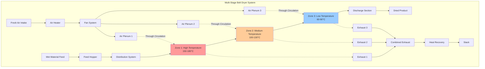

## Belt Dryer Fundamentals

Belt dryers represent a continuous convective drying system where wet material travels on a moving conveyor belt through heated air zones. The physics governing belt dryer operation centers on simultaneous heat and mass transfer, where hot air supplies the latent heat of vaporization while creating a vapor pressure gradient to drive moisture from the material.

The fundamental drying mechanism operates in two distinct periods. During the constant-rate period, surface moisture evaporates at a rate controlled by external heat and mass transfer coefficients. Once surface moisture depletes, internal moisture diffusion becomes rate-limiting in the falling-rate period. Belt dryer design must accommodate both regimes to achieve specified final moisture content.

## Heat and Mass Transfer Analysis

The total heat requirement for belt drying combines sensible heating of the material and latent heat for moisture evaporation:

$$Q_{total} = \dot{m}_{material} c_p (T_f - T_i) + \dot{m}_{water} h_{fg}$$

where:
- $Q_{total}$ = total heat duty (kW)
- $\dot{m}_{material}$ = dry material mass flow rate (kg/s)
- $c_p$ = specific heat of material (kJ/kg·K)
- $T_f, T_i$ = final and initial material temperatures (K)
- $\dot{m}_{water}$ = water evaporation rate (kg/s)
- $h_{fg}$ = latent heat of vaporization (kJ/kg)

The evaporation rate correlates directly with the convective mass transfer coefficient and driving force:

$$\dot{m}_{water} = h_m A_{belt} \rho_{air} (Y_s - Y_\infty)$$

where:
- $h_m$ = mass transfer coefficient (m/s)
- $A_{belt}$ = belt surface area (m²)
- $\rho_{air}$ = air density (kg/m³)
- $Y_s$ = humidity ratio at material surface (kg/kg)
- $Y_\infty$ = bulk air humidity ratio (kg/kg)

## Belt Dryer Capacity Calculation

Belt dryer throughput depends on belt dimensions, speed, material loading, and residence time requirements:

$$\dot{m}_{capacity} = v_{belt} \cdot W_{belt} \cdot \rho_{loading}$$

where:
- $\dot{m}_{capacity}$ = production capacity (kg/h)
- $v_{belt}$ = belt velocity (m/min)
- $W_{belt}$ = belt width (m)
- $\rho_{loading}$ = material loading density (kg/m²)

The required belt length to achieve target moisture reduction follows from drying kinetics:

$$L_{belt} = v_{belt} \cdot t_{residence} = v_{belt} \cdot \frac{X_i - X_f}{R_{avg}}$$

where:
- $L_{belt}$ = belt length (m)
- $t_{residence}$ = residence time (min)
- $X_i, X_f$ = initial and final moisture content (dry basis)
- $R_{avg}$ = average drying rate (kg water/kg dry material·min)

## Belt Dryer Configuration

## Belt Dryer Types Comparison

| Belt Dryer Type | Air Flow Pattern | Material Depth | Typical Velocity | Energy Efficiency | Applications |
|-----------------|------------------|----------------|------------------|-------------------|--------------|
| **Single-Stage Through-Flow** | Vertical through perforated belt | 20-50 mm | 0.5-2.0 m/min | 65-75% | Granular materials, pellets, extrudates |
| **Multi-Stage Cascade** | Horizontal cross-flow | 50-150 mm | 0.3-1.5 m/min | 70-80% | Particulates, flakes, shredded materials |
| **Through-Circulation Multi-Tier** | Alternating up/down flow | 30-80 mm | 0.8-3.0 m/min | 75-85% | High-capacity operations, heat-sensitive products |
| **Impingement Belt** | High-velocity jets perpendicular to belt | 10-30 mm | 1.0-4.0 m/min | 60-70% | Thin layers, rapid drying requirements |
| **Perforated Belt with Recirculation** | Mixed flow with 60-80% recirculation | 25-60 mm | 0.5-2.5 m/min | 80-90% | Energy-critical applications, uniform drying |

## Design Standards and Specifications

Belt dryer design adheres to standards established by ASABE (American Society of Agricultural and Biological Engineers) Standard S448 for thin-layer drying, and ISO 15003 for continuous dryers. Critical design parameters include:

**Belt Material Selection:**
- Perforated stainless steel (AISI 304/316) for corrosive environments
- Woven wire mesh (50-200 mesh) for fine particulates
- Modular plastic belting (UHMW polyethylene) for low-temperature applications
- Open aperture percentage: 30-60% for optimal air distribution

**Air System Design:**
- Air velocity through material bed: 0.5-2.5 m/s
- Specific airflow rate: 2000-6000 m³/h per m² belt area
- Temperature drop across material layer: 15-40 K
- Pressure drop through perforated belt and material: 200-800 Pa

**Thermal Efficiency Optimization:**
Multi-stage belt dryers achieve superior thermal efficiency through progressive temperature reduction. The first stage operates at maximum permissible temperature to exploit constant-rate drying, while subsequent stages operate at lower temperatures matching reduced drying rates. This staged approach minimizes energy consumption per kilogram of water evaporated.

Heat recovery from exhaust air streams through air-to-air heat exchangers or heat pump systems can improve overall thermal efficiency by 15-30%. Pre-heating fresh air with exhaust energy reduces primary heating requirements proportionally.

## Material Retention Time

The residence time distribution in belt dryers approximates plug flow behavior, providing uniform treatment of all material. For materials requiring precise moisture control, belt speed variability of ±2% ensures consistent residence time. Belt tracking systems maintain lateral position within ±5 mm to prevent material spillage and uneven air distribution.

For materials prone to case hardening, initial zone relative humidity may be elevated to 40-60% RH, preventing surface sealing while allowing internal moisture migration. Subsequent zones operate at progressively lower humidity to complete drying without quality degradation.

## Operational Considerations

Belt dryer efficiency depends critically on uniform material distribution across belt width. Vibratory feeders or oscillating spreaders create consistent layer thickness (±10% variation maximum). Non-uniform loading creates preferential air channeling, reducing dryer effectiveness and producing variable final moisture content.

Material discharge systems must prevent re-wetting from ambient air ingress. Belt cleaners (rotating brushes or air knives) remove adhered particles, maintaining open belt apertures for consistent airflow resistance throughout operation.
