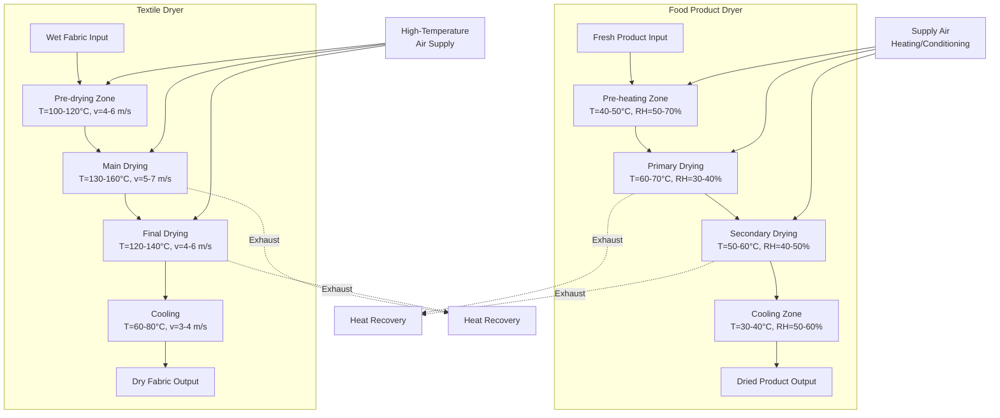

## Fundamental Drying Physics

Food and textile conveyor dryers operate on simultaneous heat and mass transfer principles, where moisture removal depends on vapor pressure differential between the product surface and ambient air. The drying process involves two distinct phases: constant-rate drying (surface moisture evaporation) and falling-rate drying (internal moisture diffusion).

### Drying Rate Equations

The mass transfer rate during constant-rate drying follows:

$$\dot{m}_w = h_m A_s (P_{sat,s} - P_v)$$

Where:
- $\dot{m}_w$ = moisture evaporation rate (kg/s)
- $h_m$ = mass transfer coefficient (m/s)
- $A_s$ = product surface area (m²)
- $P_{sat,s}$ = saturation vapor pressure at surface temperature (Pa)
- $P_v$ = partial vapor pressure in air (Pa)

The convective heat transfer to the product surface:

$$Q = h A_s (T_a - T_s) = \dot{m}_w h_{fg}$$

Where:
- $h$ = convective heat transfer coefficient (W/m²·K)
- $T_a$ = air temperature (K)
- $T_s$ = surface temperature (K)
- $h_{fg}$ = latent heat of vaporization (J/kg)

### Moisture Content Relationships

Product moisture content on dry basis:

$$X = \frac{m_w}{m_s}$$

Where:
- $X$ = moisture content (kg water/kg dry solid)
- $m_w$ = mass of water (kg)
- $m_s$ = mass of dry solid (kg)

The drying time during falling-rate period:

$$t = \frac{m_s}{K A_s} \ln\left(\frac{X_c - X_e}{X_f - X_e}\right)$$

Where:
- $t$ = drying time (s)
- $K$ = drying constant (kg/m²·s)
- $X_c$ = critical moisture content (kg/kg)
- $X_e$ = equilibrium moisture content (kg/kg)
- $X_f$ = final moisture content (kg/kg)

## Food Product Drying

### Psychrometric Control

Food drying requires precise control of dry-bulb temperature, relative humidity, and air velocity to prevent case hardening (surface sealing) while maximizing moisture removal. The optimal drying curve follows a decreasing temperature profile as internal moisture decreases.

For fruits and vegetables, the initial drying stage uses:

$$RH = 40\% - 60\%, \quad T_{db} = 50°C - 70°C, \quad v = 1.5 - 3.0 \text{ m/s}$$

### Product-Specific Considerations

**Fruit and Vegetable Drying**
High sugar content products require lower temperatures to prevent caramelization. The glass transition temperature $T_g$ defines the critical point where products transition from rubbery to glassy state, affecting storage stability:

$$T_g = T_{g,s} + k \cdot X$$

Where $T_{g,s}$ is the glass transition of the dry solid and $k$ is an empirical constant.

**Pasta Drying**
Pasta requires controlled humidity to prevent stress cracking. The maximum allowable temperature gradient:

$$\nabla T_{max} = \frac{\sigma_{allow}}{E \alpha}$$

Where:
- $\sigma_{allow}$ = allowable stress (Pa)
- $E$ = elastic modulus (Pa)
- $\alpha$ = thermal expansion coefficient (1/K)

## Textile Drying Applications

### Fabric Moisture Dynamics

Textile drying differs from food processing through higher acceptable temperatures and mechanical handling considerations. Fabric moisture regain at equilibrium:

$$M_r = \frac{m_w}{m_d} \times 100\%$$

Where $M_r$ is moisture regain percentage.

### Energy Balance

The total heat requirement for textile drying:

$$Q_{total} = m_f c_{pf} (T_2 - T_1) + m_w h_{fg} + Q_{air} + Q_{loss}$$

Where:
- $m_f$ = fabric mass (kg)
- $c_{pf}$ = specific heat of fabric (J/kg·K)
- $T_1, T_2$ = initial and final temperatures (K)
- $Q_{air}$ = air heating requirement (J)
- $Q_{loss}$ = heat losses (J)

### Air Flow Requirements

Textile dryers typically operate with higher air velocities (3-8 m/s) compared to food applications to achieve rapid moisture removal without product degradation. The pressure drop through the fabric layer:

$$\Delta P = \frac{\mu v L}{K_{perm}}$$

Where:
- $\mu$ = air dynamic viscosity (Pa·s)
- $v$ = superficial velocity (m/s)
- $L$ = fabric thickness (m)
- $K_{perm}$ = fabric permeability (m²)

## Conveyor Dryer Configuration

## Drying Requirements by Product Type

| Product Category | Initial MC (%) | Final MC (%) | Temp Range (°C) | RH Range (%) | Air Velocity (m/s) | Residence Time |
|-----------------|----------------|--------------|-----------------|--------------|-------------------|----------------|
| Fruit (Apples, Apricots) | 80-85 | 18-24 | 55-70 | 35-50 | 1.5-2.5 | 4-8 hours |
| Vegetables (Carrots, Onions) | 85-92 | 4-8 | 50-65 | 40-60 | 2.0-3.0 | 3-6 hours |
| Pasta (Extruded) | 30-35 | 10-12 | 40-80* | 60-80* | 0.5-1.5 | 8-24 hours |
| Meat Products | 60-75 | 20-30 | 50-70 | 45-65 | 1.0-2.0 | 6-12 hours |
| Cotton Fabrics | 100-150 | 6-8 | 120-150 | N/A | 4-6 | 2-5 minutes |
| Synthetic Fabrics | 60-80 | 0.4-1.0 | 100-130 | N/A | 5-7 | 1-3 minutes |
| Wool Textiles | 80-120 | 13-16 | 80-100 | N/A | 3-5 | 3-8 minutes |

*Pasta drying uses staged temperature/humidity profiles

## Design Standards and Codes

**Food Product Drying:**
- ASABE S448: Thin-Layer Drying of Grains and Crops
- ASABE S352.2: Moisture Measurement (Unground Grain and Seeds)
- FDA 21 CFR Part 110: Current Good Manufacturing Practice
- USDA AMS: Standards for fruits and vegetables

**Textile Drying:**
- ASTM D1776: Conditioning and Testing Textiles
- ASTM D2654: Moisture in Textiles
- ISO 3758: Textile Care Labeling
- NFPA 86: Standard for Ovens and Furnaces

## Energy Efficiency Optimization

The specific moisture extraction rate (SMER) defines dryer efficiency:

$$SMER = \frac{\dot{m}_w}{P_{total}} \text{ (kg/kWh)}$$

Typical values:
- Food conveyor dryers: 0.8-1.2 kg/kWh
- Textile conveyor dryers: 1.5-2.5 kg/kWh

Heat recovery from exhaust air improves efficiency:

$$\eta_{recovery} = \frac{T_{exhaust} - T_{ambient}}{T_{supply} - T_{ambient}}$$

Multi-stage drying with heat recovery can achieve 30-50% energy reduction compared to single-pass systems.

## Critical Control Parameters

**Food Products:**
- Monitor core temperature to prevent thermal damage
- Control humidity to prevent case hardening
- Validate residence time distribution
- Sanitize contact surfaces per FDA requirements

**Textile Products:**
- Maintain fabric tension to prevent distortion
- Control contact temperature to prevent fabric damage
- Monitor shrinkage and dimensional stability
- Ensure uniform air distribution across fabric width
