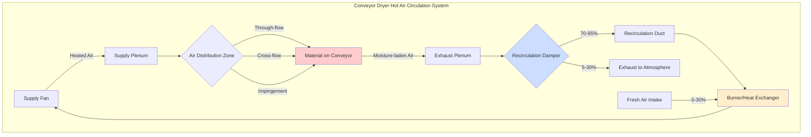

## Hot Air Circulation in Conveyor Dryers

Hot air circulation represents the fundamental mechanism driving moisture removal in conveyor drying systems. The circulation system determines drying uniformity, energy efficiency, and product quality through controlled delivery of heated air to the material surface. Understanding the physics of convective heat and mass transfer governs optimal system design.

## Heat and Mass Transfer Fundamentals

Convective drying occurs when hot air contacts the wet material, simultaneously transferring sensible heat to evaporate moisture and carrying away water vapor. The driving potential for moisture removal depends on the vapor pressure difference between the material surface and the bulk air.

The convective heat transfer to the material surface follows:

$$Q_{conv} = h_c A (T_{air} - T_{surface})$$

Where $h_c$ is the convective heat transfer coefficient (W/m²·K), $A$ is the surface area (m²), $T_{air}$ is the bulk air temperature (°C), and $T_{surface}$ is the material surface temperature (°C).

The convective heat transfer coefficient depends on air velocity:

$$h_c = C \cdot Re^m \cdot Pr^{1/3} \cdot \frac{k}{L}$$

Where $Re$ is the Reynolds number, $Pr$ is the Prandtl number, $k$ is thermal conductivity (W/m·K), $L$ is the characteristic length (m), and $C$ and $m$ are empirical constants based on flow regime.

## Drying Air Temperature Requirements

Optimal drying air temperature balances moisture removal rate against product degradation risk. The temperature must provide sufficient vapor pressure difference while avoiding thermal damage.

The required air temperature depends on the target moisture removal rate:

$$T_{air} = T_{wet-bulb} + \frac{\dot{m}_{evap} \cdot h_{fg}}{h_c A}$$

Where $T_{wet-bulb}$ is the wet-bulb temperature (°C), $\dot{m}_{evap}$ is the evaporation rate (kg/s), and $h_{fg}$ is the latent heat of vaporization (2,260 kJ/kg at atmospheric pressure).

Temperature uniformity across the conveyor width typically requires ±2°C control to ensure consistent product moisture content. Temperature stratification develops when vertical temperature gradients exceed 5°C per meter of duct height.

## Air Velocity Optimization

Air velocity directly impacts the convective heat transfer coefficient and boundary layer thickness. Higher velocities increase drying rates but also increase fan power consumption and material disturbance.

The critical velocity for boundary layer penetration:

$$v_{critical} = \frac{\mu}{\rho \delta}$$

Where $\mu$ is dynamic viscosity (Pa·s), $\rho$ is air density (kg/m³), and $\delta$ is the desired boundary layer thickness (m).

Typical design velocities range from 1.5 to 4.0 m/s depending on material characteristics. Fragile materials require velocities below 2.0 m/s, while robust materials tolerate velocities up to 6.0 m/s.

The optimal velocity maximizes the drying rate per unit energy:

$$v_{optimal} = \left(\frac{\dot{m}_{evap} \cdot h_{fg}}{\eta_{fan} \cdot \Delta P \cdot A}\right)^{1/3}$$

Where $\eta_{fan}$ is fan efficiency and $\Delta P$ is pressure drop (Pa).

## Air Distribution Methods

Air distribution configuration fundamentally affects drying uniformity and energy efficiency. Three primary methods dominate industrial applications.

| Distribution Method | Air Velocity Range (m/s) | Uniformity (±%) | Energy Efficiency | Typical Applications |
|---------------------|---------------------------|-----------------|-------------------|----------------------|
| Through-flow (vertical) | 0.5 - 2.0 | ±3 | High | Particulate materials, thin layers |
| Cross-flow (horizontal) | 1.5 - 4.0 | ±5 | Medium | Sheet materials, continuous webs |
| Impingement | 3.0 - 8.0 | ±2 | Low | High-value products, rapid drying |
| Combination (multi-zone) | Variable | ±3 | Medium-High | Complex geometries, staged drying |

Through-flow systems direct air perpendicular to the conveyor belt, passing through the material layer. This configuration provides excellent uniformity for permeable materials but requires perforated belts and clean products to prevent plugging.

Cross-flow systems direct air parallel to the conveyor surface, either from one side or alternating sides. This approach suits impermeable materials and minimizes pressure drop but creates velocity gradients across the belt width.

Impingement systems use high-velocity air jets directed at the material surface from close proximity (25-75 mm). The impinging jets penetrate the boundary layer effectively but consume significant fan power.

## Recirculation and Fresh Air Balance

Energy efficiency demands maximum air recirculation while maintaining sufficient moisture removal capacity. The recirculation ratio determines fuel consumption and dryer size.

The required fresh air fraction follows from psychrometric analysis:

$$f_{fresh} = \frac{\omega_{sat}(T_{air}) - \omega_{recir}}{\omega_{sat}(T_{air}) - \omega_{ambient}}$$

Where $\omega$ represents humidity ratio (kg water/kg dry air) and subscripts denote conditions.

Typical recirculation ratios range from 70% to 95% depending on the initial material moisture content and product sensitivity. Higher moisture materials require greater fresh air introduction to prevent air saturation.

## Hot Air Circulation Flow Path

The circulation system maintains continuous airflow through the dryer chamber. Supply fans deliver heated air to distribution plenums, which direct airflow across or through the material layer. Moisture-laden exhaust air separates into recirculation and exhaust streams based on psychrometric requirements. The recirculation stream returns to the heating system for reheating before re-entering the supply plenum.

## Design Standards and Best Practices

Industrial conveyor dryer design follows guidelines established by ASHRAE, ASABE, and manufacturer-specific standards. Key design parameters include:

**Air Distribution Uniformity**: Velocity variation across the belt width should not exceed ±10% at any cross-section. Achieving this requires careful plenum design with perforated plates or diffuser arrays.

**Temperature Control**: Zoned temperature control allows optimization of drying conditions along the conveyor length. Initial zones operate at higher temperatures (150-200°C) for surface moisture removal, while final zones use lower temperatures (80-120°C) to prevent overdrying.

**Pressure Drop Management**: Total system pressure drop typically ranges from 500 to 1,500 Pa. Excessive pressure drop increases fan power consumption and operating costs.

**Safety Considerations**: Explosive atmospheres can develop when drying combustible materials. Fresh air introduction must maintain solvent or dust concentrations below 25% of the Lower Explosive Limit (LEL).

## Circulation System Performance

Circulation effectiveness determines overall dryer performance. The thermal efficiency of the circulation system:

$$\eta_{thermal} = \frac{\dot{m}_{evap} \cdot h_{fg}}{\dot{Q}_{fuel}}$$

Where $\dot{Q}_{fuel}$ is the fuel energy input rate (kW).

Well-designed systems achieve thermal efficiencies of 60-75% when accounting for all losses. Circulation fan efficiency typically ranges from 65-80% depending on system design and operating conditions.

Air distribution uniformity directly impacts product quality consistency. Non-uniform drying creates moisture gradients that manifest as quality variations in the final product. Maintaining velocity uniformity within ±5% and temperature uniformity within ±2°C ensures acceptable product consistency for most applications.
