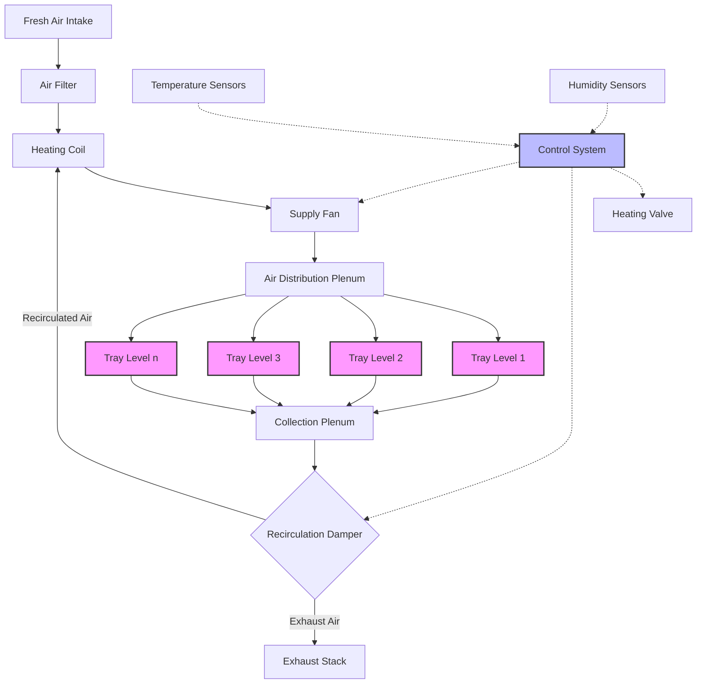

# Tray Dryers for Industrial Batch Drying Processes

Tray dryers represent the most fundamental form of convective batch drying, utilizing heated air circulation over material arranged in thin layers on trays. These systems operate on the principle of simultaneous heat and mass transfer, where thermal energy supplied by heated air evaporates moisture from the material surface, and the moisture-laden air is either exhausted or recirculated after dehumidification.

## Physical Principles of Tray Drying

The drying process in tray dryers occurs in two distinct phases governed by different physical mechanisms.

**Constant Rate Period:** During initial drying, moisture migrates from the material interior to the surface faster than evaporation occurs. The surface remains saturated, and the drying rate depends entirely on external heat and mass transfer conditions. The evaporation rate equals:

$$\dot{m}_w = h_m \cdot A \cdot (C_{s} - C_{\infty})$$

Where $h_m$ is the mass transfer coefficient (m/s), $A$ is the exposed surface area (m²), $C_s$ is the vapor concentration at the saturated surface (kg/m³), and $C_{\infty}$ is the vapor concentration in the bulk air stream (kg/m³).

**Falling Rate Period:** Once the critical moisture content is reached, internal moisture migration becomes the limiting factor. The drying rate decreases as the material dries, and diffusion-controlled mechanisms dominate. This phase requires significantly longer time and determines overall batch duration for most materials.

## Heat Transfer and Energy Requirements

The thermal energy required for drying consists of sensible heat to raise material temperature and latent heat for moisture evaporation:

$$Q_{total} = m_s \cdot c_p \cdot \Delta T + m_w \cdot h_{fg}$$

Where $m_s$ is the dry solid mass (kg), $c_p$ is the specific heat of the material (kJ/kg·K), $\Delta T$ is the temperature rise (K), $m_w$ is the moisture removed (kg), and $h_{fg}$ is the latent heat of vaporization (approximately 2,500 kJ/kg at atmospheric pressure).

The convective heat transfer from air to material follows:

$$q = h_c \cdot A \cdot (T_{air} - T_{material})$$

The convective heat transfer coefficient $h_c$ (W/m²·K) depends critically on air velocity over the tray surface. Typical values range from 10-50 W/m²·K for air velocities of 1-5 m/s.

## Tray Dryer Capacity Calculation

The batch drying time calculation requires integrating the drying rate over the moisture content range:

$$t_{dry} = \int_{X_1}^{X_2} \frac{m_s}{A \cdot R_c} \, dX$$

Where $X_1$ and $X_2$ are initial and final moisture contents (kg water/kg dry solid), and $R_c$ is the critical drying rate (kg/m²·h).

For practical design, the drying time is estimated separately for constant and falling rate periods:

$$t_{total} = \frac{m_s(X_i - X_c)}{A \cdot R_c} + \frac{m_s(X_c - X_f)}{A \cdot R_c \cdot \ln\left(\frac{X_c}{X_f}\right)}$$

Where $X_i$, $X_c$, and $X_f$ represent initial, critical, and final moisture contents respectively.

## Airflow Configuration and Psychrometrics

Effective tray dryer operation requires precise control of air temperature, humidity, and velocity. The air can be configured in several arrangements:

- **Through-circulation:** Air passes perpendicular through perforated trays, maximizing contact with material
- **Cross-flow:** Air flows horizontally across tray surfaces, simpler construction but less uniform
- **Combination:** Initial through-flow transitions to cross-flow as material shrinks

The psychrometric analysis determines whether air recirculation is feasible. Fresh air heating energy per unit mass of water removed:

$$E_{fresh} = \frac{c_p \cdot (T_{supply} - T_{ambient})}{\omega_{exhaust} - \omega_{ambient}}$$

Recirculation reduces energy consumption but requires maintaining adequate humidity driving force. The optimal recirculation ratio balances energy savings against drying rate reduction.

## Tray Dryer System Configuration

## Application-Specific Design Considerations

| Application | Temperature Range | Air Velocity | Critical Parameters | Typical Cycle Time |
|-------------|------------------|--------------|---------------------|-------------------|
| Pharmaceutical granules | 40-60°C | 1.5-2.5 m/s | Uniform temperature, GMP compliance, validation | 4-12 hours |
| Food products | 50-80°C | 2-4 m/s | Food-grade materials, easy cleaning, low humidity | 3-8 hours |
| Chemical intermediates | 60-120°C | 2-5 m/s | Explosion-proof design, solvent recovery | 6-16 hours |
| Ceramic products | 80-150°C | 1-3 m/s | Slow drying to prevent cracking, uniformity | 12-48 hours |
| Electronic components | 40-80°C | 1-2 m/s | Clean air, precise control, static prevention | 2-6 hours |

## Standards and Design References

ASHRAE Handbook - HVAC Applications provides guidance on industrial drying system design including psychrometric calculations and equipment selection. Pharmaceutical applications must comply with FDA cGMP requirements (21 CFR Part 211) and EU GMP Annex 15 for qualification and validation.

ASME BPE standards govern sanitary design for pharmaceutical and biotech applications, specifying surface finish, materials of construction, and cleanability requirements. The standards require 20 µin Ra maximum surface roughness for product contact surfaces and specify 316L stainless steel as minimum material grade.

For process safety, NFPA 86 Standard for Ovens and Furnaces addresses explosion prevention in dryers handling flammable solvents. The standard requires continuous monitoring of solvent concentration, maintaining levels below 25% of the Lower Explosive Limit (LEL), and interlocked purge cycles.

## Optimization Strategies

Maximizing tray dryer efficiency requires:

1. **Loading optimization:** Material depth affects drying time exponentially; 10-25 mm depth provides optimal balance
2. **Air distribution:** Uniform velocity across all trays prevents under-drying in low-velocity zones
3. **Temperature profiling:** Higher initial temperatures accelerate constant-rate drying without damaging heat-sensitive materials
4. **Humidity control:** Reducing exhaust humidity ratio increases driving force but raises energy consumption

The thermal efficiency of tray dryers typically ranges from 25-45%, significantly lower than continuous dryers due to batch heating losses and structural heat capacity. Proper insulation (minimum R-10 for walls, R-15 for roof) and rapid loading/unloading procedures improve efficiency.

Tray dryers remain the preferred choice for small-batch production, frequent product changeovers, and materials requiring gentle handling despite lower thermal efficiency compared to continuous systems. The simplicity of construction, ease of cleaning, and process flexibility justify their widespread use in pharmaceutical, specialty chemical, and food industries.

## Components

- Batch Tray Dryers
- Truck Tray Dryers
- Air Circulation Trays
- Heating Methods Tray Dryers
