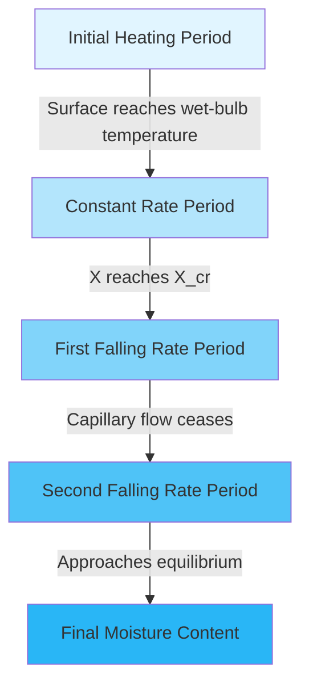

# Drying Process Fundamentals

Industrial drying systems remove moisture from materials through simultaneous heat and mass transfer. Understanding the physics governing these processes is essential for designing efficient HVAC systems that meet production requirements while minimizing energy consumption.

## Physical Principles of Drying

Drying occurs when the vapor pressure at the material surface exceeds the partial pressure of water vapor in the surrounding air. This vapor pressure difference drives moisture migration from the material interior to the surface, followed by evaporation into the air stream.

The process involves three fundamental mechanisms:

- **Heat transfer** from the drying medium to the material surface
- **Internal moisture migration** through diffusion, capillary action, or vapor flow
- **Mass transfer** of water vapor from the surface to the bulk air

### Energy Balance

The energy required for drying consists of sensible heating and latent heat of vaporization:

$$Q_{total} = m_s c_p (T_f - T_i) + m_w h_{fg}$$

Where:
- $Q_{total}$ = total energy required (kJ)
- $m_s$ = mass of dry solid (kg)
- $c_p$ = specific heat of material (kJ/kg·K)
- $T_f, T_i$ = final and initial temperatures (K)
- $m_w$ = mass of water evaporated (kg)
- $h_{fg}$ = latent heat of vaporization (kJ/kg)

At typical drying temperatures (50-150°C), latent heat dominates total energy consumption, representing 80-95% of the thermal load.

## Drying Rate Equations

The drying rate characterizes moisture removal speed and determines equipment sizing. It varies significantly throughout the drying cycle.

### Constant Rate Period

During constant rate drying, sufficient moisture exists at the surface to maintain a continuous liquid film. The rate is governed by external heat and mass transfer:

$$\frac{dX}{dt} = -\frac{h_m A}{m_s}(Y_s - Y_\infty)$$

Where:
- $\frac{dX}{dt}$ = drying rate (kg water/kg dry solid·s)
- $h_m$ = mass transfer coefficient (m/s)
- $A$ = surface area (m²)
- $Y_s$ = humidity ratio at surface (kg/kg)
- $Y_\infty$ = bulk air humidity ratio (kg/kg)

The mass transfer coefficient relates to convective heat transfer through the Lewis relation:

$$\frac{h_c}{h_m c_p} = Le^n$$

Where $Le$ is the Lewis number (typically 0.8-1.0 for air-water systems) and $n$ ranges from 0.33 to 0.67 depending on flow conditions.

### Falling Rate Period

Once surface moisture depletes below the critical moisture content ($X_{cr}$), the drying rate decreases as internal moisture diffusion becomes limiting:

$$\frac{dX}{dt} = -\frac{D_{eff} A}{V L}(X - X_e)$$

Where:
- $D_{eff}$ = effective diffusivity (m²/s)
- $V$ = material volume (m³)
- $L$ = characteristic length (m)
- $X$ = moisture content (kg/kg dry basis)
- $X_e$ = equilibrium moisture content (kg/kg)

Effective diffusivity depends exponentially on temperature:

$$D_{eff} = D_0 \exp\left(-\frac{E_a}{RT}\right)$$

Where $E_a$ is the activation energy (kJ/mol), $R$ is the gas constant (8.314 J/mol·K), and $T$ is absolute temperature.

## Psychrometric Considerations

The drying medium's capacity to accept moisture depends on its psychrometric state. The maximum moisture pickup occurs when air exits at saturation:

$$\Delta Y_{max} = Y_{sat}(T_{db}) - Y_{in}$$

Actual moisture pickup is:

$$\Delta Y_{actual} = \eta_{saturation} \cdot \Delta Y_{max}$$

Where saturation efficiency ($\eta_{saturation}$) typically ranges from 0.6-0.9 depending on contact time and equipment design.

## Drying Curve Characteristics

The critical moisture content ($X_{cr}$) marks the transition between constant and falling rate periods. This value depends on:

- Material porosity and structure
- Initial moisture distribution
- Drying air velocity and temperature
- Material thickness

## Comparison of Industrial Drying Methods

| Drying Method | Heat Transfer Mode | Typical Temperature Range (°C) | Drying Rate | Energy Efficiency | Capital Cost |
|---------------|-------------------|-------------------------------|-------------|------------------|--------------|
| **Convective (Direct)** | Convection from hot air | 50-200 | Moderate | 30-50% | Low-Moderate |
| **Conductive (Indirect)** | Conduction through heated surface | 60-150 | Slow-Moderate | 50-70% | Moderate-High |
| **Radiant (Infrared)** | Radiation absorption | 80-300 | Fast | 40-60% | Moderate |
| **Dielectric (Microwave/RF)** | Volumetric heating | 40-100 | Very Fast | 50-80% | High |
| **Freeze Drying** | Sublimation under vacuum | -40-25 | Very Slow | 10-20% | Very High |
| **Superheated Steam** | Convection from steam | 105-200 | Fast | 70-90% | High |

## Design Implications

HVAC system design for industrial drying must account for:

**Air flow rate determination**:
$$\dot{m}_{air} = \frac{\dot{m}_w}{\Delta Y_{actual}}$$

This establishes fan sizing and ductwork requirements.

**Heating capacity**:
$$Q_{heating} = \dot{m}_{air}[h(T_{out}, Y_{out}) - h(T_{in}, Y_{in})]$$

Where $h$ represents specific enthalpy of moist air.

**Humidity control**: Maintaining optimal inlet humidity maximizes drying potential while preventing material degradation from excessive drying rates.

**Exhaust air treatment**: High moisture exhaust may require condensing heat recovery or exhaust air recirculation to improve energy efficiency.

## Optimization Strategies

Efficient drying system operation requires balancing drying rate against energy consumption. Key strategies include:

- **Temperature optimization**: Higher temperatures increase drying rate but may damage heat-sensitive materials
- **Humidity control**: Lower inlet humidity increases driving force but requires more makeup air heating
- **Air velocity**: Increased velocity improves mass transfer during constant rate period but increases fan power
- **Heat recovery**: Exhaust air contains significant sensible and latent heat suitable for preheating or dehumidification

The specific moisture extraction rate (SMER) quantifies energy efficiency:

$$SMER = \frac{\text{kg water evaporated}}{\text{kWh energy input}}$$

Typical SMER values range from 0.5-1.5 kg/kWh for convective dryers to 3-6 kg/kWh for heat pump-assisted systems.

Understanding these fundamental principles enables proper equipment selection, accurate performance prediction, and effective troubleshooting of industrial drying systems.
