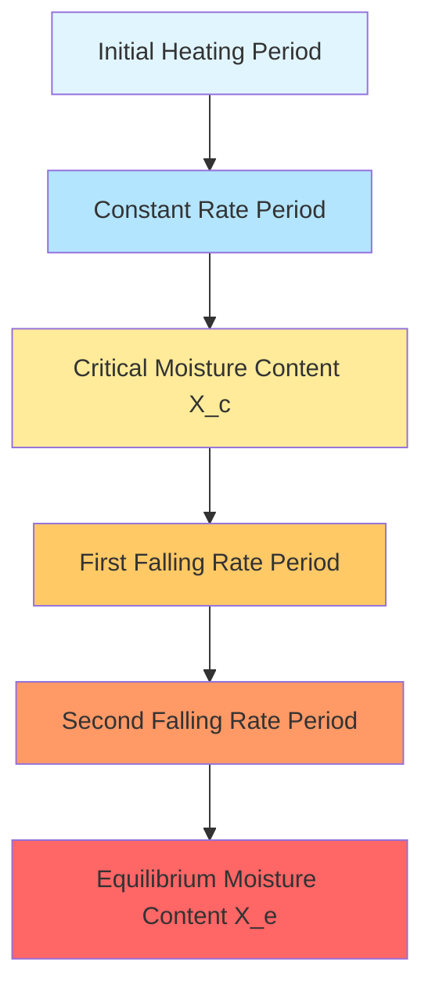
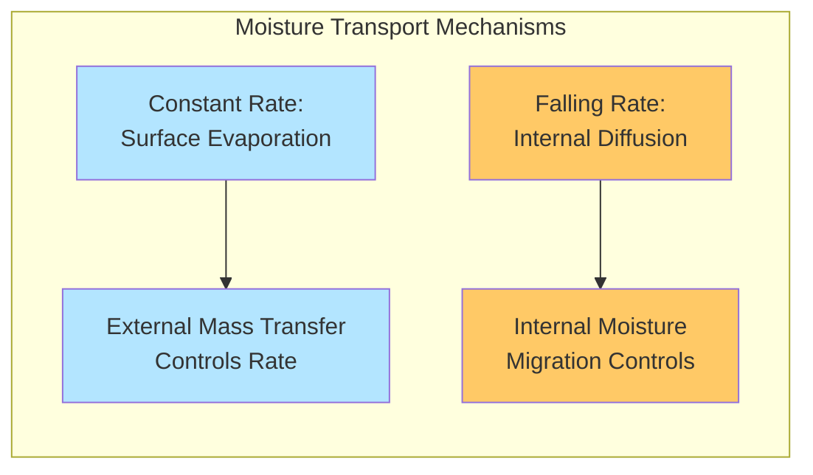

Industrial drying processes exhibit distinct phases characterized by the mechanisms controlling moisture removal. Understanding the transition between constant rate and falling rate periods enables precise process control, energy optimization, and accurate prediction of drying times for hygroscopic materials.

## Physical Mechanisms of Drying Periods

### Constant Rate Period

During the constant rate period, the material surface remains saturated with liquid water. Free moisture evaporates from the surface at a rate determined entirely by external conditions: air temperature, humidity, velocity, and the exposed surface area. The drying rate remains constant because moisture migrates from the interior to the surface faster than it evaporates, maintaining surface saturation.

The evaporation rate during this period follows convective mass transfer principles:

$$\dot{m}_w = h_m A_s (C_{s} - C_{\infty})$$

Where:
- $\dot{m}_w$ = mass transfer rate of water vapor (kg/s)
- $h_m$ = convective mass transfer coefficient (m/s)
- $A_s$ = surface area exposed to airflow (m²)
- $C_s$ = vapor concentration at saturated surface (kg/m³)
- $C_{\infty}$ = vapor concentration in bulk air (kg/m³)

The heat required for evaporation balances convective heat transfer from the air:

$$\dot{Q} = h_c A_s (T_{\infty} - T_s) = \dot{m}_w h_{fg}$$

Where:
- $h_c$ = convective heat transfer coefficient (W/m²·K)
- $T_{\infty}$ = bulk air temperature (K)
- $T_s$ = surface temperature (K)
- $h_{fg}$ = latent heat of vaporization (J/kg)

During constant rate drying, the surface temperature equals the wet-bulb temperature of the drying air. This occurs because evaporative cooling exactly balances convective heating, establishing thermal equilibrium at the wet-bulb condition.

### Critical Moisture Content

The critical moisture content ($X_c$) marks the transition point where surface saturation can no longer be maintained. At this threshold, the internal moisture migration rate becomes insufficient to replenish surface evaporation. The critical moisture content depends on material structure, thickness, initial moisture distribution, and drying conditions.

For many materials:

$$X_c = f(R_c, D_{eff}, \rho_s, h_m)$$

Where:
- $R_c$ = characteristic dimension (thickness, radius)
- $D_{eff}$ = effective moisture diffusivity (m²/s)
- $\rho_s$ = dry solid density (kg/m³)

Thinner materials, higher air velocities, and elevated temperatures reduce critical moisture content because surface evaporation intensifies relative to internal diffusion capacity.

### Falling Rate Period

Once moisture content drops below the critical value, the drying rate decreases progressively. The material surface begins to dry, and the evaporation plane recedes into the material interior. Internal moisture diffusion becomes the rate-limiting mechanism rather than external convection.

The falling rate period typically follows diffusion-controlled kinetics:

$$\frac{dX}{dt} = -K(X - X_e)$$

Where:
- $X$ = moisture content (kg water/kg dry solid)
- $t$ = time (s)
- $K$ = drying rate constant (1/s)
- $X_e$ = equilibrium moisture content (kg/kg)

For diffusion-controlled drying in simple geometries, Fick's second law applies:

$$\frac{\partial X}{\partial t} = D_{eff} \nabla^2 X$$

The effective diffusivity exhibits strong temperature dependence following an Arrhenius relationship:

$$D_{eff} = D_0 \exp\left(-\frac{E_a}{RT}\right)$$

Where:
- $D_0$ = pre-exponential factor (m²/s)
- $E_a$ = activation energy for diffusion (J/mol)
- $R$ = universal gas constant (8.314 J/mol·K)
- $T$ = absolute temperature (K)

## Drying Curve Characteristics

## Comparison of Drying Periods

| Characteristic | Constant Rate Period | Falling Rate Period |
|----------------|---------------------|---------------------|
| **Rate-Limiting Mechanism** | External convection (heat/mass transfer) | Internal diffusion |
| **Surface Condition** | Saturated with liquid water | Partially or completely dry |
| **Drying Rate** | Constant, independent of moisture content | Decreases with moisture content |
| **Surface Temperature** | Equals wet-bulb temperature | Rises toward dry-bulb temperature |
| **Moisture Profile** | Relatively uniform throughout material | Strong gradient from core to surface |
| **Effect of Air Velocity** | Strong influence on rate | Minimal influence on rate |
| **Effect of Air Temperature** | Linear increase in rate | Exponential increase (affects diffusivity) |
| **Effect of Material Thickness** | Affects duration, not rate | Strong effect on both rate and duration |
| **Energy Efficiency** | High (direct evaporation) | Lower (heat penetration required) |

## Engineering Applications

### Drying Time Calculation

Total drying time equals the sum of constant and falling rate periods:

$$t_{total} = t_{constant} + t_{falling}$$

For constant rate period:

$$t_{constant} = \frac{m_s(X_0 - X_c)}{R_c A_s}$$

Where:
- $m_s$ = mass of dry solid (kg)
- $X_0$ = initial moisture content (kg/kg)
- $R_c$ = constant drying rate (kg/m²·s)

For falling rate period (first-order approximation):

$$t_{falling} = \frac{m_s}{K A_s} \ln\left(\frac{X_c - X_e}{X_f - X_e}\right)$$

Where $X_f$ = final desired moisture content (kg/kg)

### Process Optimization

Maximizing the constant rate period duration improves energy efficiency and throughput. This requires maintaining surface moisture through proper material handling, optimizing air conditions, and controlling feed moisture uniformity. Thin layer drying, increased surface area, and optimal air velocity enhance constant rate performance.

During falling rate drying, elevating air temperature increases diffusivity more effectively than raising air velocity. However, temperature limits exist based on product quality, thermal degradation, and case hardening prevention.

## Critical Considerations

Equilibrium moisture content represents the thermodynamic limit where vapor pressure at the material surface equals partial pressure in the surrounding air. This value depends on material hygroscopicity, temperature, and relative humidity according to sorption isotherms. Drying cannot proceed below equilibrium moisture content without altering air conditions.

Case hardening occurs when surface moisture removal vastly exceeds internal migration, creating an impermeable dry shell that traps internal moisture. This defect arises from excessive drying rates during the falling rate period and requires controlled temperature and humidity profiles to prevent.

Understanding these fundamental periods enables rational dryer design, accurate performance prediction, and effective troubleshooting of industrial drying operations across food processing, pharmaceuticals, ceramics, lumber, and textile manufacturing applications.
