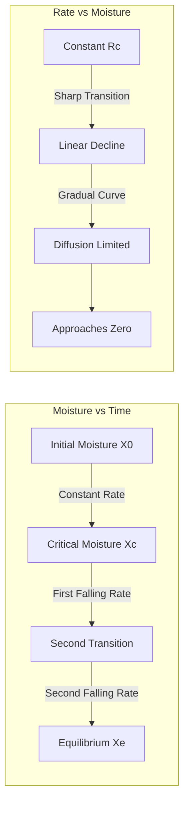
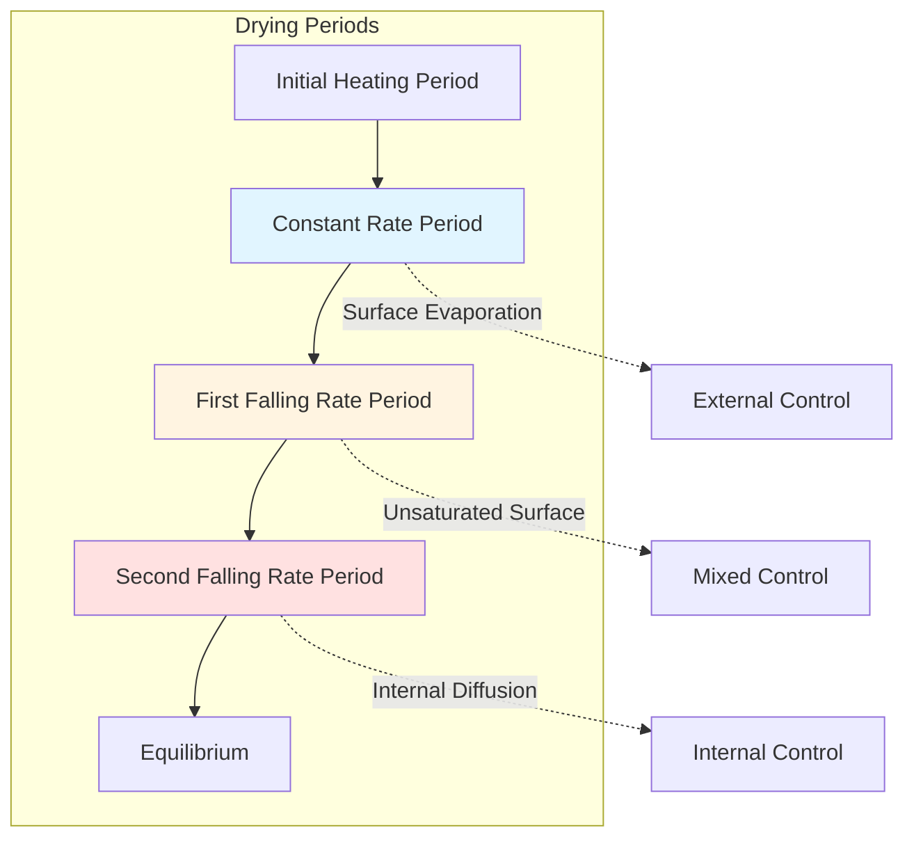

## Fundamental Drying Curve Theory

The drying curve represents the relationship between moisture content and time during the drying process. This graphical representation reveals the fundamental mass transfer mechanisms controlling moisture removal and allows prediction of drying times for industrial processes.

When plotting moisture content versus time, the resulting curve exhibits distinct periods characterized by different moisture migration mechanisms. Understanding these periods enables proper dryer design, energy optimization, and process control strategy development.

## Moisture Content Definitions

Free moisture content on a dry basis:

$$X = \frac{m_w}{m_s}$$

where:
- $X$ = moisture content (kg water/kg dry solid)
- $m_w$ = mass of water (kg)
- $m_s$ = mass of bone-dry solid (kg)

Moisture ratio (dimensionless):

$$MR = \frac{X - X_e}{X_0 - X_e}$$

where:
- $MR$ = moisture ratio (dimensionless)
- $X_0$ = initial moisture content (kg/kg)
- $X_e$ = equilibrium moisture content (kg/kg)
- $X$ = moisture content at time $t$ (kg/kg)

## Drying Rate Curve Characteristics

The drying rate curve plots the drying rate against moisture content, revealing critical transition points in the drying process.

Instantaneous drying rate:

$$R = -\frac{m_s}{A} \frac{dX}{dt}$$

where:
- $R$ = drying rate (kg/m²·s)
- $A$ = drying surface area (m²)
- $t$ = time (s)

### Constant Rate Period

During the constant rate period, sufficient free moisture exists at the material surface to maintain a continuous liquid film. The surface behaves as a free water surface, and evaporation occurs at the wet-bulb temperature of the drying air.

Drying rate during constant rate period:

$$R_c = k_y(H_{sat,s} - H_a)$$

where:
- $R_c$ = constant drying rate (kg/m²·s)
- $k_y$ = mass transfer coefficient (kg/m²·s)
- $H_{sat,s}$ = humidity ratio at surface saturation (kg/kg)
- $H_a$ = humidity ratio of bulk air (kg/kg)

The constant rate persists until the critical moisture content $X_c$ is reached. At this point, the surface can no longer supply sufficient moisture to maintain complete surface wetness.

### Falling Rate Period

Once moisture content falls below $X_c$, the drying rate decreases progressively. Two distinct mechanisms typically control this period:

**First Falling Rate Period**: Partially wetted surface. The drying rate decreases linearly as the wetted surface area decreases:

$$R = R_c \frac{X - X_e}{X_c - X_e}$$

**Second Falling Rate Period**: Internal diffusion control. Moisture migration from the interior to the surface becomes rate-limiting:

$$R = k_d \frac{\partial X}{\partial y}\bigg|_{y=0}$$

where:
- $k_d$ = diffusion coefficient (m²/s)
- $y$ = distance from surface (m)

## Drying Time Calculation

Total drying time integrates the contributions from constant and falling rate periods.

Time for constant rate period:

$$t_c = \frac{m_s(X_0 - X_c)}{A \cdot R_c}$$

Time for falling rate period (first falling rate):

$$t_f = \frac{m_s(X_c - X_e)}{A \cdot R_c} \ln\left(\frac{X_c - X_e}{X_f - X_e}\right)$$

where $X_f$ is the final moisture content.

## Drying Curve Characteristics

**Typical Drying Curve Progression:**

## Material-Specific Drying Behavior

| Material Type | Critical Moisture Xc | Falling Rate Mechanism | Typical Drying Time |
|--------------|---------------------|------------------------|---------------------|
| Non-hygroscopic porous | 0.15-0.25 kg/kg | Capillary flow dominates | Short constant period |
| Hygroscopic porous | 0.30-0.60 kg/kg | Bound water diffusion | Extended falling period |
| Granular free-flowing | 0.08-0.15 kg/kg | Interparticle evaporation | Minimal constant period |
| Colloidal/gel materials | 0.80-2.00 kg/kg | Case hardening risk | Prolonged diffusion phase |
| Dense non-porous | Very low | Pure diffusion control | No constant rate period |

## Critical Moisture Content Determination

The critical moisture content $X_c$ depends on:

1. **Material structure**: Pore size distribution, capillary network connectivity
2. **Drying conditions**: Air velocity, temperature, humidity
3. **Material thickness**: Thicker materials reach $X_c$ at higher moisture content
4. **Initial moisture**: Higher $X_0$ may increase $X_c$

Empirical correlation for porous materials:

$$X_c = X_e + k \cdot L^{0.5} \cdot R_c^{0.3}$$

where:
- $L$ = characteristic material thickness (m)
- $k$ = material constant (experimentally determined)

## Practical Applications

**Process Control Strategy:**
- Monitor drying rate continuously
- Detect transition to falling rate period (optimization point)
- Adjust temperature and airflow based on drying period
- Prevent over-drying and energy waste

**Energy Optimization:**
- Maximum evaporation efficiency occurs during constant rate period
- Increase air temperature during falling rate to maintain acceptable rates
- Reduce airflow when external mass transfer no longer limits rate

**Quality Considerations:**
- Rapid constant rate drying may cause surface case hardening
- Controlled falling rate prevents cracking and warping
- Equilibrium moisture content determines final product stability

## Experimental Determination

Standard procedure for generating drying curves:

1. Prepare material sample of known initial moisture $X_0$
2. Expose to controlled drying air (constant $T$, $RH$, velocity)
3. Weigh sample at regular intervals without removing from dryer
4. Calculate moisture content and drying rate
5. Plot $X$ vs $t$ and $R$ vs $X$
6. Identify $X_c$ at the intersection of constant and falling rate extrapolations

The resulting curves provide design data specific to the material and drying conditions, enabling accurate dryer sizing and performance prediction.

## Conclusion

Drying curves quantify the fundamental moisture removal mechanisms governing industrial drying processes. The constant rate period represents external mass transfer control where psychrometric driving forces dominate. The falling rate period reflects internal moisture migration limitations where diffusion and capillary flow determine performance. Accurate characterization of these periods through experimental curves enables precise dryer design, energy-efficient operation, and consistent product quality.
