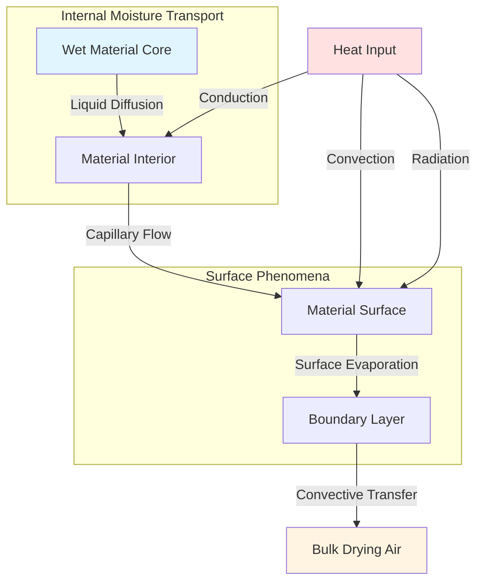

## Fundamentals of Moisture Removal

Moisture removal from materials represents the core objective of industrial drying systems. The process involves simultaneous heat and mass transfer, governed by thermodynamic and transport properties of both the material and the drying medium. Understanding these mechanisms enables accurate prediction of drying times, energy requirements, and final product quality.

## Moisture Transfer Mechanisms

Three primary mechanisms drive moisture from the interior of materials to the surface and subsequently into the drying air:

**Liquid Diffusion**: Moisture moves through the material as liquid water driven by concentration gradients. This mechanism dominates in the early stages of drying when moisture content remains high. The diffusion flux follows Fick's law:

$$J = -D \frac{\partial C}{\partial x}$$

where $J$ is the moisture flux (kg/m²·s), $D$ is the diffusion coefficient (m²/s), and $\frac{\partial C}{\partial x}$ is the moisture concentration gradient (kg/m⁴).

**Vapor Diffusion**: As surface moisture depletes, internal moisture vaporizes and diffuses through pores and capillaries. The vapor diffusion rate depends on the partial pressure gradient:

$$J_v = -D_v \frac{\partial P_v}{\partial x}$$

where $D_v$ is the vapor diffusion coefficient and $P_v$ is the vapor pressure.

**Capillary Flow**: In porous materials, surface tension forces drive liquid moisture through interconnected capillaries toward drier regions. This mechanism becomes significant in hygroscopic materials with well-defined pore structures.

## Evaporation Rate Equations

The moisture removal rate from the material surface depends on the vapor pressure difference between the surface and the bulk air:

$$\dot{m} = h_m A (C_s - C_\infty)$$

where:
- $\dot{m}$ = moisture evaporation rate (kg/s)
- $h_m$ = mass transfer coefficient (m/s)
- $A$ = surface area (m²)
- $C_s$ = moisture concentration at surface (kg/m³)
- $C_\infty$ = moisture concentration in bulk air (kg/m³)

The mass transfer coefficient relates to the convective heat transfer coefficient through the Lewis relation:

$$\frac{h_m}{h} = \frac{1}{\rho c_p Le^{2/3}}$$

where $Le = \frac{\alpha}{D}$ is the Lewis number, representing the ratio of thermal to mass diffusivity.

## Drying Rate Periods

Industrial drying occurs in distinct periods characterized by different controlling mechanisms:

**Constant Rate Period**: Surface moisture evaporates at a rate determined entirely by external conditions. The drying rate remains constant because moisture migration from the interior replenishes surface moisture as fast as it evaporates:

$$\frac{dX}{dt} = -\frac{h_m A}{m_s}(Y_s - Y_\infty)$$

where $X$ is moisture content (dry basis), $m_s$ is dry solid mass, and $Y$ represents humidity ratio.

**Falling Rate Period**: Internal moisture transport becomes the limiting factor. The drying rate decreases as moisture migrates slower from the depleted interior:

$$\frac{dX}{dt} = -k(X - X_e)$$

where $k$ is the drying constant and $X_e$ is the equilibrium moisture content.

## Moisture Removal Methods Comparison

| Method | Mechanism | Energy Source | Typical Rate | Applications | Efficiency |
|--------|-----------|---------------|--------------|--------------|------------|
| Convective Drying | Evaporation + Convection | Hot air | 0.5-5 kg/m²·h | General purpose, grains, lumber | 25-60% |
| Conductive Drying | Evaporation + Conduction | Heated surface | 2-10 kg/m²·h | Pastes, slurries, thin layers | 40-70% |
| Radiation Drying | Evaporation + IR absorption | Infrared lamps | 1-8 kg/m²·h | Coatings, textiles, paper | 50-80% |
| Vacuum Drying | Reduced pressure evaporation | Heated walls | 0.1-2 kg/m²·h | Heat-sensitive, pharmaceuticals | 60-85% |
| Freeze Drying | Sublimation | Vacuum + heat | 0.05-0.5 kg/m²·h | Biologicals, high-value foods | 30-50% |
| Microwave Drying | Volumetric heating | Electromagnetic | 3-15 kg/m²·h | Selective heating, rapid drying | 50-75% |

## Energy Requirements for Moisture Removal

The minimum theoretical energy to evaporate moisture equals the latent heat of vaporization:

$$Q_{min} = m_w h_{fg}$$

where $m_w$ is the mass of water removed and $h_{fg}$ is the latent heat (approximately 2450 kJ/kg at atmospheric pressure).

Actual energy requirements exceed this minimum due to:

- Sensible heating of material and moisture
- Heating excess air above saturation requirements
- Heat losses from equipment surfaces
- Energy to overcome binding forces in hygroscopic materials

The total specific energy consumption typically ranges from 3000-6000 kJ/kg water removed:

$$q_{total} = h_{fg} + c_p \Delta T_{material} + \frac{Q_{losses}}{\dot{m}_w}$$

## Moisture Binding Energy

Materials exhibit different moisture binding energies depending on the moisture-solid interaction. The differential heat of sorption quantifies the additional energy required beyond free water evaporation:

$$q_s = h_{fg} + \Delta h_b$$

where $\Delta h_b$ represents the binding energy, which increases substantially at low moisture contents in hygroscopic materials.

## Practical Considerations

**Equilibrium Moisture Content**: Materials cannot dry below the equilibrium moisture content corresponding to the drying air humidity. The EMC follows sorption isotherms specific to each material:

$$X_e = f(RH, T)$$

**Drying Air Conditions**: Optimal drying requires balancing temperature (driving evaporation rate) and humidity (moisture carrying capacity). The psychrometric properties of the drying air determine the maximum moisture removal potential.

**Material Properties**: Thermal conductivity, permeability, and diffusivity govern internal moisture transport rates. Dense, impermeable materials require significantly longer drying times than porous, permeable structures.

Understanding these moisture removal fundamentals enables design of efficient drying systems, accurate prediction of drying times, and optimization of energy consumption while maintaining product quality specifications.
