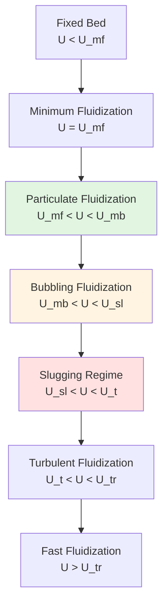
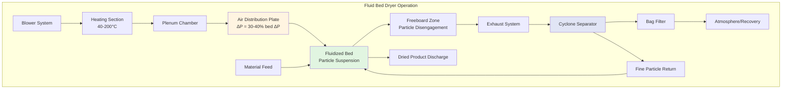

Fluid bed dryers suspend particulate materials in an upward-flowing air stream, creating a fluidized state that enables rapid, uniform moisture removal through superior gas-solid contact. The technology achieves heat and mass transfer rates 3-10 times higher than fixed-bed systems through continuous particle mixing and large interfacial area.

## Fluidization Fundamentals

### Minimum Fluidization Velocity

Fluidization occurs when upward gas velocity generates sufficient drag force to counteract particle weight and inter-particle friction. At minimum fluidization velocity ($U_{mf}$), particles begin to separate and exhibit fluid-like behavior. The Ergun equation governs pressure drop across the packed bed:

$$\frac{\Delta P}{L} = \frac{150\mu U(1-\varepsilon)^2}{\phi^2 d_p^2 \varepsilon^3} + \frac{1.75\rho_g U^2(1-\varepsilon)}{\phi d_p \varepsilon^3}$$

Where:
- $\Delta P$ = pressure drop across bed (Pa)
- $L$ = bed depth (m)
- $\mu$ = gas dynamic viscosity (Pa·s)
- $U$ = superficial gas velocity (m/s)
- $\varepsilon$ = void fraction (dimensionless)
- $\phi$ = particle sphericity (dimensionless)
- $d_p$ = particle diameter (m)
- $\rho_g$ = gas density (kg/m³)

At incipient fluidization, pressure drop equals bed weight per unit area:

$$\Delta P = (1-\varepsilon_{mf})(\rho_p - \rho_g)gL$$

Where $\varepsilon_{mf}$ is void fraction at minimum fluidization and $\rho_p$ is particle density (kg/m³).

For fine particles (Re < 20), the simplified Wen-Yu correlation estimates $U_{mf}$:

$$U_{mf} = \frac{d_p^2(\rho_p - \rho_g)g}{1650\mu}$$

Operating velocity typically ranges from 1.5 to 3.0 times $U_{mf}$ to ensure stable fluidization without excessive particle entrainment.

### Geldart Classification

The Geldart classification system categorizes particle fluidization behavior based on mean particle size and density difference:

| Geldart Group | Particle Size ($\mu$m) | Behavior | Applications |
|---------------|------------------------|----------|--------------|
| **Group C** | < 30 | Cohesive, channeling, difficult to fluidize | Very fine powders, pigments |
| **Group A** | 30-100 | Particulate fluidization, controlled bubbling | Pharmaceuticals, catalysts, lactose |
| **Group B** | 100-800 | Bubbling fluidization, vigorous mixing | Sand, sugar, granules, food products |
| **Group D** | > 800 | Spouting, large bubbles, high velocity required | Pellets, coffee beans, large granules |

Group A particles exhibit smooth expansion before bubbling begins. Group B particles bubble immediately upon exceeding $U_{mf}$. Group D particles require high velocities and often employ spouted bed configurations.

### Fluidization Regimes

Where $U_{mb}$ = minimum bubbling velocity, $U_{sl}$ = slugging velocity, $U_t$ = terminal velocity, $U_{tr}$ = transport velocity.

## Particle Suspension Mechanics

### Terminal Velocity

Terminal velocity ($U_t$) represents the maximum gas velocity preventing particle elutriation:

$$U_t = \sqrt{\frac{4g d_p(\rho_p - \rho_g)}{3C_D \rho_g}}$$

Drag coefficient ($C_D$) depends on particle Reynolds number ($Re_p = \rho_g U d_p / \mu$):

- **Laminar regime** ($Re_p$ < 0.4): $C_D = 24/Re_p$ (Stokes law)
- **Intermediate regime** (0.4 < $Re_p$ < 500): $C_D = 18.5/Re_p^{0.6}$
- **Turbulent regime** ($Re_p$ > 500): $C_D \approx 0.44$

The operational fluidization window exists between $U_{mf}$ and $U_t$, defining stable operating conditions.

### Particle Size Distribution Effects

| Particle Size Range | $U_{mf}$ (m/s) | $U_t$ (m/s) | Fluidization Quality | Typical Product |
|---------------------|----------------|-------------|---------------------|-----------------|
| 20-50 $\mu$m | 0.001-0.005 | 0.05-0.2 | Cohesive, channeling risk | Pharmaceutical powders |
| 50-200 $\mu$m | 0.005-0.05 | 0.2-1.5 | Smooth, uniform expansion | Granulated sugar, salt |
| 200-500 $\mu$m | 0.05-0.25 | 1.5-5.0 | Vigorous bubbling | Coffee, cereals |
| 500-2000 $\mu$m | 0.25-2.0 | 5.0-15.0 | Spouting, high velocity | Large pellets, nuts |

Wide particle size distributions create segregation issues where fine particles preferentially elutriate while coarse particles settle. Size distribution coefficient of variation should remain below 30% for optimal performance.

## Air Distribution System Design

### Distributor Plate Requirements

The air distribution plate ensures uniform gas flow across the bed cross-section, preventing dead zones and channeling. Critical design parameters:

**Pressure Drop Criterion:**

$$\Delta P_{distributor} > 0.3 \times \Delta P_{bed}$$

This ratio prevents gas maldistribution and ensures even fluidization across the entire bed area.

**Open Area Calculation:**

$$A_{open} = \frac{n \pi d_{hole}^2}{4A_{total}}$$

Where $n$ = number of holes, $d_{hole}$ = hole diameter, $A_{total}$ = total plate area.

Open area typically ranges from 3-10% depending on particle size and pressure drop requirements.

### Distributor Types

| Distributor Type | Pressure Drop (Pa) | Applications | Advantages | Disadvantages |
|------------------|-------------------|--------------|------------|---------------|
| **Perforated plate** | 500-2000 | General purpose, Group B/D particles | Simple, low cost, easy cleaning | Particle back-flow risk |
| **Sintered metal** | 1000-5000 | Fine powders, Group A particles | Excellent uniformity, high ΔP | Expensive, difficult to clean |
| **Bubble caps** | 800-3000 | Coarse particles, high velocity | Prevents back-flow, flexible | Complex fabrication |
| **Nozzle grid** | 1500-4000 | Large particles, coating operations | High velocity jets, good mixing | Higher cost, maintenance |
| **Conical distributor** | 600-2500 | Product discharge, batch systems | Facilitates discharge, uniform flow | Custom design required |

**Hole Spacing:** Triangular pitch with spacing 3-6 times hole diameter ensures uniform distribution. Hole diameter ranges from 1-10 mm based on particle size—holes should be 1/3 to 1/5 the minimum particle diameter to prevent particle back-sifting.

### Gas Velocity Distribution

## Heat Transfer Analysis

### Convective Heat Transfer

Heat transfer in fluid bed dryers occurs primarily through gas-to-particle convection. The volumetric heat transfer coefficient ($h_v$) ranges from 300-3000 W/m³K depending on particle size and fluidization intensity:

$$h_v = h \times A_s$$

Where $h$ = particle heat transfer coefficient (W/m²K) and $A_s$ = particle surface area per unit bed volume (m²/m³).

Individual particle heat transfer coefficient:

$$h = \frac{Nu \times k_g}{d_p}$$

Nusselt number correlations for fluidized beds:

**Gupta-Beeckmans correlation:**

$$Nu = 0.03 Re_p^{1.3}$$

Valid for $Re_p$ > 300.

**Ranz-Marshall correlation (smaller particles):**

$$Nu = 2.0 + 0.6 Re_p^{0.5} Pr^{0.33}$$

Where $Pr = c_p \mu / k_g$ is the Prandtl number, $c_p$ = gas specific heat, $k_g$ = gas thermal conductivity.

### Operating Parameter Ranges

| Parameter | Range | Typical Value | Effect on Performance |
|-----------|-------|---------------|----------------------|
| **Inlet air temperature** | 40-200°C | 80-120°C | Higher = faster drying, thermal stress risk |
| **Inlet air velocity** | 0.3-3.0 m/s | 0.5-1.5 m/s | Must exceed $U_{mf}$, avoid $U_t$ |
| **Bed temperature** | 30-120°C | 50-80°C | Product quality control point |
| **Bed depth (static)** | 0.1-1.0 m | 0.3-0.6 m | Deeper = higher ΔP, longer residence |
| **Expansion ratio** | 1.2-3.0 | 1.5-2.5 | Higher = better mixing, particle loss risk |
| **Residence time** | 1-60 min | 10-30 min | Product and moisture dependent |
| **Relative humidity (exhaust)** | 40-90% | 60-80% | Indicates drying efficiency |

### Drying Kinetics

Moisture removal rate during constant-rate period:

$$\frac{dM}{dt} = \frac{h A (T_g - T_p)}{\lambda}$$

Where:
- $M$ = moisture content (kg water/kg dry solid)
- $t$ = time (s)
- $A$ = total particle surface area (m²)
- $T_g$ = gas temperature (K)
- $T_p$ = particle temperature (K)
- $\lambda$ = latent heat of vaporization (J/kg)

During falling-rate period, internal diffusion controls:

$$\frac{dM}{dt} = -k(M - M_e)$$

Where $k$ = drying constant (1/s) and $M_e$ = equilibrium moisture content.

## Process Control Strategies

### Critical Control Parameters

| Control Variable | Measurement | Control Method | Acceptable Range |
|-----------------|-------------|----------------|------------------|
| **Bed temperature** | RTD, thermocouple | PID control of inlet air temp | ±2-5°C |
| **Inlet air temperature** | RTD | Modulating steam/electric heater | ±3°C |
| **Pressure drop** | Differential pressure transmitter | Indicates fluidization quality | ±10% setpoint |
| **Air flow rate** | Pitot tube, venturi | VFD on blower | ±5% setpoint |
| **Product moisture** | NIR, LOD sampling | Residence time adjustment | ±0.5% target |
| **Exhaust humidity** | Capacitive/dew point sensor | Process endpoint indicator | Process dependent |

**Fluidization monitoring:** Pressure drop across the bed provides real-time fluidization indication. Stable ΔP indicates proper fluidization; fluctuating ΔP suggests bubbling regime; decreasing ΔP indicates channeling or defluidization.

## Industrial Applications

**Pharmaceutical sector:**
- Granulation drying post wet-granulation (15-60 min cycles)
- API crystallization drying at controlled temperatures (< 60°C)
- Wurster coating for controlled-release tablets
- Pellet spheronization drying (10-30 min residence)

**Food processing:**
- Instant coffee and milk powder agglomeration
- Breakfast cereal puffing and moisture adjustment (5-15 min)
- Spice and herb drying at low temperatures (40-70°C)
- Nut roasting and moisture standardization

**Chemical industry:**
- Catalyst drying and activation
- Polymer powder drying post-polymerization
- Fertilizer granule drying
- Detergent powder processing

**Design standards:**
- ASME BPE for pharmaceutical applications (sanitary design)
- FDA 21 CFR Part 11 for electronic records (process validation)
- NFPA 68/69 for explosion venting/suppression (solvent processing)
- 3-A Sanitary Standards for food-grade equipment

Energy efficiency improvements include exhaust air heat recovery (15-30% energy savings), dehumidification of recirculated air in humid climates, and variable frequency drives for blower optimization. Modern systems achieve specific energy consumption of 2500-4500 kJ/kg water evaporated.

Fluid bed dryer selection requires comprehensive particle characterization (size distribution, density, moisture content), thermodynamic analysis (psychrometrics, heat transfer calculations), and process requirements (throughput, final moisture, temperature sensitivity) to achieve optimal moisture removal while maintaining product integrity.
