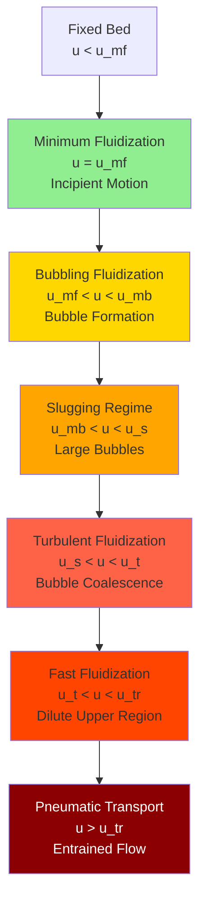

Fluidization transforms a static bed of solid particles into a fluid-like state through upward gas flow, creating intimate gas-solid contact essential for efficient heat and mass transfer in industrial drying operations. Understanding the physics governing this transition is fundamental to designing and operating fluid bed dryers effectively.

## Fundamental Fluidization Mechanics

When gas flows upward through a packed bed of particles, the system progresses through distinct flow regimes as velocity increases. At low velocities, gas percolates through interstitial spaces with particles remaining stationary. As velocity increases, drag forces on individual particles grow until they balance the effective weight of the bed. At this critical point, termed minimum fluidization, the bed transitions from fixed to suspended state.

The pressure drop across a fluidized bed equals the weight of particles per unit cross-sectional area:

$$\Delta P = (1 - \varepsilon_{mf}) \cdot (\rho_p - \rho_g) \cdot g \cdot H_{mf}$$

Where $\varepsilon_{mf}$ is void fraction at minimum fluidization, $\rho_p$ is particle density, $\rho_g$ is gas density, $g$ is gravitational acceleration, and $H_{mf}$ is bed height at minimum fluidization.

## Minimum Fluidization Velocity

The Ergun equation describes pressure drop through packed beds and forms the basis for calculating minimum fluidization velocity. For spherical particles, the correlation yields:

$$\frac{1.75}{(\varepsilon_{mf})^3} \cdot Re_{mf}^2 + \frac{150(1-\varepsilon_{mf})}{(\varepsilon_{mf})^3} \cdot Re_{mf} = Ar$$

The particle Reynolds number at minimum fluidization is:

$$Re_{mf} = \frac{\rho_g \cdot u_{mf} \cdot d_p}{\mu_g}$$

The Archimedes number characterizes particle-fluid system properties:

$$Ar = \frac{d_p^3 \cdot \rho_g \cdot (\rho_p - \rho_g) \cdot g}{\mu_g^2}$$

Where $u_{mf}$ is minimum fluidization velocity, $d_p$ is particle diameter, and $\mu_g$ is gas dynamic viscosity.

For fine particles (Ar < 20), the Wen-Yu correlation simplifies prediction:

$$Re_{mf} = (33.7^2 + 0.0408 \cdot Ar)^{0.5} - 33.7$$

This relationship demonstrates that minimum fluidization velocity increases with particle size and density difference, while decreasing with gas viscosity.

## Fluidization Regime Characteristics

Beyond minimum fluidization, the bed behavior depends strongly on superficial gas velocity. The operating regime determines heat transfer coefficients, mixing intensity, and particle attrition rates.

### Particle Classification by Fluidization Behavior

Geldart classified particles into four groups based on density difference and mean particle size:

| Geldart Group | Particle Size | Density Difference | Fluidization Character | Typical Materials |
|---------------|---------------|-------------------|------------------------|-------------------|
| Group C | < 30 μm | Variable | Cohesive, difficult to fluidize | Flour, starch, fine catalysts |
| Group A | 30-100 μm | < 1.4 g/cm³ | Aeratable, smooth fluidization | Fluid catalytic cracking catalyst |
| Group B | 100-800 μm | 1.4-4.0 g/cm³ | Bubbling, vigorous action | Sand, glass beads, seeds |
| Group D | > 800 μm | > 4.0 g/cm³ | Spouting, requires high velocity | Large particles, metal ores |

## Design Velocity Selection

Operating velocity must exceed minimum fluidization while remaining below the terminal velocity to prevent excessive particle entrainment:

$$u_t = \left[\frac{4 \cdot d_p \cdot (\rho_p - \rho_g) \cdot g}{3 \cdot C_D \cdot \rho_g}\right]^{0.5}$$

Where $C_D$ is the drag coefficient, which depends on particle Reynolds number. For most industrial applications:

$$\frac{u_{op}}{u_{mf}} = 2.0 \text{ to } 5.0$$

This ratio provides adequate mixing and heat transfer while minimizing elutriation losses. Higher ratios increase bubble size and decrease bed uniformity.

## Bed Expansion and Voidage

As velocity increases above minimum fluidization, the bed expands and voidage increases. For bubbling beds, the Richardson-Zaki correlation predicts expansion:

$$\frac{u}{u_t} = \varepsilon^n$$

The exponent $n$ ranges from 2.4 to 4.6 depending on particle Reynolds number. Bed height at operating conditions relates to minimum fluidization height:

$$\frac{H}{H_{mf}} = \frac{1 - \varepsilon_{mf}}{1 - \varepsilon}$$

## Heat Transfer Considerations

Maximum heat transfer coefficients occur in the bubbling regime at moderate gas velocities. The coefficient peaks at:

$$u_{opt} \approx (2-3) \cdot u_{mf}$$

Higher velocities reduce particle residence time near heat transfer surfaces and decrease coefficients. Typical values range from 200-600 W/m²·K for most industrial systems, significantly exceeding fixed bed performance.

## Pressure Drop Characteristics

The pressure drop-velocity relationship provides diagnostic information about bed condition. A properly operating fluidized bed maintains constant pressure drop above minimum fluidization, independent of gas velocity. Increasing pressure drop with velocity above this point indicates channeling, agglomeration, or insufficient distributor design.

Distributor pressure drop should be 20-40% of bed pressure drop to ensure uniform gas distribution and prevent channeling. This requirement directly impacts fan power consumption and must be balanced against operational uniformity.

## Standards and Design References

ASME standards provide guidance for pressure vessel design incorporating fluid bed systems. The key considerations include:

- Distributor plate design per API 650 for structural integrity
- Freeboard height sizing to minimize entrainment losses
- Cyclone separator design for fines recovery
- Explosion venting requirements per NFPA 68 for combustible materials

Understanding fluidization fundamentals enables engineers to predict bed behavior, optimize operating conditions, and troubleshoot performance issues in industrial drying applications. The transition from packed bed to fluidized state represents a critical operating parameter that determines overall system efficiency and product quality.
