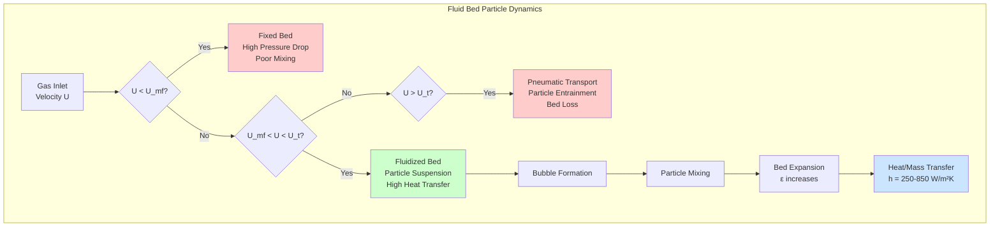

## Fundamental Physics of Particle Suspension

Particle suspension in fluid bed dryers represents the critical transition between a static packed bed and a fluidized state where solid particles behave as a fluid. This phenomenon occurs when upward-flowing gas exerts sufficient drag force to counteract the gravitational force on particles, creating optimal conditions for heat and mass transfer in industrial drying operations.

The fluidization process depends on achieving a precise balance between fluid drag forces and particle weight. When gas velocity reaches the minimum fluidization velocity, the pressure drop across the bed equals the bed weight per unit area. This equilibrium condition enables uniform particle mixing, maximized surface area exposure, and enhanced heat transfer coefficients that can reach 250-850 W/(m²·K), significantly higher than fixed bed systems.

## Minimum Fluidization Velocity

The minimum fluidization velocity (U_mf) represents the critical superficial gas velocity at which fluidization begins. For this condition, the pressure drop across the bed equals the buoyant weight of particles:

$$\Delta P = \frac{(1-\varepsilon_{mf})(\rho_p - \rho_g)gH}{}$$

where ε_mf is void fraction at minimum fluidization (typically 0.40-0.45 for spherical particles), ρ_p is particle density, ρ_g is gas density, g is gravitational acceleration, and H is bed height.

The Ergun equation provides a fundamental relationship for calculating U_mf by equating pressure drop to bed weight:

$$\frac{150(1-\varepsilon_{mf})^2 \mu U_{mf}}{\varepsilon_{mf}^3 \phi^2 d_p^2} + \frac{1.75(1-\varepsilon_{mf})\rho_g U_{mf}^2}{\varepsilon_{mf}^3 \phi d_p} = (1-\varepsilon_{mf})(\rho_p - \rho_g)g$$

where μ is gas dynamic viscosity, φ is particle sphericity (0.6-1.0), and d_p is particle diameter. The equation consists of viscous (laminar) and inertial (turbulent) terms, with the viscous term dominating for fine particles and the inertial term for coarse particles.

For engineering calculations, the Wen and Yu correlation simplifies U_mf determination:

$$Re_{mf} = \sqrt{(33.7)^2 + 0.0408 \cdot Ar} - 33.7$$

where Re_mf = (ρ_g U_mf d_p)/μ is the Reynolds number at minimum fluidization, and Ar is the Archimedes number:

$$Ar = \frac{d_p^3 \rho_g (\rho_p - \rho_g) g}{\mu^2}$$

## Terminal Velocity and Operating Window

The terminal velocity (U_t) represents the maximum superficial velocity before particle entrainment occurs. For spherical particles, terminal velocity derives from force balance:

$$U_t = \sqrt{\frac{4 d_p (\rho_p - \rho_g) g}{3 C_D \rho_g}}$$

where C_D is the drag coefficient, which varies with Reynolds number. The operating velocity range for stable fluidization lies between U_mf and U_t, providing the design window:

$$1.5 U_{mf} < U_{op} < 0.8 U_t$$

Typical operating velocities range from 0.3-3.0 m/s depending on particle properties, with larger particles requiring higher velocities.

## Bed Expansion Dynamics

The Richardson-Zaki correlation describes bed expansion as a function of superficial gas velocity:

$$\frac{U}{U_t} = \varepsilon^n$$

where ε is bed voidage and n is the expansion index (typically 2.4-4.6, decreasing with increasing Reynolds number). Bed expansion ratio is:

$$\frac{H}{H_{mf}} = \frac{1-\varepsilon_{mf}}{1-\varepsilon}$$

This relationship enables prediction of bed height at any operating velocity, critical for freeboard design and preventing particle carryover.

## Particle Characteristic Effects

Particle properties fundamentally affect suspension behavior and system performance:

| Property | Range | Effect on Fluidization | Design Impact |
|----------|-------|------------------------|---------------|
| Particle Diameter | 50-500 μm (Group A) | Low U_mf, smooth fluidization | Lower blower power, better control |
| Particle Diameter | 500-2000 μm (Group B) | Moderate U_mf, bubbling bed | Moderate power, good mixing |
| Particle Diameter | >2000 μm (Group D) | High U_mf, spouting behavior | High power requirement |
| Particle Density | 700-1200 kg/m³ | Moderate suspension force | Standard distributor design |
| Particle Density | 1200-2500 kg/m³ | High suspension force required | Reinforced distributor needed |
| Sphericity | 0.6-0.8 (irregular) | Increased U_mf (30-50%) | Higher operating velocity |
| Sphericity | 0.9-1.0 (spherical) | Minimum U_mf | Optimal efficiency |
| Moisture Content | 0-5% (dry) | Minimal cohesion | Free-flowing operation |
| Moisture Content | 10-30% (wet) | Strong cohesion, channeling | Pre-drying may be required |

## Engineering Design Considerations

**Distributor Plate Design:** The pressure drop across the distributor must exceed 30-40% of bed pressure drop to ensure uniform gas distribution:

$$\Delta P_{distributor} = 0.3-0.4 \cdot \Delta P_{bed}$$

Open area typically ranges from 5-15% of total cross-sectional area, with hole diameters 2-5 mm to prevent particle weepage while maintaining uniform flow.

**Freeboard Height:** Adequate freeboard prevents particle entrainment and allows bubble disengagement. The transport disengagement height (TDH) where particle carryover becomes negligible typically ranges from 1.5-4.0 times the bed diameter, depending on particle size distribution and operating velocity.

**Particle Size Distribution:** Wide size distributions create segregation issues, with fines concentrating near the bed surface. For optimal performance, maintain particle size ratio (d_max/d_min) below 3:1, or use classifier systems to remove fines continuously.

**Scale-Up Relationships:** Fluidization quality degrades with increasing bed diameter due to bubble growth. Maintain Froude number similarity:

$$Fr = \frac{U^2}{gD} = constant$$

where D is bed diameter, to preserve hydrodynamic behavior during scale-up.

## Standards and Design References

Particle suspension design follows ASME BPVC Section VIII for pressure vessel requirements when operating above atmospheric pressure. The AIChE Equipment Testing Procedure for fluid bed dryers provides testing protocols for determining U_mf experimentally. For pharmaceutical applications, FDA CFR Title 21 Part 11 governs process control and validation requirements.

Experimental determination of U_mf through pressure drop versus velocity curves remains the most reliable design approach, particularly for non-spherical particles or polydisperse systems where correlations introduce 20-40% uncertainty.
