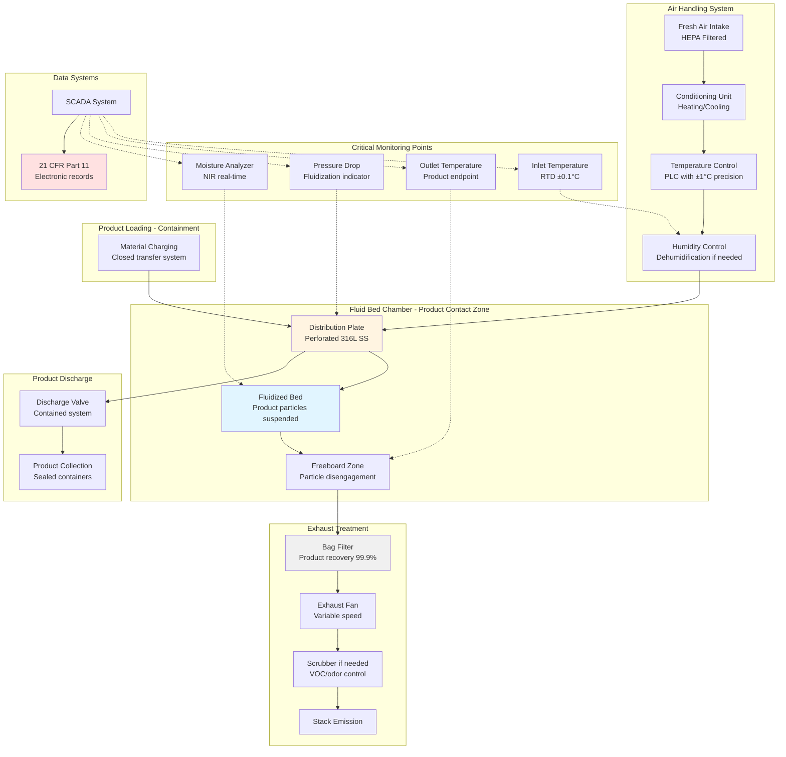

## Physics of Pharmaceutical and Food Fluid Bed Drying

Pharmaceutical and food fluid bed dryers operate under the strictest regulatory requirements in industrial drying. The fundamental physics remains heat and mass transfer, but the constraints of product integrity, contamination prevention, and process validation demand precision HVAC control that exceeds conventional industrial applications.

### Mass Transfer in Regulated Environments

The drying rate in pharmaceutical and food applications follows Fick's law, but product degradation limits operating conditions:

$$\frac{dm}{dt} = -h_m A (C_s - C_\infty)$$

Where:
- $\frac{dm}{dt}$ = mass transfer rate (kg/s)
- $h_m$ = mass transfer coefficient (m/s)
- $A$ = particle surface area (m²)
- $C_s$ = moisture concentration at surface (kg/m³)
- $C_\infty$ = moisture concentration in bulk air (kg/m³)

For pharmaceutical granules and food particles, the mass transfer coefficient depends on particle Reynolds number:

$$Sh = 2 + 0.6 Re_p^{0.5} Sc^{0.33}$$

The Sherwood number (Sh) defines the mass transfer coefficient, while the Schmidt number (Sc) characterizes the fluid properties. This relationship determines how quickly moisture leaves the particle without thermal degradation.

### Energy Balance and Product Temperature Control

The critical constraint in pharmaceutical and food drying is maintaining product temperature below degradation thresholds while achieving target moisture content. The energy balance for a single particle:

$$m_p c_p \frac{dT_p}{dt} = h A (T_g - T_p) - \lambda \frac{dm}{dt}$$

Where:
- $m_p$ = particle mass (kg)
- $c_p$ = specific heat of particle (J/kg·K)
- $T_p$ = particle temperature (K)
- $T_g$ = gas temperature (K)
- $h$ = convective heat transfer coefficient (W/m²·K)
- $\lambda$ = latent heat of vaporization (J/kg)

The particle temperature remains at the wet-bulb temperature during constant-rate drying, providing thermal protection. As the falling-rate period begins, product temperature rises toward gas temperature, requiring careful outlet temperature control.

### Psychrometric Control for Quality Assurance

Pharmaceutical and food products demand precise humidity control to prevent overdrying (loss of product attributes) or incomplete drying (microbial growth risk). The absolute humidity of inlet air determines the driving force for drying:

$$Y = 0.622 \frac{P_v}{P - P_v}$$

Where:
- $Y$ = humidity ratio (kg water/kg dry air)
- $P_v$ = partial pressure of water vapor (Pa)
- $P$ = total pressure (Pa)

The moisture removal capacity of air increases with temperature but decreases with inlet humidity. For temperature-sensitive products, dehumidified inlet air allows lower gas temperatures while maintaining drying rates.

## Pharmaceutical Fluid Bed Dryer Requirements

### cGMP Compliance and Validation

FDA 21 CFR Part 211 mandates that pharmaceutical manufacturing equipment must be of appropriate design, adequate size, and suitably located to facilitate operations for its intended use and for its cleaning and maintenance. For fluid bed dryers, this translates to:

**Critical Design Elements:**
- All product-contact surfaces in 316L stainless steel with electropolished finish (Ra < 0.4 μm)
- Cleanability validation demonstrating removal of residues to below detection limits
- No dead legs or areas of potential product accumulation
- HEPA-filtered inlet air (ISO 7 or better for sterile products)
- Containment systems for potent compounds (OEB 3-5)

**Process Validation Requirements:**
- Installation Qualification (IQ): Equipment installed per specifications
- Operational Qualification (OQ): Operating parameters within design ranges
- Performance Qualification (PQ): Consistent product quality across three consecutive batches

The thermal qualification includes temperature distribution studies demonstrating uniformity within ±2°C throughout the product bed.

### Pharmaceutical Applications and Parameters

| Application | Inlet Temp (°C) | Outlet Temp (°C) | Product Temp (°C) | Drying Time (min) | Final Moisture (%) |
|-------------|----------------|------------------|-------------------|-------------------|--------------------|
| Tablet Granulation | 60-80 | 40-50 | 35-45 | 30-90 | 2-4 |
| API Drying | 40-60 | 30-40 | 25-35 | 60-180 | 0.5-2 |
| Pellet Coating Dry | 50-70 | 35-45 | 30-40 | 20-60 | 1-3 |
| Lyophilized Products | 30-50 | 25-35 | 20-30 | 90-240 | 1-5 |

Active pharmaceutical ingredients (APIs) often require inert gas (nitrogen) atmospheres to prevent oxidation, adding complexity to the psychrometric calculations and requiring explosion-proof electrical systems.

## Food Industry Fluid Bed Drying

### Food Safety and Regulatory Framework

Food-grade fluid bed dryers must comply with FDA Food Safety Modernization Act (FSMA) and applicable HACCP requirements. The HVAC system becomes a Critical Control Point (CCP) when thermal processing achieves microbial reduction.

**Sanitary Design Requirements:**
- 3-A Sanitary Standards for construction
- Sloped surfaces (minimum 2%) for drainage
- Accessible for daily cleaning and inspection
- Materials approved for food contact (NSF/ANSI 51)

Unlike pharmaceutical applications, food products often tolerate higher temperatures but require careful control to prevent case hardening, where the surface dries rapidly while trapping moisture in the core.

### Food Product Applications

| Product | Inlet Temp (°C) | Product Temp (°C) | Particle Size (mm) | Final Moisture (%) | Critical Quality Parameter |
|---------|----------------|-------------------|--------------------|--------------------|----------------------------|
| Instant Coffee | 120-150 | 80-100 | 0.5-3 | 3-5 | Aroma retention |
| Milk Powder | 70-100 | 50-70 | 0.1-0.5 | 3-4 | Solubility index |
| Breakfast Cereal | 140-180 | 90-120 | 3-10 | 2-3 | Crispness texture |
| Dried Vegetables | 60-80 | 45-60 | 5-15 | 5-8 | Color retention |
| Protein Isolates | 50-70 | 40-50 | 0.2-1 | 4-6 | Protein denaturation |

## Pharmaceutical vs. Food Comparison

| Requirement | Pharmaceutical | Food |
|-------------|----------------|------|
| Material | 316L electropolished SS | 304 SS or 316 SS |
| Surface Finish | Ra < 0.4 μm | Ra < 0.8 μm |
| Inlet Air Quality | HEPA filtered (ISO 7) | MERV 13-15 filtered |
| Validation | IQ/OQ/PQ required | Process validation optional |
| Documentation | Batch records per 21 CFR 211 | Production records per FSMA |
| Cleaning Protocol | Validated cleaning procedures | Sanitation SOPs |
| Temperature Control | ±1-2°C | ±3-5°C |
| Batch Traceability | Complete genealogy required | Lot tracking required |

## Process Flow and Control Systems

## Airflow Calculations for Minimum Fluidization

The minimum fluidization velocity is critical for process design and must be validated during qualification:

$$u_{mf} = \frac{(d_p)^2 (\rho_p - \rho_g) g}{150 \mu} \cdot \frac{\epsilon_{mf}^3}{1-\epsilon_{mf}}$$

For pharmaceutical granules (density 1400 kg/m³, diameter 500 μm) in air at 60°C:

The volumetric airflow requirement for a 100 kg batch with bed cross-section 1 m²:

$$Q = u_{op} \cdot A = (2-3) \cdot u_{mf} \cdot A$$

Operating at 2.5 times minimum fluidization velocity provides stable fluidization without excessive particle attrition, which is critical for tablet granule integrity.

## Validation and Process Control

### Critical Process Parameters (CPPs)

1. **Inlet Air Temperature**: Governs drying rate and product temperature ceiling
2. **Airflow Rate**: Determines fluidization quality and heat transfer coefficient
3. **Batch Size**: Affects bed depth and residence time distribution
4. **Inlet Humidity**: Influences drying capacity and endpoint achievement

### Critical Quality Attributes (CQAs)

1. **Moisture Content**: Direct impact on product stability and microbial growth
2. **Particle Size Distribution**: Affects flowability and downstream processing
3. **Bulk Density**: Indicates degree of agglomeration during drying
4. **Temperature History**: Ensures no thermal degradation occurred

Modern fluid bed dryers employ real-time moisture measurement using near-infrared (NIR) spectroscopy, enabling automated endpoint determination based on CQA achievement rather than fixed time-based cycles.

The intersection of HVAC engineering and regulatory compliance makes pharmaceutical and food fluid bed dryers among the most sophisticated industrial drying systems. Success requires understanding both the fundamental transport phenomena and the quality systems that ensure patient safety and food security.
