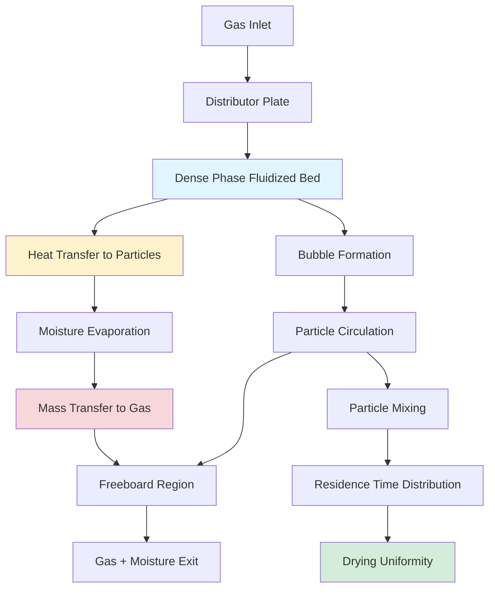

## Fundamentals of Uniform Drying

Uniform drying in fluid bed systems depends on achieving consistent heat and mass transfer conditions for all particles throughout the bed. The physical mechanisms governing uniformity include particle mixing intensity, residence time distribution, and local variations in gas velocity and temperature.

The drying rate for a single particle follows the relationship:

$$\frac{dm}{dt} = -h_m A_p (C_{s} - C_{\infty})$$

where $h_m$ is the mass transfer coefficient (m/s), $A_p$ is particle surface area (m²), $C_s$ is moisture concentration at the particle surface (kg/m³), and $C_{\infty}$ is bulk gas moisture concentration (kg/m³).

For uniform drying across the entire bed, this rate must remain consistent for all particles, requiring uniform exposure to drying conditions.

## Heat Transfer Uniformity

The convective heat transfer to particles in a fluidized bed is described by:

$$q = h A_p (T_g - T_p)$$

where $h$ is the convective heat transfer coefficient (W/m²·K), $T_g$ is gas temperature (K), and $T_p$ is particle temperature (K).

The heat transfer coefficient in fluidized beds ranges from 200-800 W/m²·K, significantly higher than in other drying methods. Uniformity requires consistent gas-particle contact across the bed.

**Key factors affecting heat transfer uniformity:**

- Gas velocity distribution through the distributor plate
- Bed height and fluidization regime
- Particle circulation patterns
- Temperature gradients in the freeboard region
- Wall heat losses and cold zones

The Nusselt number correlation for fluidized beds:

$$Nu = \frac{hd_p}{k_g} = 2 + 0.6 Re^{0.5} Pr^{0.33}$$

where $d_p$ is particle diameter (m), $k_g$ is gas thermal conductivity (W/m·K), $Re$ is Reynolds number, and $Pr$ is Prandtl number.

## Mass Transfer and Moisture Removal

The Sherwood number characterizes mass transfer in fluidized beds:

$$Sh = \frac{h_m d_p}{D_{AB}} = 2 + 0.6 Re^{0.5} Sc^{0.33}$$

where $D_{AB}$ is the binary diffusion coefficient (m²/s) and $Sc$ is the Schmidt number.

Uniform moisture removal requires:

1. **Consistent gas-particle contact time** - Achieved through proper particle circulation
2. **Uniform gas distribution** - Distributor plate design critical
3. **Adequate mixing intensity** - Prevents dead zones and channeling
4. **Temperature uniformity** - Minimizes local drying rate variations

The overall moisture removal rate:

$$\frac{dX}{dt} = -\frac{h_m A_s}{\rho_s V_p} (X^* - X)$$

where $X$ is moisture content (kg water/kg dry solid), $X^*$ is equilibrium moisture content, $A_s$ is specific surface area (m²/kg), $\rho_s$ is solid density (kg/m³), and $V_p$ is particle volume (m³).

## Residence Time Distribution

Particle residence time distribution (RTD) directly impacts drying uniformity. The variance of RTD ($\sigma^2$) quantifies uniformity:

$$\sigma^2 = \frac{\int_0^{\infty} (t - \bar{t})^2 E(t) dt}{\bar{t}^2}$$

where $E(t)$ is the residence time distribution function and $\bar{t}$ is mean residence time (s).

Lower variance indicates more uniform particle treatment. Ideal mixing approaches $\sigma^2/\bar{t}^2 = 1$, while plug flow approaches 0.

## Uniformity Factor Analysis

| Factor | Impact on Uniformity | Optimal Range | Control Method |
|--------|---------------------|---------------|----------------|
| Gas velocity | High - affects fluidization quality | 1.5-3.0 × $U_{mf}$ | Blower speed control |
| Distributor open area | High - controls gas distribution | 5-15% | Plate design optimization |
| Bed aspect ratio | Medium - affects mixing | H/D = 0.5-2.0 | Bed geometry selection |
| Particle size distribution | High - impacts segregation | $d_{max}/d_{min}$ < 2 | Classification/screening |
| Solids feed rate | Medium - affects residence time | Maintain steady flow | Feeder calibration |
| Gas temperature | Medium - drives drying rate | 80-150°C typical | Temperature control loop |
| Particle circulation | High - ensures exposure uniformity | Complete turnover < 30s | Baffle placement |

## Bed Hydrodynamics and Mixing

## Optimization Strategies

**Distributor plate design:**

Pressure drop across the distributor should exceed bed pressure drop:

$$\Delta P_{distributor} > (1.5-2.0) \times \Delta P_{bed}$$

This ensures uniform gas distribution even with slight variations in bed density.

**Mixing enhancement:**

- Internal baffles to promote particle circulation
- Draft tubes for controlled upflow/downflow regions
- Proper freeboard height to minimize particle carryover
- Multiple gas injection points for large-diameter beds

**Process control:**

Monitor and control:
- Outlet gas humidity (indicates drying efficiency)
- Bed temperature distribution (thermocouples at multiple heights)
- Pressure drop (fluidization quality indicator)
- Product moisture content (inline or grab samples)

**Scale-up considerations:**

The dimensionless Peclet number characterizes mixing:

$$Pe = \frac{UL}{D_m}$$

where $U$ is superficial gas velocity (m/s), $L$ is characteristic length (m), and $D_m$ is particle mixing coefficient (m²/s).

Maintaining similar Pe values during scale-up preserves mixing characteristics and drying uniformity.

## Practical Implementation

Achieving uniform drying requires:

1. **Proper distributor design** - Uniform gas injection prevents channeling and dead zones
2. **Adequate fluidization velocity** - Ensures vigorous mixing without excessive entrainment
3. **Controlled feed introduction** - Uniform distribution of wet material across bed surface
4. **Temperature management** - Minimize hot spots and thermal gradients
5. **Residence time control** - Balance throughput with required drying time

The coefficient of variation (CV) for product moisture content should remain below 10% for acceptable uniformity:

$$CV = \frac{\sigma_X}{\bar{X}} \times 100\%$$

where $\sigma_X$ is standard deviation of moisture content and $\bar{X}$ is mean moisture content.

Regular monitoring of product moisture distribution provides direct feedback on drying uniformity and guides process adjustments to maintain optimal performance.
