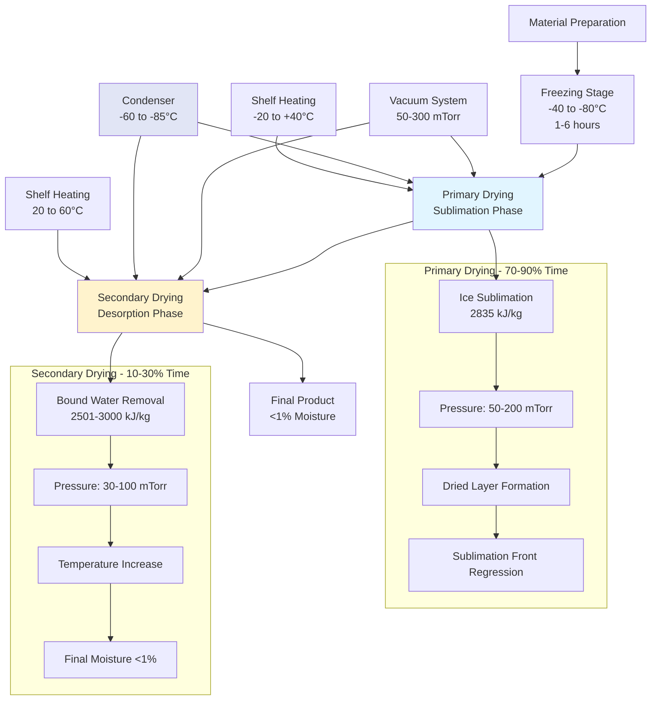

Freeze drying removes water from materials through sublimation under vacuum conditions, converting ice directly to vapor without passing through the liquid phase. This process preserves heat-sensitive materials, biological products, and pharmaceutical compounds that degrade under conventional drying temperatures. Lyophilization achieves moisture contents below 1% while maintaining product structure, activity, and reconstitution properties.

## Freeze Drying Thermodynamics

### Phase Diagram and Triple Point

Water sublimation occurs when vapor pressure exceeds ambient pressure at temperatures below the triple point (0.01°C at 611.66 Pa). The Clausius-Clapeyron equation governs vapor pressure-temperature relationships:

$$\ln\left(\frac{P_2}{P_1}\right) = \frac{\Delta H_{sub}}{R}\left(\frac{1}{T_1} - \frac{1}{T_2}\right)$$

Where:
- $P$ = vapor pressure (Pa)
- $\Delta H_{sub}$ = enthalpy of sublimation (J/mol), approximately 51,050 J/mol for ice
- $R$ = universal gas constant, 8.314 J/(mol·K)
- $T$ = absolute temperature (K)

The vapor pressure of ice at common freeze drying temperatures:

| Temperature (°C) | Temperature (K) | Vapor Pressure (Pa) | Vapor Pressure (mTorr) |
|------------------|----------------|---------------------|------------------------|
| -60 | 213 | 1.08 | 8.1 |
| -50 | 223 | 3.94 | 29.6 |
| -40 | 233 | 12.84 | 96.3 |
| -30 | 243 | 38.25 | 286.9 |
| -20 | 253 | 103.5 | 776.3 |
| -10 | 263 | 259.9 | 1949 |
| 0 | 273 | 611.7 | 4588 |

Operating chamber pressure must remain below ice vapor pressure to drive sublimation. Pharmaceutical freeze dryers typically operate at 50-300 mTorr during primary drying.

### Sublimation Energy Requirements

Ice sublimation requires significantly more energy than liquid water evaporation. The enthalpy of sublimation equals the sum of fusion and vaporization:

$$\Delta H_{sub} = \Delta H_{fus} + \Delta H_{vap}$$

At 0°C:
- $\Delta H_{fus}$ = 333.5 kJ/kg (heat of fusion)
- $\Delta H_{vap}$ = 2501 kJ/kg (heat of vaporization)
- $\Delta H_{sub}$ = 2835 kJ/kg (heat of sublimation)

The sublimation enthalpy varies with temperature:

$$\Delta H_{sub}(T) = 2835 - 0.24(T - 273.15) \text{ kJ/kg}$$

This temperature dependence affects heat transfer calculations throughout the drying cycle.

## Freeze Drying Process Stages

### Freezing Stage

Freezing converts water to ice crystals that determine product structure and drying efficiency. Cooling rate controls crystal size distribution:

**Slow freezing** (0.1-1°C/min):
- Large ice crystals (50-200 μm)
- Increased pore size in dried product
- Faster sublimation during primary drying
- Potential cell damage in biologics

**Rapid freezing** (5-50°C/min):
- Small ice crystals (5-20 μm)
- Fine pore structure, slower drying
- Better preservation of structure
- Pharmaceutical applications

Freezing temperature must reach 10-20°C below the eutectic temperature (for crystalline systems) or glass transition temperature (for amorphous systems) to ensure complete solidification.

Common eutectic temperatures:

| Solution | Eutectic Temperature (°C) | Composition at Eutectic Point |
|----------|---------------------------|-------------------------------|
| Sodium chloride | -21.1 | 23.3% NaCl |
| Mannitol | -1.5 | 15.6% mannitol |
| Glycine | -6.5 | 30% glycine |
| Lactose | -3.5 | 20% lactose |
| Trehalose | -15 | 45% trehalose |
| Sucrose | -9.5 | 62% sucrose |

### Primary Drying Stage

Primary drying removes 85-95% of total water through ice sublimation. The sublimation rate depends on heat transfer to the product and vapor mass transfer from the sublimation front to the condenser.

**Heat transfer rate:**

$$Q = K_v A \Delta P$$

Where:
- $Q$ = sublimation rate (kg/s)
- $K_v$ = overall mass transfer coefficient (kg/(m²·s·Pa))
- $A$ = product surface area (m²)
- $\Delta P$ = vapor pressure difference between sublimation front and condenser (Pa)

The vapor pressure driving force:

$$\Delta P = P_{ice}(T_{interface}) - P_{chamber}$$

**Shelf heat transfer:**

$$\dot{q}_{shelf} = h_{shelf}(T_{shelf} - T_{product}) + \sigma \varepsilon (T_{shelf}^4 - T_{product}^4)$$

Where $h_{shelf}$ is the convective/conductive heat transfer coefficient (W/m²K), and the second term represents radiative heat transfer with $\sigma$ = Stefan-Boltzmann constant (5.67×10⁻⁸ W/m²K⁴) and $\varepsilon$ = effective emissivity (typically 0.3-0.6).

At low chamber pressures (50-200 mTorr), radiation dominates heat transfer. Contact conduction becomes significant only with good vial-shelf contact.

**Mass transfer resistance:**

The dried product layer presents diffusion resistance to escaping water vapor:

$$R_{dry} = \frac{L_{dry}}{K_p A}$$

Where $L_{dry}$ is dried layer thickness (m) and $K_p$ is product permeability (m²·s/kg).

As primary drying progresses, $L_{dry}$ increases and sublimation rate decreases. The dried layer acts as an insulating barrier, reducing heat transfer to the sublimation front.

**Primary drying time estimation:**

$$t_{primary} = \frac{L_{frozen} \rho_{ice} \Delta H_{sub}}{q_{in} - q_{out}}$$

Where:
- $L_{frozen}$ = initial frozen layer thickness (m)
- $\rho_{ice}$ = ice density, 920 kg/m³
- $q_{in}$ = heat flux into product (W/m²)
- $q_{out}$ = heat flux leaving via vapor (W/m²)

Typical primary drying durations: 12-48 hours depending on product thickness, temperature, and pressure.

### Secondary Drying Stage

Secondary drying removes residual moisture bound to product matrix through desorption. Chamber pressure decreases to 30-100 mTorr while shelf temperature increases to 20-60°C.

**Desorption kinetics:**

$$\frac{dM}{dt} = -k_d(M - M_e)$$

Where:
- $M$ = moisture content (kg water/kg dry solid)
- $k_d$ = desorption rate constant (1/s)
- $M_e$ = equilibrium moisture content

The rate constant follows Arrhenius temperature dependence:

$$k_d = k_0 \exp\left(-\frac{E_a}{RT}\right)$$

Where $E_a$ is activation energy for desorption, typically 40-80 kJ/mol for pharmaceutical products.

Secondary drying temperature limits depend on product stability. Proteins typically tolerate 25-40°C; small molecules may withstand 40-60°C.

**Secondary drying endpoint determination:**

- Comparative pressure rise test: isolate chamber from vacuum pump, monitor pressure rise rate
- Pirani vs. capacitance manometer comparison: differential reading indicates water vapor partial pressure
- Moisture analyzers: Karl Fischer titration or near-infrared spectroscopy

Target final moisture content: 0.5-3% for pharmaceutical products, ensuring long-term stability.

## Vacuum System Design

### Chamber Pressure Requirements

Freeze dryer chamber pressure directly affects sublimation rate and product temperature. Operating pressure represents a balance between drying rate and product quality:

**Low pressure (30-100 mTorr):**
- Maximum sublimation driving force
- Risk of product overheating from excessive heat input
- Lower heat transfer coefficient (reduced gas conduction)

**Higher pressure (150-300 mTorr):**
- Better heat transfer via gas conduction
- Reduced sublimation driving force
- Lower risk of collapse or melt-back

Optimal pressure typically ranges 80-150 mTorr during primary drying.

### Vacuum Pump Selection

Freeze dryers require vacuum systems capable of evacuating chamber volume and handling continuous vapor load during sublimation.

| Pump Type | Ultimate Pressure (mTorr) | Pumping Speed Range | Advantages | Disadvantages |
|-----------|---------------------------|---------------------|------------|---------------|
| **Rotary vane** | 1-10 | 50-2000 CFM | Low cost, reliable | Oil contamination risk, limited ultimate pressure |
| **Scroll pump** | 5-50 | 10-500 CFM | Oil-free, low maintenance | Higher cost than rotary vane |
| **Roots blower + rotary vane** | 0.1-1 | 200-5000 CFM | High pumping speed | Complex system, oil backstreaming risk |
| **Screw pump** | 0.1-10 | 100-2000 CFM | Oil-free, handles vapor well | High initial cost, louder operation |
| **Turbomolecular** | 0.001-0.1 | 50-2000 L/s | Ultra-high vacuum capability | Expensive, requires backing pump, fragile |

**Pumping speed calculation:**

Required effective pumping speed at the chamber:

$$S_{eff} = \frac{Q_{vapor}}{P_{chamber}}$$

Where $Q_{vapor}$ is vapor throughput (Pa·m³/s) and $P_{chamber}$ is operating pressure (Pa).

For pharmaceutical production freeze dryers processing 100-500 kg batch loads, pumping speed requirements range 500-5000 CFM (850-8500 m³/h).

### Condenser Design

The condenser captures sublimed water vapor, preventing pump overload and maintaining chamber pressure. Condenser temperature must remain 15-20°C below the coldest product temperature to ensure adequate vapor pressure differential.

**Condenser capacity:**

$$m_{ice} = \frac{Q_{sublimation} \times t_{cycle}}{\Delta H_{sub}}$$

Where:
- $m_{ice}$ = ice accumulation on condenser (kg)
- $Q_{sublimation}$ = total heat input during sublimation (J)
- $t_{cycle}$ = cycle duration (s)

Condenser surface area requirement:

$$A_{condenser} = \frac{\dot{m}_{vapor} \times \Delta H_{dep}}{h_{cond}(T_{vapor} - T_{condenser})}$$

Where:
- $\dot{m}_{vapor}$ = vapor mass flow rate (kg/s)
- $\Delta H_{dep}$ = enthalpy of vapor deposition (J/kg), approximately 2835 kJ/kg
- $h_{cond}$ = condensation heat transfer coefficient (W/m²K), typically 20-100 W/m²K
- $T_{vapor}$ = vapor temperature (K)
- $T_{condenser}$ = condenser surface temperature (K)

**Condenser refrigeration systems:**

| Refrigeration Type | Temperature Range (°C) | Capacity Range (kW) | Applications |
|--------------------|------------------------|---------------------|--------------|
| **Mechanical cascade** | -50 to -85 | 5-50 | Laboratory, pilot-scale systems |
| **Single-stage with ethylene glycol** | -40 to -60 | 3-30 | Small production systems |
| **Two-stage mechanical** | -60 to -80 | 10-100 | Production pharmaceutical freeze dryers |
| **Liquid nitrogen** | -80 to -196 | Variable | Research applications, backup cooling |

Typical condenser loading: 0.5-1.5 kg ice per liter of chamber volume per cycle.

## Heat Transfer Mechanisms

### Shelf Heat Transfer Coefficient

The effective heat transfer coefficient between heated shelf and product vial depends on multiple mechanisms:

$$h_{eff} = h_{contact} + h_{gas} + h_{radiation}$$

**Contact conduction** occurs at discrete contact points between vial bottom and shelf:

$$h_{contact} = \frac{k_{glass} \times f_{contact}}{L_{contact}}$$

Where $k_{glass}$ is glass thermal conductivity (≈1.0 W/m·K), $f_{contact}$ is fractional contact area (typically 0.01-0.10), and $L_{contact}$ is contact layer thickness.

**Gas conduction** through residual chamber gases:

$$h_{gas} = \frac{k_{gas} \times P}{d \times P_{ref}}$$

Where $k_{gas}$ is gas thermal conductivity, $P$ is chamber pressure, $d$ is gap distance (typically 0.1-0.5 mm), and $P_{ref}$ is reference pressure (atmospheric).

At 100 mTorr chamber pressure, gas conduction contributes 1-5 W/m²K depending on gap geometry.

**Radiation heat transfer:**

$$h_{radiation} = 4 \sigma \varepsilon T_{avg}^3$$

Where $T_{avg}$ is average absolute temperature between shelf and product.

Typical effective heat transfer coefficients:

| Condition | $h_{eff}$ (W/m²K) | Dominant Mechanism |
|-----------|-------------------|-------------------|
| Good vial contact, 200 mTorr | 15-25 | Contact + gas conduction |
| Poor contact, 100 mTorr | 5-10 | Gas conduction + radiation |
| Very low pressure (10 mTorr) | 2-4 | Radiation dominant |
| Atmospheric pressure (leak test) | 150-300 | Full gas conduction |

### Product Temperature Control

Product temperature during primary drying must remain below the collapse temperature (amorphous materials) or eutectic temperature (crystalline materials) to prevent structural failure.

**Collapse temperature ($T_c$):** Temperature at which amorphous frozen matrix loses structural rigidity and collapses. Typically determined by differential scanning calorimetry (DSC) or freeze-dry microscopy.

**Maximum product temperature:**

$$T_{product,max} = T_c - 2 \text{ to } 5 \text{°C}$$

This safety margin accounts for local temperature variations and measurement uncertainty.

**Heat flux balance at sublimation interface:**

$$q_{in} = q_{sublimation} + q_{out}$$

$$h_{eff}(T_{shelf} - T_{interface}) = \dot{m}_{sub} \Delta H_{sub} + h_{vapor}(T_{interface} - T_{chamber})$$

Where $\dot{m}_{sub}$ is sublimation rate per unit area (kg/m²s).

The product temperature profile develops a gradient:
- Coldest point: sublimation interface (near collapse temperature)
- Warmest point: vial bottom (nearest to heated shelf)
- Dried layer: intermediate temperature

Thermocouples placed at vial bottom provide conservative product temperature monitoring for process control.

## Pharmaceutical Freeze Drying Applications

### Biopharmaceutical Products

Protein and antibody formulations require freeze drying to achieve 2-3 year shelf life at refrigerated storage. Lyophilization preserves biological activity while preventing aggregation and chemical degradation.

**Common biopharmaceutical freeze-dried products:**

| Product Class | Typical Concentration | Cycle Time | Storage Stability | Reconstitution Time |
|---------------|----------------------|------------|-------------------|---------------------|
| Monoclonal antibodies | 25-100 mg/mL | 48-72 hours | 18-36 months at 2-8°C | 2-5 minutes |
| Vaccines (viral/bacterial) | Variable titers | 24-48 hours | 12-24 months at 2-8°C | 1-3 minutes |
| Blood factors | 250-1000 IU/vial | 36-60 hours | 24-36 months at 2-8°C | 3-10 minutes |
| Enzymes | 500-5000 units | 30-48 hours | 24-36 months at RT | 2-5 minutes |
| Cytokines | 0.1-10 mg/vial | 40-60 hours | 12-24 months at -20°C | 2-5 minutes |

**Formulation considerations:**

Cryoprotectants and lyoprotectants stabilize proteins during freezing and drying:
- **Sucrose, trehalose** (5-10% w/v): maintain protein structure via water replacement mechanism
- **Mannitol** (2-5% w/v): bulking agent, crystalline matrix former
- **Glycine** (1-3% w/v): buffering, bulking
- **Polysorbate 80** (0.01-0.1% w/v): surfactant preventing aggregation

### Pharmaceutical Manufacturing Standards

**FDA Guidance Documents:**
- Guidance for Industry: PAT — A Framework for Innovative Pharmaceutical Development, Manufacturing, and Quality Assurance (2004)
- Guidance for Industry: Q8(R2) Pharmaceutical Development (2009)
- Aseptic Processing Guidance (2004)

**USP Requirements:**
- USP <1116> Microbiological Control and Monitoring of Aseptic Processing Environments
- USP <797> Pharmaceutical Compounding—Sterile Preparations
- USP <71> Sterility Tests

**Process validation requirements:**
- Installation Qualification (IQ): equipment specifications verified
- Operational Qualification (OQ): operating ranges demonstrated
- Performance Qualification (PQ): consistent product quality over multiple batches
- Continued Process Verification: ongoing monitoring and control

### GMP Freeze Dryer Design Features

| Design Element | Requirement | Standard Reference |
|----------------|-------------|-------------------|
| **Product contact surfaces** | 316L electropolished stainless steel, Ra < 0.8 μm | ASME BPE |
| **Sterilization capability** | Steam-in-place (SIP) 121°C, 30 min | PDA Technical Report No. 1 |
| **Clean-in-place (CIP)** | Automated spray ball system, documented validation | 21 CFR Part 211.67 |
| **HEPA filtration** | 99.97% efficiency at 0.3 μm for chamber venting | ISO 14644-1 Class 5 |
| **Door seal integrity** | Leak rate < 5 mTorr·L/s at operating pressure | ASME BPE |
| **Temperature mapping** | ±1°C uniformity across all shelf positions | FDA Process Validation Guidance |
| **Automated loading/unloading** | Robotic systems for sterile handling | ISO 14644-1 |
| **Data integrity** | 21 CFR Part 11 compliant electronic records | 21 CFR Part 11 |

### Freeze Drying Cycle Development

Cycle optimization follows Quality by Design (QbD) principles:

**1. Product characterization:**
- Thermal analysis (DSC): collapse temperature, eutectic temperature, glass transition
- Freeze-dry microscopy: visual observation of collapse/eutectic melting
- Moisture sorption isotherms: equilibrium moisture content vs. relative humidity

**2. Cycle parameter screening:**
- Freezing rate: -0.5°C/min to -2°C/min (controlled nucleation may be applied)
- Primary drying pressure: 50-300 mTorr (product dependent)
- Shelf temperature: -30°C to +10°C (must keep product below collapse temperature)
- Secondary drying temperature: +20°C to +60°C
- Secondary drying duration: 2-12 hours

**3. Design space determination:**
- Design of Experiments (DOE): factorial or response surface methodology
- Critical quality attributes (CQAs): moisture content, reconstitution time, protein activity, appearance
- Critical process parameters (CPPs): shelf temperature, chamber pressure, drying time

**4. Scale-up considerations:**
- Heat transfer coefficients vary with equipment size
- Edge vials receive more radiative heat than center vials
- Larger batches require longer equilibration times

## Freeze Dryer Equipment Types

### Laboratory Scale Freeze Dryers

Laboratory units process 0.1-4 liters of product for formulation development and process optimization.

| Parameter | Benchtop Systems | Floor-Model Systems |
|-----------|------------------|---------------------|
| **Chamber volume** | 3-8 liters | 8-25 liters |
| **Shelf area** | 0.1-0.3 m² | 0.3-1.0 m² |
| **Condenser capacity** | 2-6 kg ice | 6-15 kg ice |
| **Vacuum system** | Rotary vane or scroll pump | Rotary vane pump |
| **Typical cycle time** | 24-48 hours | 48-72 hours |
| **Temperature control** | ±2-5°C | ±1-3°C |
| **Typical cost** | $15,000-$50,000 | $50,000-$150,000 |

### Pilot Scale Freeze Dryers

Pilot systems bridge laboratory and production, processing 5-50 liters for clinical trials and process validation.

**Specifications:**
- Chamber volume: 50-200 liters
- Shelf area: 1-5 m²
- Condenser capacity: 50-200 kg ice
- Vacuum system: rotary vane + roots blower or screw pump
- Shelf temperature control: ±0.5-1°C
- Cost: $200,000-$800,000

### Production Scale Freeze Dryers

Manufacturing systems process 100-1000 liters per batch with full GMP compliance.

| Scale | Chamber Volume | Shelf Area | Vials per Batch (20 mL) | Condenser Capacity | Typical Cost |
|-------|---------------|------------|------------------------|-------------------|--------------|
| **Small production** | 0.5-2 m³ | 5-15 m² | 5,000-15,000 | 200-500 kg | $800K-$2M |
| **Medium production** | 2-5 m³ | 15-35 m² | 15,000-35,000 | 500-1,200 kg | $2M-$5M |
| **Large production** | 5-15 m³ | 35-100 m² | 35,000-100,000 | 1,200-3,500 kg | $5M-$12M |

**Production system features:**
- Multiple shelf zones with independent temperature control
- Automated loading/unloading systems (isolator integration)
- Redundant vacuum pumps and refrigeration systems
- Recipe management and batch tracking software
- Real-time process monitoring (pressure, temperature at multiple points)

## Industrial Applications Comparison

| Application | Typical Products | Operating Conditions | Critical Parameters | Economic Drivers |
|-------------|------------------|---------------------|-------------------|------------------|
| **Pharmaceuticals** | Antibodies, vaccines, APIs | -45°C product, 100 mTorr, 48-72 hr | Sterility, stability, activity | High value, small batches |
| **Biologics** | Blood products, enzymes | -40°C product, 80 mTorr, 36-60 hr | Activity retention, reconstitution | Critical therapies, stable storage |
| **Diagnostics** | Reagent kits, test strips | -30°C product, 150 mTorr, 24-48 hr | Consistent performance, shelf life | Volume production, cost control |
| **Food** | Coffee, fruits, herbs | -20°C product, 200 mTorr, 12-24 hr | Flavor, color, rehydration | Premium products, light weight |
| **Aerospace** | Meals, ingredients | -25°C product, 150 mTorr, 18-36 hr | Weight reduction, shelf life | Space missions, long expeditions |
| **Museums/Archives** | Documents, artifacts | -30°C product, 100 mTorr, 48-96 hr | Structural integrity, preservation | Irreplaceable items, one-time process |

## Energy Considerations and Efficiency

Freeze drying requires 2500-4000 kJ/kg water removed, significantly higher than conventional drying (2500-3500 kJ/kg) due to refrigeration and vacuum requirements.

**Energy consumption breakdown:**
- Refrigeration (condenser): 40-50%
- Vacuum pumps: 15-25%
- Shelf heating: 20-30%
- Control systems, ancillary: 5-15%

**Energy optimization strategies:**
- Controlled nucleation: uniform ice crystal formation reduces primary drying time by 10-25%
- Pressure rise analysis: precise endpoint determination prevents over-drying
- Multi-temperature zones: optimize heat input across shelf positions
- Heat recovery: condenser heat used for facility heating or hot water generation

## Quality Control and Process Monitoring

### In-Process Monitoring Technologies

| Technology | Measured Parameter | Advantages | Limitations |
|------------|-------------------|------------|-------------|
| **Pirani gauge** | Total pressure (includes non-condensables) | Simple, robust | Cannot distinguish water vapor from other gases |
| **Capacitance manometer** | True chamber pressure | Accurate, gas-independent | More expensive than Pirani |
| **Comparative pressure measurement** | Water vapor partial pressure | Real-time sublimation monitoring | Requires both gauge types |
| **Thermocouples** | Product temperature | Direct measurement, low cost | Invasive, affects local drying |
| **Wireless temperature sensors** | Product temperature | Non-invasive after loading | Higher cost, limited battery life |
| **Process mass spectrometry** | Gas composition | Detect leaks, monitor vapor composition | Expensive, complex operation |
| **NIR spectroscopy** | Moisture content | Non-invasive, real-time | Requires calibration, expensive |
| **Tunable diode laser absorption** | Water vapor concentration | High sensitivity, fast response | Complex setup, high cost |

### Product Quality Attributes

**Critical quality attributes requiring validation:**

1. **Residual moisture content**: Karl Fischer titration, target 0.5-3%
2. **Cake appearance**: uniform structure, no collapse, no melt-back
3. **Reconstitution time**: <5 minutes for most pharmaceutical products
4. **Biological activity**: protein assays, enzyme activity, potency testing
5. **Stability**: accelerated and real-time stability studies per ICH guidelines
6. **Particulate matter**: USP <788> and <789> requirements for injectables

## Standards and References

**Regulatory Guidance:**
- FDA Guidance for Industry: Lyophilization of Parenteral Products (in development)
- EMA Guideline on the Sterilisation of the Medicinal Product, Active Substance, Excipient and Primary Container (2019)
- ICH Q8(R2): Pharmaceutical Development
- ICH Q11: Development and Manufacture of Drug Substances

**Industry Standards:**
- ASME BPE: Bioprocessing Equipment
- PDA Technical Report No. 1 (Revised 2007): Validation of Moist Heat Sterilization Processes
- PDA Technical Report No. 3 (Revised 2013): Validation of Dry Heat Processes Used for Depyrogenation and Sterilization
- ISO 13408-1:2008: Aseptic processing of health care products

**Technical References:**
- Oetjen, G.W. & Haseley, P. (2004). *Freeze-Drying*. 2nd Edition. Wiley-VCH.
- Tang, X.C. & Pikal, M.J. (2004). "Design of Freeze-Drying Processes for Pharmaceuticals." *Pharmaceutical Research*, 21(2): 191-200.
- ASHRAE Handbook - HVAC Applications (2023), Chapter 29: Industrial Drying Systems
- Carpenter, J.F., et al. (1997). "Rational Design of Stable Lyophilized Protein Formulations." *Pharmaceutical Research*, 14(8): 969-975.
