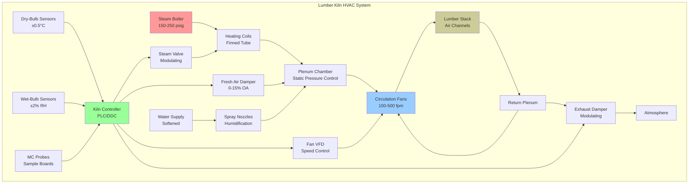

Lumber kilns represent specialized HVAC applications where precise control of temperature, humidity, and airflow drives moisture diffusion from wood cellular structures. The process fundamentally involves creating vapor pressure gradients that exceed capillary forces within wood fibers while preventing surface checking and internal stress development.

## Moisture Diffusion Physics

Wood drying follows Fick's second law of diffusion, where moisture movement depends on diffusion coefficients that vary exponentially with temperature and moisture content:

$$\frac{\partial M}{\partial t} = D \nabla^2 M$$

where:
- $M$ = moisture content (decimal)
- $t$ = time (hours)
- $D$ = diffusion coefficient (m²/s)

The diffusion coefficient increases with both temperature and moisture content:

$$D = D_0 \exp\left(-\frac{E_a}{RT}\right) \cdot \exp(kM)$$

where:
- $D_0$ = reference diffusion coefficient
- $E_a$ = activation energy (typically 40-60 kJ/mol for wood)
- $R$ = universal gas constant (8.314 J/mol·K)
- $T$ = absolute temperature (K)
- $k$ = moisture content factor (typically 10-15 for softwoods)

## Equilibrium Moisture Content

The target final moisture content depends on equilibrium moisture content (EMC), determined by the Hailwood-Horrobin model:

$$\text{EMC} = \frac{1800}{W}\left[\frac{K_1 K h}{1-K h} + \frac{K_1 K_2 K h}{1 + K_1 K h}\right]$$

Simplified for practical kiln operation using the Simpson approximation:

$$\text{EMC} = \frac{1800}{W}\left[\frac{K h}{1-K h} + \frac{K_1 K h + 2K_1 K_2 K^2 h^2}{1 + K_1 K h + K_1 K_2 K^2 h^2}\right]$$

For most commercial applications, use the Hailwood-Horrobin correlation:

$$\text{EMC} = A_1 + A_2 T + A_3 \text{RH} + A_4 T \cdot \text{RH} + A_5 T^2 + A_6 \text{RH}^2$$

where coefficients vary by wood species.

## Drying Time Calculations

Approximate drying time from initial moisture content $M_i$ to final moisture content $M_f$ for lumber of thickness $L$:

$$t = \frac{L^2}{4\pi^2 D}\ln\left(\frac{M_i - M_e}{M_f - M_e}\right)$$

where $M_e$ = equilibrium moisture content at kiln conditions.

For practical scheduling, use the characteristic drying time:

$$\tau = \frac{L^2 \rho_d}{8h_m}$$

where:
- $\rho_d$ = dry wood density (kg/m³)
- $h_m$ = mass transfer coefficient (kg/m²·s)

Total drying time with multiple stages:

$$t_{total} = \sum_{i=1}^{n} \frac{L^2}{4\pi^2 D_i}\ln\left(\frac{M_{i-1} - M_{e,i}}{M_i - M_{e,i}}\right)$$

## Kiln System Configuration

## Kiln Type Comparison

| Kiln Type | Temperature Range | Drying Rate | Initial Cost | Energy Use | Best Application |
|-----------|------------------|-------------|--------------|------------|------------------|
| **Conventional Steam** | 100-180°F | Moderate | $150-250/MBF capacity | 1.5-2.5 MMBtu/MBF | Hardwoods, quality appearance |
| **High-Temperature** | 180-240°F | Fast (50% reduction) | $120-200/MBF capacity | 1.0-1.5 MMBtu/MBF | Softwoods, construction grade |
| **Dehumidification** | 100-160°F | Slow to moderate | $400-600/MBF capacity | 0.5-0.8 MMBtu/MBF | High-value hardwoods, small batches |
| **Vacuum** | 120-160°F (0.1-0.3 atm) | Very fast | $800-1200/MBF capacity | 1.8-2.5 MMBtu/MBF | Thick hardwoods, refractory species |
| **Solar** | Ambient to 140°F | Very slow | $50-100/MBF capacity | Minimal (fan only) | Low-grade, tropical climates |
| **Radio Frequency** | 140-180°F core | Extremely fast | $1500-2500/MBF capacity | 3.0-4.5 MMBtu/MBF | Pre-drying thick sections, equalization |

*MBF = thousand board feet*

## Psychrometric Control Strategy

Conventional kiln drying follows staged schedules that progressively increase dry-bulb temperature while managing wet-bulb depression to control drying stress:

**Phase 1 - Warming (6-12 hours)**
- Dry-bulb: Gradual ramp to 110-130°F
- Wet-bulb depression: 5-10°F
- Objective: Uniform temperature distribution, prevent surface setting

**Phase 2 - Constant Rate Drying**
- Dry-bulb: 130-160°F (species-dependent)
- Wet-bulb depression: 10-25°F
- Duration: Until fiber saturation point (~30% MC)
- Airflow: 300-500 fpm through lumber stack

**Phase 3 - Falling Rate Drying**
- Dry-bulb: 160-180°F
- Wet-bulb depression: 25-50°F
- Progressive increase in depression as MC decreases
- Duration: Until target MC ±2%

**Phase 4 - Conditioning (12-48 hours)**
- Steam spray to increase RH to 80-95%
- Temperature maintained or reduced 10-20°F
- Objective: Relieve drying stresses, equalize MC

**Phase 5 - Cooling**
- Gradual reduction to ambient +20°F
- Full ventilation
- Prevents thermal shock and checking

## Heat Transfer Analysis

Total heat input required for drying:

$$Q_{total} = Q_{heating} + Q_{evap} + Q_{losses}$$

Wood heating load:

$$Q_{heating} = m_{wood}(c_{wood} + M_i c_{water})(T_f - T_i)$$

where:
- $c_{wood}$ ≈ 1.2 kJ/kg·K (dry wood specific heat)
- $c_{water}$ = 4.18 kJ/kg·K

Evaporation load:

$$Q_{evap} = m_{wood}(M_i - M_f)h_{fg}$$

where $h_{fg}$ = latent heat of vaporization ≈ 2260 kJ/kg at 100°C, increasing at lower temperatures.

Shell losses:

$$Q_{losses} = U \cdot A \cdot (T_{kiln} - T_{ambient}) \cdot t$$

Typical U-values for kiln construction: 0.3-0.5 W/m²·K for insulated metal buildings.

## Airflow Requirements

Required air velocity through lumber stack:

$$v = \frac{k \cdot DR}{P_v^{sat} - P_v^{amb}}$$

where:
- $k$ = mass transfer coefficient factor
- $DR$ = desired drying rate (kg water/m²·hr)
- $P_v^{sat}$ = saturated vapor pressure at wood surface
- $P_v^{amb}$ = vapor pressure in kiln atmosphere

Pressure drop through lumber stack (modified Darcy-Weisbach):

$$\Delta P = f \frac{L}{D_h} \frac{\rho v^2}{2}$$

For typical lumber stacking with stickers, hydraulic diameter $D_h$ ≈ 4 × sticker spacing.

Fan power requirement:

$$W_{fan} = \frac{\dot{V} \Delta P}{\eta_{fan}}$$

Typical circulation fan power: 0.5-1.5 HP per MBF kiln capacity.

## Standards and References

Kiln operation follows guidance from:

- **USDA Forest Products Laboratory**: Technical specifications for kiln-drying lumber schedules by species
- **ASTM D4933**: Standard guide for moisture conditioning of wood and wood-based materials
- **ASTM D4442**: Standard test methods for direct moisture content measurement of wood
- **International Building Code (IBC)**: Requires framing lumber at ≤19% MC
- **Southern Pine Inspection Bureau**: KD-15 certification (15% MC ±3%)

The fundamental challenge in lumber kiln design lies in balancing rapid moisture removal against defect formation. Excessive drying rates cause surface hardening (case hardening), internal checking, and warp. Insufficient air circulation creates moisture gradients between boards. Proper kiln operation requires continuous monitoring of sample boards and adjustment of schedules based on species, thickness, and initial moisture content.

Energy efficiency improvements focus on heat recovery from exhaust air, variable-speed circulation fans, and optimal scheduling to minimize conditioning time while maintaining lumber grade.
