## Physical Principles of Lumber Kiln Drying

Lumber kiln drying removes moisture from wood cells through simultaneous heat and mass transfer. The drying process requires:

1. **Heat input** to evaporate bound and free water within wood fibers
2. **Moisture vapor removal** to maintain favorable vapor pressure gradients
3. **Controlled humidity** to prevent drying defects (checking, warping, case hardening)

The fundamental moisture removal rate depends on the vapor pressure difference between wood surface and ambient air:

$$\dot{m}_{water} = h_m A_s (P_{sat,wood} - P_{vapor,air})$$

Where:
- $\dot{m}_{water}$ = moisture evaporation rate (kg/s)
- $h_m$ = mass transfer coefficient (m/s)
- $A_s$ = exposed wood surface area (m²)
- $P_{sat,wood}$ = saturation vapor pressure at wood surface temperature (Pa)
- $P_{vapor,air}$ = partial vapor pressure in ambient air (Pa)

## Conventional Steam-Heated Kilns

Conventional kilns use steam-heated finned tube heat exchangers to elevate air temperature and accelerate moisture evaporation. The energy balance for a conventional kiln:

$$Q_{total} = Q_{evap} + Q_{wood} + Q_{losses}$$

Breaking down each component:

$$Q_{evap} = \dot{m}_{water} h_{fg}$$

$$Q_{wood} = m_{wood} c_{p,wood} \frac{dT}{dt}$$

$$Q_{losses} = UA_{kiln}(T_{inside} - T_{ambient})$$

Where:
- $Q_{evap}$ = energy required for water evaporation (kW)
- $h_{fg}$ = latent heat of vaporization (2257 kJ/kg at 100°C)
- $Q_{wood}$ = sensible heat to raise wood temperature (kW)
- $c_{p,wood}$ = specific heat of wood (1.2-2.0 kJ/kg·K, moisture-dependent)
- $Q_{losses}$ = heat loss through kiln envelope (kW)
- $UA_{kiln}$ = overall heat transfer coefficient × area (kW/K)

Conventional kilns vent moisture-laden air to atmosphere, discarding both sensible and latent energy. This results in high energy consumption, typically 3000-5000 kJ per kg of water removed.

**Operating characteristics:**
- Temperature range: 40-90°C
- Relative humidity control: 20-90% RH
- Drying time: 2-6 weeks for hardwoods
- Energy source: Steam boiler (natural gas, biomass)
- Venting: 10-30% air replacement per hour

## Dehumidification Kilns

Dehumidification (DH) kilns use refrigeration-cycle heat pumps to simultaneously cool air below its dew point (condensing moisture) and reheat it using recovered condenser energy. This closed-loop approach recovers latent heat.

The energy equation for a DH kiln:

$$Q_{compressor} = Q_{evap} - Q_{condensation}$$

Where the refrigeration cycle extracts moisture:

$$\dot{m}_{water,condensed} = \frac{\dot{Q}_{evaporator}}{h_{fg}} = \frac{\dot{V} \rho_{air} (W_1 - W_2) h_{fg}}{1}$$

The coefficient of performance (COP) for the heat pump system:

$$COP = \frac{Q_{heating}}{W_{compressor}} = \frac{h_2 - h_3}{h_2 - h_1}$$

Where:
- $h_1, h_2, h_3$ = refrigerant enthalpies at compressor inlet, outlet, and condenser outlet (kJ/kg)
- $W_{compressor}$ = compressor power input (kW)
- $\dot{V}$ = air circulation rate (m³/s)
- $W_1, W_2$ = humidity ratios before and after evaporator coil (kg water/kg dry air)

Typical COP values for lumber DH kilns range from 2.5 to 4.0, meaning 2.5-4.0 units of heating per unit of electrical energy input.

**Energy efficiency:**

$$\eta_{DH} = \frac{Q_{evap}}{W_{electric}} = COP \times \eta_{motor}$$

DH kilns consume 600-1500 kJ per kg of water removed, representing 50-75% energy savings compared to conventional kilns.

## Comparison of Kiln Technologies

| Parameter | Conventional Steam | Dehumidification | Heat Pump (Advanced) |
|-----------|-------------------|------------------|----------------------|
| **Energy source** | Steam boiler | Electric compressor | Electric compressor + supplemental heat |
| **Energy consumption** | 3000-5000 kJ/kg water | 600-1500 kJ/kg water | 400-900 kJ/kg water |
| **Capital cost** | $150-250/m³ capacity | $250-400/m³ capacity | $350-500/m³ capacity |
| **Max temperature** | 90-115°C | 45-65°C | 60-80°C |
| **Drying time multiplier** | 1.0× (baseline) | 1.2-1.5× | 1.0-1.2× |
| **Humidity control precision** | ±5% RH | ±2% RH | ±1% RH |
| **Suitable species** | All species | Softwoods, select hardwoods | Most hardwoods/softwoods |
| **Venting requirements** | High (10-30% ACH) | Minimal (sealed) | Minimal (sealed) |
| **Operating cost** | High | Low | Very low |

## System Selection Criteria

**Choose conventional steam kilns when:**
- High-temperature schedules required (>70°C) for refractory hardwoods
- Large production volumes justify boiler infrastructure
- Low-cost waste biomass fuel available
- Rapid drying cycles critical
- Existing steam distribution system present

**Choose dehumidification kilns when:**
- Energy costs exceed $0.08/kWh electric
- Low to moderate temperature schedules appropriate (<65°C)
- Precise humidity control essential
- Small to medium batch sizes (10-50 m³)
- Environmental regulations limit emissions

**Choose advanced heat pump kilns when:**
- Maximum energy efficiency required
- Electric rates favorable or renewable energy available
- High-value species justify premium capital cost
- Combination of speed and efficiency desired

## Process Flow Comparison

```mermaid
graph TB
    subgraph "Conventional Steam Kiln"
        A1[Steam Boiler] --> A2[Finned Tube Heat Exchangers]
        A2 --> A3[Hot Air Circulation]
        A3 --> A4[Wood Stack]
        A4 --> A5[Moisture Evaporation]
        A5 --> A6[Exhaust Vent]
        A6 --> A7[Energy Lost to Atmosphere]
    end

    subgraph "Dehumidification Kiln"
        B1[Electric Compressor] --> B2[Refrigeration Cycle]
        B2 --> B3[Evaporator Coil - Dehumidification]
        B3 --> B4[Condenser Coil - Reheating]
        B4 --> B5[Hot Air Circulation]
        B5 --> B6[Wood Stack]
        B6 --> B7[Moisture to Air]
        B7 --> B3
        B3 --> B8[Condensate Drain]
    end

    style A7 fill:#ff6b6b
    style B8 fill:#51cf66
```

## Standards and References

Lumber kiln design and operation follows these industry standards:

- **USDA Forest Products Laboratory**: Technical specifications for kiln schedules
- **Western Dry Kiln Association (WDK)**: Operational guidelines and best practices
- **NFPA 664**: Standard for prevention of fires and explosions in wood processing facilities
- **ASHRAE Handbook - HVAC Applications**: Chapter on industrial drying systems

Dehumidification kiln performance testing per ASTM D4933 "Standard Guide for Moisture Conditioning of Wood and Wood-Based Materials."

## Economic Analysis

For a 30 m³ capacity kiln operating 250 days/year:

**Conventional kiln annual energy:**
- Steam consumption: 200,000 kg/year
- Natural gas: 180,000 m³/year at $0.30/m³ = $54,000

**Dehumidification kiln annual energy:**
- Electrical consumption: 65,000 kWh/year at $0.12/kWh = $7,800

Operating cost differential: $46,200/year favoring DH technology. With $80,000 capital cost premium for DH system, simple payback: 1.7 years.

The physics-based advantage of latent heat recovery in dehumidification systems provides compelling economics in most applications where operating temperatures remain below 65°C.
