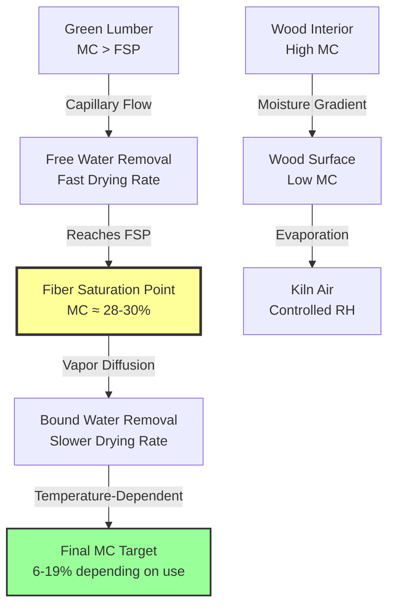

Moisture removal from lumber represents a complex heat and mass transfer process governed by diffusion through porous media. Effective kiln operation requires precise control of temperature, humidity, and air velocity to drive moisture from the wood's interior to the surface while preventing defects such as checking, warping, and case hardening.

## Fundamentals of Moisture in Wood

Wood moisture exists in two distinct forms. Free water occupies the cell cavities and voids within the wood structure, while bound water exists within the cell walls themselves, held by hydrogen bonding to the cellulose and lignin molecules. The transition point between these states is the **fiber saturation point (FSP)**, typically occurring at 28-30% moisture content for most species.

The moisture content of wood is defined as the mass of water relative to the oven-dry mass of wood:

$$MC = \frac{m_{wet} - m_{dry}}{m_{dry}} \times 100\%$$

Where:
- $MC$ = moisture content (%)
- $m_{wet}$ = current mass of wood (kg)
- $m_{dry}$ = oven-dry mass of wood (kg)

Above the FSP, moisture removal is relatively rapid as free water evaporates from the cell cavities. Below the FSP, drying becomes significantly slower because bound water must diffuse through the cell wall structure before it can evaporate from the wood surface.

## Moisture Movement Mechanisms

Three primary mechanisms drive moisture movement during kiln drying:

**Capillary flow** dominates above the FSP, where free water moves through the interconnected void structure under capillary pressure gradients. This mechanism is relatively fast and continues until the FSP is reached.

**Vapor diffusion** occurs when water vapor moves through the wood structure from regions of high vapor pressure (interior) to low vapor pressure (surface). The rate follows Fick's first law:

$$J = -D \frac{\partial C}{\partial x}$$

Where:
- $J$ = diffusion flux (kg/m²·s)
- $D$ = diffusion coefficient (m²/s)
- $C$ = moisture concentration (kg/m³)
- $x$ = distance (m)

**Bound water diffusion** becomes the rate-limiting step below FSP, where water molecules migrate through the cell wall structure. This process is highly temperature-dependent, with diffusion coefficients increasing exponentially with temperature according to an Arrhenius relationship:

$$D = D_0 e^{-E_a/RT}$$

Where:
- $D_0$ = pre-exponential factor (m²/s)
- $E_a$ = activation energy (J/mol)
- $R$ = gas constant (8.314 J/mol·K)
- $T$ = absolute temperature (K)

## Moisture Content Targets by Application

The target moisture content varies significantly based on the end use and geographic location where the lumber will be installed. The equilibrium moisture content (EMC) of wood adjusts to match the relative humidity and temperature of its environment.

| Wood Species | Green MC (%) | Target MC Interior Use (%) | Target MC Exterior Use (%) | FSP (%) |
|--------------|--------------|---------------------------|---------------------------|---------|
| Southern Yellow Pine | 80-150 | 6-8 | 9-14 | 28 |
| Douglas Fir | 40-120 | 6-8 | 9-14 | 28 |
| Red Oak | 70-100 | 6-8 | 9-14 | 30 |
| White Oak | 70-100 | 6-8 | 9-14 | 30 |
| Hard Maple | 65-90 | 6-8 | 9-14 | 29 |
| Soft Maple | 65-90 | 6-8 | 9-14 | 29 |
| Western Red Cedar | 45-80 | 8-10 | 10-15 | 27 |
| Walnut | 70-90 | 6-8 | 9-14 | 29 |

## Moisture Gradient Control

The moisture gradient between the wood's core and surface must be carefully controlled to prevent drying stresses. When the surface dries too rapidly compared to the core, tensile stresses develop at the surface while the wet interior remains in compression. This stress distribution can cause surface checking and internal honeycomb defects.

The drying stress can be approximated as:

$$\sigma = E \cdot \beta \cdot \Delta MC$$

Where:
- $\sigma$ = drying stress (MPa)
- $E$ = modulus of elasticity (GPa)
- $\beta$ = shrinkage coefficient (dimensionless)
- $\Delta MC$ = moisture content difference between surface and core (%)

Kiln operators control the moisture gradient through manipulation of wet-bulb depression (dry-bulb temperature minus wet-bulb temperature). Higher wet-bulb depression increases the driving force for evaporation but also increases surface-to-core moisture gradients.

## Stress Relief Techniques

**Conditioning** is a deliberate stress relief step where steam or high-humidity air is introduced near the end of the drying cycle. This temporarily raises the surface moisture content, allowing stress relaxation through mechano-sorptive creep. The conditioning process typically occurs at 160-180°F with relative humidity increased to 80-90% for 2-8 hours depending on lumber thickness and species.

**Equalization** involves holding the lumber at moderate temperature and humidity after the average moisture content reaches target. This allows interior moisture to redistribute toward drier surfaces, reducing the moisture gradient before final conditioning.

## Drying Rate Control

The drying rate must balance production efficiency against lumber quality. Excessively rapid drying causes defects, while overly conservative schedules increase energy costs and reduce throughput. The instantaneous drying rate can be expressed as:

$$\frac{dMC}{dt} = -k \cdot (MC - MC_{eq})$$

Where:
- $k$ = drying rate constant (1/hr), dependent on temperature, humidity, air velocity, and wood properties
- $MC_{eq}$ = equilibrium moisture content at current kiln conditions (%)

Modern kilns employ moisture content monitoring systems that measure electrical resistance or dielectric properties to track the drying process in real time, enabling dynamic schedule adjustments to optimize quality and efficiency.

## Standards and Specifications

The U.S. Department of Commerce Voluntary Product Standard PS 20 defines moisture content requirements for softwood lumber, specifying maximum 19% MC for lumber intended for dry use. The Western Dry Kiln Association and Southern Forest Products Association publish comprehensive drying schedules for various species and thicknesses, providing temperature and humidity setpoints throughout the drying cycle to achieve target moisture content while minimizing defects.
