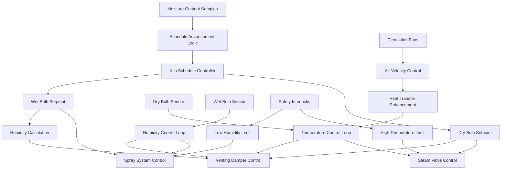

## Fundamental Drying Physics

Lumber kiln temperature and humidity control operates on the principle of vapor pressure differential between wood and surrounding air. Wood releases moisture when its internal vapor pressure exceeds the partial pressure of water vapor in the kiln atmosphere. The drying rate depends on three simultaneous transport mechanisms: internal moisture migration through capillaries and cell walls, surface evaporation governed by mass transfer coefficients, and convective removal of water vapor by circulating air.

The equilibrium moisture content (EMC) establishes the theoretical endpoint for drying at given conditions. Wood continuously exchanges moisture with air until reaching equilibrium, where the chemical potential of water in wood equals that in air. This relationship follows thermodynamic principles expressed through relative humidity and temperature.

## Psychrometric Control Relationships

The fundamental relationship between dry bulb temperature, wet bulb temperature, and relative humidity governs all kiln control strategies:

$$\text{RH} = \frac{p_v}{p_{vs}(T_{db})} \times 100$$

Where relative humidity equals the ratio of actual vapor pressure to saturation vapor pressure at dry bulb temperature. The saturation vapor pressure follows the Antoine equation:

$$p_{vs} = \exp\left(77.345 + 0.0057T - \frac{7235}{T}\right)$$

With temperature in Kelvin and pressure in Pascals. The wet bulb depression relates to evaporative cooling potential:

$$T_{db} - T_{wb} = \frac{(h_s - h)}{\lambda}\cdot\frac{c_p}{\alpha}$$

Where $h_s$ represents enthalpy at saturation, $h$ is actual air enthalpy, $\lambda$ is latent heat of vaporization (2,257 kJ/kg at 100°C), $c_p$ is specific heat of air (1.006 kJ/kg·K), and $\alpha$ is the psychrometric constant (0.665 kPa/K).

The equilibrium moisture content equation based on Hailwood-Horrobin theory:

$$\text{EMC} = \frac{1800}{W}\left[\frac{KH(1-KH)}{(1-KH+K_1KH)}\right] + \frac{1800}{W}\left[\frac{K_1KH}{1+K_1KH}\right]$$

Where $W$ is fiber saturation point (typically 30%), $K$ and $K_1$ are temperature-dependent equilibrium constants, and $H$ is relative humidity expressed as a decimal.

For practical kiln control, the Simpson approximation provides sufficient accuracy:

$$\text{EMC} = \frac{1297W}{W + 1297} - 0.142W + 6.34$$

$$W = \exp\left(\frac{-11.279 + 0.028T_{db}}{T_{db} + 239.44}\right) \times \left(\frac{\text{RH}}{100}\right)$$

## Control System Architecture

The control system maintains target dry bulb and wet bulb temperatures through coordinated manipulation of steam injection, water spray, and venting dampers. Steam valves modulate to control dry bulb temperature, while spray systems adjust wet bulb depression. Venting dampers simultaneously affect both parameters by introducing outdoor air, requiring feedforward compensation.

## Kiln Schedule Specifications

Standard kiln schedules progress through phases with decreasing relative humidity as moisture content drops. The schedule selection depends on species, thickness, desired final moisture content, and allowable drying time.

| Schedule Phase | Moisture Content Range | Dry Bulb Temp (°F) | Wet Bulb Depression (°F) | Relative Humidity (%) | EMC Target (%) |
|----------------|------------------------|--------------------|--------------------------|-----------------------|----------------|
| Initial Conditioning | >50% | 110 | 5 | 85 | 18.5 |
| Primary Drying | 50-30% | 130 | 15 | 65 | 12.8 |
| Secondary Drying | 30-20% | 150 | 25 | 48 | 9.2 |
| Final Drying | 20-15% | 160 | 35 | 38 | 7.4 |
| Conditioning | <15% | 180 | 20 | 52 | 9.8 |
| Equalization | <15% | 140 | 10 | 75 | 14.2 |

The conditioning phase at elevated temperature and humidity relieves drying stresses by temporarily increasing surface moisture content, allowing stress relaxation before cooling. The equalization phase ensures uniform moisture distribution throughout lumber thickness.

Kiln schedule advancement occurs when average board moisture content reaches phase transition points. Sample boards representative of the load provide feedback through periodic weighing or electrical resistance measurements.

## Heat and Mass Transfer Calculations

The drying rate equation combines convective mass transfer with internal diffusion:

$$\frac{dm}{dt} = -h_m A_s (p_{vs,wood} - p_v) = -D_{eff}\frac{A_{cs}}{L}\rho_{wood}\left(\frac{MC_1 - MC_2}{100}\right)$$

Where $h_m$ is mass transfer coefficient (m/s), $A_s$ is surface area (m²), $D_{eff}$ is effective diffusivity (m²/s), $A_{cs}$ is cross-sectional area, $L$ is board thickness, $\rho_{wood}$ is wood density, and $MC$ represents moisture content percentages.

The heat requirement balances sensible heating, water evaporation, and heat losses:

$$Q_{total} = m_{wood}c_{wood}\Delta T + m_{water}\lambda + Q_{losses}$$

Typical energy requirements range from 1,000 to 1,500 kWh per thousand board feet, depending on initial moisture content, species, and schedule aggressiveness.

## Control Strategies and Optimization

Modern kilns employ cascade control where the primary controller generates dry bulb and wet bulb setpoints from the current schedule phase, while secondary PID loops manipulate actuators to maintain these setpoints. Feedforward compensation adjusts for outdoor air temperature and humidity variations affecting venting operations.

The critical control challenge involves maintaining sufficiently high drying potential (wet bulb depression) without causing surface case hardening, checking, or warping from excessive moisture gradients. Conservative schedules with minimal wet bulb depression reduce defects but extend drying time and energy consumption.

Advanced control algorithms optimize schedule progression based on real-time moisture content monitoring, adjusting temperature and humidity trajectories to minimize drying time while maintaining quality constraints. These systems integrate stress models predicting internal moisture distributions and mechanical stress development.

Air circulation velocity substantially affects surface mass transfer coefficients. Most kilns maintain 200-400 fpm across lumber stacks through reversing fan operation every 4-8 hours to equalize drying rates between wet and dry ends of the kiln.

## Practical Implementation Considerations

Sensor placement critically affects control quality. Dry bulb sensors measure true air temperature in shielded, aspirated locations away from direct steam injection. Wet bulb sensors require continuous wetting with distilled water to prevent mineral buildup affecting evaporation rates. Modern installations increasingly employ relative humidity transmitters eliminating wet bulb maintenance, though these sensors require calibration verification.

The control system must prevent condensation during initial heating when cold lumber surface temperatures fall below air dew point. Gradual temperature ramping with minimal wet bulb depression during startup phases prevents condensation-induced staining.

Steam trap sizing and steam distribution uniformity significantly impact temperature control quality. Undersized traps or poor distribution cause temperature stratification requiring increased setpoint offsets and longer drying times.
