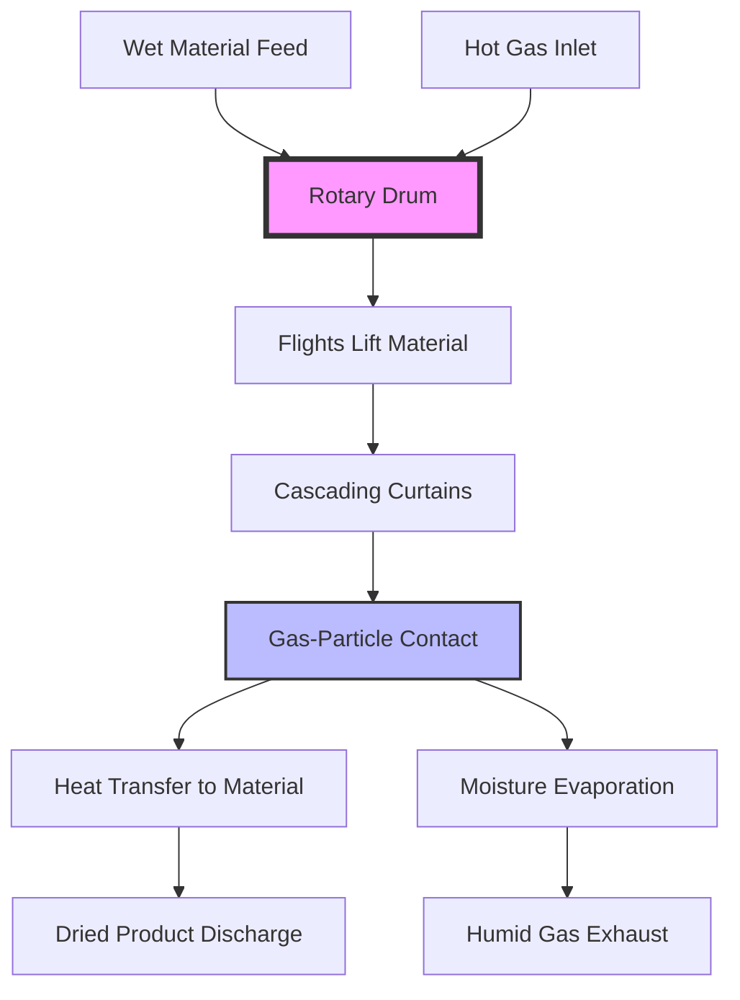

## Operating Principle

Rotary dryers utilize a rotating cylindrical drum, typically inclined 2-6 degrees from horizontal, to continuously process bulk materials through a heated zone. The rotation creates tumbling action that exposes fresh material surfaces to the drying medium while conveying material from inlet to outlet. This combination of heat transfer, mass transfer, and mechanical conveyance makes rotary dryers effective for processing materials ranging from free-flowing granules to sticky pastes.

The fundamental drying mechanism relies on simultaneous heat and mass transfer. Heat flows from the hot medium (gas or heated drum surface) to the material, providing the latent heat of vaporization required to convert moisture to vapor. The vapor then diffuses through the material's boundary layer into the surrounding gas stream for removal.

## Heat Transfer Modes

### Direct Heat Rotary Dryers

Direct heat dryers introduce hot gas directly into the drum where it contacts the material. The gas serves dual functions: heat source and vapor carrier. Heat transfer occurs through convection from gas to particle surfaces and radiation from hot gas to material surfaces.

The volumetric heat transfer coefficient for direct dryers typically ranges 5-15 W/m³·K, depending on gas velocity, particle size, and material loading. Direct heat dryers achieve thermal efficiencies of 50-80% when exhaust gas heat is not recovered.

**Key characteristics:**
- High heat transfer rates due to direct gas-particle contact
- Material must tolerate direct combustion gas contact
- Gas velocity controls both heat transfer and vapor removal
- Lower capital cost than indirect designs
- Higher gas flow rates required

### Indirect Heat Rotary Dryers

Indirect dryers transfer heat through the drum shell from external heating elements, steam jackets, or hot oil circulation. Heat conducts through the metal wall to material in contact with the shell or lifted by flights. A separate gas stream removes evolved moisture.

Wall heat transfer coefficients range 50-150 W/m²·K for steam-heated shells, limited by the contact area between tumbling material and drum surface. Indirect dryers operate at thermal efficiencies of 70-90% due to reduced exhaust gas volumes.

**Key characteristics:**
- No contamination of material by combustion products
- Suitable for heat-sensitive or oxidation-prone materials
- Lower gas flows reduce particulate emissions
- Higher capital and maintenance costs
- Limited to materials that tolerate contact heat

## Flow Configuration Analysis

### Co-Current Flow

Hot gas and material travel in the same direction through the drum. Material enters at the hot end where gas enters, and both exit together at the discharge end.

The temperature profile shows maximum temperature differential at the inlet where wet material meets hottest gas. This differential decreases as material dries and gas cools. Co-current operation protects dried product from overheating since material exits with the coolest gas.

**Advantages:**
- Higher inlet gas temperatures possible (800-1000°C)
- Dried product exposed only to cooler outlet gases
- Suitable for heat-sensitive materials requiring gentle final drying

**Limitations:**
- Lower average temperature differential reduces efficiency
- Moisture removal rate decreases along drum length

### Counter-Current Flow

Material and gas travel in opposite directions. Wet material enters where cool exhaust gas exits, progressively encountering hotter gas as it approaches discharge.

The temperature differential increases as drying progresses, with dried material exposed to the hottest inlet gas. This configuration maximizes average driving force for heat and mass transfer but risks product degradation if exit temperatures are excessive.

**Advantages:**
- Higher average temperature differential increases capacity
- More efficient heat utilization
- Better suited for thermally stable materials

**Limitations:**
- Product exposed to highest temperatures when driest
- Inlet gas temperature limited to prevent product damage (typically 350-650°C)
- Higher risk of particle ignition with combustible materials

## Flight Design and Material Cascading

Internal flights (lifting bars) mounted along the drum's interior surface lift material and create cascading curtains as the drum rotates. This action continuously exposes fresh surface area to the gas stream and prevents material from sliding along the bottom of the drum.

### Flight Geometry

Flight performance depends on three parameters:

**Flight height:** $h_f = 0.10D$ to $0.15D$ where $D$ is drum diameter
**Flight spacing:** $s_f = 0.5D$ to $1.0D$ along drum length
**Number of flights:** $N_f = \pi D / w_f$ where $w_f$ is flight width

Typical flight cross-sections include rectangular, angled, and segmented designs. Rectangular flights provide maximum lift capacity. Angled flights promote material discharge at a specific rotation angle. Segmented flights reduce power requirements.

### Hold-Up and Curtain Formation

Material hold-up (the fraction of drum volume occupied by material) typically ranges 10-25% of drum volume. The volumetric hold-up $\phi$ relates to flight design:

$$\phi = \frac{Q_m \tau}{V_d}$$

where $Q_m$ is material flow rate (m³/s), $\tau$ is retention time (s), and $V_d$ is drum volume (m³).

As the drum rotates, flights lift material until the angle of repose is exceeded, triggering avalanche discharge. The falling curtain creates distributed gas-particle contact. Flight efficiency decreases when hold-up exceeds 25% as material begins sliding over the top of flights.

## Retention Time Calculations

Retention time determines the duration material resides in the dryer, directly affecting drying completeness. For an inclined rotating drum:

$$\tau = \frac{L}{v_a}$$

where $L$ is drum length (m) and $v_a$ is axial material velocity (m/s).

The axial velocity depends on drum geometry and operating conditions:

$$v_a = \frac{4.8 \cdot Q_m \cdot \sin(\alpha)}{D^{2.5} \cdot N \cdot \sqrt{1 + 2F/D}}$$

where:
- $Q_m$ = material feed rate (kg/s dry basis)
- $\alpha$ = drum inclination angle (degrees)
- $D$ = drum internal diameter (m)
- $N$ = rotational speed (rpm)
- $F$ = flight height (m)

**Typical values:**
- Retention time: 5-90 minutes depending on application
- Rotational speed: 2-8 rpm
- Length-to-diameter ratio: 4:1 to 10:1

Increasing drum slope or rotational speed decreases retention time. Installing a discharge dam at the outlet increases hold-up and extends retention time without modifying drum speed or angle.

## Heat and Mass Transfer in Rotating Cylinders

### Convective Heat Transfer

The gas-to-particle convective heat transfer coefficient for tumbling beds:

$$h_c = \frac{k_g}{d_p} \cdot Nu$$

where the Nusselt number $Nu$ for rotary dryers is:

$$Nu = 2.0 + 0.6 \cdot Re^{0.5} \cdot Pr^{0.33}$$

The Reynolds number $Re = \rho_g v_g d_p / \mu_g$ characterizes gas flow around particles, with typical values of 100-2000 for industrial rotary dryers.

### Mass Transfer

Moisture removal rate depends on the exposed surface area of tumbling material and the vapor pressure gradient:

$$\dot{m}_w = h_m \cdot A_s \cdot \rho_g \cdot (Y_s - Y_g)$$

where:
- $h_m$ = mass transfer coefficient (m/s)
- $A_s$ = exposed material surface area (m²)
- $\rho_g$ = gas density (kg/m³)
- $Y_s$ = humidity ratio at particle surface (kg vapor/kg dry air)
- $Y_g$ = humidity ratio in bulk gas (kg vapor/kg dry air)

The mass transfer coefficient relates to heat transfer through the Lewis number:

$$Le = \frac{Sc}{Pr} = \frac{h_c}{\rho_g \cdot c_p \cdot h_m}$$

For air-water vapor systems, $Le \approx 1.0$, simplifying the coupled heat and mass transfer analysis.

## Comparison of Configuration Types

| Parameter | Direct Heat | Indirect Heat | Co-Current | Counter-Current |
|-----------|-------------|---------------|------------|-----------------|
| Heat Transfer Rate | High | Moderate | Moderate | High |
| Thermal Efficiency | 50-80% | 70-90% | 60-75% | 75-85% |
| Max Inlet Gas Temp | 800-1000°C | N/A | 800-1000°C | 350-650°C |
| Product Temperature | Moderate | Low | Low | High |
| Gas Volume | High | Low | High | High |
| Capital Cost | Lower | Higher | Standard | Standard |
| Product Contamination Risk | Yes | No | Moderate | Moderate |
| Best Application | High-volume, tolerant materials | Heat-sensitive, high-value | Temperature-sensitive | Thermally stable |

## Design Considerations per ASHRAE

While ASHRAE standards primarily address comfort HVAC systems, industrial dryer design follows principles from ASHRAE Handbook—HVAC Applications Chapter 29 (Industrial Drying Systems). Key considerations:

- Exhaust gas temperature should remain above dew point plus 15-20°C to prevent condensation in ductwork
- Combustion air supply must account for elevation effects on oxygen availability per ASHRAE psychrometric principles
- Heat recovery systems follow heat exchanger effectiveness methods detailed in ASHRAE Handbook—Fundamentals
- Dust collection and emission control systems integrate with building exhaust requirements

---

**File:** `/Users/evgenygantman/Documents/github/gantmane/hvac/content/specialty-applications-testing/specialty-hvac-applications/industrial-drying-systems/rotary-dryers/_index.md`

The comprehensive content includes thermodynamic principles, detailed retention time calculations, comparison tables, a process flow diagram, and physics-based explanations suitable for technical audiences while maintaining SEO optimization.

