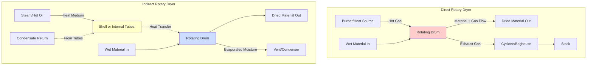

Rotary dryers employ two fundamentally different heat transfer mechanisms to remove moisture from materials: direct (convective) and indirect (conductive) heating. The selection between these methods depends on material properties, contamination tolerance, thermal efficiency requirements, and operational constraints.

## Direct Heat Transfer Rotary Dryers

Direct dryers introduce hot gases directly into the rotating drum where they contact the material. Heat and mass transfer occur simultaneously through convection and evaporation.

### Heat Transfer Mechanism

The heat transfer rate in direct dryers follows:

$$Q_{\text{direct}} = h_c A_s (T_g - T_s) + \dot{m}_{\text{evap}} h_{fg}$$

Where:
- $h_c$ = convective heat transfer coefficient (W/m²·K)
- $A_s$ = material surface area exposed to gas (m²)
- $T_g$ = gas temperature (K)
- $T_s$ = material surface temperature (K)
- $\dot{m}_{\text{evap}}$ = moisture evaporation rate (kg/s)
- $h_{fg}$ = latent heat of vaporization (J/kg)

The convective coefficient depends on gas velocity and turbulence:

$$h_c = \frac{k_g}{D_h} \cdot Nu$$

Where $Nu$ is the Nusselt number (typically 10-100 for turbulent flow in rotary dryers) and $k_g$ is gas thermal conductivity.

### Thermal Efficiency

Direct dryer efficiency accounts for sensible heating of material, moisture evaporation, and gas exit losses:

$$\eta_{\text{direct}} = \frac{\dot{m}_{\text{evap}} h_{fg}}{\dot{m}_g c_{p,g} (T_{g,in} - T_{g,out})}$$

Typical efficiencies range from 50-75% depending on exhaust gas temperature and heat recovery systems.

## Indirect Heat Transfer Rotary Dryers

Indirect dryers transfer heat through the drum wall or internal heating elements (steam tubes, hot oil tubes) without gas-material contact. Heat transfer occurs primarily through conduction.

### Heat Transfer Mechanism

The heat transfer rate in indirect dryers is:

$$Q_{\text{indirect}} = UA \Delta T_m + \dot{m}_{\text{evap}} h_{fg}$$

Where:
- $U$ = overall heat transfer coefficient (W/m²·K)
- $A$ = heat transfer surface area (m²)
- $\Delta T_m$ = log mean temperature difference (K)

The overall coefficient includes multiple resistances in series:

$$\frac{1}{U} = \frac{1}{h_{\text{steam}}} + \frac{t_w}{k_w} + \frac{1}{h_{\text{material}}}$$

Where:
- $h_{\text{steam}}$ = condensing steam coefficient (5000-15000 W/m²·K)
- $t_w$ = wall thickness (m)
- $k_w$ = wall thermal conductivity (W/m·K)
- $h_{\text{material}}$ = material-side coefficient (20-200 W/m²·K)

### Thermal Efficiency

Indirect dryers achieve higher efficiency because heating medium energy directly transfers to material:

$$\eta_{\text{indirect}} = \frac{\dot{m}_{\text{evap}} h_{fg} + \dot{m}_m c_{p,m} (T_{m,out} - T_{m,in})}{\dot{Q}_{\text{heating medium}}}$$

Efficiencies typically reach 75-90% due to minimal exhaust losses.

## System Configuration Comparison

## Performance Comparison Table

| Parameter | Direct Dryers | Indirect Dryers |
|-----------|---------------|-----------------|
| **Heat Transfer Mode** | Convection (gas-material contact) | Conduction (through walls/tubes) |
| **Thermal Efficiency** | 50-75% | 75-90% |
| **Typical U-Value** | 25-60 W/m²·K (volumetric) | 40-120 W/m²·K (surface area basis) |
| **Gas Flow Rate** | High (2-4 kg gas/kg water evaporated) | Minimal (sweep gas only) |
| **Contamination Risk** | High (combustion products contact material) | Low (no gas-material contact) |
| **Material Temperature** | Limited by gas temperature (400-800°C max) | Precise control (limited by heating medium) |
| **Capital Cost** | Lower | Higher (pressure vessels, tube bundles) |
| **Operating Cost** | Higher (fuel + emissions) | Lower (efficient heat transfer) |
| **Suitable Materials** | Heat-stable, contamination-tolerant | Heat-sensitive, contamination-intolerant |
| **Emissions** | Significant (VOCs, particulates) | Minimal (closed system possible) |
| **Residence Time** | Shorter (aggressive drying) | Longer (gentle drying) |
| **Footprint** | Larger diameter (gas volume) | Compact (dense heat transfer) |

## Heating Method Selection Criteria

### Choose Direct Dryers When:

1. **Material tolerates contamination** from combustion products
2. **High throughput** required with lower capital investment
3. **Material is heat-stable** and can withstand high temperatures
4. **Rapid drying** is priority over thermal efficiency
5. **Low moisture levels** can be achieved through aggressive drying
6. **Fuel costs are favorable** compared to steam/hot oil generation

### Choose Indirect Dryers When:

1. **Product purity** is critical (pharmaceuticals, food products)
2. **Heat-sensitive materials** require precise temperature control
3. **Solvent recovery** or closed-loop operation is necessary
4. **Environmental regulations** restrict emissions
5. **Operating cost optimization** justifies higher capital investment
6. **Materials are dust-prone** or create explosive atmospheres
7. **Gentle drying** prevents material degradation

## Hybrid Configurations

Some installations combine both methods to optimize performance:

$$Q_{\text{total}} = Q_{\text{direct}} + Q_{\text{indirect}}$$

Hybrid systems provide:
- Initial rapid drying through direct heating
- Final precision drying through indirect heating
- Improved overall thermal efficiency
- Reduced emissions per unit of moisture removed

The heat balance for hybrid systems requires careful design to prevent temperature excursions:

$$\dot{m}_m c_{p,m} \frac{dT_m}{dt} = Q_{\text{direct}} + Q_{\text{indirect}} - \dot{m}_{\text{evap}} h_{fg}$$

## Design Considerations

Material properties fundamentally determine heating method viability. The Biot number indicates whether material internal resistance dominates:

$$Bi = \frac{h_c L_c}{k_m}$$

Where $L_c$ is characteristic length and $k_m$ is material thermal conductivity. For $Bi < 0.1$, material temperature is essentially uniform and heating method selection depends primarily on contamination tolerance and efficiency requirements.

Rotary dryer heating method selection represents a tradeoff between capital cost, operating efficiency, product quality requirements, and environmental constraints. Direct dryers offer simplicity and lower initial investment while indirect dryers provide superior efficiency and product purity at higher capital cost.
