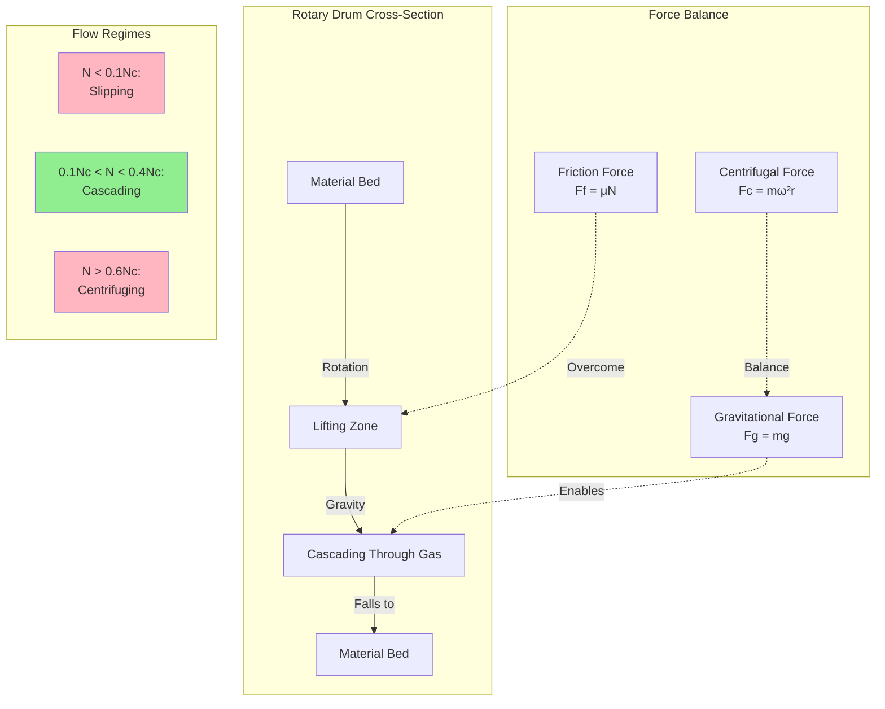

## Fundamental Rotation Mechanics

Rotary dryer performance depends critically on drum rotation speed, which governs material movement patterns, residence time, and heat transfer effectiveness. The rotating drum creates a cascading action where material lifts on the ascending side and falls through the hot gas stream, maximizing contact area and thermal exchange.

Three distinct flow regimes occur as rotation speed increases:

**Slipping Regime** - Material slides along the drum wall without lifting. Occurs at very low speeds when centrifugal force is insufficient to overcome static friction. Provides minimal material-gas contact and poor drying efficiency.

**Cascading Regime** - Material lifts on the ascending side and cascades through the gas stream. This is the optimal operating regime for most industrial dryers, providing maximum surface area exposure and heat transfer.

**Centrifuging Regime** - Material adheres to the drum wall due to excessive centrifugal force. Occurs when rotation speed is too high. Results in minimal material movement and dramatically reduced drying performance.

## Critical Speed Relationship

The transition between regimes is governed by the balance between centrifugal acceleration and gravitational acceleration. Critical speed represents the theoretical rotation rate at which material would remain pinned to the drum wall:

$$N_c = \frac{42.3}{\sqrt{D}}$$

Where:
- $N_c$ = critical speed (rpm)
- $D$ = drum internal diameter (ft)

In SI units:

$$N_c = \frac{76.6}{\sqrt{D_m}}$$

Where $D_m$ is drum diameter in meters.

**Physical Basis**: At critical speed, centrifugal acceleration equals gravitational acceleration. The factor 42.3 derives from $\frac{1}{2\pi}\sqrt{g}$ where $g$ is gravitational acceleration. This represents the speed at which the centrifugal force coefficient equals unity.

## Froude Number Analysis

The Froude number provides a dimensionless measure of rotation speed relative to critical speed:

$$Fr = \frac{N^2 D}{N_c^2 D} = \left(\frac{N}{N_c}\right)^2$$

Where:
- $Fr$ = Froude number (dimensionless)
- $N$ = actual rotation speed (rpm)

Optimal dryer operation typically occurs at Froude numbers between 0.01 and 0.15, corresponding to 10-40% of critical speed. This range ensures cascading flow without centrifuging.

## Residence Time Calculation

Material residence time in the drum determines thermal processing and must be sufficient for complete drying. For a cylindrical drum with no lifters:

$$\tau = \frac{0.19 L}{N D S \tan(\theta)}$$

Where:
- $\tau$ = residence time (min)
- $L$ = drum length (ft)
- $N$ = rotation speed (rpm)
- $D$ = drum diameter (ft)
- $S$ = fractional drum speed ($N/N_c$)
- $\theta$ = drum slope angle (degrees)

**Physical Interpretation**: Residence time increases with drum length and decreases with rotation speed, diameter, and slope. The $\tan(\theta)$ term reflects gravity-driven axial flow velocity. The coefficient 0.19 is empirically derived for cylindrical drums and varies with material properties and flight design.

For drums equipped with lifting flights:

$$\tau = \frac{0.19 L F_L}{N D S \tan(\theta)}$$

Where $F_L$ is a flight factor typically ranging from 1.5 to 3.0, depending on flight geometry and spacing.

## Rotational Speed Control Strategy

Industrial dryers require precise speed control to maintain optimal material handling:

**Variable Frequency Drives (VFDs)** provide the primary control method, offering:
- Continuous speed adjustment from 0-100% of design speed
- Soft-start capability to reduce mechanical stress
- Energy optimization during partial load operation
- Integration with process control systems

**Speed Selection Criteria**:

1. **Material Properties**: Sticky or wet materials require slower speeds to prevent balling and wall buildup. Free-flowing materials tolerate higher speeds.

2. **Particle Size Distribution**: Fine materials need lower speeds to minimize dust generation and entrainment. Coarse materials benefit from higher speeds for improved cascading.

3. **Required Residence Time**: Longer drying times necessitate slower rotation or longer drums.

4. **Heat Sensitivity**: Temperature-sensitive materials may require faster rotation for shorter exposure times at higher gas temperatures.

## Drum Rotation Mechanics

## Rotation Speed Comparison by Application

| Application | Typical Speed (% Critical) | Actual Speed (rpm)* | Residence Time (min) | Key Considerations |
|-------------|---------------------------|---------------------|---------------------|-------------------|
| Sand & Aggregates | 25-35% | 4-7 | 10-20 | Free-flowing, high capacity |
| Fertilizer Granules | 20-30% | 3-6 | 15-30 | Prevent attrition, uniform drying |
| Wood Chips/Biomass | 15-25% | 2-5 | 20-40 | Prevent fiber damage, high moisture removal |
| Chemical Powders | 15-20% | 2-4 | 20-35 | Minimize dust, prevent agglomeration |
| Mineral Concentrates | 20-30% | 3-6 | 15-25 | Sticky when wet, build-up prevention |
| Food Products | 10-20% | 2-4 | 25-45 | Gentle handling, temperature control |
| Pharmaceutical | 10-15% | 1.5-3 | 30-60 | Minimal degradation, precise control |
| Sludge/Biosolids | 15-25% | 2-5 | 25-40 | Sticky material, frequent cleaning |

*Assumes 8 ft (2.4 m) diameter drum. Scale proportionally for other sizes.

## Design Standards and Guidelines

**ASME Standards** do not directly specify rotation speeds but provide mechanical design criteria for rotating pressure vessels that influence maximum safe speeds.

**Manufacturer Guidelines** typically recommend:
- Operating speed: 15-30% of critical speed for general industrial applications
- Maximum speed: 40% of critical speed to maintain safety margin from centrifuging
- Minimum speed: 10% of critical speed to ensure cascading action

**Perry's Chemical Engineers' Handbook** provides empirical correlations for residence time and recommends slope angles of 0-5 degrees with rotation speeds inversely proportional to slope.

## Practical Implementation Considerations

**Startup Protocol**: Begin rotation before introducing material and heat to verify mechanical integrity. Gradually increase to operating speed while monitoring vibration and bearing temperatures.

**Material Bed Depth**: Optimal fill typically ranges from 8-15% of drum cross-sectional area. Excessive fill increases residence time but reduces cascading effectiveness. Insufficient fill wastes thermal capacity.

**Drive System Sizing**: Motor power requirements scale with drum diameter to the fourth power due to inertial loads. Torque must overcome static friction during startup, typically 2-3 times running torque.

**Vibration Management**: Unbalanced material distribution creates cyclic loading. Modern systems employ continuous monitoring with automatic shutdown thresholds to prevent structural damage.

The physics of drum rotation fundamentally determines rotary dryer performance. Proper speed selection balances residence time requirements against heat transfer effectiveness while maintaining the cascading flow regime essential for efficient thermal processing.
