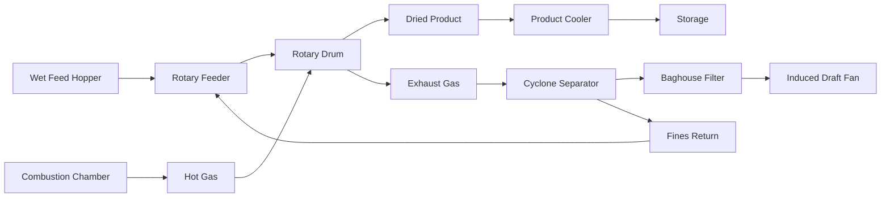

## Rotary Dryers for Grain and Minerals

Rotary dryers provide continuous, high-capacity moisture removal for bulk granular materials including agricultural grains and mineral products. The design fundamentals differ substantially between applications due to temperature sensitivity in grains versus mineral tolerance to elevated temperatures.

### Physical Principles of Rotary Drying

Material moves through an inclined rotating cylinder while hot gas flows either co-currently or counter-currently. Heat transfer occurs through three simultaneous mechanisms:

1. **Convection** from hot gas to particle surfaces (dominant mode)
2. **Conduction** from heated drum walls to material
3. **Radiation** from gas and walls (significant at high temperatures)

The drying rate depends on moisture diffusion from particle interiors to surfaces where evaporation occurs. The critical moisture content represents the transition from surface-controlled to diffusion-controlled drying, typically 0.15-0.25 kg water/kg dry solid for grains.

### Grain Drying Applications

#### Temperature Limits for Quality Preservation

Agricultural grains require strict temperature control to prevent protein denaturation, starch gelatinization, and seed viability loss:

| Grain Type | Maximum Plenum Temperature | Maximum Grain Temperature | Quality Concern |
|------------|---------------------------|--------------------------|-----------------|
| Corn (seed) | 43°C (110°F) | 38°C (100°F) | Germination viability |
| Corn (commercial) | 71°C (160°F) | 60°C (140°F) | Stress cracking |
| Wheat (seed) | 49°C (120°F) | 43°C (110°F) | Germination viability |
| Rice (milling) | 60°C (140°F) | 54°C (130°F) | Kernel breakage |
| Soybeans | 71°C (160°F) | 60°C (140°F) | Oil quality degradation |

Excessive temperatures cause thermal stress cracking in corn kernels when the moisture gradient exceeds 4-5 percentage points between kernel exterior and interior. The stress develops from differential volumetric shrinkage according to:

$$\sigma = E \cdot \alpha \cdot \Delta M$$

where $\sigma$ is thermal stress, $E$ is elastic modulus (1.5-2.0 GPa for corn), $\alpha$ is moisture expansion coefficient (0.012-0.015 per percentage point moisture), and $\Delta M$ is moisture gradient.

#### Grain Dryer Residence Time

Residence time in rotary grain dryers typically ranges from 15-45 minutes depending on initial moisture content and desired final moisture. The mean residence time is calculated from:

$$t_r = \frac{L}{N \cdot D \cdot \tan(\theta) \cdot 60}$$

where $t_r$ is residence time (min), $L$ is dryer length (m), $N$ is rotational speed (rpm), $D$ is diameter (m), and $\theta$ is inclination angle (typically 0-5°).

For continuous mixed-flow operation with minimal particle segregation:

$$t_r = \frac{0.19 \cdot L}{N \cdot D \cdot S}$$

where $S$ is slope (m/m). Flight design significantly affects material showering and gas-solid contact, with straight radial flights providing baseline performance and angled or lifting flights increasing residence time by 20-40%.

### Mineral Processing Applications

#### High-Temperature Operation

Mineral products (sand, ore concentrates, coal, industrial minerals) tolerate substantially higher temperatures:

| Material | Typical Inlet Gas Temperature | Processing Objective |
|----------|------------------------------|---------------------|
| Silica sand | 650-870°C (1200-1600°F) | Surface moisture removal |
| Iron ore pellets | 400-650°C (750-1200°F) | Pre-heating before sintering |
| Coal fines | 260-540°C (500-1000°F) | Moisture reduction to <5% |
| Limestone | 315-650°C (600-1200°F) | Preparation for calcination |

Counter-current flow maximizes thermal efficiency in mineral applications, achieving 50-65% thermal efficiency compared to 35-50% for co-current designs. However, counter-current operation exposes wet feed to cooler exhaust gases, requiring careful sizing to prevent condensation.

#### Throughput Calculation Methodology

Volumetric loading for mineral dryers typically operates at 8-15% of drum volume, while grain dryers use 10-20% to minimize mechanical damage. The throughput capacity is determined from the heat and mass balance:

$$\dot{m}_s = \frac{\dot{Q}_{avail}}{\lambda_w \cdot (M_i - M_f) + c_s \cdot (T_{out} - T_{in})}$$

where:
- $\dot{m}_s$ = dry solids throughput (kg/h)
- $\dot{Q}_{avail}$ = available heat transfer rate (kJ/h)
- $\lambda_w$ = latent heat of water vaporization at average temperature (kJ/kg)
- $M_i$, $M_f$ = initial and final moisture content (kg water/kg dry solid)
- $c_s$ = specific heat of dry solid (kJ/kg·K)
- $T_{out}$, $T_{in}$ = discharge and feed temperatures (K)

The available heat transfer rate depends on volumetric heat transfer coefficient ($U_v$, typically 400-1200 kJ/m³·h·K for rotary dryers):

$$\dot{Q}_{avail} = U_v \cdot V \cdot \Delta T_{lm} \cdot \eta$$

where $V$ is drum volume (m³), $\Delta T_{lm}$ is log-mean temperature difference, and $\eta$ is thermal efficiency (0.35-0.65).

### Process Flow Configuration

### Design Decision Matrix

| Design Parameter | Grain Application | Mineral Application |
|-----------------|-------------------|---------------------|
| Flow pattern | Co-current (protect from high temp) | Counter-current (thermal efficiency) |
| Inlet gas temp | 70-160°C | 260-870°C |
| Residence time | 15-45 min | 30-90 min |
| Rotational speed | 3-8 rpm | 2-6 rpm |
| L/D ratio | 4:1 to 8:1 | 6:1 to 12:1 |
| Volumetric loading | 10-20% | 8-15% |
| Flight design | Deep pockets (gentle handling) | Straight radial (max exposure) |

### Moisture Removal Rate Analysis

The drying rate in the constant-rate period (surface moisture) follows:

$$\frac{dM}{dt} = -\frac{h \cdot A}{m_s \cdot \lambda_w} \cdot (T_g - T_{wb})$$

where $h$ is convective heat transfer coefficient (20-80 W/m²·K depending on gas velocity), $A$ is particle surface area, $m_s$ is particle mass, and $T_{wb}$ is wet-bulb temperature.

In the falling-rate period (internal diffusion control):

$$\frac{dM}{dt} = -k \cdot (M - M_{eq})$$

where $k$ is drying constant (0.05-0.3 min⁻¹) and $M_{eq}$ is equilibrium moisture content at dryer conditions.

### Energy Efficiency Considerations

ASHRAE Handbook - HVAC Applications (Chapter 29) provides guidance on industrial drying efficiency. Specific energy consumption (SEC) for rotary dryers:

$$SEC = \frac{\dot{m}_g \cdot c_p \cdot (T_{in} - T_{out})}{\dot{m}_s \cdot (M_i - M_f)} \quad \text{(kJ/kg water removed)}$$

Typical SEC values:
- Grain dryers: 4000-6000 kJ/kg water (co-current, lower efficiency)
- Mineral dryers: 3000-4500 kJ/kg water (counter-current, higher efficiency)

Heat recovery from exhaust gases through recuperative heat exchangers reduces SEC by 15-30%, though grain applications must avoid condensation that could contaminate return air with mold spores or mycotoxins.

### Performance Monitoring Parameters

Critical operational metrics include:

1. **Specific evaporation rate**: 15-40 kg water/m³·h (function of gas temperature and velocity)
2. **Thermal efficiency**: Ratio of heat used for evaporation to total heat input
3. **Product temperature rise**: Must remain within quality limits
4. **Exhaust gas humidity**: Indicates approach to saturation and efficiency

The dryer length required for a specified moisture reduction is estimated from empirical correlations validated through pilot testing, as particle-gas contact efficiency depends on flight design, rotation speed, and material characteristics that resist simple theoretical prediction.
