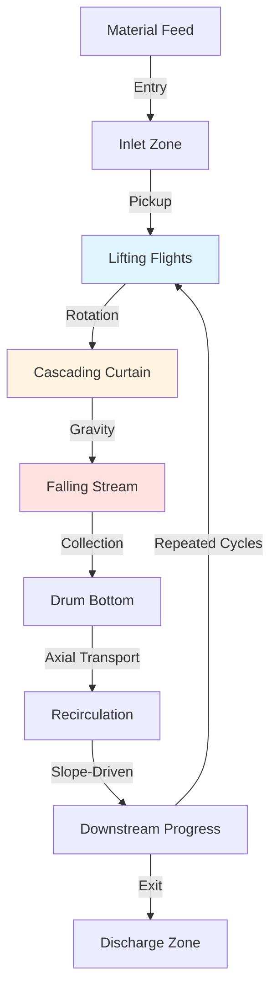

## Fundamental Flow Mechanisms

Material flow through rotary dryers combines gravitational transport along the drum axis with transverse motion created by rotation and internal flights. The dominant transport mechanism determines drying efficiency, residence time uniformity, and thermal contact between material and drying gas.

Three primary flow regimes govern rotary dryer operation:

**Slumping flow** occurs at low rotational speeds where material avalanches down the flight face without becoming airborne. This regime provides minimal gas-solid contact and poor heat transfer efficiency.

**Cascading flow** develops at moderate speeds where material showers through the gas stream in discrete curtains. This regime maximizes interfacial area and represents the optimal operating condition for most applications.

**Centrifuging flow** emerges at excessive speeds where centrifugal forces exceed gravitational forces, preventing material discharge from flights. This unproductive regime should be avoided.

## Residence Time Distribution

Material residence time τ in a rotary dryer depends on drum geometry, slope, rotational speed, and material properties. The fundamental residence time equation from first principles:

$$\tau = \frac{L}{v_a}$$

where L is drum length and $v_a$ is the average axial velocity. For a sloped rotary drum:

$$v_a = \frac{4QN}{60\pi D^2 \tan\theta}$$

where:
- Q = volumetric holdup (-)
- N = rotational speed (rpm)
- D = drum diameter (m)
- θ = drum slope angle (rad)

Combining these relationships yields the complete residence time equation:

$$\tau = \frac{15\pi D^2 L \tan\theta}{QN}$$

This equation reveals that residence time increases linearly with length and slope, quadratically with diameter, and inversely with rotational speed and holdup fraction.

## Flight-Induced Material Distribution

Internal flights lift and cascade material through the gas stream. The number of flights in the active zone determines curtain density and heat transfer effectiveness. Flight loading follows from geometric analysis:

$$m_f = \rho_b V_f = \rho_b w h^2 \left(\frac{\pi}{4} - \frac{1}{3}\right)$$

where:
- $\rho_b$ = bulk density (kg/m³)
- w = flight width (m)
- h = flight height (m)

The total material in flight at any instant:

$$M_{flight} = n_{active} m_f = \frac{N_{flights}}{4} m_f$$

assuming 25% of flights are in the active lifting zone. This airborne material creates the gas-solid interface critical for convective heat transfer.

## Flow Pattern Configuration

## Flow Configuration Comparison

| Configuration | Hold-Up Q | Heat Transfer | Residence Time | Applications |
|--------------|-----------|---------------|----------------|--------------|
| Straight drum, no flights | 0.05-0.10 | Poor (gas bypass) | Variable, uncontrolled | Not recommended |
| Straight drum with flights | 0.10-0.15 | Excellent | Medium | Free-flowing granules |
| Sloped drum with flights | 0.08-0.12 | Excellent | Controlled by slope | Standard applications |
| Sloped with lifting flights | 0.12-0.18 | Maximum | Extended | Difficult materials |
| Counter-current w/ flights | 0.10-0.15 | Excellent | Optimal control | High moisture removal |
| Co-current with flights | 0.08-0.12 | Good | Shorter | Heat-sensitive products |

## Axial Dispersion and Mixing

Material does not flow through rotary dryers as plug flow. Axial dispersion creates a residence time distribution around the mean value. The Peclet number characterizes dispersion:

$$Pe = \frac{v_a L}{D_a}$$

where $D_a$ is the axial dispersion coefficient. Lower Peclet numbers indicate greater dispersion and broader residence time distributions. Typical rotary dryers operate at Pe = 10-50.

The variance of residence time distribution relates to Peclet number:

$$\sigma_\theta^2 = \frac{2}{Pe} - \frac{2}{Pe^2}(1 - e^{-Pe})$$

where $\sigma_\theta^2$ is the dimensionless variance. Higher variance reduces drying uniformity and can lead to product quality issues.

## Critical Speed Considerations

The Froude number determines flow regime transitions:

$$Fr = \frac{N^2 D}{1800g}$$

where g = 9.81 m/s². Flow regime boundaries:

- **Slumping:** Fr < 0.003
- **Cascading:** 0.003 < Fr < 0.02
- **Centrifuging:** Fr > 0.02

Most industrial dryers operate at Fr = 0.005-0.015 to maintain cascading flow. Operating speed typically ranges from 30-70% of critical speed, where critical speed:

$$N_c = \frac{42.3}{\sqrt{D}}$$

with D in meters and $N_c$ in rpm.

## Design Integration Standards

ASME specifications for rotary dryer material flow design include:

**Holdup fraction**: Maintain Q = 0.08-0.15 for optimal gas-solid contact without excessive power consumption.

**Flight spacing**: Position flights at angular intervals of 15-30° to ensure continuous material curtaining without overloading individual flights.

**Slope optimization**: Limit slope to 0-5 cm/m to balance residence time against material sliding rather than lifting.

**Rotational speed**: Select N = 4-8 rpm for large dryers (D > 2 m) and N = 8-15 rpm for smaller units to maintain Fr in the cascading regime.

Proper material flow design ensures uniform residence time distribution, maximizes heat transfer efficiency, and prevents operational issues such as ringing, material buildup, or premature discharge.

## Operational Monitoring

Key indicators of proper material flow:

- Consistent discharge rate matching feed rate at steady state
- Uniform temperature distribution along drum length
- Absence of audible material avalanching or impact sounds
- Visible material curtaining through inspection ports
- Power consumption within design specifications (kW/tonne throughput)

Deviations from these indicators suggest flow regime changes requiring operational adjustments or mechanical inspection of flight condition.
