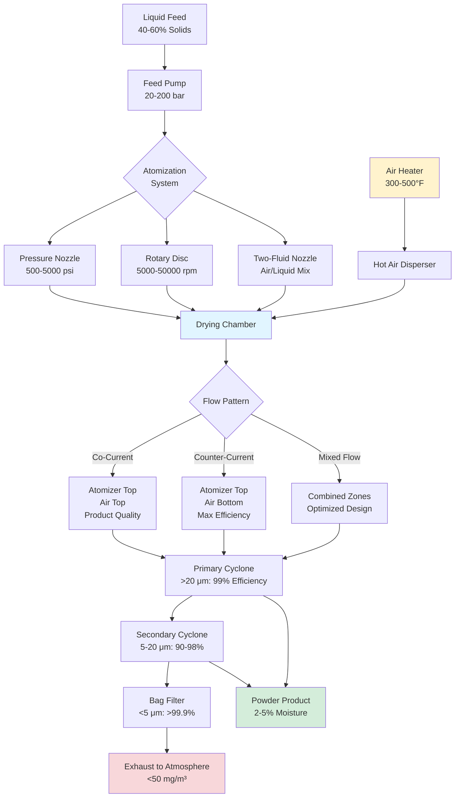

## Spray Drying Fundamentals

Spray drying converts liquid feed materials into dry powder through atomization, hot air contact, and rapid moisture evaporation. This process achieves moisture removal in seconds, making it essential for heat-sensitive materials requiring minimal thermal exposure. The technology dominates production of milk powder, instant coffee, pharmaceuticals, ceramics, and specialty chemicals.

The fundamental spray drying sequence involves three transport phenomena occurring simultaneously:

- **Atomization** - liquid breakup into droplets with surface area-to-volume ratios of 10,000-60,000 m²/m³
- **Heat transfer** - convective energy delivery from hot air to droplet surface
- **Mass transfer** - moisture diffusion from droplet interior through evaporation at the air interface

Drying rate follows the characteristic curve with initial constant-rate period controlled by surface evaporation, transitioning to falling-rate period as internal moisture diffusion becomes limiting.

## Atomization Principles and Technology

Atomization creates the high surface area necessary for rapid drying. Droplet size distribution critically affects product quality, residence time requirements, and energy efficiency.

### Pressure Nozzle Atomizers

Pressure nozzles force liquid through small orifices at 500-5000 psi, generating droplets through hydraulic shear. Mean droplet diameter follows the correlation:

$$D_{mean} = K \cdot \left(\frac{\sigma}{\rho_a v^2}\right)^{0.5} \cdot \left(\frac{\mu_l^2}{\sigma \rho_l d_o}\right)^{0.25}$$

where $\sigma$ is surface tension, $\rho_a$ air density, $v$ relative velocity, $\mu_l$ liquid viscosity, $\rho_l$ liquid density, $d_o$ orifice diameter, and $K$ is an empirical constant (typically 3.0-4.5).

**Pressure nozzle characteristics:**

- Droplet range: 40-300 μm mean diameter
- Feed rate: 10-2000 kg/h per nozzle
- Energy consumption: 0.3-0.8 kWh per 1000 kg feed
- Applications: medium to low viscosity feeds (<300 cP)

### Rotary Atomizers

Centrifugal atomizers distribute liquid onto a rotating disc or cup operating at 5,000-50,000 rpm. Liquid flows radially outward, disintegrating at the periphery through centrifugal force. Droplet size depends on disc speed, feed rate, and liquid properties:

$$D_{mean} = 0.4 \left(\frac{Q}{\pi \omega D_{disc}}\right)^{0.6} \left(\frac{\sigma}{\rho_l \omega^2 D_{disc}^2}\right)^{0.2}$$

where $Q$ is volumetric feed rate, $\omega$ angular velocity, and $D_{disc}$ is disc diameter.

**Rotary atomizer advantages:**

- Droplet range: 20-200 μm (tighter distribution than pressure nozzles)
- High capacity: up to 100,000 kg/h
- Handles viscous feeds: up to 2000 cP
- Adjustable particle size via speed control

### Two-Fluid Nozzle Atomizers

Two-fluid nozzles use compressed air (or steam) to atomize liquid feed through pneumatic shear. Air-to-liquid mass ratios of 0.2-1.0 produce fine droplets suitable for small-scale or pilot operations.

## Chamber Design and Airflow Patterns

Chamber geometry determines residence time distribution, particle trajectory, and product-air contact efficiency. Three primary configurations exist:

### Co-Current Flow Design

Hot air and atomized droplets flow in the same direction. Inlet air temperatures of 300-500°F contact wet droplets with high moisture content. As particles dry and air cools, temperature differentials decrease, protecting heat-sensitive products.

**Co-current design features:**

- Outlet temperatures: 160-220°F
- Product temperature: remains near wet-bulb temperature until final drying stage
- Applications: heat-sensitive materials (milk powder, pharmaceuticals, flavors)
- Chamber height-to-diameter ratio: 2:1 to 5:1

The thermal advantage of co-current flow is that wet particles never experience maximum air temperature. Product temperature follows:

$$T_{product} \approx T_{wb} + (T_{out} - T_{wb}) \cdot \left(\frac{X_{final}}{X_{initial}}\right)^{0.5}$$

This relationship shows product temperature remains near wet-bulb temperature during most of the drying cycle.

### Counter-Current Flow Design

Hot air enters at the bottom while atomization occurs at the top. Dry particles encounter the hottest air, raising product temperature significantly. This configuration maximizes thermal efficiency but subjects product to elevated temperatures.

**Counter-current applications:**

- Detergents, ceramic slurries, minerals
- Products tolerating 300-400°F
- Maximum evaporation efficiency

Counter-current flow achieves 10-20% better thermal efficiency than co-current due to optimal temperature driving force throughout the chamber. Product exit temperature approaches inlet air temperature minus 20-40°F.

### Mixed-Flow Design

Combined co-current and counter-current zones optimize both product quality and energy efficiency. Atomization occurs in co-current zone; dried particles fall through counter-current zone for final moisture reduction.

The temperature profile in mixed-flow designs provides initial gentle drying followed by aggressive final moisture removal, achieving both product quality and energy efficiency objectives.

## Hot Air Systems

### Air Heating Methods

Spray dryer air heating systems must deliver clean, precisely controlled hot air at rates of 10,000-500,000 CFM.

**Direct-fired gas heaters:**

- Efficiency: 92-98%
- Temperature control: ±10°F
- Combustion products contact product (acceptable for non-sensitive materials)
- Fuel consumption: 800-1200 Btu per lb water evaporated

**Indirect steam or thermal oil heaters:**

- Clean air (no combustion products)
- Precise temperature control: ±3°F
- Higher capital cost
- Applications: pharmaceuticals, food products requiring isolated air

### Air Distribution

Uniform air distribution prevents temperature gradients causing product degradation or incomplete drying. Inlet air dispersers create controlled flow patterns:

- **Swirl generators** - tangential air injection creating cyclonic flow for rotary atomizers
- **Distributor plates** - perforated plates ensuring uniform radial distribution
- **Air straighteners** - honeycomb structures eliminating turbulence for pressure nozzle systems

Air velocity in the drying chamber ranges 0.5-3.0 ft/s, balancing residence time against particle entrainment.

## Heat and Mass Transfer Equations

### Convective Heat Transfer to Droplet

The rate of heat transfer from hot air to a droplet surface follows Newton's law of cooling:

$$q = h \cdot A \cdot (T_{air} - T_{surface})$$

where $h$ is the convective heat transfer coefficient (W/m²·K), $A$ is droplet surface area (m²), $T_{air}$ is bulk air temperature (K), and $T_{surface}$ is droplet surface temperature (K).

The heat transfer coefficient for a sphere in flowing air is calculated using the Ranz-Marshall correlation:

$$Nu = \frac{hD}{k_{air}} = 2 + 0.6 \cdot Re^{0.5} \cdot Pr^{0.33}$$

where $Nu$ is Nusselt number, $D$ is droplet diameter (m), $k_{air}$ is air thermal conductivity (W/m·K), $Re$ is Reynolds number, and $Pr$ is Prandtl number.

### Evaporation Rate

The mass transfer rate from droplet surface to air follows:

$$\frac{dm}{dt} = h_m \cdot A \cdot (C_{surface} - C_{air})$$

where $h_m$ is the mass transfer coefficient (m/s), and $C$ represents moisture concentration (kg/m³).

The Sherwood number for mass transfer parallels heat transfer:

$$Sh = \frac{h_m D}{D_{AB}} = 2 + 0.6 \cdot Re^{0.5} \cdot Sc^{0.33}$$

where $D_{AB}$ is the water-air diffusion coefficient (m²/s) and $Sc$ is Schmidt number.

### Droplet Drying Time

For the constant-rate drying period, total drying time is estimated by:

$$t_{dry} = \frac{\rho_l D_0^2}{8 k_{air} (T_{air} - T_{wb})} \cdot \Delta H_v \cdot \left(X_0 - X_f\right)$$

where $\rho_l$ is liquid density (kg/m³), $D_0$ is initial droplet diameter (m), $T_{wb}$ is wet-bulb temperature (K), $\Delta H_v$ is latent heat of vaporization (J/kg), $X_0$ is initial moisture content (kg water/kg dry solid), and $X_f$ is final moisture content.

### Energy Balance

The overall energy balance for the spray dryer chamber:

$$\dot{m}_{air} \cdot c_{p,air} \cdot (T_{in} - T_{out}) = \dot{m}_{water} \cdot \Delta H_v + \dot{m}_{solids} \cdot c_{p,solids} \cdot (T_{out} - T_{feed})$$

where $\dot{m}$ denotes mass flow rate (kg/s) and $c_p$ is specific heat capacity (J/kg·K).

Thermal efficiency is calculated as:

$$\eta_{thermal} = \frac{\dot{m}_{water} \cdot \Delta H_v}{\dot{m}_{air} \cdot c_{p,air} \cdot (T_{in} - T_{ambient})} \times 100\%$$

Typical thermal efficiency ranges 50-75% depending on outlet temperature, feed concentration, and heat recovery implementation.

## Cyclone Separation Systems

### Separation Principles

Cyclones separate dried powder from exhaust air through centrifugal force. Air enters tangentially, creating a vortex. Particles with sufficient inertia migrate to the wall and descend; clean air exits through the central core.

Collection efficiency follows:

$$\eta = 1 - \exp\left(-\frac{2NL}{D}\right)$$

where $N$ is the number of effective turns, $L$ cyclone length, and $D$ cyclone diameter.

**Typical cyclone performance:**

| Particle Size (μm) | Collection Efficiency |
|-------------------|----------------------|
| >20 | >99% |
| 10-20 | 90-98% |
| 5-10 | 70-90% |
| <5 | 40-70% |

### Multi-Stage Systems

Fine particles escaping primary cyclones require secondary separation:

- **Secondary cyclones** - smaller diameter units capturing 5-15 μm particles
- **Bag filters** - fabric filtration for submicron particles, achieving >99.9% collection
- **Wet scrubbers** - final polishing for environmental compliance

## Industrial Applications

### Dairy Industry

Milk powder production represents the largest spray drying application globally. Whole milk, skim milk, and whey undergo preconcentration to 40-50% solids via evaporation, then spray drying to 2-4% final moisture.

**Dairy spray dryer specifications:**

| Parameter | Whole Milk Powder | Skim Milk Powder | Whey Powder | Infant Formula |
|-----------|-------------------|------------------|-------------|----------------|
| Feed Solids (%) | 45-50 | 48-52 | 45-50 | 50-55 |
| Inlet Temperature (°F) | 350-390 | 360-400 | 340-370 | 320-350 |
| Outlet Temperature (°F) | 180-195 | 185-200 | 175-190 | 165-180 |
| Final Moisture (%) | 2.5-3.5 | 2.5-4.0 | 3.0-4.5 | 2.0-3.0 |
| Bulk Density (g/cm³) | 0.50-0.65 | 0.55-0.70 | 0.45-0.60 | 0.35-0.50 |
| Particle Size (μm) | 80-150 | 100-180 | 60-120 | 50-100 |
| Residence Time (sec) | 18-28 | 20-30 | 15-25 | 25-35 |

Product quality parameters include bulk density, particle size distribution, and instant properties (wettability, dispersibility). Instant milk powder requires agglomeration through rewetting and re-drying to achieve particle sizes of 200-500 μm.

### Chemical Industry

Chemical spray drying produces catalysts, pigments, dyestuffs, and polymer resins. Operating conditions accommodate corrosive feeds, organic solvents, and inert atmospheres.

**Chemical dryer features:**

- Closed-loop inert gas systems (nitrogen) for flammable solvents
- Solvent recovery and condensation systems
- Explosion-proof electrical systems
- Corrosion-resistant materials (316 stainless steel, hastelloy)

### Pharmaceutical Industry

Pharmaceutical spray drying creates amorphous solid dispersions, improving drug bioavailability. Aseptic design and validation requirements exceed food and chemical standards.

**Pharmaceutical requirements:**

- cGMP-compliant construction and documentation
- CIP (clean-in-place) systems with documented cleaning validation
- Product contact surfaces: 316L electropolished stainless steel
- Containment systems for high-potency APIs
- Process analytical technology (PAT) for real-time monitoring

Chamber design incorporates conical bottoms with smooth transitions, minimizing product accumulation. Outlet temperatures remain below drug degradation thresholds, typically 140-180°F for heat-sensitive compounds.

## Process Control and Powder Properties

### Critical Process Parameters

Powder properties depend on precise control of operating parameters:

| Product Property | Primary Controlling Factors | Typical Range |
|------------------|----------------------------|---------------|
| Particle Size | Atomization speed/pressure, feed rate, feed viscosity | 20-300 μm |
| Bulk Density | Outlet temperature, feed solids content, agglomeration | 0.3-0.8 g/cm³ |
| Moisture Content | Outlet temperature, residence time, air humidity | 1-5% |
| Flowability | Particle shape, size distribution, moisture | Carr Index 5-25 |
| Wettability | Surface composition, porosity, particle size | 5-60 seconds |
| Dispersibility | Agglomeration, surface fines, particle structure | 60-95% |
| Color | Product temperature history, feed quality | L* value 85-98 |

### Particle Morphology

Spray-dried particle structure evolves through the drying process:

1. **Wet droplet stage** (0-2 seconds): uniform liquid sphere
2. **Crust formation** (2-8 seconds): surface solidification while interior remains liquid
3. **Puffing stage** (8-15 seconds): internal vapor pressure creates hollow particles
4. **Final drying** (15-30 seconds): residual moisture removal, final structure solidification

Hollow particle formation occurs when:

$$\frac{dP_{internal}}{dt} > \frac{d\sigma_{crust}}{dt}$$

where internal vapor pressure increase rate exceeds crust strength development rate. This produces lower bulk density powder with improved instant properties.

### Operating Condition Effects

**Inlet temperature increase:**
- Faster drying rate (decreased residence time)
- Lower bulk density (increased puffing)
- Higher risk of product degradation
- Improved thermal efficiency

**Outlet temperature increase:**
- Lower final moisture content
- Reduced powder flowability (surface stickiness)
- Decreased product stability (oxidation, Maillard reactions)

**Feed solids concentration increase:**
- Higher production capacity
- Reduced specific energy consumption (Btu/lb evaporated)
- Increased feed viscosity (may require different atomization)
- Improved particle morphology

## Energy Considerations

Spray drying energy consumption ranges 1,200-2,000 Btu per pound of water evaporated, significantly higher than mechanical evaporation (400-600 Btu/lb). Energy optimization strategies include:

- **Feed preconcentration** - reducing dryer evaporative load
- **Exhaust air heat recovery** - preheating inlet air or feed
- **Multi-stage drying** - combining spray drying with belt or fluid bed drying
- **Dehumidification drying** - closed-loop systems with heat pump moisture removal

## Spray Dryer Operating Conditions by Application

Specific applications require tailored temperature, atomization, and residence time parameters:

| Application | Feed Conc. (%) | Inlet Temp (°F) | Outlet Temp (°F) | Atomizer Type | Flow Pattern | Final Moisture (%) |
|-------------|---------------|-----------------|------------------|---------------|--------------|-------------------|
| Whole Milk Powder | 45-50 | 360-390 | 185-195 | Rotary/Pressure | Co-current | 2.5-3.5 |
| Skim Milk Powder | 48-52 | 370-400 | 190-200 | Rotary/Pressure | Co-current | 2.5-4.0 |
| Instant Coffee | 30-40 | 300-350 | 160-180 | Pressure | Co-current | 2.5-4.0 |
| Coffee Creamer | 35-45 | 350-380 | 175-190 | Rotary | Co-current | 2.0-3.5 |
| Egg Powder | 40-48 | 280-320 | 140-160 | Pressure | Co-current | 2.0-5.0 |
| Blood Plasma | 15-25 | 250-280 | 120-140 | Two-fluid | Co-current | 3.0-6.0 |
| Ceramic Slurry | 60-70 | 500-700 | 200-250 | Pressure | Counter-current | 0.5-2.0 |
| Detergent Powder | 55-65 | 550-650 | 180-220 | Pressure | Counter-current | 3.0-8.0 |
| Catalyst Powder | 30-50 | 400-550 | 180-220 | Rotary | Mixed-flow | 1.0-5.0 |
| Pharmaceutical API | 20-35 | 250-320 | 130-160 | Two-fluid | Co-current | 1.0-3.0 |
| Fruit Juice Powder | 50-60 | 340-380 | 170-190 | Rotary | Co-current | 2.0-4.0 |
| Resin Powder | 40-55 | 320-400 | 160-190 | Pressure | Co-current | 0.5-2.0 |

## Standards and Guidelines

### Food Safety Standards

- **FDA 21 CFR Part 110** - Current Good Manufacturing Practices for food manufacturing
- **3-A Sanitary Standards** - Equipment design for dairy processing
- **FDA 21 CFR Part 117** - Hazard Analysis and Risk-Based Preventive Controls
- **ISO 22000** - Food Safety Management Systems

### Process Standards

- **ASHRAE Handbook - HVAC Applications, Chapter 29** - Industrial drying system design
- **GMP Guidelines (FDA/EMA)** - Pharmaceutical manufacturing requirements
- **ASME BPE** - Bioprocessing equipment design standards
- **3-A Standard 16-03** - Spray dryers for dairy products

### Air Quality Standards

- **EPA NESHAP Subpart DDD** - Emissions from industrial organic processes
- **OSHA 29 CFR 1910.94** - Ventilation requirements for hazardous operations
- **ACGIH Industrial Ventilation Manual** - Exhaust system design

### Safety Standards

- **NFPA 61** - Prevention of fires and dust explosions in agricultural facilities
- **NFPA 654** - Prevention of fire and dust explosions from combustible particulate solids
- **ATEX Directive 2014/34/EU** - Equipment in explosive atmospheres (European)
- **IEC 61241** - Electrical apparatus for use in combustible dust atmospheres

## Energy Optimization Strategies

Spray drying energy consumption ranges 1,200-2,000 Btu per pound of water evaporated, significantly higher than mechanical evaporation (400-600 Btu/lb). Energy optimization strategies include:

### Feed Preconcentration

Evaporative preconcentration from 10-15% solids to 45-50% solids reduces spray dryer evaporation load by 85-90%. Multi-effect evaporators operating at 500-800 Btu/lb water evaporated achieve combined system energy consumption of 850-1,100 Btu/lb total water removed.

### Exhaust Air Heat Recovery

Two-stage heat recovery systems:

1. **Direct heat recovery** - exhaust air preheats inlet air through air-to-air heat exchangers (30-50% energy recovery)
2. **Indirect heat recovery** - exhaust air preheats feed or process water (10-20% additional recovery)

Total recoverable energy:

$$Q_{recoverable} = \dot{m}_{exhaust} \cdot c_{p,air} \cdot (T_{exhaust} - T_{ambient} - \Delta T_{approach})$$

where $\Delta T_{approach}$ is heat exchanger approach temperature (typically 20-40°F).

### Multi-Stage Drying

Integrated belt drying after spray drying removes final moisture at 400-600 Btu/lb water, reducing overall energy consumption by 15-25% for products tolerating longer drying times.

### Dehumidification Drying

Closed-loop systems with heat pump dehumidification achieve 600-900 Btu/lb water evaporated in applications requiring inert atmosphere or solvent recovery.

## References

- Masters, K. (1991). *Spray Drying Handbook*. 5th Edition. Longman Scientific & Technical.
- ASHRAE Handbook - HVAC Applications (2023), Chapter 29: Industrial Drying Systems
- Perry's Chemical Engineers' Handbook, 9th Edition: Spray Drying Section
- Oakley, D.E. (2004). "Spray Dryer Modeling in Theory and Practice." *Drying Technology*, 22(6): 1371-1402.
- Bhandari, B., et al. (2013). *Handbook of Food Powders*. Woodhead Publishing.
- FDA Guidance for Industry: Process Validation (2011)
- 3-A Sanitary Standards for Spray Dryers, Number 16-03 (2017)
- NFPA 61: Standard for the Prevention of Fires and Dust Explosions in Agricultural and Food Processing Facilities (2020)
