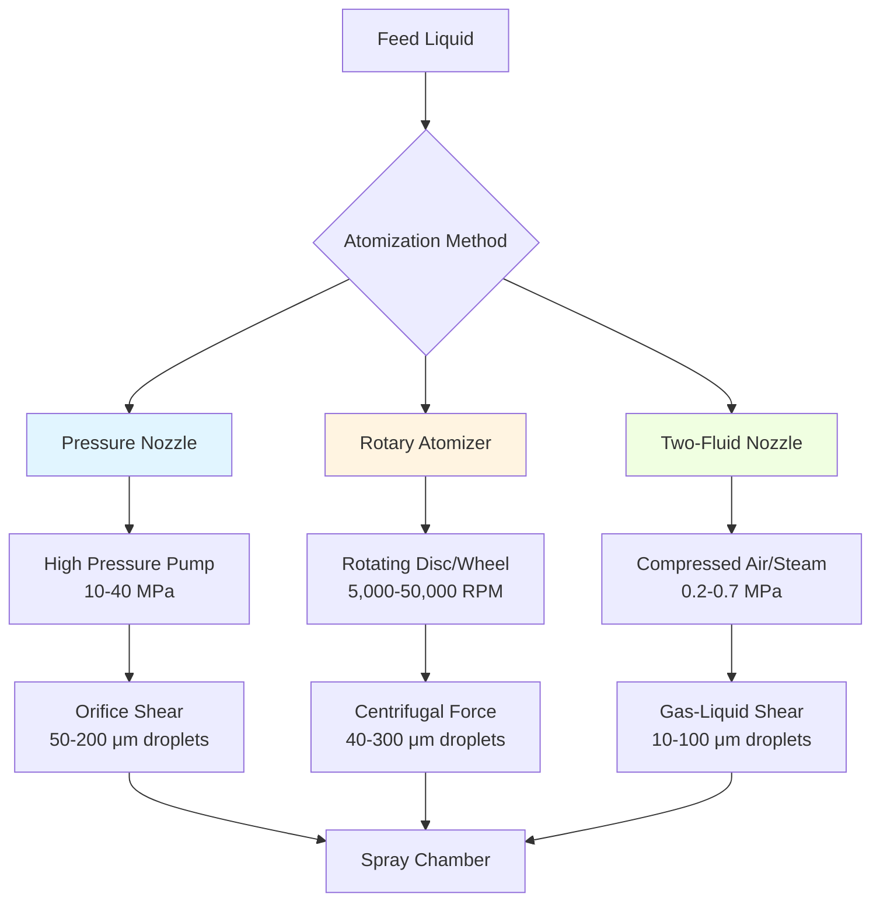

# Spray Dryer Atomization Technology

Atomization represents the critical first stage in spray drying, transforming liquid feed into a fine mist of droplets that expose maximum surface area for rapid moisture evaporation. The physics of droplet formation, size distribution, and kinetic energy directly govern drying efficiency, product quality, and energy consumption across pharmaceutical, food, chemical, and materials processing industries.

## Fundamental Physics of Atomization

Atomization occurs when applied energy overcomes the surface tension forces holding liquid molecules together. Three energy input methods drive commercial atomization systems:

**Pressure Energy:** High-pressure pumps force liquid through small orifices, converting pressure potential into kinetic energy that disrupts the liquid jet into droplets.

**Centrifugal Energy:** Rotating discs or wheels accelerate liquid radially outward, creating unstable liquid films that disintegrate into droplets under aerodynamic and centrifugal forces.

**Kinetic Energy Transfer:** High-velocity gas streams impact liquid, transferring momentum that fragments the liquid into fine droplets through shear forces.

The critical Weber number governs droplet breakup:

$$We = \frac{\rho_g v^2 d}{\sigma}$$

Where:
- $\rho_g$ = gas density (kg/m³)
- $v$ = relative velocity between gas and liquid (m/s)
- $d$ = characteristic liquid dimension (m)
- $\sigma$ = surface tension (N/m)

Droplet formation occurs when $We > 12$ for most liquid-gas systems.

## Droplet Size Prediction

The Sauter Mean Diameter (SMD or $d_{32}$) characterizes droplet size distribution, representing the diameter of a droplet having the same volume-to-surface area ratio as the entire spray:

$$d_{32} = \frac{\sum n_i d_i^3}{\sum n_i d_i^2}$$

For pressure nozzles, empirical correlations predict SMD:

$$d_{32} = 3.08 \cdot Q^{0.25} \cdot \Delta P^{-0.5} \cdot \sigma^{0.25} \cdot \rho_l^{0.25}$$

Where:
- $Q$ = volumetric flow rate (m³/s)
- $\Delta P$ = pressure drop across nozzle (Pa)
- $\rho_l$ = liquid density (kg/m³)

For rotary atomizers, the relationship follows:

$$d_{32} = \frac{4.5 \cdot \sigma^{0.6} \cdot Q^{0.4}}{\rho_l^{0.2} \cdot \omega^{1.2} \cdot D^{0.6}}$$

Where:
- $\omega$ = angular velocity (rad/s)
- $D$ = disc diameter (m)

## Atomization Methods Comparison

## Atomizer Type Characteristics

| Atomizer Type | Droplet Size Range | Capacity Range | Energy Consumption | Feed Viscosity Limit | Wear Rate |
|---------------|-------------------|----------------|-------------------|---------------------|-----------|
| Pressure Nozzle | 50-200 μm | 10-5,000 L/h | 0.5-2.0 kWh/kg water | <200 mPa·s | High (abrasion) |
| Rotary Disc | 40-300 μm | 50-50,000 L/h | 0.3-1.5 kWh/kg water | <1,000 mPa·s | Low |
| Rotary Wheel | 60-400 μm | 100-100,000 L/h | 0.4-1.8 kWh/kg water | <2,000 mPa·s | Moderate |
| Two-Fluid (Internal) | 10-60 μm | 5-500 L/h | 2.0-8.0 kWh/kg water | <500 mPa·s | Low |
| Two-Fluid (External) | 20-100 μm | 20-2,000 L/h | 1.5-6.0 kWh/kg water | <300 mPa·s | Low |
| Ultrasonic | 5-50 μm | 1-100 L/h | 3.0-12.0 kWh/kg water | <50 mPa·s | Very Low |

## Selection Criteria and Performance Optimization

**Pressure Nozzle Systems** excel in applications requiring narrow droplet size distributions and moderate feed rates. The primary limitation involves orifice wear from abrasive feeds and clogging from particulate matter. Typical operating pressures range from 10-40 MPa, with orifice diameters of 0.4-2.0 mm.

**Rotary Atomizers** dominate large-scale production due to superior capacity handling and tolerance for viscous, abrasive feeds. Disc diameters range from 50-300 mm, operating at peripheral velocities of 100-200 m/s. The spray pattern produces a characteristic horizontal disc perpendicular to the rotation axis.

**Two-Fluid Atomizers** generate the finest droplets but consume significantly more energy through compressed gas requirements. The gas-to-liquid mass ratio typically ranges from 0.2-2.0, with higher ratios producing finer atomization. Internal mixing designs provide better atomization efficiency than external mixing configurations.

## Thermodynamic Considerations

The energy required for atomization represents a small fraction of total spray drying energy consumption (typically 1-5%), but directly influences:

**Evaporation Rate:** Smaller droplets provide higher surface area per unit volume, following:

$$\frac{A}{V} = \frac{6}{d}$$

This relationship demonstrates that halving droplet diameter doubles the specific surface area, accelerating drying kinetics proportionally.

**Residence Time:** Droplet trajectory and terminal velocity determine contact time with drying air. Stokes' Law governs settling velocity for droplets below 100 μm:

$$v_t = \frac{g \cdot d^2 \cdot (\rho_p - \rho_g)}{18 \mu}$$

Where:
- $v_t$ = terminal velocity (m/s)
- $g$ = gravitational acceleration (9.81 m/s²)
- $\mu$ = gas dynamic viscosity (Pa·s)

**Particle Morphology:** Rapid surface drying at high temperatures creates hollow particles through case hardening, while slower evaporation yields dense particles. The Peclet number characterizes this behavior:

$$Pe = \frac{k_e \cdot R^2}{D_{eff}}$$

Where:
- $k_e$ = evaporation rate constant (s⁻¹)
- $R$ = droplet radius (m)
- $D_{eff}$ = effective diffusivity (m²/s)

Values of $Pe > 1$ indicate surface precipitation and hollow particle formation.

## Operational Monitoring and Control

Critical process parameters requiring continuous monitoring include:

- **Feed Rate Stability:** Variations exceeding ±5% alter droplet size distribution and product quality
- **Atomizer Speed (Rotary):** Maintained within ±2% for consistent particle size
- **Pressure Fluctuation (Nozzle):** Should remain below ±10% to prevent size distribution shifts
- **Air-to-Liquid Ratio (Two-Fluid):** Controlled within ±5% for stable atomization energy input

Advanced systems employ laser diffraction or phase Doppler anemometry for real-time droplet size measurement, enabling closed-loop control of atomization parameters to maintain target particle specifications despite feed property variations.

The atomization stage fundamentally determines spray dryer performance limits, making proper atomizer selection and operation essential for achieving target product specifications while minimizing energy consumption and maximizing throughput.
