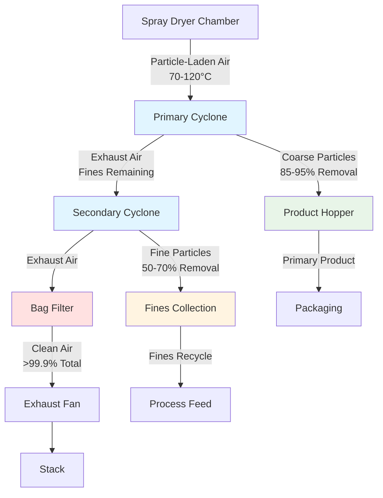

## Fundamental Operation

Exhaust cyclones in spray dryer systems separate product particles from the exhaust air stream through centrifugal force. The particle-laden air enters tangentially, creating a vortex that drives particles outward to the cyclone wall where they descend to the collection hopper. Clean air exits through the central vortex finder tube.

The separation mechanism relies on the density difference between particles and air combined with centrifugal acceleration. Particles experience forces several hundred times greater than gravitational acceleration, enabling efficient separation of fine particles down to 5-10 μm.

## Separation Physics

### Centrifugal Force Analysis

The centrifugal force acting on a particle in the cyclone vortex:

$$F_c = \frac{m_p v_t^2}{r}$$

where:
- $m_p$ = particle mass (kg)
- $v_t$ = tangential velocity (m/s)
- $r$ = radial position (m)

The particle settling velocity toward the wall under centrifugal acceleration:

$$v_s = \frac{d_p^2 (\rho_p - \rho_g) v_t^2}{18 \mu r}$$

where:
- $d_p$ = particle diameter (m)
- $\rho_p$ = particle density (kg/m³)
- $\rho_g$ = gas density (kg/m³)
- $\mu$ = gas dynamic viscosity (Pa·s)

### Cut Diameter

The cut diameter represents the particle size collected with 50% efficiency:

$$d_{50} = \sqrt{\frac{9 \mu b}{2 \pi N_e v_i (\rho_p - \rho_g)}}$$

where:
- $b$ = inlet width (m)
- $N_e$ = effective number of turns
- $v_i$ = inlet velocity (m/s)

Typical spray dryer cyclones achieve cut diameters of 5-15 μm depending on design and operating conditions.

## Collection Efficiency

### Grade Efficiency Model

The fractional efficiency for a given particle size follows:

$$\eta(d_p) = \frac{1}{1 + (d_{50}/d_p)^2}$$

This relationship demonstrates that efficiency increases sharply for particles larger than the cut diameter. For particles twice the cut diameter, efficiency exceeds 80%.

### Overall Efficiency

The total collection efficiency integrating across the particle size distribution:

$$\eta_{total} = \int_0^\infty \eta(d_p) \cdot f(d_p) \, dd_p$$

where $f(d_p)$ is the normalized particle size distribution from the spray dryer.

Spray dryer exhaust cyclones typically achieve overall efficiencies of 85-95% for product recovery, with remaining fines captured by bag filters or scrubbers downstream.

## System Configuration

## Design Configurations

| Configuration | Diameter Ratio | Height Ratio | Inlet Velocity | Pressure Drop | Efficiency | Application |
|--------------|----------------|--------------|----------------|---------------|------------|-------------|
| High Efficiency | D/4 inlet | 4D cylinder | 12-18 m/s | 800-1200 Pa | 92-96% | Fine powders, pharmaceuticals |
| Standard | D/4 inlet | 3D cylinder | 15-20 m/s | 600-900 Pa | 88-93% | Food products, detergents |
| High Throughput | D/3 inlet | 2.5D cylinder | 18-25 m/s | 500-800 Pa | 82-88% | Bulk chemicals, minerals |
| Low Pressure Drop | D/5 inlet | 3.5D cylinder | 10-15 m/s | 400-600 Pa | 85-90% | Heat-sensitive products |
| Multi-Clone | Multiple small | Variable | 12-20 m/s | 700-1000 Pa | 90-94% | High volume applications |

**Diameter Ratio**: Inlet width relative to cyclone body diameter (D)
**Height Ratio**: Cylindrical section height relative to body diameter

## Pressure Drop Calculation

The pressure drop across a cyclone separator:

$$\Delta P = \frac{K \rho_g v_i^2}{2}$$

where $K$ is the cyclone resistance coefficient (typically 6-10 for spray dryer cyclones).

The resistance coefficient depends on cyclone geometry:

$$K = 16 \left(\frac{a \cdot b}{D_e^2}\right)^2$$

where:
- $a$ = inlet height (m)
- $b$ = inlet width (m)
- $D_e$ = exit diameter (m)

Pressure drop directly impacts fan power requirements. Each 100 Pa increase in cyclone pressure drop adds approximately 10-15 W per m³/s of airflow to fan power consumption.

## Design Considerations

### Temperature Effects

Exhaust gas temperature affects separation performance through gas properties:

- **Viscosity increase**: Reduces particle settling velocity by 15-20% from 80°C to 120°C
- **Density decrease**: Reduces centrifugal force by approximately 12% over the same range
- **Thermal expansion**: Requires 20-30°C design margin for dimensional stability

Cyclone bodies require insulation to maintain gas temperature above the dew point and prevent condensation that causes product adhesion to walls.

### Particle Loading

High dust loadings (>50 g/m³) create particle-particle interactions that enhance collection through agglomeration but increase pressure drop. Typical spray dryer exhaust contains 20-80 g/m³ of product particles.

Excessive loading causes saltation in the cyclone cone, requiring steeper cone angles (60-75° from vertical) to ensure reliable discharge.

### Material Selection

Cyclone construction materials must resist:
- Abrasion from particle impacts (carbon steel with 6-10 mm thickness or abrasion-resistant coatings)
- Corrosion from moisture and product chemistry (stainless steel 304/316 for food and pharmaceutical applications)
- Temperature cycling (allowances for thermal expansion, stress-relief welds)

Internal surface finish affects particle adhesion. Polished surfaces (Ra < 3.2 μm) minimize buildup for sticky products like sugar or milk powder.

## Performance Optimization

Cyclone efficiency improves with:
- Increased inlet velocity (within pressure drop constraints)
- Smaller cyclone diameter (but reduced capacity)
- Greater cylindrical section height (more separation time)
- Optimized vortex finder diameter (typically 0.4-0.6 × body diameter)

Pressure drop reduces with:
- Lower inlet velocity
- Streamlined inlet design
- Larger exit diameter
- Smooth internal surfaces

Design optimization balances these competing factors based on product characteristics, capacity requirements, and energy costs.

## Integration with Spray Dryer

The cyclone system must match the spray dryer exhaust conditions:

- **Airflow capacity**: Cyclone sized for 110-120% of dryer exhaust volume to handle process variations
- **Temperature compatibility**: Materials and seals rated for maximum exhaust temperature plus 20-30°C margin
- **Product characteristics**: Cut diameter selected based on particle size distribution from atomization system
- **Pressure budget**: Cyclone pressure drop coordinated with overall system static pressure (typically 2000-3500 Pa total)

Multiple cyclones in parallel provide redundancy and allow maintenance without system shutdown in critical production environments.

## Maintenance Requirements

Regular inspection intervals:
- Weekly: Hopper discharge valves, level sensors, product buildup on walls
- Monthly: Inlet and outlet duct connections, structural integrity, insulation condition
- Quarterly: Internal inspection for erosion patterns, coating condition, dimensional verification
- Annually: Comprehensive inspection with efficiency testing, alignment verification

Erosion patterns indicate flow distribution issues. Localized wear spots require baffle installation or inlet geometry modification to extend service life.

---

*Technical content reflecting established cyclone separation principles and spray dryer integration practices as of January 2025.*
