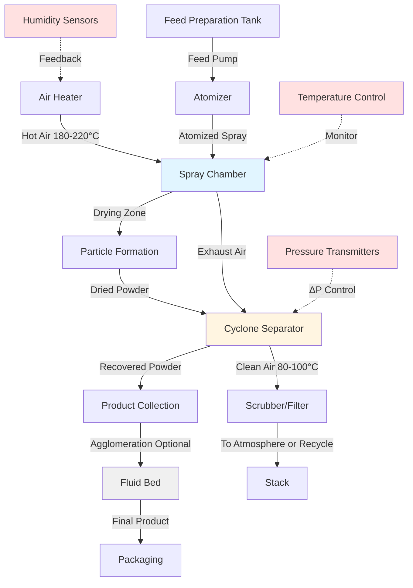

## Physics of Spray Drying

Spray drying transforms liquid feeds into dry powders through atomization and rapid moisture evaporation in controlled hot air streams. The process exploits the large surface-area-to-volume ratio of atomized droplets to achieve drying rates 100-1000 times faster than conventional methods.

### Heat and Mass Transfer Fundamentals

The drying rate depends on simultaneous heat and mass transfer between hot air and droplets. During the constant-rate period, moisture evaporates from the droplet surface at a rate governed by:

$$\frac{dW}{dt} = -h_m A_s (C_{s} - C_{\infty})$$

Where:
- $\frac{dW}{dt}$ = moisture removal rate (kg/s)
- $h_m$ = mass transfer coefficient (m/s)
- $A_s$ = droplet surface area (m²)
- $C_s$ = vapor concentration at droplet surface (kg/m³)
- $C_{\infty}$ = vapor concentration in bulk air (kg/m³)

The convective heat transfer to the droplet provides latent heat for evaporation:

$$q = h A_s (T_{\infty} - T_s) = \frac{dW}{dt} h_{fg}$$

Where:
- $h$ = convective heat transfer coefficient (W/m²·K)
- $T_{\infty}$ = bulk air temperature (K)
- $T_s$ = droplet surface temperature (K)
- $h_{fg}$ = latent heat of vaporization (J/kg)

### Droplet Drying Time

The time required to dry a droplet from initial moisture content $X_0$ to final moisture content $X_f$ follows:

$$t = \frac{\rho_p d_p^2}{8 h_m \rho_g} \ln\left(\frac{X_0 - X_e}{X_f - X_e}\right)$$

Where:
- $\rho_p$ = particle density (kg/m³)
- $d_p$ = droplet diameter (m)
- $\rho_g$ = gas density (kg/m³)
- $X_e$ = equilibrium moisture content (kg/kg dry basis)

This equation reveals why atomization is critical: drying time increases with the square of droplet diameter. Reducing droplet size from 200 μm to 50 μm decreases drying time by a factor of 16.

## Atomization Systems

### Pressure Nozzle Atomization

Pressure nozzles accelerate liquid through small orifices at 3-30 MPa, producing droplets 50-200 μm. The mean droplet diameter follows:

$$d_{32} = 3.08 \nu^{0.385} \sigma^{0.737} \dot{m}_L^{0.259} \Delta P^{-0.54}$$

Where:
- $d_{32}$ = Sauter mean diameter (μm)
- $\nu$ = kinematic viscosity (m²/s)
- $\sigma$ = surface tension (N/m)
- $\dot{m}_L$ = liquid mass flow rate (kg/s)
- $\Delta P$ = pressure drop across nozzle (Pa)

Pressure nozzles suit low-viscosity feeds (< 0.3 Pa·s) like skim milk and pharmaceutical solutions.

### Rotary Atomizer

Centrifugal atomizers use rotating wheels or disks at 5,000-50,000 rpm. Droplet size correlates with:

$$d_{32} = 0.4 \left(\frac{\sigma}{\rho_L \omega^2 D}\right)^{0.6} \left(\frac{\dot{m}_L}{\rho_L \omega D^2}\right)^{0.2}$$

Where:
- $\omega$ = angular velocity (rad/s)
- $D$ = wheel diameter (m)
- $\rho_L$ = liquid density (kg/m³)

Rotary atomizers handle higher viscosities (up to 5 Pa·s) and provide better control over particle size distribution, making them preferred for whole milk powder and ceramic slurries.

## Product-Specific Parameters

| Parameter | Milk Powder | Pharmaceutical API | Chemical Powder | Ceramic Powder |
|-----------|-------------|-------------------|-----------------|----------------|
| **Inlet Air Temperature** | 180-220°C | 120-180°C | 200-350°C | 250-400°C |
| **Outlet Air Temperature** | 80-100°C | 60-90°C | 90-120°C | 100-150°C |
| **Feed Solids Content** | 45-52% | 20-40% | 30-60% | 50-70% |
| **Atomization Method** | Pressure/Rotary | Pressure | Pressure/Rotary | Rotary |
| **Particle Size (d₅₀)** | 80-150 μm | 5-50 μm | 50-200 μm | 10-100 μm |
| **Residual Moisture** | 3-5% | 1-3% | 0.5-2% | 0.1-1% |
| **Bulk Density** | 500-700 kg/m³ | 300-500 kg/m³ | 400-800 kg/m³ | 800-1500 kg/m³ |
| **Air Flow Rate** | 1.5-2.0 kg air/kg water | 2.0-3.0 kg air/kg water | 1.5-2.5 kg air/kg water | 2.5-4.0 kg air/kg water |

## Chamber Design Configurations

### Co-Current Flow

Hot air and spray enter from the top, moving downward together. The hottest air contacts the wettest droplets, preventing thermal damage as particles approach the wet-bulb temperature initially. Product temperature rises only as moisture decreases. This configuration suits heat-sensitive materials like milk proteins and pharmaceutical biologics.

### Counter-Current Flow

Air enters at the bottom while spray enters from top. Dried particles encounter the hottest air at the cone outlet. This arrangement maximizes thermal efficiency but risks product degradation. Used for heat-stable chemicals and ceramics requiring very low final moisture.

### Mixed Flow

Combines co-current drying in the upper chamber with counter-current flow in the conical base. Balances product quality with energy efficiency. Common in large-scale milk powder production.

## Psychrometric Control for Product Quality

### Milk Powder Production

Skim milk powder requires strict outlet humidity control to prevent:
- Lactose crystallization (excess drying below 3% moisture)
- Maillard browning (excessive temperatures above 90°C particle temperature)
- Protein denaturation (inlet temperatures above 220°C)

The air dewpoint at the outlet must remain below 15°C to achieve target 3-5% moisture content while maintaining 80-100°C dry-bulb temperature.

### Pharmaceutical API Spray Drying

GMP requirements mandate HEPA-filtered air (ISO Class 5-7) and validated temperature control ±2°C. Closed-loop nitrogen spray drying prevents oxidation of sensitive compounds. The oxygen concentration stays below 5% by volume through continuous nitrogen purging at 1.2× stoichiometric excess.

### Chemical Powder Systems

Solvent recovery systems condense organic vapors from chemical spray drying. For ethanol-based feeds, the inlet air temperature remains below 180°C (well below the 363°C autoignition temperature) with LEL monitoring maintaining solvent concentration below 25% of the lower explosive limit.

## Energy Efficiency Optimization

The specific energy consumption (SEC) for spray drying ranges from 3,000-6,000 kJ/kg water evaporated. Minimize SEC through:

**Air Temperature Optimization**: Higher inlet temperatures increase driving force for evaporation but risk product damage. The optimal balance occurs at:

$$T_{in,opt} = T_{product,max} + \frac{h_{fg}}{\rho_{air} c_p v_{air} \tau_{residence}}$$

**Exhaust Air Heat Recovery**: Recovering sensible heat from 90°C exhaust air to preheat feed or combustion air reduces energy consumption by 20-30%. Heat exchangers must prevent cross-contamination in food and pharmaceutical applications.

**Moisture Content Control**: Over-drying beyond specification wastes energy. Each 1% reduction in target moisture content increases SEC by approximately 15%.

## Regulatory Standards

### Food Applications (Milk Powder)
- **FDA 21 CFR Part 110**: Current Good Manufacturing Practice in manufacturing, packing, or holding human food
- **USDA Grade A PMO**: Pasteurized Milk Ordinance requirements for air quality
- **3-A Sanitary Standards**: Equipment design for cleanability (3-A Standard 605-03)

### Pharmaceutical Applications
- **FDA 21 CFR Part 211**: cGMP for finished pharmaceuticals
- **EU GMP Annex 1**: Manufacture of sterile medicinal products
- **ISO 14644**: Cleanroom classification and monitoring
- **USP <1116>**: Microbiological control and monitoring of aseptic processing environments

### Chemical Applications
- **NFPA 654**: Standard for prevention of fire and dust explosions
- **ATEX Directive 2014/34/EU**: Equipment in explosive atmospheres
- **OSHA 29 CFR 1910.119**: Process safety management of highly hazardous chemicals

## Product Quality Metrics

Spray dryer performance links directly to powder characteristics:

**Particle Size Distribution**: Affects reconstitution, flowability, and bioavailability. Span index quantifies distribution width:

$$\text{Span} = \frac{d_{90} - d_{10}}{d_{50}}$$

Narrow distributions (span < 2) indicate consistent atomization.

**Bulk Density**: Influenced by particle morphology. Higher air temperatures produce hollow particles with lower bulk density. Control through atomizer selection and air pattern.

**Moisture Content**: Measured by Karl Fischer titration (pharmaceuticals) or oven drying (food products). Directly correlates with outlet air humidity per sorption isotherms.

**Residual Solvent**: For chemical/pharmaceutical spray drying, gas chromatography verifies solvent levels meet ICH Q3C limits (typically < 0.5% for Class 2 solvents).

---

*Technical specifications based on thermodynamic principles, mass transfer theory, and industrial spray drying standards current to January 2025.*
