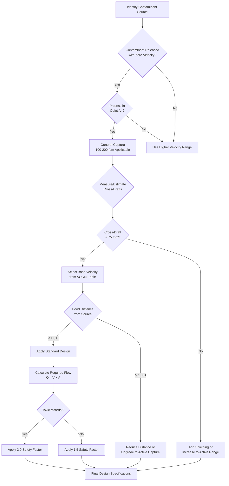

## Overview of General Capture Velocity

General capture velocity in the range of 100-200 fpm represents the lowest tier of industrial local exhaust ventilation systems, designed for applications where contaminants are released with minimal energy into relatively calm air. This velocity range addresses situations where pollutants disperse gradually and uniformly, requiring only gentle air movement to achieve effective capture.

The fundamental principle governing general capture relies on creating a consistent airflow pattern that intercepts and conveys contaminants before they enter the worker's breathing zone or disperse into the general workspace environment.

## Applications Requiring 100-200 fpm Capture

Low-velocity capture systems serve specific industrial processes where contaminant generation occurs with minimal velocity or turbulence.

### Evaporation and Diffusion Processes

Degreasing operations using low-volatility solvents produce vapors that rise slowly through natural convection. Cold tank degreasing, where parts are immersed in solvent at room temperature, generates vapor clouds that drift upward at rates typically below 50 fpm. The capture system must provide sufficient induction to overcome this natural movement while accounting for ambient air currents.

Surface coating operations involving slow-drying materials, such as brushed-on varnishes or oil-based stains, release vapors gradually over extended periods. The contaminant source effectively becomes the entire coated surface area, requiring broad-area capture with gentle but consistent airflow.

### Low-Temperature Processes

Intermittent welding operations where duty cycles allow substantial cooling between welds produce fume plumes with reduced thermal buoyancy. The initial high-velocity discharge from the welding arc diminishes quickly, leaving residual fume that disperses at low velocity as it cools.

Tank filling operations, particularly with volatile liquids at ambient temperature, create vapor releases at the liquid surface that rise slowly through density differences. The capture velocity must account for the vessel opening area and the vapor generation rate determined by liquid temperature and volatility.

## Low-Velocity Contaminant Source Characteristics

Contaminants suitable for 100-200 fpm capture share specific release characteristics.

The pollutant exits the source with essentially zero velocity, relying on thermal convection, molecular diffusion, or very gentle mechanical disturbance for initial movement. Examples include room-temperature evaporation from open containers, settling dust from slowly moving conveyors, and vapor release from quiescent liquid surfaces.

The source generates contaminants at relatively low mass flow rates, measured in grams per minute rather than kilograms per minute. This low generation rate allows capture with modest volumetric flow rates.

Environmental conditions surrounding the source remain relatively stable, with minimal process-induced turbulence, mechanical vibration, or rapid temperature fluctuations that might accelerate contaminant dispersion.

## Hood Design for General Capture

Effective hood design for low-velocity capture emphasizes coverage area and airflow uniformity over concentrated suction velocity.

### Hood Configuration Principles

Canopy hoods positioned above heat-generating sources utilize thermal stratification to assist capture. The hood perimeter should extend beyond the source by at least the vertical distance from source to hood, following the relationship:

$$L_{\text{hood}} = L_{\text{source}} + 2H$$

where $L_{\text{hood}}$ is the hood dimension, $L_{\text{source}}$ is the source dimension, and $H$ is the vertical distance from source to hood opening.

Enclosing hoods that partially surround the source improve capture efficiency by reducing the open face area through which contaminants must be drawn. The capture velocity calculation uses only the open face area:

$$V_{\text{capture}} = \frac{Q}{A_{\text{face}}}$$

where $Q$ is the volumetric flow rate (cfm) and $A_{\text{face}}$ is the hood face area (ft²).

### Flange and Baffling Effects

Adding flanges to hood perimeters significantly improves capture efficiency by eliminating airflow from behind the hood. A flange extending 6-12 inches beyond the hood opening can reduce required airflow by 25-40% compared to unflanged designs.

Side baffles that partially enclose the contaminant source reduce cross-draft interference and concentrate airflow across the source area. The effectiveness follows:

$$\eta_{\text{enclosure}} = \frac{A_{\text{enclosed}}}{A_{\text{total}}}$$

where enclosure efficiency increases with the ratio of enclosed surface area to total surface area surrounding the source.

## Air Current Interference Effects

General capture systems exhibit high sensitivity to ambient air currents because the capture velocities approach typical air movement speeds in industrial environments.

### Cross-Draft Impacts

Building ventilation systems, open doors, and traffic patterns create air currents typically ranging from 50-100 fpm in industrial facilities. When these cross-drafts approach or exceed the capture velocity, contaminant plumes deflect away from the hood opening.

The critical cross-draft velocity that begins to compromise capture effectiveness is approximately:

$$V_{\text{critical}} = 0.5 \times V_{\text{capture}}$$

For a 150 fpm capture velocity, cross-drafts exceeding 75 fpm will noticeably reduce capture efficiency, requiring increased exhaust flow rates or additional shielding.

### Thermal Plume Disruption

Heat sources create upward air currents that can assist or interfere with capture depending on hood placement. A heat source generating 1000 BTU/hr creates an updraft velocity of approximately:

$$V_{\text{thermal}} = K \sqrt[3]{Q_{\text{heat}}}$$

where $K$ is an empirical constant (approximately 50 for typical conditions) and $Q_{\text{heat}}$ is the heat release rate in kilowatts.

## Distance from Source Considerations

Capture velocity diminishes rapidly with distance from the hood face, following inverse square relationships for unflanged hoods and more favorable characteristics for flanged or enclosed designs.

### Velocity Decay Relationships

For a plain unflanged opening, the centerline velocity at a distance from the hood follows:

$$V_x = \frac{V_{\text{face}}}{(10x/D + 1)^2}$$

where $V_x$ is velocity at distance $x$, $V_{\text{face}}$ is face velocity, and $D$ is the hood diameter or equivalent diameter for rectangular openings.

This relationship demonstrates that capturing contaminants at even modest distances requires substantially higher face velocities. A contaminant source located 12 inches from a 12-inch diameter hood requires approximately 4 times the face velocity compared to a source at the hood face.

### Practical Distance Limitations

ACGIH guidelines recommend maximum source-to-hood distances for general capture applications:

- Simple canopy hoods: source should be within 1.0-1.5 hood diameters
- Flanged slot hoods: source within 1.0 slot width
- Exterior hoods: source within 0.5 hood diameters

Exceeding these distances transitions the application into active capture territory, requiring velocities of 200-500 fpm or higher.

## ACGIH Recommendations for General Capture

The American Conference of Governmental Industrial Hygienists provides specific guidance for low-velocity capture applications in their Industrial Ventilation Manual.

### Velocity Selection Criteria

ACGIH defines general capture conditions as:

"Release of contaminant at essentially zero velocity into relatively quiet air, requiring capture and control within the zone of influence without appreciable cross-currents."

Recommended velocities within this category:

| Application Type | Recommended Capture Velocity |
|-----------------|------------------------------|
| Evaporation from tanks, degreasing | 100-150 fpm |
| Intermittent low-speed processes | 100-150 fpm |
| Room-temperature barrel filling | 100-150 fpm |
| Conveyor loading at low speeds | 125-175 fpm |
| Laboratory chemical handling | 150-200 fpm |
| Slow-speed booths | 150-200 fpm |

### Design Safety Factors

General capture designs should incorporate safety factors accounting for:

1. Anticipated cross-drafts: multiply base velocity by 1.5-2.0
2. Irregular source geometry: increase velocity by 25-50%
3. Toxic materials: use upper range values regardless of process conditions
4. Aged or poorly maintained ductwork: factor for 25% reduction in delivered flow

The final design capture velocity incorporates these factors:

$$V_{\text{design}} = V_{\text{base}} \times SF_{\text{draft}} \times SF_{\text{geometry}} \times SF_{\text{toxicity}}$$

## Applications and Recommended Velocities

The following table provides specific guidance for common industrial applications requiring general capture velocities.

| Process | Contaminant Type | Recommended Velocity (fpm) | Hood Type |
|---------|-----------------|---------------------------|-----------|
| Cold tank degreasing | Solvent vapors | 100-125 | Canopy with side baffles |
| Barrel filling (ambient) | Organic vapors | 100-150 | Exterior slot hood |
| Paint brush application | VOC emissions | 125-175 | Booth with rear exhaust |
| Parts tumbling (low speed) | Dust | 150-200 | Canopy hood |
| Chemical transfer | Various vapors | 150-200 | Enclosing hood |
| Laboratory fume bench | Mixed chemicals | 175-200 | Enclosed bench |
| Slow conveyor transfer | Dust, fibers | 125-175 | Canopy with flanges |
| Cooling tanks | Steam, vapors | 100-125 | Wide canopy |

## System Design Flowchart

## Performance Verification

Installed systems require field verification to ensure design capture velocities are achieved at critical control points.

Traverse the hood face using a velometer or thermal anemometer at multiple points across the opening. Average readings should meet or exceed design specifications, with no individual point reading below 80% of the design value.

Measure capture effectiveness using tracer smoke or vapor releases at the contaminant source location. Effective capture shows immediate smoke movement toward the hood with no visible escape into the general workspace.

Document air current patterns near the installation using smoke tubes to identify unexpected cross-drafts that may compromise capture performance.

Monitor system static pressure at the hood and compare to design calculations. Significant deviations indicate duct blockage, fan degradation, or leakage requiring correction.

## Maintenance Considerations

Low-velocity systems require particular attention to factors that reduce airflow because the small velocity margins provide limited tolerance for degradation.

Filter loading in systems handling particulate contaminants can reduce flow rates by 30-50% before replacement occurs if monitoring is inadequate. Establish maximum allowable static pressure increases and replace filters when thresholds are reached.

Duct contamination from vapor condensation or dust accumulation reduces effective diameter and increases resistance. Annual duct inspection and cleaning maintains design performance.

Fan belt slippage or motor bearing wear reduces delivered flow without obvious symptoms. Quarterly measurement of system flow rates identifies developing problems before they compromise worker protection.

Hood damage from material handling equipment or corrosion can create openings that admit ambient air, reducing face velocity. Monthly visual inspections identify damage requiring repair.
