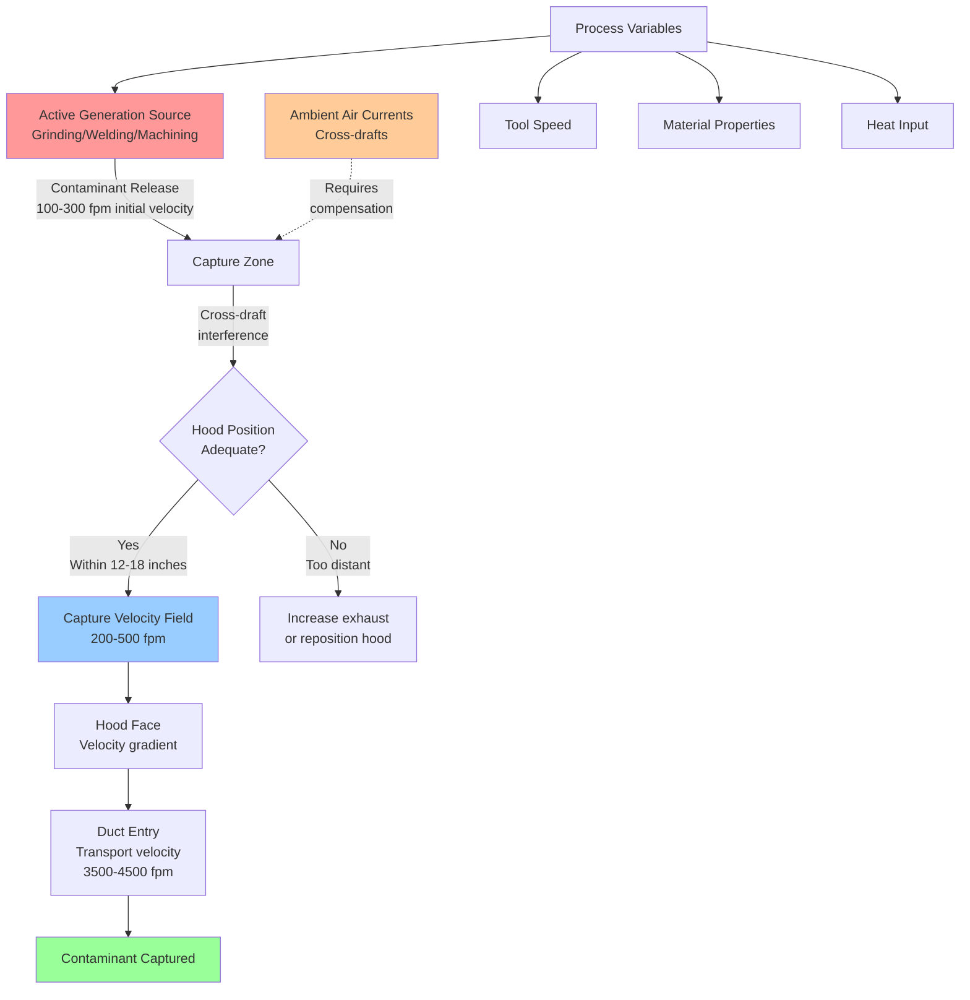

## Active Contaminant Generation Sources

Active generation sources release contaminants with appreciable initial velocity due to process energy input. These operations require higher capture velocities (200-500 fpm) compared to passive sources because contaminants are projected into the workspace with momentum.

### Characteristic Process Features

Active generation involves mechanical or thermal energy that imparts velocity to contaminants:

- **Mechanical processes**: Grinding, buffing, machining operations where rotating tools propel particles
- **Thermal processes**: Welding, cutting, soldering where heat creates buoyant plumes and sparks
- **Impact operations**: Chipping, abrasive blasting where force disperses material
- **High-speed material removal**: Sawing, routing where cutting action creates airborne debris

The initial velocity of released contaminants ranges from 100-500 fpm depending on process intensity, requiring exhaust systems capable of overcoming this momentum and any ambient air currents.

## Grinding Applications

Grinding operations generate high-velocity particulate streams requiring robust capture velocility design.

### Surface Grinding

Surface grinders produce continuous particle streams projected perpendicular to the work surface. Capture velocity requirements:

$$V_c = V_p + V_d + V_s$$

Where:
- $V_c$ = Required capture velocity (fpm)
- $V_p$ = Particle projection velocity (100-300 fpm)
- $V_d$ = Cross-draft velocity compensation (fpm)
- $V_s$ = Safety factor velocity (50-100 fpm)

Typical design values range from 300-500 fpm at the grinding wheel periphery.

### Bench and Pedestal Grinding

Bench grinders require downdraft or side-draft hoods positioned within 12 inches of the wheel. The capture velocity must overcome:

- Wheel peripheral velocity effects (3,000-6,000 sfpm wheel speed creates local turbulence)
- Particle trajectory from grinding action
- Operator body blockage effects on airflow patterns

Design capture velocity: 350-500 fpm at the wheel face.

## Welding and Thermal Cutting

Welding processes generate both particulate fume and thermal plumes requiring specialized exhaust approaches.

### Welding Fume Characteristics

Welding produces ultra-fine particles (0.01-1.0 μm) carried upward by thermal convection at velocities of 100-200 fpm. The rising plume spreads as it moves away from the arc:

$$D = D_0 + 2 \alpha z$$

Where:
- $D$ = Plume diameter at height $z$ (inches)
- $D_0$ = Initial plume diameter at source (inches)
- $\alpha$ = Entrainment angle (typically 0.15-0.20)
- $z$ = Height above welding arc (inches)

### Hood Positioning Requirements

Effective welding exhaust capture requires:

1. **Distance from arc**: Maximum 12-18 inches from fume source
2. **Lateral positioning**: Hood centerline aligned with predominant fume direction
3. **Capture zone**: Hood face must intercept expanding plume before room air dilutes concentration
4. **Avoid air stream disruption**: Position to not interfere with shielding gas (GMAW, GTAW processes)

Recommended capture velocity: 200-400 fpm measured at the fume source location.

### Thermal Cutting Operations

Plasma and oxyfuel cutting generate more vigorous plumes than welding due to higher heat input. Downdraft tables with 250-400 fpm face velocity provide optimal capture for horizontal cutting operations.

## Machining Operations

Metal cutting operations produce chips and mist requiring containment near the generation point.

### Mist Generation Processes

Turning, milling, and drilling with cutting fluids atomize coolant into respirable mist (1-10 μm droplets). Capture requirements:

| Machining Process | Typical Capture Velocity | Hood Distance |
|-------------------|-------------------------|---------------|
| Manual turning | 200-300 fpm | 12-18 inches |
| CNC milling | 250-350 fpm | 8-12 inches |
| High-speed drilling | 300-400 fpm | 6-12 inches |
| Grinding (wet) | 350-500 fpm | 6-10 inches |

### Chip and Particulate Control

Dry machining produces chips with substantial mass and velocity. Hood design must account for:

- Chip trajectory from cutting tool (varies with cutting speed and geometry)
- Capture zone positioned in chip flight path
- Adequate transport velocity in ductwork (3,500-4,500 fpm for metal chips)

## Cross-Draft Compensation

Cross-drafts from building ventilation, open doors, or process equipment airflows interfere with capture by deflecting contaminant trajectories away from the hood face.

### Compensation Methodology

The required increase in capture velocity to overcome cross-drafts:

$$V_{required} = V_{base} + k \cdot V_{draft}$$

Where:
- $V_{required}$ = Adjusted capture velocity (fpm)
- $V_{base}$ = Baseline capture velocity for process (fpm)
- $V_{draft}$ = Measured cross-draft velocity (fpm)
- $k$ = Compensation factor (1.5-2.5 depending on hood geometry)

### Cross-Draft Mitigation Strategies

1. **Physical barriers**: Install partial enclosures or baffles to block air currents
2. **Increased exhaust volume**: Raise hood flow rate to increase capture zone extent
3. **Push-pull systems**: Add supply air jets to counter cross-drafts
4. **Process relocation**: Move operations away from doors, air curtains, or supply diffusers

## Higher Velocity Requirements Justification

Active generation sources demand 200-500 fpm capture velocities based on fundamental physics:

### Momentum Considerations

Contaminants released with initial velocity possess kinetic energy that must be overcome:

$$E_k = \frac{1}{2} m v_p^2$$

The exhaust system must provide sufficient momentum flux to redirect particles into the hood against their initial trajectory. Higher capture velocities create stronger velocity gradients near the hood face, extending the effective capture zone.

### Turbulence Effects

Active processes generate local turbulence that disperses contaminants in random directions. Statistical analysis shows that capture velocity must exceed the root-mean-square turbulent velocity by a factor of 2-3 to achieve reliable capture:

$$V_c \geq (2-3) \cdot v_{rms}$$

For grinding operations where $v_{rms}$ = 80-150 fpm, this yields capture velocities of 300-450 fpm.

### Dilution Prevention

Higher velocities reduce the time contaminants spend in the workspace before capture, minimizing exposure:

$$t = \frac{x}{V_c}$$

Where $x$ is the distance from source to hood face. Doubling capture velocity halves residence time in the breathing zone.

## ACGIH Industrial Ventilation Manual Guidance

The American Conference of Governmental Industrial Hygienists (ACGIH) Industrial Ventilation Manual provides design recommendations for active generation sources.

### Hood Design Philosophy

ACGIH categorizes contaminant release conditions:

- **Released with no appreciable velocity**: 50-100 fpm (passive sources)
- **Released at low velocity**: 100-200 fpm (evaporation, low-energy processes)
- **Active generation into rapid air motion**: 200-500 fpm (grinding, welding, machining)
- **Released at high initial velocity**: 500-2,000 fpm (abrasive blasting, high-speed grinding)

### Design Procedure Recommendations

1. **Identify release characteristics**: Determine contaminant velocity and direction from process observation
2. **Select hood type**: Choose enclosing, exterior, or receiving hood based on process access requirements
3. **Position hood optimally**: Locate within recommended distance and orientation
4. **Calculate required flow rate**: Use hood entry loss factors and desired capture velocity
5. **Account for real conditions**: Add safety factors for cross-drafts, variable operations, and uncertainty

### Specific Design Values

ACGIH provides hood-specific design plates with dimensional requirements and volumetric flow rates. For active generation:

| Application | ACGIH Recommended Capture Velocity | Design Plate Reference |
|-------------|-----------------------------------|------------------------|
| Bench grinding | 350-500 fpm | VS-15-10 through VS-15-30 |
| Welding bench | 200-300 fpm | VS-50-10 through VS-50-50 |
| Machining with coolant | 250-400 fpm | VS-40-05 through VS-40-20 |
| Portable grinding | 300-500 fpm | VS-15-50, VS-15-60 |

## Application-Specific Design Tables

### Active Source Velocity Requirements

| Contaminant Source | Release Velocity | Recommended Capture Velocity | Maximum Hood Distance |
|--------------------|------------------|------------------------------|----------------------|
| Surface grinding (dry) | 200-400 fpm | 400-500 fpm | 10-12 inches |
| Bench grinding (wheel < 16") | 150-300 fpm | 350-450 fpm | 8-12 inches |
| MIG/MAG welding | 100-200 fpm (thermal) | 250-350 fpm | 12-18 inches |
| TIG welding | 80-150 fpm (thermal) | 200-300 fpm | 10-16 inches |
| Plasma cutting | 200-350 fpm (thermal + pressure) | 300-450 fpm | 6-12 inches (downdraft) |
| CNC machining (wet) | 100-250 fpm | 250-350 fpm | 8-14 inches |
| Manual machining (dry) | 80-200 fpm | 200-300 fpm | 12-18 inches |
| Portable grinding | 200-450 fpm | 400-600 fpm | 6-10 inches |
| Buffing/polishing | 150-300 fpm | 300-450 fpm | 10-14 inches |

### Hood Performance Factors

| Factor | Impact on Required Capture Velocity | Correction Multiplier |
|--------|-------------------------------------|----------------------|
| Cross-draft < 50 fpm | Minimal | 1.0 |
| Cross-draft 50-100 fpm | Moderate | 1.2-1.5 |
| Cross-draft > 100 fpm | Severe | 1.5-2.5 |
| Intermittent operation | Reduced effectiveness | 1.1-1.3 |
| Variable source position | Larger capture zone needed | 1.2-1.5 |
| High toxicity material | Conservative design | 1.3-2.0 |
| Multiple simultaneous sources | Interference effects | 1.2-1.8 |

## Design Implementation

Successful active generation exhaust systems require integrated consideration of hood geometry, airflow patterns, and process constraints. Field verification through smoke testing and velocity measurements confirms design performance and identifies modifications needed for optimal contaminant capture.

Regular maintenance of hoods, ductwork, and fans maintains design capture velocities. Periodic velocity measurements at the source location ensure continued protection as processes change or equipment ages.