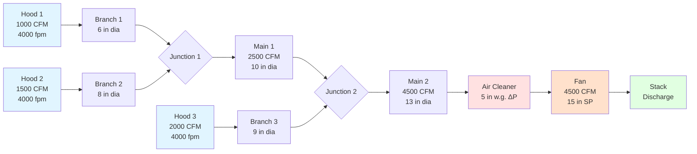

## Physical Principles of Exhaust Duct Design

Exhaust duct design for industrial ventilation systems requires balancing three fundamental requirements: maintaining sufficient transport velocity to prevent particle settling, minimizing energy consumption through friction loss reduction, and ensuring structural integrity under operating conditions. Unlike comfort HVAC ductwork where velocities rarely exceed 2000 fpm, industrial exhaust ducts must maintain velocities between 2000-4500 fpm depending on particulate characteristics, creating substantially higher pressure losses and requiring careful engineering analysis.

The fundamental challenge stems from particulate behavior in horizontal and inclined ducts. When duct velocity falls below the minimum transport velocity, particles settle by gravitational force, creating accumulations that reduce effective duct area, increase local velocities, cause additional pressure losses, and create fire or explosion hazards depending on material properties.

## Minimum Transport Velocity Requirements

Transport velocity represents the minimum duct velocity required to maintain particles in suspension and prevent settling. This velocity depends on particle size, density, shape, and concentration. ACGIH provides empirically-derived minimum transport velocities based on contaminant characteristics:

| Contaminant Type | Particle Characteristics | Minimum Velocity |
|------------------|--------------------------|------------------|
| Gases and vapors | No particulate matter | 1000-2000 fpm |
| Fumes | < 1 micron, low density | 2000-2500 fpm |
| Very fine dust | 1-10 microns, light | 2500-3000 fpm |
| Dry dusts and powders | 10-100 microns, moderate density | 3000-3500 fpm |
| Average industrial dust | Mixed size distribution | 3500-4000 fpm |
| Heavy dust and chips | > 100 microns, high density, metal | 4000-4500 fpm |

These values apply to horizontal and inclined ducts. Vertical ducts carrying particles upward require velocities exceeding particle terminal settling velocity plus a safety factor, typically 1.25-1.5 times the values above.

### Terminal Settling Velocity

For spherical particles in laminar flow (Re < 1), terminal settling velocity follows Stokes' Law:

$$V_t = \frac{g d_p^2 (\rho_p - \rho_f)}{18 \mu}$$

Where:
- $V_t$ = terminal settling velocity (ft/s)
- $g$ = gravitational acceleration (32.2 ft/s²)
- $d_p$ = particle diameter (ft)
- $\rho_p$ = particle density (lb/ft³)
- $\rho_f$ = fluid (air) density (lb/ft³)
- $\mu$ = dynamic viscosity of air (lb/(ft·s))

For larger particles in turbulent flow, empirical correlations or iterative solutions of the drag equation become necessary.

## Duct Sizing Calculations

Duct diameter (or equivalent diameter for rectangular ducts) is determined from required volumetric flow rate and minimum transport velocity:

$$D = \sqrt{\frac{4Q}{\pi V}}$$

Where:
- $D$ = duct diameter (ft)
- $Q$ = volumetric flow rate (ft³/min or CFM)
- $V$ = duct velocity (ft/min)

Converting to inches (more practical for fabrication):

$$D_{in} = 12 \sqrt{\frac{4Q}{\pi V}} = 13.546 \sqrt{\frac{Q}{V}}$$

For rectangular ducts, equivalent diameter for friction loss calculations:

$$D_{eq} = 1.30 \frac{(ab)^{0.625}}{(a+b)^{0.25}}$$

Where $a$ and $b$ are duct dimensions in inches.

### Velocity Pressure and Static Pressure

Velocity pressure represents the kinetic energy of moving air:

$$VP = \frac{\rho V^2}{2g_c \times 1097}$$

In practical units at standard air density (0.075 lb/ft³):

$$VP = \left(\frac{V}{4005}\right)^2 \text{ inches w.g.}$$

More commonly:

$$VP = 0.0001247 V^2 \text{ inches w.g.}$$

Where $V$ is in feet per minute.

Total pressure equals static pressure plus velocity pressure:

$$TP = SP + VP$$

## Friction Loss in Straight Ducts

Friction loss in straight ductwork follows the Darcy-Weisbach equation:

$$\Delta P_f = f \frac{L}{D} \frac{\rho V^2}{2g_c}$$

Where:
- $\Delta P_f$ = friction pressure loss (lb/ft²)
- $f$ = friction factor (dimensionless)
- $L$ = duct length (ft)
- $D$ = duct diameter (ft)
- $\rho$ = air density (lb/ft³)
- $V$ = air velocity (ft/s)
- $g_c$ = gravitational constant (32.2 lb·ft/(lb_f·s²))

Converting to practical units (inches w.g. per 100 ft of duct):

$$\Delta P_{100} = \frac{f V^2}{12 \times 4005^2} \frac{100}{D} \times 12$$

For round ducts, simplified design charts or the following approximation for turbulent flow in metal ducts:

$$\Delta P_{100} = 0.027 \frac{Q^{1.9}}{D^{5.02}}$$

Where $Q$ is in CFM, $D$ is in inches, and $\Delta P_{100}$ is in inches w.g. per 100 ft.

### Friction Factor Determination

For turbulent flow in commercial steel ducts (absolute roughness ε ≈ 0.0005 ft), friction factor depends on Reynolds number:

$$Re = \frac{\rho V D}{\mu} = \frac{V D}{\nu}$$

For fully turbulent flow (Re > 4000), the Colebrook equation applies:

$$\frac{1}{\sqrt{f}} = -2 \log_{10}\left(\frac{\varepsilon/D}{3.7} + \frac{2.51}{Re\sqrt{f}}\right)$$

This requires iterative solution. For industrial exhaust systems, roughness increases over time due to particulate adhesion, requiring conservative friction factor selection or safety margins.

## Fitting and Component Losses

Losses through fittings, transitions, and branches are expressed as multiples of velocity pressure:

$$\Delta P_{fitting} = C \times VP$$

Where $C$ is the loss coefficient specific to the fitting geometry.

### Common Fitting Loss Coefficients

| Fitting Type | Configuration | Loss Coefficient C |
|--------------|--------------|-------------------|
| 90° elbow | r/D = 1.5, round | 0.27 |
| 90° elbow | r/D = 1.0, round | 0.48 |
| 90° elbow | r/D = 0.75, round | 0.75 |
| 45° elbow | r/D = 1.5, round | 0.17 |
| Entry, bellmouth | r/D = 0.2 | 0.05 |
| Entry, sharp edge | No radius | 0.50 |
| Exit | Discharge to atmosphere | 1.00 |
| Gradual contraction | 30° included angle | 0.02 |
| Abrupt contraction | 90° shoulder | 0.50 |
| Gradual expansion | 15° included angle | 0.15 |
| Abrupt expansion | 90° shoulder | 1.00 |

Branch entries require special analysis using blast gate settings or balancing dampers to achieve design flow distribution.

## Duct Material Selection

Material selection depends on contaminant characteristics, temperature, abrasion resistance requirements, and cost.

| Material | Gauge/Thickness | Applications | Advantages | Limitations |
|----------|----------------|--------------|------------|-------------|
| Galvanized steel | 22-16 ga | General dust, non-corrosive | Low cost, readily available | Corrosion with moisture, chemicals |
| Black steel | 16-10 ga | Welded systems, high abrasion | High strength, weldable | Rust without coating |
| Stainless steel 304 | 20-14 ga | Corrosive environments, food | Corrosion resistant | Higher cost |
| Stainless steel 316 | 18-14 ga | Aggressive chemicals | Superior corrosion resistance | Highest cost |
| PVC/CPVC | Schedule 40/80 | Acid fumes, wet scrubber exhaust | Corrosion immune, smooth interior | Temperature limited (140-200°F) |
| Fiberglass (FRP) | 1/8-1/4 in | Corrosive gases, coastal | Lightweight, corrosion resistant | Lower strength, UV degradation |
| Aluminum | 18-14 ga | Clean applications | Lightweight, corrosion resistant | Reactive with alkalis, not for sparking hazards |

### Abrasion Considerations

For abrasive particulates (metal grinding, foundry dust, woodworking), duct wear is proportional to:

$$Wear \propto V^3 \times C \times \rho_p \times H$$

Where:
- $V$ = velocity
- $C$ = particle concentration
- $\rho_p$ = particle density
- $H$ = hardness

Abrasion-resistant materials include:
- Hardfaced steel (wear plates at high-impact areas)
- Abrasion-resistant rubber lining
- Ultra-high molecular weight polyethylene (UHMW-PE) liner
- Increased material thickness at elbows and branches

## Duct Construction Methods

**Spiral Seam (Helical Lockseam)**: Factory-formed continuous spiral seam, most common for round ducts 3-60 inches diameter. Airtight with mastic sealant, suitable for moderate pressures.

**Longitudinal Seam**: Straight seam, used for custom fabrication, transitions, and large diameters. Requires reinforcement for structural stability.

**Welded Construction**: Required for abrasive materials, toxic substances, or high temperatures. Fully airtight without gaskets. Most expensive but most durable.

**Flanged Connections**: Bolted flanges with gaskets at joints. Allows disassembly for inspection and cleaning. Required for plastic and fiberglass systems.

## System Configuration Design

### Balancing Principles

Each branch must achieve design flow rate. Since flow distributes according to path resistance, balancing requires:

1. Calculate total pressure loss from each hood to fan inlet
2. Paths with lower resistance will draw excess flow
3. Add blast gates or balancing dampers to equalize pressure losses
4. Velocity measurement at each branch confirms proper distribution

The balanced condition:

$$SP_{hood1} + \Delta P_{path1} = SP_{hood2} + \Delta P_{path2} = ... = SP_{fan}$$

## Vertical vs. Horizontal Duct Orientation

Vertical ducts carrying particles upward require higher velocities. The effective gravitational component:

$$V_{vertical} = V_{horizontal} \times \sqrt{1 + \frac{V_t}{V_{horizontal}}}$$

For downward vertical flow, lower velocities may suffice, but saltation (particle accumulation followed by slug flow) creates operational problems. Design vertical down-flow ducts for the same velocity as horizontal sections.

## Cleanout Access and Inspection Ports

NFPA 652 (Combustible Dust) and good practice require:

- Cleanout doors every 12-20 feet in horizontal runs
- Cleanout at base of vertical risers
- Access doors upstream and downstream of air cleaners
- Transparent inspection sections for visual monitoring
- Properly gasketed and latched to maintain system integrity

## Thermal Expansion Considerations

For elevated temperature exhaust (>150°F), thermal expansion causes:

$$\Delta L = \alpha L \Delta T$$

Where:
- $\Delta L$ = change in length
- $\alpha$ = coefficient of thermal expansion (6.5×10⁻⁶ in/in/°F for steel)
- $L$ = duct length
- $\Delta T$ = temperature change

Provide expansion joints every 40-100 feet depending on temperature to prevent buckling or stress cracking.

## Pressure Loss Summary Example

For a 50-foot section of 12-inch diameter galvanized duct carrying 4000 CFM at 4000 fpm with two 90° elbows (r/D = 1.5):

**Velocity pressure**:
$$VP = 0.0001247 \times 4000^2 = 1.995 \text{ in w.g.}$$

**Friction loss** (using approximation):
$$\Delta P_f = 0.027 \times \frac{4000^{1.9}}{12^{5.02}} \times \frac{50}{100} = 0.86 \text{ in w.g.}$$

**Elbow losses**:
$$\Delta P_{elbows} = 2 \times 0.27 \times 1.995 = 1.08 \text{ in w.g.}$$

**Total section loss**:
$$\Delta P_{total} = 0.86 + 1.08 = 1.94 \text{ in w.g.}$$

## Design Checklist

Proper exhaust duct design requires:

- Minimum transport velocity maintained throughout system
- Duct diameter increases at junctions to limit velocity increase to 20% maximum
- Material selection appropriate for temperature and chemical exposure
- Adequate structural support every 10-12 feet for metal ducts
- Sloped horizontal sections 1-2% toward cleanouts where practical
- Smooth transitions with maximum 30° included angle expansions, 60° contractions
- Branch entries at 30-45° to main duct flow direction
- Welded or gasketed joints for particulate systems to prevent leakage
- Proper grounding and bonding for combustible dust or static-sensitive materials

## Conclusion

Exhaust duct design for industrial ventilation represents a specialized engineering discipline requiring application of fluid mechanics principles, empirical data from ACGIH standards, and practical fabrication knowledge. Proper sizing maintains minimum transport velocities to prevent settling while minimizing energy consumption through careful attention to friction losses and fitting selections. Material selection must account for chemical compatibility, temperature resistance, and abrasion characteristics specific to each application. The resulting system provides reliable contaminant transport when designed with appropriate safety factors and maintained according to manufacturer and regulatory requirements.
