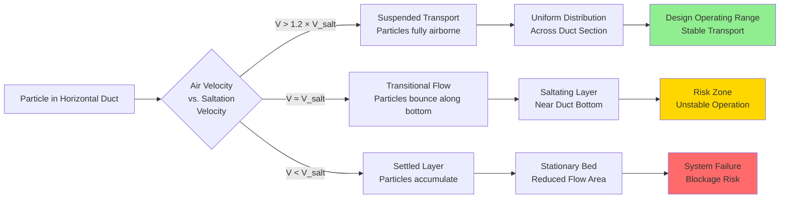

# Material Transport in Exhaust Ducts

Material transport in industrial exhaust duct systems involves the simultaneous movement of particulate matter and air through enclosed conduits. The fundamental challenge centers on maintaining sufficient air velocity to prevent particle settling while minimizing energy consumption and duct wear. Transport physics depends on particle properties (size, density, shape), air properties (velocity, density, viscosity), and duct geometry (diameter, orientation, roughness). Proper design requires understanding three critical velocities: terminal velocity (particle free-fall speed), pickup velocity (entrainment from surfaces), and saltation velocity (minimum horizontal transport without settling). ACGIH Industrial Ventilation Manual provides empirical transport velocities ranging from 3000-5500 fpm based on material characteristics, representing industry-validated safety factors above calculated saltation velocities.

## Particle Transport Physics

### Forces Acting on Particles

Particles suspended in moving air streams experience multiple competing forces that determine transport behavior.

**Drag force (opposing particle motion relative to air):**

$$F_D = \frac{1}{2} \times C_D \times \rho_a \times A_p \times (V_{air} - V_{particle})^2$$

Where:
- $F_D$ = Drag force (lbf)
- $C_D$ = Drag coefficient (0.44 for spheres at Re > 1000, higher for irregular particles)
- $\rho_a$ = Air density (0.075 lb/ft³ at standard conditions)
- $A_p$ = Particle projected area perpendicular to flow (ft²)
- $V_{air}$ = Air velocity (ft/s)
- $V_{particle}$ = Particle velocity (ft/s)

**Gravitational force (causing settling):**

$$F_G = m_p \times g = \frac{\pi \times d_p^3}{6} \times \rho_p \times g$$

Where:
- $m_p$ = Particle mass (lb)
- $g$ = Gravitational acceleration (32.2 ft/s²)
- $d_p$ = Particle diameter (ft)
- $\rho_p$ = Particle material density (lb/ft³)

**Buoyant force (opposing gravity):**

$$F_B = \frac{\pi \times d_p^3}{6} \times \rho_a \times g$$

Net gravitational force equals $F_G - F_B$, though buoyancy is negligible for typical industrial particles since $\rho_p \gg \rho_a$.

### Terminal Velocity

Terminal velocity represents the equilibrium falling speed where drag force equals gravitational force. This defines the minimum vertical duct velocity required to prevent particle settling.

**Terminal velocity equation (derived from force balance):**

$$V_t = \sqrt{\frac{4 \times g \times d_p \times (\rho_p - \rho_a)}{3 \times C_D \times \rho_a}}$$

Where:
- $V_t$ = Terminal velocity (ft/s)
- All other terms as previously defined

For Reynolds numbers Re > 1000 (typical for particles > 100 μm in air), drag coefficient $C_D \approx 0.44$. For smaller particles in laminar flow (Re < 1), Stokes' law applies with $C_D = 24/Re$.

**Terminal velocities for common industrial materials:**

| Material | Particle Density (lb/ft³) | Particle Size (μm) | Terminal Velocity (fpm) | Vertical Transport Velocity (fpm) |
|----------|---------------------------|-------------------|-------------------------|-----------------------------------|
| Flour dust | 45 | 50 | 180 | 350-400 |
| Cotton lint | 25 | 100 | 140 | 300-350 |
| Wood dust | 40 | 100 | 320 | 500-600 |
| Grain dust | 48 | 75 | 240 | 450-550 |
| Cement dust | 94 | 50 | 280 | 550-650 |
| Plastic powder | 87 | 80 | 360 | 600-700 |
| Sand | 165 | 200 | 1400 | 2200-2500 |
| Metal chips (aluminum) | 168 | 500 | 2100 | 3200-3600 |
| Metal chips (steel) | 490 | 1000 | 3800 | 5500-6000 |
| Mineral ore | 250 | 300 | 2400 | 3600-4000 |

Vertical transport velocity includes safety factor of 1.5-2.0× terminal velocity to ensure reliable transport under varying conditions.

### Horizontal Transport and Saltation

Horizontal duct transport presents greater complexity than vertical transport because particles interact with the duct bottom. Below a critical velocity termed saltation velocity, particles drop from suspension and accumulate on the duct floor.

**Saltation velocity (Rizk empirical correlation):**

$$V_{salt} = FL \times \sqrt{2 \times g \times D} \times \left(\frac{\rho_p}{\rho_a}\right)^{0.35}$$

Where:
- $V_{salt}$ = Saltation velocity (ft/s)
- $FL$ = Froude-loading factor (1.0-3.5, dimensionless)
- $g$ = 32.2 ft/s²
- $D$ = Duct diameter (ft)
- $\rho_p$ = Particle material density (lb/ft³)
- $\rho_a$ = Air density (0.075 lb/ft³)

**Physical interpretation:** Saltation occurs when particle inertia (proportional to $\rho_p$) overcomes turbulent suspension forces (proportional to air velocity and density). The Froude number ($Fr = V^2/(g \times D)$) represents the ratio of inertial to gravitational forces. The empirical 0.35 exponent on density ratio reflects the complex interaction between particle-wall collisions, turbulent lift, and gravitational settling.

**Froude-loading factors by material category:**

| Material Category | FL Factor | Physical Characteristics | Examples |
|-------------------|-----------|-------------------------|----------|
| Very light, cohesive | 1.0-1.5 | Low density, high surface area, inter-particle forces | Flour, starch, toner powder, carbon black |
| Light, free-flowing | 1.5-2.0 | Low density, spherical or smooth particles | Grain kernels, plastic pellets, sugar, salt |
| Medium density, irregular | 2.0-2.5 | Moderate density, angular shapes | Sand, cement, limestone, fly ash, wood chips |
| Heavy, abrasive | 2.5-3.5 | High density, hard particles | Metal turnings, foundry sand, mineral ore, glass cullet |

Higher FL factors account for increased particle inertia and reduced suspension in turbulent eddies.

## ACGIH Transport Velocity Requirements

The American Conference of Governmental Industrial Hygienists (ACGIH) Industrial Ventilation Manual Table 5-2 provides minimum transport velocities validated through decades of industrial application. These velocities incorporate safety margins above calculated saltation velocities to ensure reliable operation under varying material and operating conditions.

### Standard Velocity Categories

| Material Description | Minimum Velocity (fpm) | Physical Basis | Example Applications |
|---------------------|------------------------|----------------|----------------------|
| Vapors, gases, smoke | 1000-2000 | No gravitational settling concern | Welding fume capture, thermal processes, vapor evacuation |
| Fumes (< 1 μm) | 2000-2500 | Very low terminal velocity | Metal fume, combustion products, chemical fumes |
| Very fine light dust | 3000-3500 | Terminal velocity 100-300 fpm | Fabric lint, paper dust, cotton dust, cosmetic powders |
| Dry dusts and powders | 3500-4000 | Terminal velocity 200-500 fpm | Flour mills, wood sanding, grain handling, plastic powder |
| Average industrial dust | 4000-4500 | Terminal velocity 400-800 fpm | Grinding dust, general machining, buffing operations |
| Heavy dust | 4500-5000 | Terminal velocity 800-1500 fpm | Metal turnings, heavy grinding, silica sand, foundry dust |
| Heavy or moist dust | 5000-5500 | Terminal velocity > 1500 fpm, cohesive | Lead dust, wet cement, foundry shakeout, metal shot blast |

**Design practice:** Select minimum velocity from ACGIH table based on material characteristics. Calculate saltation velocity using Rizk equation. Design velocity equals the higher of these two values plus 10-15% safety margin.

### Material-Specific Transport Velocities

| Specific Material | Particle Density (lb/ft³) | Typical Size (μm) | ACGIH Minimum (fpm) | Design Velocity (fpm) |
|-------------------|---------------------------|-------------------|---------------------|----------------------|
| Aluminum dust | 168 | 50-200 | 4500 | 5000 |
| Asbestos fibers | 94 | 5-50 (length 100-500) | 4000 | 4500 |
| Cement dust | 94 | 10-100 | 3500 | 4000 |
| Coal dust | 75 | 20-200 | 4000 | 4500 |
| Cotton lint | 25 | Fibrous (500-2000) | 3000 | 3500 |
| Flour | 45 | 20-80 | 3500 | 4000 |
| Granite dust | 166 | 50-500 | 4500 | 5000 |
| Iron ore dust | 250 | 100-1000 | 5000 | 5500 |
| Lead dust | 710 | 50-500 | 5500 | 6000 |
| Limestone dust | 168 | 50-300 | 4000 | 4500 |
| Magnesium dust | 109 | 50-200 | 4500 | 5000 |
| Marble dust | 169 | 50-400 | 4500 | 5000 |
| Mica dust | 180 | Flaky (50-500) | 4000 | 4500 |
| Plastic dust (PVC) | 87 | 50-300 | 3500 | 4000 |
| Quartz dust (crystalline silica) | 165 | 20-500 | 4500 | 5000 |
| Rubber dust | 75 | 100-500 | 4000 | 4500 |
| Soap powder | 50 | 50-200 | 3500 | 4000 |
| Steel grinding dust | 490 | 50-500 | 5000 | 5500 |
| Tobacco dust | 44 | 50-300 | 3500 | 4000 |
| Wood sawdust | 22-40 | 100-1000 | 3500 | 4000 |
| Zinc oxide fume | 345 | 0.1-1 | 2500 | 3000 |

## Particle Size Effects

### Size Distribution Impact

Industrial dust rarely consists of uniform particle size. Size distribution significantly affects transport behavior because small and large particles exhibit different aerodynamic characteristics.

**Critical particle sizes:**

| Size Range | Classification | Terminal Velocity | Transport Behavior | Collection Method |
|------------|----------------|-------------------|-------------------|-------------------|
| < 1 μm | Fumes | 1-10 fpm | Follows air streamlines perfectly | Fabric filter, electrostatic precipitator |
| 1-10 μm | Respirable dust | 10-100 fpm | High suspension, long residence time | Fabric filter, high-efficiency cyclone |
| 10-100 μm | Inhalable dust | 100-1000 fpm | Moderate suspension, saltates easily | Cyclone, fabric filter |
| 100-1000 μm | Coarse particles | 1000-5000 fpm | Low suspension, high inertia | Gravity settling, cyclone |
| > 1000 μm | Large particles | > 5000 fpm | Requires very high velocity | Gravity chute, mechanical conveyor |

**Design approach for mixed size distributions:**

1. Identify largest particle size requiring transport (d₉₀ or d₉₅)
2. Calculate saltation velocity based on d₉₀ and bulk material density
3. Verify that resulting velocity transports smaller particles (typically satisfied)
4. Consider cyclone pre-separator to remove large particles if d₉₀ > 1000 μm

### Particle Shape Factor

Non-spherical particles exhibit higher drag coefficients and different settling behavior than spheres.

**Shape factor correction:**

$$C_D = C_{D,sphere} \times \psi$$

Where:
- $\psi$ = Sphericity (ratio of surface area of sphere with same volume to actual particle surface area)
- $\psi$ = 1.0 for spheres
- $\psi$ = 0.6-0.8 for angular particles (sand, crushed rock)
- $\psi$ = 0.4-0.6 for flakes (mica, metal foil)
- $\psi$ = 0.3-0.5 for fibers (cotton, asbestos)

Lower sphericity increases drag coefficient, reducing terminal velocity and saltation velocity. Fibrous materials require 15-25% lower transport velocity than spherical particles of equivalent mass.

## Duct Orientation Effects

### Vertical Ducts

Vertical upward flow requires air velocity exceeding particle terminal velocity plus safety margin.

**Minimum vertical velocity:**

$$V_{vertical,min} = 1.5 \times V_t$$

Safety factor of 1.5 accounts for:
- Velocity variations across duct cross-section (parabolic profile)
- Material property variations
- System disturbances (elbow wakes, turbulence)

Vertical duct pressure drop includes both air friction and material elevation:

$$\Delta P_{vertical} = \Delta P_{air} + \Delta P_{elevation}$$

$$\Delta P_{elevation} = \frac{\rho_p \times h}{12} \times \frac{m_{material}}{m_{air}} \text{ (in wg)}$$

Where:
- $h$ = Vertical height (ft)
- Material elevation contributes 0.1-0.5 in wg per 10 ft for typical loading ratios

### Horizontal Ducts

Horizontal transport requires velocity exceeding saltation velocity with adequate safety margin.

**Minimum horizontal velocity:**

$$V_{horizontal,min} = 1.2 \times V_{salt}$$

The 1.2 multiplier provides margin for:
- Duct roughness effects
- Material variations
- Non-uniform particle distribution

Horizontal ducts exhibit asymmetric particle distribution with higher concentration near the bottom, increasing wear on duct floor.

### Inclined Ducts

Inclined ducts between horizontal and vertical require intermediate velocities.

**Velocity correction for incline angle:**

$$V_{inclined} = V_{horizontal} + (V_{vertical} - V_{horizontal}) \times \sin(\theta)$$

Where:
- $\theta$ = Angle from horizontal (degrees)
- For $\theta$ = 0° (horizontal): $V_{inclined} = V_{horizontal}$
- For $\theta$ = 90° (vertical): $V_{inclined} = V_{vertical}$

**Practical incline guidelines:**

| Incline Angle | Velocity Multiplier | Design Approach |
|---------------|---------------------|-----------------|
| 0-15° | 1.0 × horizontal | Treat as horizontal |
| 15-45° | 1.2 × horizontal | Interpolate or use horizontal |
| 45-75° | 1.4 × horizontal | Interpolate toward vertical |
| 75-90° | Use vertical criteria | Treat as vertical |

Inclines below 45° behave more like horizontal ducts with increased settling tendency. Inclines above 45° approach vertical duct behavior.

## Duct Diameter Influence

Duct diameter affects both saltation velocity (through Rizk equation) and particle suspension dynamics.

### Diameter Effect on Saltation

From Rizk equation:

$$V_{salt} \propto \sqrt{D}$$

Larger diameter increases saltation velocity because:
1. Reduced turbulent intensity in core flow
2. Increased particle settling time (greater distance from top to bottom)
3. Lower wall shear stress for given average velocity

**Example calculation:**

Material: Sand ($\rho_p$ = 165 lb/ft³, FL = 2.5)

| Duct Diameter (inches) | Saltation Velocity (fpm) | Design Velocity (fpm) |
|------------------------|--------------------------|----------------------|
| 4 | 3950 | 4750 |
| 6 | 4840 | 5800 |
| 8 | 5590 | 6700 |
| 10 | 6240 | 7500 |
| 12 | 6840 | 8200 |

Larger ducts require higher velocity for same material, but also move more material at that velocity.

### Velocity Profile Effects

Turbulent flow in ducts exhibits non-uniform velocity distribution with maximum at centerline and minimum at wall.

**Velocity ratio (centerline to average):**

$$\frac{V_{centerline}}{V_{average}} \approx 1.2 \text{ for turbulent flow}$$

Minimum velocity at duct centerline equals 0.7-0.8 times average velocity. This velocity variation explains why design velocities must exceed calculated saltation by 15-25%—the duct center must maintain adequate velocity even when walls are at lower velocity.

## Pressure Drop Considerations

Material transport through ducts creates pressure drop beyond clean air friction.

### Total Pressure Drop Components

$$\Delta P_{total} = \Delta P_{air} + \Delta P_{material} + \Delta P_{acceleration}$$

**Air friction (Darcy-Weisbach):**

$$\Delta P_{air} = f \times \frac{L}{D} \times \frac{\rho_a \times V^2}{2 \times g_c \times 12}$$

Where:
- $f$ = Friction factor (0.02-0.025 for commercial steel)
- $L$ = Duct length (ft)
- $D$ = Duct diameter (ft)
- $V$ = Air velocity (ft/s)
- $g_c$ = 32.2 lbm·ft/(lbf·s²)
- Factor of 12 converts to inches water gauge

**Material friction multiplier:**

$$\Delta P_{material} = \phi \times \Delta P_{air}$$

| Loading Ratio (lb material/lb air) | Friction Multiplier (φ) |
|------------------------------------|-------------------------|
| 0.1 (very light) | 1.1 |
| 0.5 | 1.3 |
| 1.0 | 1.5 |
| 2.0 | 1.8 |
| 5.0 | 2.5 |
| 10.0 | 3.5 |

**Acceleration pressure drop:**

$$\Delta P_{accel} = \frac{V^2}{2 \times g_c \times 12} \times \rho_a \times \frac{\dot{m}_{material}}{\dot{m}_{air}}$$

Occurs at material entry point where particles accelerate from rest to transport velocity. Typically 0.5-2.0 in wg depending on loading ratio.

### Practical Pressure Drop Values

| Duct Velocity (fpm) | Material Type | Pressure Drop (in wg per 100 ft) |
|---------------------|---------------|----------------------------------|
| 3500 | Light dust (flour) | 2.0-3.0 |
| 4000 | Wood dust | 3.0-4.5 |
| 4000 | Plastic pellets | 3.5-5.0 |
| 4500 | Sand, cement | 5.0-7.5 |
| 5000 | Metal chips | 8.0-12.0 |
| 5500 | Heavy minerals | 10.0-15.0 |

Vertical ducts exhibit 60-75% of horizontal pressure drop due to reduced particle-wall interaction.

## Design Methodology

### Step-by-Step Design Process

**1. Material characterization:**
- Identify material density ($\rho_p$)
- Determine particle size distribution (d₅₀, d₉₀)
- Classify material (light, medium, heavy)
- Assess abrasiveness and moisture

**2. Select reference velocity:**
- Look up ACGIH Table 5-2 minimum velocity
- Record recommended velocity range

**3. Calculate saltation velocity:**
- Select appropriate FL factor
- Apply Rizk equation for duct diameter
- Calculate $V_{salt}$ in fpm

**4. Determine design velocity:**
- $V_{design} = \max(V_{ACGIH}, 1.2 \times V_{salt})$
- Add 10-15% safety factor for critical applications
- Verify velocity transports largest particles (d₉₀)

**5. Calculate duct diameter:**
- Determine required airflow (cfm)
- Apply $Q = V \times A$
- Round to next standard duct size
- Recalculate actual velocity

**6. Verify design:**
- Confirm velocity > 1.2 × saltation
- Check loading ratio reasonable (< 10:1 for dilute phase)
- Estimate pressure drop
- Assess elbow wear potential

## Standards and References

**ACGIH Industrial Ventilation Manual:**
- Table 5-2: Minimum Transport Velocities for Materials
- Chapter 5: Local Exhaust Hood Design
- VS-80 series: Duct velocity standards

**ASHRAE Handbook - HVAC Applications:**
- Chapter on industrial exhaust systems
- Material handling fundamentals

**SMACNA HVAC Systems Duct Design:**
- Duct construction for material-laden flows
- Support requirements for heavy-duty service

**Pneumatic Conveying Design Guide (David Mills):**
- Detailed saltation velocity correlations
- Phase diagrams and design procedures

**NFPA 654: Standard for Prevention of Fire and Dust Explosions:**
- Minimum transport velocities for combustible dusts
- Housekeeping and system maintenance requirements

Proper material transport design ensures particles remain suspended throughout the duct system, preventing accumulation that leads to reduced flow area, increased pressure drop, system blockage, and in the case of combustible dusts, explosion hazards. The combination of physics-based calculations and empirical ACGIH guidance provides reliable design criteria for industrial exhaust systems handling particulate materials.
