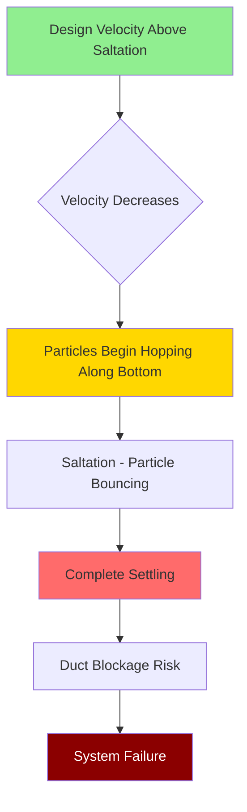

## Transport Velocity Fundamentals

Minimum transport velocity represents the critical air velocity required to prevent particulate matter from settling and accumulating in horizontal or near-horizontal ductwork. The 3500-4500 fpm range addresses intermediate to heavy industrial particulates where gravitational settling forces require substantial kinetic energy in the airstream to maintain suspension.

The physical principle governing particle transport derives from the balance between drag forces and gravitational settling:

$$F_d = \frac{1}{2} \rho_{air} C_d A_p V^2$$

Where $F_d$ is drag force (lbf), $\rho_{air}$ is air density (lb/ft³), $C_d$ is the drag coefficient (dimensionless), $A_p$ is particle projected area (ft²), and $V$ is relative velocity (ft/s).

For a particle to remain entrained, the vertical component of drag must exceed the gravitational force:

$$F_d \geq m_p g = \rho_p V_p g$$

Where $m_p$ is particle mass, $\rho_p$ is particle density, $V_p$ is particle volume, and $g$ is gravitational acceleration (32.2 ft/s²).

## Saltation Velocity Concept

Saltation velocity defines the threshold below which particles begin to drop from suspension and settle along the duct bottom. This phenomenon occurs through a characteristic progression:

The saltation velocity varies with particle characteristics according to empirical relationships. For spherical particles, the Rizk correlation provides reasonable estimates:

$$V_{salt} = 1.8 \sqrt{\frac{gD(\rho_p - \rho_{air})}{\rho_{air}}}$$

Where $D$ is particle diameter (ft) and densities are in lb/ft³. This relationship demonstrates why velocity requirements increase with particle size and density.

## Material-Specific Velocity Requirements

ACGIH Industrial Ventilation Manual establishes minimum transport velocities based on material characteristics:

| Material Category | Particle Characteristics | Minimum Velocity | ACGIH Classification |
|------------------|-------------------------|------------------|---------------------|
| Light wood dust | Sawdust, sander dust, <100 μm | 3500 fpm | Light dust |
| Heavy wood dust | Planer shavings, coarse particles | 4000 fpm | Average dust |
| Metal fines | Grinding dust, buffing particles | 4000-4500 fpm | Heavy dust |
| Heavy grinding dust | Abrasive particles, dense materials | 4500 fpm | Heavy/sticky materials |
| Welding fume with particles | Mixed aerosol-particle systems | 3500-4000 fpm | Variable |

### Light Wood Dust (3500 FPM)

Fine wood dust from sanding operations typically exhibits:

- Particle size: 10-100 μm mass median diameter
- Bulk density: 10-15 lb/ft³
- Individual particle density: 25-35 lb/ft³
- Reynolds number range: 1-50 (transitional drag regime)

At 3500 fpm (58.3 ft/s), the velocity pressure is:

$$VP = \frac{\rho V^2}{2g_c} = \frac{0.075 \times (58.3)^2}{2 \times 32.2} = 3.96 \text{ in. w.g.}$$

Using standard air density of 0.075 lb/ft³ and $g_c = 32.2$ lbm-ft/(lbf-s²).

### Heavy Wood Dust and Metal Fines (4000-4500 FPM)

Coarser particles from planing operations and metal grinding require higher velocities due to:

- Increased particle mass (volume scales as $d^3$)
- Higher settling velocities
- Greater momentum required for direction changes at elbows
- Risk of compaction if settling occurs

For 4000 fpm (66.7 ft/s):

$$VP = \frac{0.075 \times (66.7)^2}{2 \times 32.2} = 5.18 \text{ in. w.g.}$$

For 4500 fpm (75.0 ft/s):

$$VP = \frac{0.075 \times (75.0)^2}{2 \times 32.2} = 6.55 \text{ in. w.g.}$$

The 30% increase in velocity from 3500 to 4500 fpm results in a 65% increase in velocity pressure, directly impacting fan power requirements:

$$P_{fan} \propto Q \times SP \propto V \times V^2 = V^3$$

## Particle Size Effects on Transport

Particle settling velocity in still air follows Stokes' law for small particles (Re < 1):

$$V_{terminal} = \frac{g d_p^2 (\rho_p - \rho_{air})}{18 \mu}$$

Where $\mu$ is dynamic viscosity of air (3.8 × 10⁻⁷ lbf-s/ft²). This relationship demonstrates the quadratic dependence on particle diameter.

### Transport Velocity Scaling

Empirical data from industrial installations suggests minimum transport velocity scales approximately as:

$$V_{min} \approx k \sqrt{d_p}$$

Where $k$ is a material-dependent constant ranging from 2000-3000 for the materials in this velocity range.

## Design Considerations

### Horizontal vs. Vertical Duct Sections

Minimum velocity requirements apply primarily to horizontal runs where gravitational settling is maximum. Vertical sections can operate at lower velocities since gravity acts perpendicular to flow direction. However, system design typically maintains consistent velocity throughout to:

- Simplify balancing calculations
- Prevent accumulation zones at transitions
- Maintain safety factors for variable loading conditions

### Velocity Loss Compensation

Static pressure losses in industrial exhaust systems reduce velocity as distance from the fan increases. Design must account for velocity degradation:

$$V_2 = V_1 \sqrt{\frac{VP_1 - \Delta P_{loss}}{VP_1}}$$

Where $\Delta P_{loss}$ represents cumulative friction and fitting losses between points 1 and 2.

### Safety Margin Requirements

ASHRAE and ACGIH recommend maintaining design velocities 10-15% above minimum values to account for:

- System wear increasing surface roughness
- Partial filter loading reducing available static pressure
- Material density variations in production processes
- Measurement uncertainties in particle characteristics

## Verification and Commissioning

Transport velocity verification requires measurement at the lowest-velocity horizontal section:

$$V_{actual} = 4005 \sqrt{\frac{VP_{measured}}{\rho_{actual}}}$$

Where $VP_{measured}$ is in inches of water gauge and $\rho_{actual}$ accounts for temperature and elevation effects on air density:

$$\rho_{actual} = \rho_{std} \times \frac{P_{actual}}{P_{std}} \times \frac{T_{std}}{T_{actual}}$$

Systems failing to maintain minimum transport velocities exhibit characteristic symptoms:

- Increased static pressure at the exhaust hood
- Periodic puffs of material from hood face
- Unusual noise from material bouncing in ductwork
- Reduced flow rates requiring frequent fan cleaning

---

**References:**
- ACGIH Industrial Ventilation Manual, 31st Edition
- ASHRAE Fundamentals Handbook, Chapter 35: Industrial Ventilation
- SMACNA HVAC Systems Duct Design, 4th Edition
