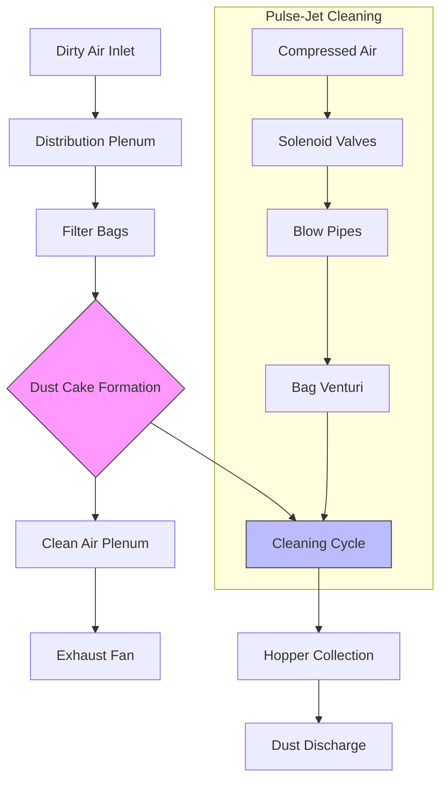

## Operating Principles

Baghouse dust collectors represent the most efficient method for removing particulate matter from industrial exhaust streams, achieving collection efficiencies exceeding 99.9% for particles as small as 0.5 microns. The fundamental operating principle involves forcing particle-laden air through porous fabric filter bags where dust accumulates on the fabric surface, forming a filter cake that enhances collection efficiency.

The filtration process occurs in three distinct phases. Initially, clean bags provide minimal filtration efficiency, relying solely on fabric porosity. As dust accumulates, a filter cake builds on the fabric surface, creating the primary filtration mechanism through depth filtration within the cake structure. Eventually, excessive cake thickness increases pressure drop to unacceptable levels, triggering the cleaning cycle to dislodge accumulated dust while maintaining a residual cake layer for continued high-efficiency operation.

## Cleaning Mechanisms

### Pulse-Jet Cleaning

Pulse-jet baghouses utilize short bursts of compressed air (60-120 psig) directed down the interior of filter bags to flex the fabric and dislodge dust cake. The cleaning pulse, typically 0.03-0.1 seconds duration, creates a rapid pressure wave that propagates down the bag length. The Venturi effect at the bag top induces secondary air flow 5-8 times the pulse air volume, providing thorough cleaning action.

Pulse-jet systems operate continuously with on-line cleaning, eliminating the need for compartmentalization. Cleaning sequences typically cycle through rows of bags every 30 seconds to 10 minutes, controlled by differential pressure setpoints or timer intervals. The high-energy cleaning action permits higher air-to-cloth ratios (4:1 to 12:1) compared to other cleaning methods.

### Reverse-Air Cleaning

Reverse-air baghouses employ gentle cleaning through airflow reversal, directing clean air backward through filter bags at 1-2 times normal face velocity. This method requires compartmentalization, with individual compartments taken offline sequentially for cleaning cycles lasting 1-3 minutes. The gentle cleaning preserves filter bag integrity, extending bag life significantly beyond pulse-jet applications.

The lower cleaning energy necessitates conservative air-to-cloth ratios (1.5:1 to 3:1), resulting in larger physical footprints but reduced bag wear. Reverse-air systems excel in applications with hygroscopic or sticky dusts where aggressive pulse cleaning might embed particles within fabric fibers.

## Filter Media Selection

Filter media selection balances collection efficiency, chemical compatibility, temperature resistance, and cake release characteristics against specific application requirements.

| **Media Type** | **Max Temp (°F)** | **Chemical Resistance** | **Applications** |
|----------------|-------------------|------------------------|------------------|
| Polyester | 275 | Moderate acids, alkalis | General dust, cement, wood |
| Polypropylene | 200 | Excellent acids | Chemical processing, acid fumes |
| Nomex | 400 | Good acids | Asphalt plants, hot applications |
| P84 | 500 | Excellent acids | Coal-fired boilers, incinerators |
| PTFE (Teflon) | 500 | Excellent acids/alkalis | Chemical plants, high moisture |
| Fiberglass | 500 | Good acids | High temperature, corrosive gases |
| PPS (Ryton) | 375 | Excellent acids/alkalis | Coal boilers, municipal waste |

Fabric finish treatments enhance performance characteristics. Singed finishes smooth fiber surfaces for improved cake release. Membrane laminates (ePTFE) provide surface filtration for submicron particles while facilitating cake release. Antistatic fibers prevent spark generation in combustible dust applications.

## Air-to-Cloth Ratio Design

The air-to-cloth ratio (A/C) defines the volumetric airflow per unit of filter fabric area, expressed as filtration velocity:

$$A/C = \frac{Q}{A_f}$$

where $Q$ = airflow (CFM) and $A_f$ = total fabric area (ft²).

Design A/C ratios depend on cleaning mechanism, dust characteristics, and required pressure drop:

**Pulse-Jet Systems:**
$$A/C = 4:1 \text{ to } 12:1 \text{ (ft/min)}$$

**Reverse-Air Systems:**
$$A/C = 1.5:1 \text{ to } 3:1 \text{ (ft/min)}$$

The total fabric area required is calculated:

$$A_f = \frac{Q \times 60}{A/C \times 60} = \frac{Q}{A/C}$$

For a 20,000 CFM pulse-jet system with 6:1 A/C ratio:

$$A_f = \frac{20,000}{6} = 3,333 \text{ ft}^2$$

## Pressure Drop Management

Baghouse pressure drop consists of three components: clean bag resistance, dust cake resistance, and system losses. Total pressure drop typically ranges from 4-8 inches water column:

$$\Delta P_{total} = \Delta P_{bag} + \Delta P_{cake} + \Delta P_{system}$$

Clean bag pressure drop remains relatively constant at 0.5-2 inches water column. Dust cake contributes the majority of resistance, increasing linearly with cake thickness until cleaning occurs. Excessive pressure drop indicates inadequate cleaning frequency, blinded bags, or excessive air-to-cloth ratio.

Optimal operation maintains pressure drop within a controlled band, typically 4-6 inches water column, through modulated cleaning cycles. Differential pressure transmitters monitor resistance and trigger cleaning when upper setpoints are reached, then terminate cleaning at lower setpoints to preserve residual cake.

## Maintenance and Bag Replacement

Preventive maintenance focuses on preserving filter bag life, which typically ranges from 1-5 years depending on application severity. Daily inspections monitor pressure drop trends, cleaning system operation, and dust discharge. Weekly inspections examine compressed air quality for pulse-jet systems, ensuring dry, oil-free air prevents bag blinding.

Bag replacement indicators include rising baseline pressure drop, visible emissions, reduced cleaning effectiveness, and physical bag deterioration. Individual bag replacement maintains system operation, while complete bag changes occur during scheduled outages. Proper installation requires careful bag seating to prevent bypass leakage around bag cuffs and maintaining cage alignment to prevent fabric abrasion.

Cleaning system maintenance includes solenoid valve testing, diaphragm replacement, and blow pipe alignment verification. Hopper discharge mechanisms require regular inspection to prevent dust accumulation and ensure complete material removal between cleaning cycles.
