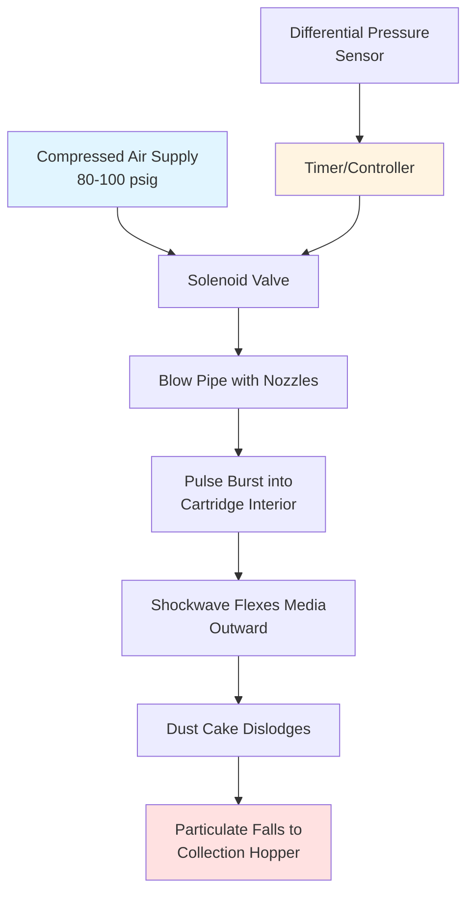

Cartridge filter dust collectors represent a compact, high-efficiency approach to industrial particulate capture. These systems utilize pleated filter media arranged in cylindrical cartridges to maximize filtration area within a minimal footprint, offering advantages over traditional fabric bag collectors in many applications.

## Cartridge Filter Construction and Media

Cartridge filters consist of pleated filter media wrapped around a central support core and encased in an outer protective cage. The pleated design dramatically increases the effective filtration surface area compared to flat media.

**Key Construction Elements:**

- **Filter Media**: Typically cellulose, cellulose-polyester blends, spunbond polyester, PTFE-coated media, or nanofiber materials
- **Pleat Configuration**: Uniform pleats ranging from 20-40 pleats per cartridge, depending on media type and application
- **Support Structure**: Inner perforated metal core and outer wire cage preventing collapse under vacuum
- **End Caps**: Molded polyurethane or metal caps with gasket seals for airtight mounting
- **Media Treatment**: Optional treatments including flame retardant, anti-static, water-repellent, or oleophobic coatings

Standard cartridge dimensions include 12.75" diameter × 26" height (providing approximately 320-350 ft² of media area) and shorter configurations for space-constrained installations.

## Pleated Media Advantages

The pleated configuration delivers significant performance benefits over traditional flat or tubular bag media.

**Primary Advantages:**

- **High Media Area**: Pleating increases filtration area by 10-15× compared to equivalent cylindrical bag dimensions
- **Compact Footprint**: Higher media density reduces overall collector size by 30-40% versus baghouses
- **Lower Pressure Drop**: Greater surface area distributes airflow, reducing face velocity and initial pressure drop
- **Improved Efficiency**: Submicron particle capture with efficiencies exceeding 99.9% for particles >0.3 μm
- **Extended Service Life**: Lower face velocities and pulse cleaning reduce media wear

Modern nanofiber and PTFE membrane media provide surface filtration rather than depth filtration, preventing particle penetration into the media structure and enabling more effective cleaning.

## Air-to-Media Ratio Design

Proper sizing of cartridge filter collectors requires calculating the air-to-media ratio (AMR), which determines face velocity and pressure drop characteristics.

**Air-to-Media Ratio Calculation:**

$$\text{AMR} = \frac{Q}{A_{\text{total}}}$$

Where:
- $\text{AMR}$ = air-to-media ratio (ft/min or m/min)
- $Q$ = volumetric airflow rate (cfm or m³/min)
- $A_{\text{total}}$ = total filtration area of all cartridges (ft² or m²)

**Recommended AMR Values:**

- General dust applications: 4-6 ft/min (1.2-1.8 m/min)
- Fine particulate (<10 μm): 3-4 ft/min (0.9-1.2 m/min)
- Combustible dust: 3-5 ft/min (0.9-1.5 m/min)
- Heavy loading applications: 2-3 ft/min (0.6-0.9 m/min)

**Number of Cartridges Required:**

$$N = \frac{Q}{\text{AMR} \times A_{\text{cartridge}}}$$

For a 10,000 cfm system with AMR = 4 ft/min and cartridges providing 320 ft² each:

$$N = \frac{10,000}{4 \times 320} = 7.8 \rightarrow 8 \text{ cartridges}$$

## Pulse-Jet Cleaning Systems

Cartridge collectors utilize high-pressure pulse-jet cleaning to dislodge accumulated dust cake from filter surfaces without interrupting collector operation.

**Pulse-Jet Operation:**

**Cleaning System Components:**

- **Compressed Air**: 80-100 psig supply with adequate volume (minimum 4 cfm per valve)
- **Solenoid Valves**: Fast-acting diaphragm valves (40-80 millisecond opening time)
- **Blow Pipes**: Perforated tubes positioned above cartridge rows with nozzles aligned to cartridge centers
- **Controller**: Timer-based or differential pressure-initiated cleaning sequences
- **Air Reservoir**: Accumulator tank maintaining adequate pulse pressure

Typical pulse duration ranges from 100-150 milliseconds per valve, with cleaning intervals from 10 seconds to 5 minutes depending on dust loading.

## Applications vs Baghouses

Cartridge collectors offer distinct advantages over traditional baghouse systems in specific applications.

**Cartridge Filter Comparison:**

| Parameter | Cartridge Filters | Bag Filters |
|-----------|------------------|-------------|
| **Media Area** | 320-350 ft²/unit | 40-60 ft²/bag |
| **Air-to-Media Ratio** | 3-6 ft/min | 5-10 ft/min |
| **Footprint** | 30-40% smaller | Larger housing required |
| **Filter Changeout** | Quick drop-in replacement | Individual bag removal |
| **Initial Cost** | Higher cartridge cost | Lower bag cost |
| **Maintenance Labor** | Lower (easier access) | Higher (more units) |
| **Pressure Drop** | 2-4" w.g. initial | 3-5" w.g. initial |
| **Best Applications** | Fine dust, limited space | High loading, abrasive dust |

**Ideal Cartridge Applications:**

- Fine particulate (<10 μm) from metalworking, pharmaceuticals, powder coating
- Operations with limited floor space or ceiling height restrictions
- Processes generating combustible dusts requiring smaller housing for deflagration protection
- Applications requiring frequent filter changeout where accessibility is critical

**Baghouse Preferences:**

- High dust loading (>10 grains/ft³) with coarse, abrasive particulate
- High-temperature applications exceeding cartridge media limits (typically >200°F)
- Situations requiring lowest initial filter media cost
- Legacy systems with existing baghouse infrastructure

## Maintenance and Cartridge Replacement

Proper maintenance practices maximize cartridge service life and system performance.

**Routine Maintenance:**

- **Differential Pressure Monitoring**: Replace cartridges when ΔP reaches 6-8" w.g. (cannot be cleaned below 4-5" w.g.)
- **Compressed Air System**: Verify adequate pressure, drain moisture separators weekly, check solenoid function
- **Hopper Evacuation**: Empty collection hoppers before dust accumulation reaches cartridge level
- **Pulse Cleaning**: Verify uniform cleaning across all cartridges; adjust pulse timing/pressure as needed

**Cartridge Replacement Indicators:**

- Sustained high differential pressure despite cleaning
- Visible media damage, tears, or gasket deterioration
- Reduction in pulse-cleaning effectiveness
- Increased particulate emissions (if monitored)

Typical cartridge service life ranges from 1-3 years depending on dust characteristics, loading, and cleaning frequency. Nanofiber and membrane-coated media typically achieve longer service life than cellulose media.

**Replacement Procedure:**

1. Shut down collector and lockout power
2. Release compressed air pressure from cleaning system
3. Access filter compartment through hinged or removable panels
4. Remove cartridges by lifting straight up (disengage from mounting studs/retainers)
5. Inspect mounting surface and gaskets for damage
6. Install new cartridges ensuring proper gasket seating
7. Close access panels, verify seal integrity, restore power
8. Record replacement date, operating hours, and final ΔP before changeout

Proper cartridge selection, conservative air-to-media ratios, and disciplined maintenance practices ensure reliable, long-term dust collection performance in demanding industrial environments.
