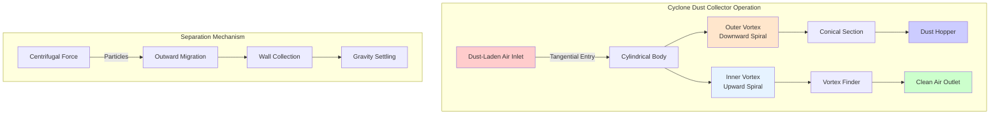

Cyclone dust collectors separate particulate matter from gas streams using centrifugal force generated by spinning airflow. These inertial separators provide economical, low-maintenance pre-filtration or standalone collection for industrial applications.

## Operating Principles

Cyclones employ centrifugal acceleration to force particles outward toward the collection wall while clean gas exits through the center.

**Flow Pattern:**
- Tangential inlet imparts rotational velocity to gas stream
- Outer vortex spirals downward along cylindrical and conical walls
- Inner vortex spirals upward through center and exits at top
- Particles migrate outward due to centrifugal force
- Collected material falls into dust hopper

**Separation Forces:**

The centrifugal force acting on a particle is:

$$F_c = \frac{m v_t^2}{r}$$

Where:
- $m$ = particle mass (kg)
- $v_t$ = tangential velocity (m/s)
- $r$ = radius from cyclone axis (m)

This force must overcome drag force for effective collection:

$$F_d = 3 \pi \mu d_p v_r$$

Where:
- $\mu$ = gas viscosity (Pa·s)
- $d_p$ = particle diameter (m)
- $v_r$ = radial velocity (m/s)

## Standard vs High-Efficiency Cyclones

Design geometry significantly impacts collection performance and pressure drop.

| Cyclone Type | Diameter Ratio | Height Ratio | Inlet Velocity | Pressure Drop | Cut Diameter |
|--------------|----------------|--------------|----------------|---------------|--------------|
| Standard (Conventional) | D = 0.5-1.0 m | H/D = 4-5 | 15-20 m/s | 4-8 inlet vel heads | 10-20 μm |
| High-Efficiency | D = 0.15-0.6 m | H/D = 6-10 | 20-30 m/s | 6-12 inlet vel heads | 5-10 μm |
| Ultra-High Efficiency | D < 0.15 m | H/D = 8-12 | 25-35 m/s | 10-20 inlet vel heads | 2-5 μm |

**Standard Cyclones:**
- Larger diameter (0.5-1.0 m)
- Lower inlet velocities (15-20 m/s)
- Moderate pressure drop (500-1000 Pa)
- Economical for large airflows
- Effective for particles > 20 μm

**High-Efficiency Cyclones:**
- Smaller diameter (0.15-0.6 m)
- Higher inlet velocities (20-30 m/s)
- Increased pressure drop (750-1500 Pa)
- Better small particle capture
- Effective for particles > 5 μm

## Particle Size Efficiency Curves

Collection efficiency varies with particle size, following characteristic curves.

**Fractional Efficiency:**

$$\eta(d_p) = \frac{1}{1 + (d_{50}/d_p)^2}$$

Where:
- $\eta(d_p)$ = fractional efficiency for particle diameter $d_p$
- $d_{50}$ = cut diameter (50% efficiency point)

**Cut Diameter Calculation:**

The theoretical cut diameter is:

$$d_{50} = \sqrt{\frac{9 \mu W}{2 \pi N_e v_i (\rho_p - \rho_g)}}$$

Where:
- $W$ = inlet width (m)
- $N_e$ = effective number of turns (typically 3-5)
- $v_i$ = inlet velocity (m/s)
- $\rho_p$ = particle density (kg/m³)
- $\rho_g$ = gas density (kg/m³)

**Typical Efficiency Ranges:**
- Particles > 50 μm: 95-99% efficiency
- Particles 20-50 μm: 85-95% efficiency
- Particles 10-20 μm: 70-85% efficiency
- Particles 5-10 μm: 40-70% efficiency
- Particles < 5 μm: < 40% efficiency

## Pressure Drop Considerations

Pressure drop represents the energy cost of cyclone operation.

**Pressure Drop Equation:**

$$\Delta P = K_c \frac{\rho_g v_i^2}{2}$$

Where:
- $K_c$ = cyclone pressure drop coefficient (3-8)
- $v_i$ = inlet velocity (m/s)

**Factors Affecting Pressure Drop:**
- Inlet velocity (squared relationship)
- Number of gas revolutions
- Wall friction losses
- Exit duct configuration
- Dust loading (typically minor effect)

**Design Trade-offs:**
- Higher efficiency requires higher velocity → increased pressure drop
- Smaller diameter increases efficiency → increases pressure drop
- Typical range: 500-2000 Pa (2-8 inches w.g.)

## Multiple Cyclone Arrangements

Multiple units optimize performance and capacity.

**Parallel Configuration:**
- Multiple cyclones share common inlet plenum
- Equal airflow distribution critical
- Maintains individual cyclone efficiency
- Scales capacity linearly
- Used for high-volume applications

**Multicyclone Units:**
- Arrays of small-diameter cyclones (2-6 inches)
- Common housing with individual tubes
- Higher efficiency than single large cyclone
- Typical pressure drop: 1000-1500 Pa
- Compact footprint

**Series Configuration:**
- Primary cyclone for coarse separation
- Secondary cyclone or filter for fine particles
- Reduces load on final filter
- Extends filter life significantly

## Applications and Limitations

**Ideal Applications:**
- Woodworking dust collection (sawdust, chips)
- Grain handling and processing
- Metal grinding and buffing operations
- Cement and aggregate handling
- Primary separation before fabric filters
- High-temperature gas streams (up to 450°C)
- Spark and ember control

**Limitations:**
- Poor efficiency for particles < 10 μm
- Cannot collect sticky or fibrous materials
- Requires careful design for optimal performance
- Particle re-entrainment possible with improper sizing
- Abrasive materials cause wall wear
- Not suitable as primary collector for fine dusts

**Design Considerations:**
- Minimum velocity to prevent settling: 15 m/s inlet
- Maximum velocity to prevent erosion: 35 m/s for abrasives
- Dust hopper must provide adequate storage capacity
- Rotary airlock or double-dump valve for hopper discharge
- Smooth interior surfaces minimize turbulence and re-entrainment

**Maintenance Requirements:**
- Periodic inspection for wall wear and erosion
- Hopper level monitoring and regular emptying
- Inlet and outlet duct inspection for blockages
- No moving parts reduces maintenance burden
- Expected service life: 15-25 years with proper design

Cyclones provide cost-effective, reliable particulate separation for industrial processes where fine particle capture is not critical or where they serve as pre-cleaners for final filtration systems.
