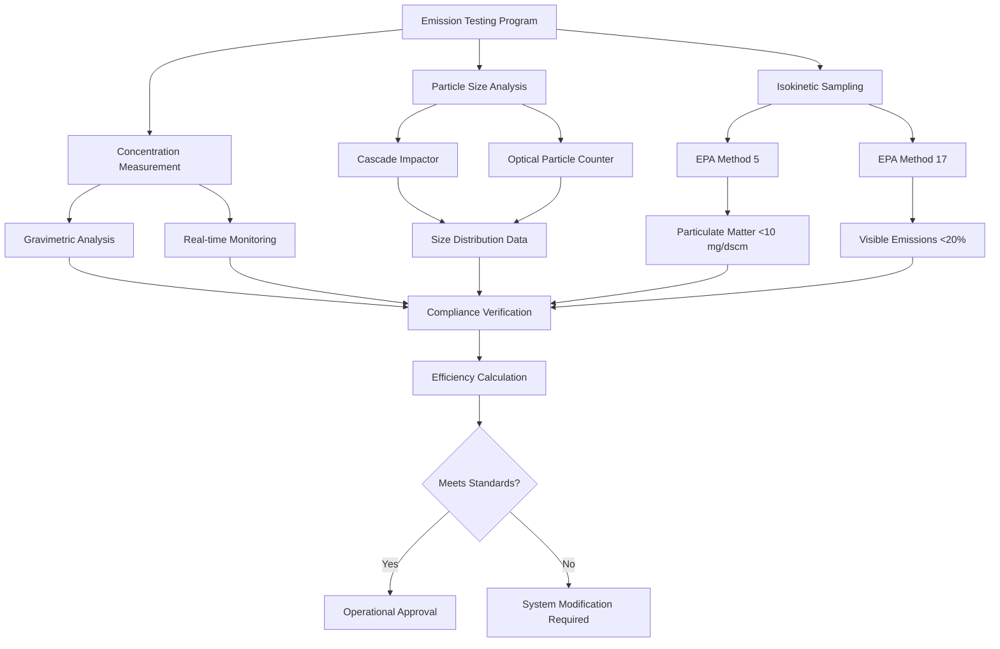

Dust collection system efficiency quantifies the ability of a collector to remove particulate matter from an air stream. Efficiency varies significantly with particle size, making accurate characterization essential for regulatory compliance and system design.

## Collection Efficiency Definitions

**Overall Collection Efficiency** represents the total mass fraction of particulate removed:

$$\eta_{\text{overall}} = \frac{m_{\text{collected}}}{m_{\text{inlet}}} \times 100\%$$

Where:
- $m_{\text{collected}}$ = mass of dust collected (lb/hr or kg/hr)
- $m_{\text{inlet}}$ = mass of dust entering collector (lb/hr or kg/hr)

Alternatively, using concentration measurements:

$$\eta_{\text{overall}} = \frac{C_{\text{in}} - C_{\text{out}}}{C_{\text{in}}} \times 100\%$$

Where:
- $C_{\text{in}}$ = inlet dust concentration (gr/ft³ or mg/m³)
- $C_{\text{out}}$ = outlet dust concentration (gr/ft³ or mg/m³)

**Penetration** expresses the fraction passing through:

$$P = 1 - \eta = \frac{C_{\text{out}}}{C_{\text{in}}}$$

Penetration is particularly useful when dealing with high-efficiency collectors where small differences matter.

## Particle Size Distribution Effects

Dust collection efficiency strongly depends on particle aerodynamic diameter. Fine particles (< 1 μm) are difficult to collect due to:

- Low inertial forces
- Increased influence of Brownian motion
- Reduced gravitational settling velocity

**Stokes Diameter** characterizes particle behavior:

$$d_{\text{Stokes}} = \sqrt{\frac{18 \mu V_{\text{terminal}}}{\rho_p g}}$$

Where:
- $\mu$ = air viscosity (lb/ft·s or Pa·s)
- $V_{\text{terminal}}$ = terminal settling velocity (ft/s or m/s)
- $\rho_p$ = particle density (lb/ft³ or kg/m³)
- $g$ = gravitational acceleration (32.2 ft/s² or 9.81 m/s²)

Particle size distributions typically follow log-normal patterns. The mass median diameter (MMD) and geometric standard deviation characterize the distribution.

## Fractional Efficiency Curves

Fractional efficiency (grade efficiency) shows collection performance across particle size ranges:

$$\eta(d_p) = \frac{m_{\text{collected}}(d_p)}{m_{\text{inlet}}(d_p)}$$

**Characteristic Efficiency Parameters:**

| Parameter | Definition | Significance |
|-----------|------------|--------------|
| $d_{50}$ (Cut diameter) | Particle size collected at 50% efficiency | Characterizes separator performance |
| $d_{95}$ | Particle size collected at 95% efficiency | Indicates near-complete capture |
| Slope | Steepness of efficiency curve | Sharp curves = narrow size selectivity |

The relationship between fractional and overall efficiency:

$$\eta_{\text{overall}} = \int_0^\infty \eta(d_p) \cdot f(d_p) \, dd_p$$

Where $f(d_p)$ is the particle size distribution function normalized to unity.

## Overall System Efficiency Calculation

For practical calculations with discrete size fractions:

$$\eta_{\text{overall}} = \sum_{i=1}^{n} \eta_i \cdot w_i$$

Where:
- $\eta_i$ = fractional efficiency for size range $i$
- $w_i$ = weight fraction in size range $i$
- $n$ = number of size fractions

**Example Calculation:**

| Size Range (μm) | Weight Fraction | Fractional Efficiency | Contribution |
|-----------------|-----------------|----------------------|--------------|
| 0-2 | 0.15 | 0.60 | 0.090 |
| 2-5 | 0.25 | 0.85 | 0.213 |
| 5-10 | 0.30 | 0.95 | 0.285 |
| 10-20 | 0.20 | 0.99 | 0.198 |
| >20 | 0.10 | 0.995 | 0.100 |
| **Total** | **1.00** | — | **0.886 (88.6%)** |

## Emission Testing Requirements

**EPA Method 5** (Particulate Emissions):
- Isokinetic sampling required
- Filter temperature 120°C ± 14°C
- Minimum sample volume 0.6 dscm
- Reporting in mg/dscm corrected to standard conditions

**EPA Method 201A/202** (PM₁₀ and PM₂.₅):
- Includes particle sizing
- More stringent for fine particulate
- Required for many industrial sources

## EPA and OSHA Compliance Standards

**EPA Emission Standards:**

| Source Category | Emission Limit | Applicable Standard |
|-----------------|----------------|---------------------|
| General Industry | 0.1 gr/dscf (229 mg/dscm) | 40 CFR 60 |
| Woodworking | 0.01 gr/dscf (23 mg/dscm) | 40 CFR 63 Subpart QQQQ |
| Metal Fabrication | 0.005 gr/dscf (11 mg/dscm) | 40 CFR 63 Subpart XXXXXX |
| Foundries | 0.002 gr/dscf (4.6 mg/dscm) | 40 CFR 63 Subpart EEEEE |
| Cement Plants | 0.015 lb/ton product | 40 CFR 63 Subpart LLL |

**OSHA Workplace Standards (29 CFR 1910):**

| Contaminant | PEL | Action Level | Notes |
|-------------|-----|--------------|-------|
| Total Dust | 15 mg/m³ | 7.5 mg/m³ | 8-hour TWA |
| Respirable Dust | 5 mg/m³ | 2.5 mg/m³ | 8-hour TWA |
| Silica (Crystalline) | 50 μg/m³ | 25 μg/m³ | New standard (2016) |
| Wood Dust | 5 mg/m³ | 2.5 mg/m³ | Hardwood STEL 10 mg/m³ |
| Metal Dusts (General) | 10 mg/m³ | 5 mg/m³ | Varies by metal type |

**Required Minimum Efficiency by Application:**

| Application | Minimum Efficiency | Primary Concern |
|-------------|-------------------|-----------------|
| General Housekeeping | 85-90% | Operational cleanliness |
| OSHA Compliance | 95-98% | Worker exposure prevention |
| EPA Compliance | 99-99.5% | Environmental emissions |
| Explosive Dust Hazards | 99.5-99.9% | Combustible dust safety |
| Toxic Materials | 99.9-99.99% | Health hazard control |
| Pharmaceutical/Food | 99.97% (HEPA) | Product contamination prevention |

**Monitoring and Documentation:**

Facilities must maintain:
- Continuous opacity monitoring (COMS) or periodic visible emission observations
- Annual stack testing for major sources
- Pressure drop monitoring across collectors
- Particulate loading calculations
- Maintenance and inspection logs

**Performance Verification:**

$$\text{Required Testing Frequency} = f(\text{Source Category, Emission Rate, Compliance History})$$

Typical requirements:
- Initial performance test upon startup
- Annual testing for major sources
- Semi-annual for problematic operations
- After any process modifications

Properly designed systems operating within design parameters consistently achieve specified efficiency. Regular monitoring, preventive maintenance, and prompt corrective action ensure sustained compliance and protect worker health and environmental quality.
