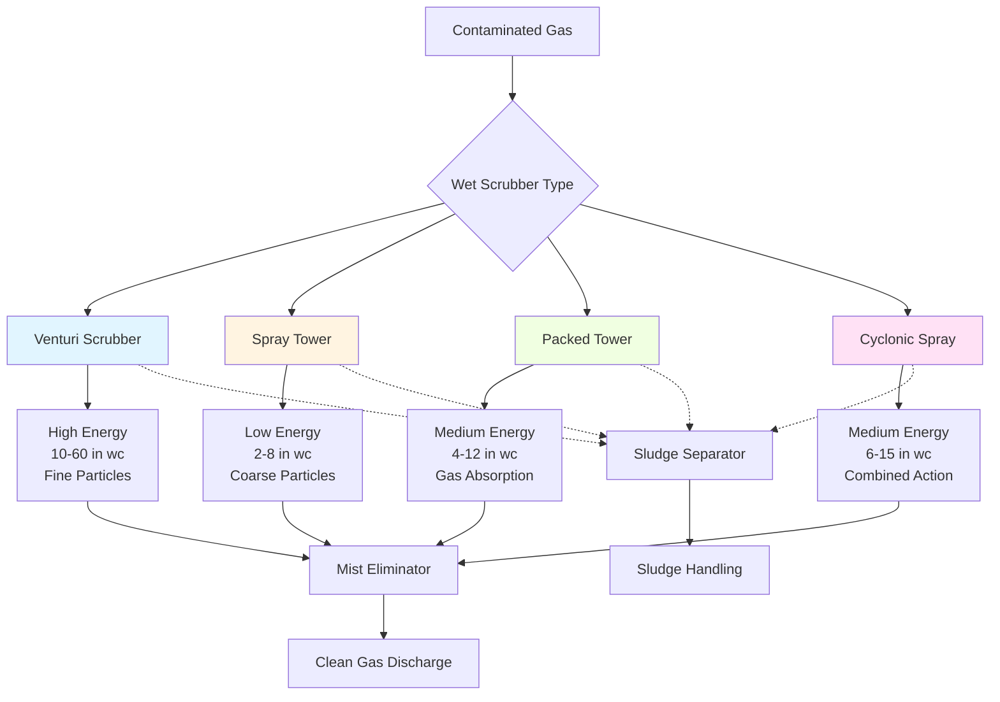

Wet scrubbers use liquid (typically water) to capture particulate matter and gaseous contaminants from industrial exhaust streams. These devices achieve simultaneous particulate removal and gas absorption through intimate contact between contaminated air and scrubbing liquid, making them essential for applications where dry collection methods are unsuitable due to combustible dust, high temperatures, or combined particle-gas control requirements.

## Operating Principles

Wet scrubbers remove particles through multiple mechanisms operating in parallel. **Impaction** occurs when particles with sufficient inertia cannot follow gas streamlines around liquid droplets and collide with the droplet surface. **Interception** captures particles that come within one particle radius of a droplet. **Diffusion** dominates for submicron particles that undergo Brownian motion and contact droplets during their random path.

The overall collection efficiency depends on the contact power—the energy expended to create liquid surface area and particle-droplet contact. Higher pressure drop across the scrubber generally correlates with improved collection efficiency, particularly for fine particles below 2 μm diameter.

The fractional collection efficiency for a single droplet can be estimated using:

$$\eta = 1 - \exp\left(-\frac{3 \cdot E_t \cdot V_g \cdot L}{2 \cdot d_d \cdot V_d}\right)$$

Where $\eta$ is collection efficiency, $E_t$ is total collection efficiency parameter (combining impaction, interception, diffusion), $V_g$ is gas velocity, $L$ is scrubber length, $d_d$ is droplet diameter, and $V_d$ is droplet velocity.

## Venturi Scrubber Design

Venturi scrubbers achieve high collection efficiency (95-99% for particles >1 μm) by accelerating the gas stream to 12,000-24,000 fpm through a constricted throat section. At the throat entrance, liquid is injected and atomized into fine droplets by the high-velocity gas stream.

The pressure drop through a venturi scrubber ranges from 10-60 inches water column, with higher pressure drops yielding better submicron particle capture. The relationship between pressure drop and liquid-to-gas ratio follows:

$$\Delta P = \frac{V_t^2 \cdot \rho_g}{2g} \left[1 + \frac{L}{G} \cdot \frac{\rho_g}{\rho_L}\right]^2$$

Where $\Delta P$ is pressure drop, $V_t$ is throat velocity, $\rho_g$ is gas density, $\rho_L$ is liquid density, $g$ is gravitational constant, and $L/G$ is liquid-to-gas ratio (typically 5-20 gal/1000 cfm).

Key venturi components include:

- **Converging section**: Accelerates gas to throat velocity
- **Throat section**: Primary particle-droplet contact zone (4-8 inch length)
- **Diverging section**: Recovers static pressure (5-7° divergence angle)
- **Separator**: Removes entrained liquid droplets from cleaned gas

## Spray Tower Configuration

Spray towers operate at lower pressure drops (2-8 inches water column) and achieve 80-95% efficiency for particles >5 μm. Contaminated gas flows upward (countercurrent) or downward (concurrent) through multiple banks of spray nozzles producing droplets 500-2000 μm diameter.

Tower design parameters:

- Gas velocity: 200-800 fpm (limited to prevent droplet entrainment)
- Liquid-to-gas ratio: 5-15 gal/1000 cfm
- Tower height: 10-40 feet depending on residence time requirements
- Nozzle spacing: 3-6 feet vertical, 4-8 feet horizontal

Spray towers excel at removing coarse particles and absorbing water-soluble gases but demonstrate poor performance on submicron particulate due to limited contact power.

## Water Recirculation Systems

Wet scrubbers employ closed-loop recirculation systems to minimize water consumption. Critical recirculation system components include:

**Sump tank**: Sized for 1-3 minutes liquid residence time at circulation flow rate. Provides settling time for coarse solids and temperature stabilization.

**Recirculation pump**: Typically centrifugal pumps with open or semi-open impellers to pass solids 0.5-2 inches. Pump materials selected for slurry service—316 stainless steel, rubber-lined carbon steel, or high-chrome alloys.

**Makeup water**: Replaces losses from evaporation (0.5-2% of gas flow), entrainment, and blowdown. Evaporation rate estimated by:

$$W_{evap} = \frac{Q \cdot \Delta T \cdot c_p}{\lambda}$$

Where $W_{evap}$ is evaporation rate, $Q$ is gas flow rate, $\Delta T$ is temperature drop across scrubber, $c_p$ is gas specific heat, and $\lambda$ is latent heat of vaporization.

**Blowdown control**: Maintains acceptable dissolved solids concentration (typically <5000 ppm) to prevent scaling and ensure consistent performance.

## Wet Scrubber Configuration Comparison

| Parameter | Venturi | Spray Tower | Packed Tower | Cyclonic Spray |
|-----------|---------|-------------|--------------|----------------|
| Pressure Drop | 10-60 in wc | 2-8 in wc | 4-12 in wc | 6-15 in wc |
| Collection Eff (>1 μm) | 95-99% | 80-95% | 85-95% | 90-97% |
| Collection Eff (<1 μm) | 90-95% | 50-70% | 60-80% | 75-85% |
| L/G Ratio (gal/1000 cfm) | 5-20 | 5-15 | 10-30 | 8-25 |
| Plugging Tendency | Low | Low | High | Medium |
| Gas Absorption | Poor | Good | Excellent | Fair |
| Turndown Ratio | 3:1 | 4:1 | 3:1 | 2:1 |
| Capital Cost | Medium | Low | High | Medium-High |
| Operating Cost | High | Low | Medium | Medium |

## Particle Collection Efficiency

Collection efficiency varies with particle size according to the grade efficiency curve. Wet scrubbers demonstrate a characteristic efficiency minimum at 0.2-0.5 μm where diffusion and impaction mechanisms are both weak.

Overall penetration (fraction passing through) for polydisperse aerosols:

$$P_{total} = \sum_{i=1}^{n} f_i \cdot P_i$$

Where $f_i$ is mass fraction in size range $i$ and $P_i$ is penetration for that size range. Overall efficiency: $\eta_{total} = 1 - P_{total}$.

For venturi scrubbers, the cut diameter (50% collection efficiency) typically falls at 0.5-1.5 μm depending on pressure drop. Spray towers exhibit cut diameters of 3-10 μm.

## Sludge Handling Requirements

Wet scrubbers generate liquid waste streams containing collected particulate, requiring dedicated sludge management systems. Sludge characteristics depend on dust properties and scrubbing liquid chemistry.

**Clarification**: Gravity thickeners or inclined plate settlers concentrate solids from 2-10% to 15-35% by weight. Settling velocity for discrete particles follows Stokes' Law:

$$V_s = \frac{g \cdot d_p^2 \cdot (\rho_p - \rho_L)}{18 \cdot \mu}$$

Where $V_s$ is settling velocity, $d_p$ is particle diameter, $\rho_p$ is particle density, and $\mu$ is liquid viscosity.

**Dewatering**: Vacuum filters, filter presses, or centrifuges reduce moisture content to 40-60% for landfill disposal or further processing. Belt filter presses handle 50-500 gpm at 1-5% inlet solids concentration.

**Disposal/recovery**: Dried sludge may be landfilled, recycled to process, or further treated depending on composition and regulatory requirements.

## Corrosion and Material Selection

Wet scrubber materials must withstand simultaneous chemical attack and abrasive wear from particle-laden slurry.

**Metallic materials**:
- 316L stainless steel: General purpose, pH 5-9, chloride <200 ppm
- Hastelloy C-276: Severe corrosion, acidic gases, chlorine compounds
- Titanium: High-chloride environments, oxidizing acids
- Duplex stainless: High-strength alternative to 316L with improved pitting resistance

**Non-metallic materials**:
- Fiber-reinforced plastic (FRP): Economical for large towers, limited to 180-220°F
- Polypropylene lining: Acidic service, temperature <180°F
- Rubber lining: Abrasion resistance, pH 2-12, temperature <160°F
- Ceramic tile: Maximum abrasion resistance for high-velocity applications

**Material selection criteria**:

1. Gas stream chemistry (acids, alkalis, oxidizers)
2. Operating temperature range
3. Particle abrasiveness (Mohs hardness)
4. Economic considerations (capital vs. service life)
5. Fabrication requirements (welding, field installation)

Critical wear zones include venturi throats, spray nozzles, impeller vanes, and sump corners. These areas may require upgraded materials, replaceable wear liners, or periodic inspection and replacement schedules.

Proper material selection extends scrubber service life from 5-10 years (inadequate materials) to 15-25 years (properly specified construction) in demanding industrial applications.
