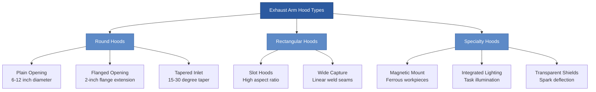

Local exhaust arms provide flexible, point-of-use fume capture for welding, soldering, grinding, and other operations generating hazardous airborne contaminants. These articulated duct systems allow operators to position capture hoods precisely at emission sources while maintaining unrestricted workspace access. Proper arm design balances structural rigidity, positioning flexibility, and aerodynamic performance to achieve capture efficiencies exceeding 95%.

## Articulating Arm Design and Features

Articulating exhaust arms consist of segmented rigid sections connected by friction joints or spring-balanced pivots. The arm structure must support its own weight plus aerodynamic loading from negative internal pressure without sagging during operation. High-quality arms maintain position indefinitely without drift or creep.

**Structural design elements:**

- **Segment length**: 18-36 inches per section for optimal balance between reach and stability
- **Joint friction**: Adjustable friction collars maintain position under ±5 lbf external force
- **Internal ductwork**: Smooth-wall construction minimizes pressure drop and particle deposition
- **Rotation capability**: Full 360-degree horizontal rotation at base and intermediate joints
- **Vertical range**: ±60 degrees from horizontal at each articulation point

The arm's moment of inertia determines positioning effort. Excessive weight requires two-handed adjustment, while insufficient mass causes overshooting during positioning. Target total arm mass between 15-30 pounds for single-handed operation by 95th percentile users.

**Counterbalancing mechanisms:**

Spring-counterbalanced arms use torsion springs at each joint to offset gravitational moments. Properly calibrated springs allow fingertip positioning throughout the working envelope. Gas springs provide constant force over the extension range but add complexity and maintenance requirements.

External counterweights mounted on parallelogram linkages maintain hood orientation regardless of arm position. This configuration keeps the hood opening perpendicular to the work surface as the arm articulates, optimizing capture geometry without manual adjustment.

## Flow Rates and Capture Velocities

Exhaust arm airflow must satisfy two competing requirements: sufficient capture velocity at the hood opening and adequate duct velocity for particle transport. The hood capture velocity depends on contaminant generation characteristics and cross-draft interference.

**Volumetric flow calculation for circular hoods:**

$$Q = 60 \times V_f \times A_h = 60 \times V_f \times \frac{\pi d^2}{4}$$

Where:
- $Q$ = volumetric flow rate (cfm)
- $V_f$ = hood face velocity (fpm)
- $A_h$ = hood face area (ft²)
- $d$ = hood diameter (ft)

For a 6-inch diameter hood (0.5 ft) with target face velocity of 150 fpm:

$$Q = 60 \times 150 \times \frac{\pi \times 0.5^2}{4} = 1767 \text{ fpm} \times 0.196 \text{ ft}^2 = 354 \text{ cfm}$$

The internal duct velocity must exceed minimum transport velocity to prevent particle settling and buildup. For welding fumes, maintain 3500-4500 fpm duct velocity.

**Duct diameter verification:**

$$d_{duct} = \sqrt{\frac{4Q}{\pi V_{duct} \times 60}}$$

For 400 cfm at 4000 fpm transport velocity:

$$d_{duct} = \sqrt{\frac{4 \times 400}{\pi \times 4000 \times 60}} = \sqrt{\frac{1600}{753982}} = 0.046 \text{ ft} = 5.5 \text{ inches}$$

This confirms a 6-inch internal duct provides adequate cross-section for particle transport without excessive pressure drop.

## Hood Configurations for Extraction Arms

Hood design dramatically affects capture efficiency and operator acceptance. The hood must intercept contaminant trajectories while minimizing workspace obstruction and providing clear sight lines to the work piece.

**Hood configuration specifications:**

| Hood Type | Diameter/Size | Flow Rate | Capture Distance | Application |
|-----------|---------------|-----------|------------------|-------------|
| Plain round | 6 inches | 300-400 cfm | 12-15 inches | Light welding, soldering |
| Plain round | 8 inches | 500-700 cfm | 15-18 inches | Medium welding, grinding |
| Plain round | 10 inches | 800-1000 cfm | 18-24 inches | Heavy welding, plasma cutting |
| Flanged round | 6 inches | 250-350 cfm | 12-15 inches | Confined spaces |
| Rectangular slot | 4 × 12 inches | 400-600 cfm | 10-14 inches | Linear welds |
| Wide capture | 8 × 12 inches | 800-1200 cfm | 18-24 inches | Robotic welding stations |

Flanged hoods increase capture efficiency by 20-25% compared to plain openings at equivalent flow rates. The flange directs airflow perpendicular to the hood face, reducing peripheral spillage. Specify flanges extending 1.5-2.0 times the hood diameter or width.

Transparent hood shields protect operators from UV radiation and sparks while maintaining visibility. Polycarbonate or acrylic shields withstand temperatures to 250°F and resist impact damage. Replace shields annually or when clarity degrades below 80% transmission.

## Self-Supporting versus Externally Supported Arms

Arm support method affects positioning flexibility, workspace clearance, and installation requirements. Self-supporting arms mount to benches, walls, or floor stands without overhead attachment. Externally supported arms suspend from ceiling or structural supports.

**Self-supporting arm characteristics:**

- **Bench mount**: Clamp or bolt to work surface edge, 500-800 lb capacity bench required
- **Floor stand**: Weighted base or floor anchor, 4-8 ft² footprint
- **Wall bracket**: Cantilevered support, structural wall attachment to studs or concrete
- **Maximum reach**: 8-10 feet from mounting point
- **Stability**: Requires wider base as reach increases, limits placement near aisles

Self-supporting installations suit permanent workstations with dedicated exhaust systems. The arm mounting height typically positions 36-48 inches above the work surface, allowing capture hood adjustment from table level to 72 inches elevation.

**Externally supported arm characteristics:**

- **Ceiling suspension**: Cable or rigid drop from overhead structure
- **Beam mounting**: Attachment to exposed structural steel or reinforced trusses
- **Rail systems**: Sliding carriage on overhead track for extended coverage
- **Maximum reach**: 10-15 feet from suspension point
- **Stability**: Superior to floor mounting, no floor space requirement

External supports eliminate floor obstructions and provide greater positioning range. Rail-mounted systems allow a single arm to service multiple workstations along a production line. The suspension point must support 200-300 pounds static load plus dynamic forces during repositioning.

## Positioning Flexibility Requirements

Operators must reposition exhaust arms frequently as work configurations change. Positioning effort, speed, and precision directly affect system utilization rates. Arms requiring excessive force or time remain in suboptimal positions, reducing capture effectiveness.

**Ergonomic positioning criteria:**

- **Actuation force**: 3-8 lbf maximum for single-handed adjustment
- **Positioning time**: 5 seconds or less from stored to working position
- **Position stability**: Less than 0.5 inches drift per hour under rated flow
- **Reach envelope**: Cover 95% of typical work area from single mounting location
- **Adjustment frequency**: Design for 50+ repositions per shift without fatigue

Joint friction adjustment accommodates variations in arm loading as ductwork accumulates debris or aftermarket accessories add weight. Accessible friction collars allow maintenance personnel to restore proper positioning force without disassembling the arm.

**Coverage pattern analysis:**

The arm's effective working envelope forms an ellipsoid centered on the mounting point. For a 10-foot arm with ±60 degree vertical articulation:

- Horizontal reach: 10 feet radius (314 ft² coverage)
- Vertical range: 8.7 feet (10 ft × sin 60°)
- Usable volume: ~2,500 ft³ accounting for structural interference

Position mounting points to minimize arm extension during typical operations. Maximum capture effectiveness occurs within 70% of full arm extension where moment loads remain modest and positioning control stays precise.

## Installation and Maintenance

Proper installation ensures structural integrity and optimal airflow performance. The mounting structure must support arm weight plus aerodynamic loads without deflection exceeding 0.25 inches under full suction.

**Installation sequence:**

1. **Verify structural capacity**: Confirm mounting surface or suspension point supports 300 lb static load with 3:1 safety factor
2. **Position mounting hardware**: Locate to minimize duct runs and avoid interference with material handling
3. **Install ductwork connections**: Use flexible connectors at arm base to accommodate rotation and vibration
4. **Connect to exhaust system**: Verify manual damper or blast gate controls individual arm airflow
5. **Balance system airflow**: Measure hood static pressure and adjust dampers for design flow distribution
6. **Test positioning function**: Verify smooth articulation through full range of motion without binding

Main duct connections require 6-8 inch diameter flexible duct with wire reinforcement to prevent collapse under suction. Limit flexible duct length to 36 inches maximum; excessive length increases pressure drop and reduces system efficiency. Secure connections with worm-gear clamps at 20 in-lb torque.

**Preventive maintenance schedule:**

| Task | Frequency | Procedure |
|------|-----------|-----------|
| Visual inspection | Daily | Check for physical damage, loose connections, abnormal noise |
| Hood cleaning | Weekly | Remove spatter, dust buildup reducing capture area |
| Duct interior inspection | Monthly | Examine for particle accumulation, internal duct damage |
| Joint friction adjustment | Quarterly | Restore proper positioning force, lubricate bearings |
| Flexible duct replacement | Annually | Replace deteriorated sections, verify airtight connections |
| Complete system rebalancing | Annually | Measure static pressures, airflows at all arms |

Welding spatter accumulation on hood surfaces reduces effective capture area by 10-30% over several weeks. Implement weekly cleaning protocols removing deposits with wire brushes or scraping tools. Magnetic hoods accumulate ferrous particles rapidly; daily cleaning maintains performance.

Internal duct inspection requires disassembly at joint sections. Acceptable particulate accumulation measures less than 0.25 inches depth on the duct bottom. Heavier accumulation indicates inadequate transport velocity or excessive particulate loading requiring increased cleaning frequency or system modifications.

Joint friction mechanisms wear from repeated articulation. Loose joints allowing uncontrolled arm movement indicate worn friction surfaces or spring fatigue. Replace friction collars or springs when adjustment range no longer provides stable positioning throughout the working envelope.

**Performance verification testing:**

Conduct quarterly hood static pressure measurements confirming design suction levels:

$$SP_{hood} = -4 \text{ to } -8 \text{ inches w.g.}$$

Static pressure outside this range indicates system degradation. Insufficient suction results from duct leaks, fan deterioration, or filter loading. Excessive suction indicates damper misadjustment or blockages in other system branches.

Smoke testing verifies capture patterns during actual welding operations. Release theatrical smoke or visible aerosol 12-18 inches from the hood opening while observing capture trajectory. Effective systems capture 90%+ of visible smoke without spillage beyond the hood periphery. Cross-drafts exceeding 50 fpm at the work surface compromise capture regardless of arm positioning.
