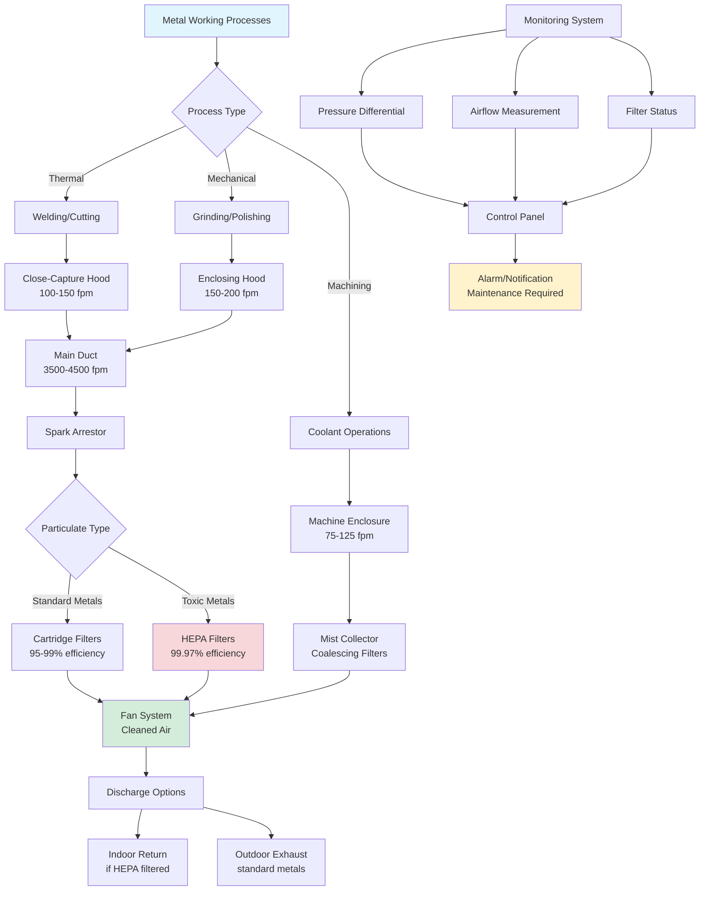

## Metal Fume Characteristics and Hazards

Metal working operations generate hazardous airborne contaminants that require effective local exhaust ventilation. These contaminants include metal fumes from thermal processes, particulates from mechanical operations, and oil mist from coolant systems.

**Primary Contaminant Types:**

- **Metal Fumes**: Submicron particles (0.001-1.0 μm) from welding, brazing, and plasma cutting
- **Metal Dust**: Larger particles (1-100 μm) from grinding, sanding, and polishing
- **Coolant Mist**: Oil aerosols and water-based fluid mist from machining operations
- **Composite Emissions**: Combinations of fumes, dust, and mist from integrated processes

Metal fumes pose significant health risks including metal fume fever, respiratory sensitization, and chronic lung disease. Hexavalent chromium from stainless steel welding and beryllium from aerospace alloys present particularly severe hazards requiring stringent exposure control.

## Cutting, Grinding, and Polishing Fumes

Mechanical metal working processes generate distinct emission profiles requiring tailored ventilation approaches.

**Thermal Cutting Operations:**

Plasma, laser, and oxyfuel cutting produce high concentrations of metal fumes. Plasma cutting of mild steel generates iron oxide fumes at rates of 50-150 mg/min. Downdraft tables or close-capture hoods positioned 6-12 inches from the cut zone provide optimal control.

**Grinding and Abrasive Operations:**

Grinding wheels, belt sanders, and disc grinders create substantial particulate emissions. The generation rate depends on material hardness, wheel speed, and applied pressure. Typical grinding operations produce 10-50 mg/min of respirable particulates.

**Polishing and Buffing:**

These finishing operations generate fine particulates mixed with buffing compound residues. Lower emission rates (5-20 mg/min) still require effective capture due to the fine particle size distribution and potential for dispersal.

## Hood and Capture Requirements

Effective capture of metal working emissions requires properly designed and positioned exhaust hoods. The required capture velocity depends on contaminant generation rate, thermal effects, and operator proximity.

**Capture Velocity Calculation:**

The minimum hood airflow for lateral slot hoods follows:

$$Q = V_c \cdot L \cdot \left(10X^2 + A\right)$$

Where:
- $Q$ = airflow rate (cfm)
- $V_c$ = capture velocity at source (fpm, typically 100-200)
- $L$ = slot length (ft)
- $X$ = distance from slot to source (ft)
- $A$ = hood face area (ft²)

**Hood Design Parameters:**

| Operation | Hood Type | Capture Velocity | Minimum Transport Velocity |
|-----------|-----------|------------------|---------------------------|
| Welding bench | Lateral exhaust | 100-150 fpm | 3,500-4,000 fpm |
| Grinding | Enclosing hood | 150-200 fpm | 4,000-4,500 fpm |
| Polishing | Downdraft table | 75-125 fpm | 3,000-3,500 fpm |
| Plasma cutting | Downdraft table | 100-150 fpm | 3,500-4,000 fpm |

**Positioning Requirements:**

Hood placement critically affects capture efficiency. Position hoods to:
- Intercept contaminant flow between source and operator breathing zone
- Minimize cross-drafts that disperse emissions (limit ambient air velocity to <50 fpm)
- Maintain recommended working distances (typically 6-18 inches from source)
- Account for thermal updrafts from hot processes

## Filtration for Metal Particulates

Metal particulate filtration systems must address wide particle size distributions and potential fire hazards from spark generation.

**Filtration Technology Selection:**

- **Cartridge Filters**: Pleated media providing 10-20 ft²/cartridge, efficiency 95-99.9% for particles >0.3 μm
- **Baghouse Collectors**: Fabric filter bags, efficiency >99% for particles >1 μm, suitable for high dust loading
- **HEPA Filters**: Required for toxic metals (hexavalent chromium, beryllium), 99.97% efficiency at 0.3 μm
- **Wet Collectors**: Water scrubbing for spark-generating operations, prevents fire risk

**Pressure Drop Considerations:**

Filter pressure drop increases with dust accumulation:

$$\Delta P = \Delta P_0 + K \cdot C \cdot t \cdot V$$

Where:
- $\Delta P$ = total pressure drop (in. wg)
- $\Delta P_0$ = clean filter pressure drop
- $K$ = dust cake permeability factor
- $C$ = inlet dust concentration (gr/ft³)
- $t$ = time since cleaning (hours)
- $V$ = face velocity (fpm)

Automated pulse-jet cleaning maintains acceptable pressure drop (4-8 in. wg) while extending filter life.

## Coolant Mist Collection

Machining operations using cutting fluids generate oil mist and water-based aerosols requiring specialized collection.

**Mist Generation Mechanisms:**

- **Mechanical**: High-speed tool rotation flings coolant into fine droplets
- **Evaporative**: Heat vaporizes fluid components creating submicron aerosols
- **Hydraulic**: High-pressure fluid jets atomize into respirable droplets

**Collection Methods:**

| Method | Particle Size Range | Efficiency | Application |
|--------|-------------------|------------|-------------|
| Mechanical separation | >10 μm | 70-85% | Pre-filtration |
| Coalescing filters | 0.5-10 μm | 95-99% | Primary collection |
| HEPA filtration | 0.01-0.5 μm | 99.97% | Final filtration |
| Electrostatic | 0.01-10 μm | 90-98% | Submicron mist |

**System Design:**

Coolant mist collectors mount directly on machine enclosures or connect via ducting. Capture airflow requirements:

$$Q = 50 \text{ to } 100 \times A_{opening}$$

Where $Q$ is in cfm and $A_{opening}$ is the enclosure opening area in ft². Higher face velocities (100-150 fpm) needed for open machines without enclosures.

## OSHA PEL Compliance

Metal working operations must comply with OSHA Permissible Exposure Limits for various metal species.

**Key Metal Exposure Limits:**

| Metal/Compound | OSHA PEL (8-hr TWA) | ACGIH TLV | Primary Health Concern |
|----------------|---------------------|-----------|------------------------|
| Iron oxide (welding fume) | 10 mg/m³ | 5 mg/m³ | Siderosis, respiratory irritation |
| Chromium (hexavalent) | 5 μg/m³ | 0.5 μg/m³ | Lung cancer, respiratory sensitization |
| Manganese (fume) | 5 mg/m³ (ceiling) | 0.02 mg/m³ | Neurological effects, Parkinsonism |
| Nickel (metal, soluble) | 1 mg/m³ | 1.5 mg/m³ | Respiratory sensitization, cancer |
| Beryllium | 0.2 μg/m³ | 0.05 μg/m³ | Chronic beryllium disease |
| Aluminum (fume) | 15 mg/m³ (total) | 1 mg/m³ | Respiratory irritation |

**Compliance Verification:**

Personal exposure monitoring establishes actual worker exposure levels. Sample collection uses calibrated pumps (2 L/min) with appropriate filter media over full work shifts. Analysis by inductively coupled plasma (ICP) spectroscopy provides quantitative metal concentrations.

**Control Hierarchy:**

1. **Engineering Controls**: Local exhaust ventilation primary defense
2. **Administrative Controls**: Work practice modifications, exposure rotation
3. **Personal Protective Equipment**: Respiratory protection when engineering controls insufficient

Effective local exhaust systems designed to maintain contaminant levels below 50% of PEL provide adequate safety margin accounting for system variability.

## System Design Considerations

**Ductwork Sizing:**

Maintain minimum transport velocities to prevent particulate settling. For metal dust and fumes:

$$V_{transport} = 4000 \sqrt{\frac{\rho_p}{\rho_{air}}}$$

Where $\rho_p$ is particle density and $\rho_{air}$ is air density. Metal particulates require 3,500-4,500 fpm transport velocity.

**Fan Selection:**

Specify fans for dirty air service with wear-resistant construction. Required static pressure overcomes system resistance:

$$SP_{total} = \Delta P_{hood} + \Delta P_{duct} + \Delta P_{filter} + \Delta P_{accessories}$$

Include 25-30% safety factor for filter loading and system degradation.

**Material Selection:**

Use spark-resistant aluminum or stainless steel ductwork for operations generating combustible metal dust (aluminum, magnesium, titanium). Ground all metallic components to prevent static accumulation.

Effective metal working fume extraction protects worker health, ensures regulatory compliance, and maintains productive work environments across diverse fabrication operations.
