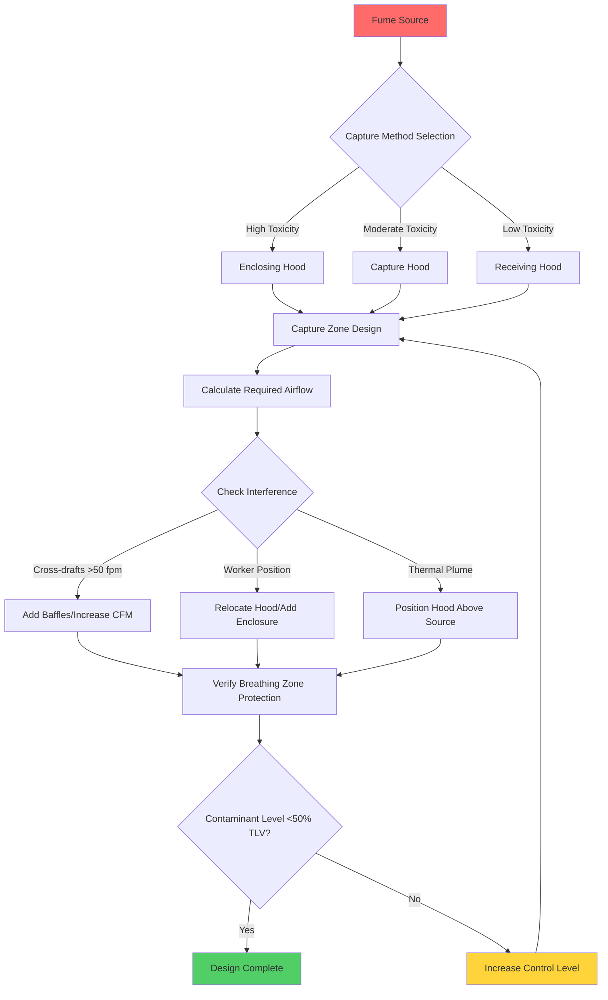

Source capture represents the most effective approach to controlling industrial fumes at their point of generation. This method intercepts contaminants before they enter the worker breathing zone or general workplace atmosphere, providing superior protection compared to dilution ventilation strategies.

## Source Capture vs Dilution Ventilation

Source capture and dilution ventilation represent fundamentally different approaches to air quality control.

**Source Capture Characteristics:**
- Captures contaminants at the point of generation
- Requires lower airflow volumes (100-1,000 CFM per source)
- Achieves contaminant concentrations below 5-10% of levels with dilution
- Suitable for toxic, high-concentration emissions
- Higher initial cost but lower operating energy
- Prevents contaminant dispersion into workspace

**Dilution Ventilation Characteristics:**
- Mixes contaminants with large air volumes
- Requires 10-100 times more airflow than source capture
- Acceptable only for low-toxicity materials
- Cannot handle high generation rates
- Lower installation cost but higher energy consumption
- Allows temporary exposure during mixing

The ACGIH Industrial Ventilation Manual establishes that source capture provides 90-99% control efficiency, while dilution ventilation typically achieves only 50-70% effectiveness for point sources.

## Capture Zone and Effectiveness

The capture zone defines the three-dimensional region where hood suction velocity exceeds contaminant dispersion velocity. Understanding this zone is critical for effective hood placement.

**Capture Zone Geometry:**

For a plain opening (flanged hood), the capture velocity at distance $X$ from the hood face follows:

$$V_x = \frac{Q}{10X^2 + A}$$

Where:
- $V_x$ = velocity at distance $X$ (ft/min)
- $Q$ = volumetric flow rate (CFM)
- $X$ = distance from hood face (ft)
- $A$ = hood face area (ft²)

For an unflanged circular opening:

$$V_x = \frac{Q}{\pi(X + 0.564\sqrt{A/\pi})^2}$$

**Effective Capture Distance:**

The maximum effective reach of a hood is where capture velocity equals the minimum required value (typically 50-200 ft/min depending on contaminant):

$$X_{max} = \sqrt{\frac{Q - A \cdot V_{capture}}{10 \cdot V_{capture}}}$$

Capture effectiveness decreases rapidly with distance. At one hood diameter from the face, velocity drops to approximately 10% of face velocity.

## Hood Positioning Relative to Source

Optimal hood positioning maximizes capture while minimizing airflow requirements.

**Positioning Principles:**

1. **Enclosure Priority:** Enclose the source to the maximum extent possible (capture effectiveness increases 5-10x)
2. **Minimum Distance:** Position hood within 1-2 hood diameters of source (capture zone strength)
3. **Vertical Placement:** Place hoods above heat sources to utilize thermal buoyancy (reduces required airflow by 30-50%)
4. **Lateral Coverage:** Ensure hood width exceeds source width by minimum 6 inches on each side
5. **Access Clearance:** Maintain worker access while preserving capture zone integrity

**Distance-Airflow Relationship:**

Doubling the hood-to-source distance increases required airflow by approximately 4x for equivalent capture. A hood at 6 inches requires ~400 CFM, while the same hood at 12 inches requires ~1,600 CFM for identical capture velocity.

## Airflow Patterns and Interference

Understanding airflow patterns prevents common capture failures.

**Interference Sources:**

- **Cross-drafts:** Room air currents >50 ft/min can deflect capture zone
- **Worker Position:** Personnel between hood and source block airflow
- **Process Movement:** Material handling disrupts established patterns
- **Thermal Currents:** Heat sources create upward plumes (100-200 ft/min)
- **Multiple Hoods:** Adjacent exhausts can create dead zones

**Mitigation Strategies:**

- Orient hoods perpendicular to dominant air currents
- Install partial enclosures or baffles (increase effectiveness 2-3x)
- Increase airflow 25-50% when cross-drafts exceed 100 ft/min
- Use push-pull ventilation for wide sources
- Coordinate hood placement to avoid interference zones

## Worker Breathing Zone Protection

The ultimate objective of source capture is protecting the worker breathing zone (defined as a hemisphere of 12-inch radius from nose/mouth).

**Protection Criteria:**

- Contaminant concentration <50% of Threshold Limit Value (TLV)
- Capture hood positioned to prevent contaminant path through breathing zone
- Worker positioned outside hood exhaust trajectory
- Breathing zone monitoring validates design assumptions

**High-Risk Configurations:**

1. Worker positioned between source and hood (contaminant stream passes through breathing zone)
2. Source below breathing zone with overhead hood (requires excessive airflow)
3. Multiple sources requiring body positioning near uncaptured emissions

## ACGIH Hierarchy of Controls

The American Conference of Governmental Industrial Hygienists establishes a control hierarchy prioritizing effectiveness:

| Control Level | Method | Effectiveness | Application to Source Capture |
|---------------|--------|---------------|-------------------------------|
| 1. Elimination | Remove hazard | 100% | Substitute non-fuming process |
| 2. Substitution | Replace with less hazardous | 90-100% | Use lower-temperature process |
| 3. Engineering Controls | Source capture LEV | 85-99% | Primary fume extraction method |
| 4. Administrative | Procedures, rotation | 50-80% | Supplement to engineering controls |
| 5. PPE | Respirators | 50-95% | Last resort when engineering inadequate |

Source capture local exhaust ventilation represents the third tier and the most effective practical control for processes that cannot eliminate fume generation. Proper design achieves 90-99% contaminant reduction, far exceeding administrative controls or PPE reliance.

**Engineering Control Priorities within Source Capture:**

1. **Enclosing Hoods:** Maximum enclosure (booth, cabinet) - 95-99% effective
2. **Capture Hoods:** Partial enclosure with directional capture - 85-95% effective
3. **Receiving Hoods:** Position to receive naturally rising contaminants - 70-90% effective
4. **Exterior Hoods:** Open capture without enclosure - 60-85% effective

## Comparison of Capture Methods

| Method | Typical Q/A (CFM/ft²) | Maximum Distance | Control Efficiency | Best Application |
|--------|------------------------|------------------|-------------------|------------------|
| Enclosing Hood (4-sided) | 60-100 | N/A (enclosed) | 95-99% | Toxic fumes, high generation |
| Slot Hood (flanged) | 100-150 | 0.5-1.0 × width | 85-95% | Linear sources, welding tables |
| Canopy Hood (above source) | 75-125 | 1.5 × diameter | 70-85% | Heat processes, thermal rise |
| Downdraft Table | 150-250 | 12-18 inches | 85-95% | Grinding, light particulate |
| Exterior Hood (unflanged) | 200-400 | 0.25-0.5 × diameter | 60-75% | Large objects, low toxicity |
| Movable Capture Arm | 100-200 | 24-36 inches | 70-90% | Intermittent operations |

Selection depends on contaminant toxicity, generation rate, work process requirements, and economic considerations. Higher control efficiency justifies higher installation cost for toxic materials.

Effective source capture requires integrated consideration of hood type, positioning, airflow calculations, and interference factors to achieve reliable breathing zone protection while minimizing energy consumption.
