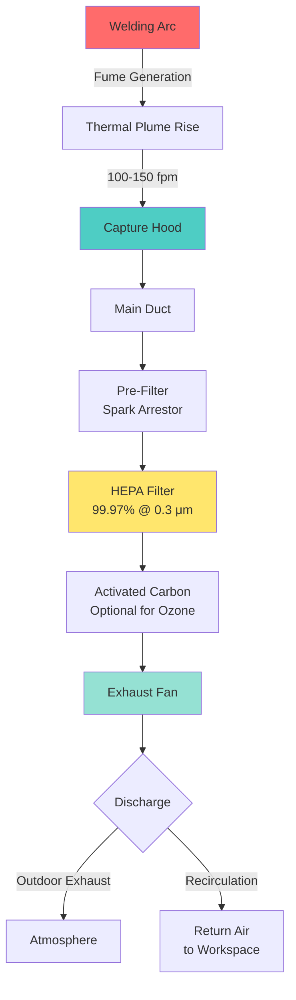

## Welding Fume Composition and Hazards

Welding fumes represent a complex mixture of metallic oxides, fluorides, and silicates produced during the fusion of base metals and filler materials. The composition varies significantly based on the welding process, base metal, electrodes, and coatings involved.

Primary hazardous constituents include:

- **Iron oxide** - the predominant component in most ferrous metal welding
- **Manganese** - neurotoxic metal causing Parkinsonism-like symptoms
- **Hexavalent chromium (Cr VI)** - carcinogenic compound from stainless steel welding
- **Nickel** - respiratory sensitizer and carcinogen
- **Cadmium** - from plated materials, highly toxic
- **Zinc oxide** - causes metal fume fever
- **Ozone and nitrogen oxides** - from arc processes

Particle sizes range from 0.01 to 1.0 micrometers, with most particles below 0.5 micrometers. These respirable particles penetrate deep into the lungs, increasing the risk of pneumoconiosis, lung cancer, and systemic toxicity.

## Capture Velocity Requirements

Effective fume extraction requires sufficient capture velocity to overcome thermal updrafts and lateral air currents at the welding source. The required capture velocity depends on hood configuration and working distance.

For welding operations, ACGIH recommends:

- **Canopy hoods**: 100-150 fpm at the farthest point of fume generation
- **Side-draft hoods**: 100-200 fpm at the work point
- **Downdraft tables**: 50-100 fpm through the working surface
- **Portable extraction arms**: 150-250 fpm at the hood face

The volumetric flow rate for a rectangular hood is calculated as:

$$Q = V \times A = V \times W \times H$$

Where:
- $Q$ = volumetric flow rate (cfm)
- $V$ = capture velocity (fpm)
- $A$ = hood face area (ft²)
- $W$ = hood width (ft)
- $H$ = hood height (ft)

For circular hoods or extraction arms:

$$Q = V \times \frac{\pi D^2}{4}$$

Where $D$ is the hood diameter in feet.

The required flow rate increases with distance from the source according to:

$$Q = V \times (10X^2 + A)$$

Where:
- $X$ = distance from source to hood face (ft)
- $A$ = hood face area (ft²)

## Hood Types for Welding Operations

### Fixed Hoods

**Downdraft Tables**: Perforated work surfaces with plenum chambers beneath draw fumes downward. Recommended for small parts and assembly welding. Face velocity through the table surface should be 50-100 fpm.

**Canopy Hoods**: Positioned above the work area to capture rising thermal plumes. Effective only when mounted within 3-4 feet of the weld point. Minimum capture velocity of 100 fpm at the farthest weld location.

**Side-Draft Booths**: Vertical or sloped back walls with exhaust plenums capture fumes horizontally. Suitable for larger fabrication work. Face velocity should be 100-150 fpm at the work zone.

### Portable Extraction Systems

**Articulating Arms**: Flexible duct arms with capture hoods positioned 6-12 inches from the weld point. Provide 1000-2000 cfm per arm. Most versatile solution for varied welding locations.

**Gun-Mounted Extractors**: Built directly into MIG welding guns, providing point-of-generation capture. Require 30-60 cfm per gun. Highly effective but limited to specific processes.

**Backdraft Benches**: Self-contained workstations with rear exhaust plenum and recirculating filtration. Face velocity 60-100 fpm across the work opening.

## Fixed vs Portable Extraction Systems

**Fixed Systems** provide permanent source capture for dedicated welding stations. Advantages include consistent performance, integration with building HVAC, and minimal worker intervention. Ductwork design follows standard industrial ventilation principles with minimum transport velocities of 3500-4000 fpm to prevent particulate settling.

Total system static pressure:

$$SP_{total} = SP_{hood} + SP_{duct} + SP_{filter} + VP_{fan}$$

Where velocity pressure $VP = \left(\frac{V}{4005}\right)^2$ inches w.g. for standard air.

**Portable Systems** offer flexibility for changing work locations and job shop environments. Self-contained units with integral filtration eliminate ductwork requirements. Limitations include higher maintenance, regular filter replacement, and potential for operator bypass.

## Filtration Requirements for Welding Fumes

Multi-stage filtration addresses the particle size distribution and chemical composition of welding fumes:

### Primary Stage
Mechanical pre-filters or cyclonic separators remove larger particles (>5 micrometers) and prevent spark entry into subsequent filter stages. Collection efficiency 80-90% by weight.

### Secondary Stage
HEPA filters capture respirable particles with 99.97% efficiency at 0.3 micrometers. Mandatory for hexavalent chromium and manganese control. Differential pressure indicators should trigger replacement at 4-6 inches w.g.

Filter surface area required:

$$A_{filter} = \frac{Q}{v_{face}}$$

Where typical HEPA face velocities range from 250-350 fpm.

### Tertiary Stage
Activated carbon adsorption removes gaseous contaminants including ozone and volatile organic compounds. Required for aluminum welding and processes generating significant ozone (>0.1 ppm).

## OSHA Exposure Limits and Compliance

OSHA mandates strict permissible exposure limits (PELs) for welding fume constituents:

| Contaminant | 8-Hour TWA PEL | STEL | Monitoring Required |
|-------------|----------------|------|---------------------|
| Manganese (fume) | 5 mg/m³ (ceiling) | - | Initial and periodic |
| Hexavalent Chromium | 5 μg/m³ | - | Yes, if potential >2.5 μg/m³ |
| Total Welding Fume | 5 mg/m³ | - | Initial assessment |
| Iron Oxide | 10 mg/m³ | - | If employee exposure |
| Nickel | 1 mg/m³ | - | Stainless steel welding |
| Cadmium | 5 μg/m³ | - | Plated materials |
| Ozone | 0.1 ppm | - | Arc welding processes |
| Nitrogen Dioxide | 5 ppm | - | Gas shielded processes |

The 2006 OSHA hexavalent chromium standard (29 CFR 1910.1026) significantly reduced the previous PEL from 52 μg/m³ to 5 μg/m³, requiring engineering controls for most stainless steel welding operations.

For manganese, OSHA lowered the ceiling limit to 5 mg/m³ in 2013, with ongoing consideration for further reductions based on neurotoxicity research. Respiratory protection alone is insufficient; engineering controls must reduce exposure to the lowest feasible level.

Air sampling methodology follows NIOSH methods 7300 (elements by ICP) and 7604 (hexavalent chromium). Personal breathing zone samples determine actual worker exposure versus area samples that may underestimate true exposure.

Effective welding fume extraction systems combine appropriate hood design, adequate capture velocity, proper transport duct design, and multi-stage filtration to maintain exposures below regulatory limits while protecting worker health.
