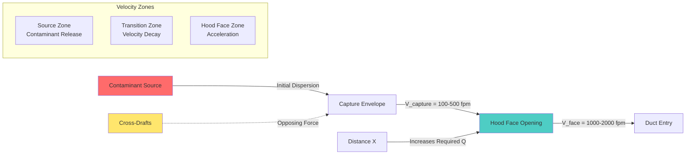

## Capture Velocity Definition

Capture velocity is the minimum air velocity induced by an exhaust hood at the most remote point of contaminant generation, sufficient to overcome opposing air currents and contaminant dispersion forces to draw the contaminant into the hood opening. This velocity represents a critical design parameter for exterior (capturing-type) hoods positioned outside the contaminated zone.

The capture velocity must be established at the source location, not at the hood face. For exterior hoods, the required volumetric flow rate increases dramatically with distance between hood and source due to the rapid velocity decay in open air.

**Measurement principles:**
- Measured using thermal anemometer or vane anemometer at source location
- Traverse measurement required for dispersed sources
- Measurement performed with all cross-drafts and process conditions operational
- Minimum acceptable velocity applies at worst-case source position

## Fundamental Airflow Relationship

The basic relationship governing exhaust hood design connects volumetric flow rate, velocity, and cross-sectional area:

$Q = V \times A$

Where:
- $Q$ = volumetric flow rate (ft³/min, cfm)
- $V$ = air velocity (ft/min, fpm)
- $A$ = cross-sectional area (ft²)

For hood face calculations:

$Q = V_{face} \times A_{face}$

For capture point calculations (exterior hoods):

$Q = V_{capture} \times A_{envelope}$

The envelope area represents the imaginary surface at the capture distance encompassing all contaminant sources. Velocity must equal or exceed the required capture velocity across this entire envelope.

## ACGIH Capture Velocity Selection Criteria

The American Conference of Governmental Industrial Hygienists (ACGIH) Industrial Ventilation Manual establishes capture velocity ranges based on contaminant release conditions and ambient air motion. These criteria represent fundamental design guidance for industrial exhaust systems.

| Release Condition | Air Motion Characteristics | Capture Velocity Range | Design Examples |
|------------------|----------------------------|----------------------|-----------------|
| Released with essentially no velocity into quiet air | Minimal room air movement, evaporation from tanks, degreasing | 50-100 fpm | Solvent degreasing tanks, liquid storage |
| Released at low velocity into moderately still air | Low-speed equipment, intermittent releases | 100-200 fpm | Container filling, low-speed conveyor transfer points |
| Active generation into zone of rapid air motion | Active grinding, crushing, tumbling, gas evolution | 200-500 fpm | Abrasive blasting, barrel filling, screening operations |
| Released at high initial velocity into very rapid air motion | High-speed grinding, abrasive blasting in turbulent environment | 500-2000 fpm | High-speed grinders, pneumatic material discharge |

**Selection factors:**

1. **Cross-draft velocity:** If ambient cross-drafts exceed 50% of capture velocity, effectiveness significantly decreases. Design capture velocity should be 2-3 times maximum expected cross-draft velocity.

2. **Contaminant hazard:** Higher toxicity substances require higher design velocities (upper end of range) to ensure reliable capture.

3. **Release velocity:** Contaminants released with high initial velocity require higher capture velocities to overcome momentum.

4. **Dispersion tendency:** Fine particulates and low-density fumes disperse rapidly, requiring higher capture velocities than coarse particles or dense vapors.

## Velocity Decay and Distance Relationship

Air velocity induced by an exhaust hood decreases rapidly with distance from the hood opening following inverse-square relationships. This velocity decay fundamentally limits the effective capture range of exterior hoods.

**For unflanged circular or square openings:**

$V_x = \frac{Q}{10X^2 + A}$

Where:
- $V_x$ = velocity at distance $X$ from hood face (fpm)
- $Q$ = hood volumetric flow rate (cfm)
- $X$ = distance from hood face (ft)
- $A$ = hood face area (ft²)

**For flanged openings (flange extending ≥ hood diameter):**

$V_x = \frac{Q}{0.75(10X^2 + A)}$

The flange reduces the effective area constant by approximately 25%, increasing velocity for equivalent airflow.

**For rectangular slot openings (length >> width):**

$V_x = \frac{3.7 \times V_{slot} \times L \times W}{X \times (L + 1.4X)}$

Where:
- $V_{slot}$ = slot velocity (fpm)
- $L$ = slot length (ft)
- $W$ = slot width (ft)
- $X$ = distance from slot (ft)

**Critical design implications:**

- Doubling the capture distance requires approximately 4 times the airflow
- Effective capture range rarely exceeds 1-2 hood diameters for exterior hoods
- Hood-to-source distance represents the most significant design variable
- Minimizing capture distance provides the greatest energy efficiency improvement

## Contaminant Characteristics Influence

Physical and chemical properties of contaminants directly affect required capture velocity through their influence on dispersion behavior and health hazard.

**Particle size effects:**

- **Coarse particles (>100 μm):** Settle rapidly under gravity, lower capture velocities adequate for particles at rest, higher velocities needed to overcome initial projection
- **Fine particles (10-100 μm):** Remain airborne for extended periods, disperse readily with air currents, require mid-range capture velocities
- **Respirable particles (<10 μm):** Follow air streamlines closely, disperse widely, require higher capture velocities for reliable capture

**Vapor density effects:**

- **Dense vapors (specific gravity >1):** Tend to settle and pool, may require floor-level or low-level capture, lower velocities sufficient for contained areas
- **Neutral density vapors:** Disperse uniformly with air, follow room air currents, require standard capture velocities
- **Light vapors (specific gravity <1):** Rise due to buoyancy, may be captured by overhead hoods with lower induced velocities if thermal convection assists

**Temperature effects:**

- **Hot processes:** Thermal buoyancy provides upward velocity assisting capture by overhead hoods, may reduce required induced velocity
- **Cold processes:** No thermal assistance, full capture velocity must be induced mechanically
- **Heated contaminants:** Thermal expansion increases volumetric flow requirements at temperature

**Toxicity classification:**

- **Highly toxic materials (TLV <10 ppm or <0.1 mg/m³):** Require capture velocities at upper end of range, safety factors of 2-4 applied
- **Moderate toxicity (TLV 10-100 ppm):** Standard capture velocities with safety factor of 1.5-2
- **Low toxicity (TLV >100 ppm):** Minimum recommended velocities acceptable

## Design Safety Factors

Engineering safety factors compensate for uncertainty in design parameters, variability in operating conditions, and degradation over time. Capture velocity calculations should incorporate appropriate safety factors based on application criticality.

**Recommended safety factors:**

| Application Factor | Multiplier | Justification |
|-------------------|-----------|---------------|
| High toxicity contaminants | 2.0-4.0 | Minimal exposure tolerance |
| Uncertain cross-draft conditions | 1.5-2.0 | Actual cross-drafts may exceed estimates |
| Variable source position | 1.5-2.5 | Design must accommodate worst-case positioning |
| Intermittent high-velocity releases | 1.5-2.0 | Peak conditions govern design |
| Future process changes | 1.25-1.5 | Accommodate production increases |
| System aging and fouling | 1.25-1.5 | Performance degradation over time |

**Cumulative factor application:**

Safety factors should not be blindly multiplied. Instead, identify the dominant uncertainty and apply the corresponding factor, then add 10-25% for secondary uncertainties:

$Q_{design} = Q_{calculated} \times SF_{primary} \times (1 + 0.1 \text{ to } 0.25)$

**Over-design consequences:**

Excessive safety factors create problems:
- Increased energy consumption throughout system life
- Higher initial equipment costs (larger fans, ductwork, collectors)
- Potential for excessive velocities causing material re-entrainment
- Noise and vibration issues from high-velocity airflow

**Under-design consequences:**

Insufficient airflow results in:
- Inadequate contaminant capture and worker exposure
- Regulatory non-compliance
- Difficulty achieving design performance under actual conditions
- Requirement for expensive system modifications

## Practical Design Procedure

1. **Identify contaminant release conditions:** Determine release velocity, air motion characteristics, and contaminant properties
2. **Select base capture velocity:** Use ACGIH table appropriate for release conditions
3. **Determine capture distance:** Establish maximum hood-to-source distance based on physical constraints
4. **Calculate envelope area:** Define imaginary surface at capture distance encompassing all sources
5. **Calculate required airflow:** $Q = V_{capture} \times A_{envelope}$
6. **Apply safety factors:** Adjust for application-specific uncertainties
7. **Verify cross-draft conditions:** Ensure $V_{capture} \geq 2 \times V_{cross-draft}$
8. **Optimize hood placement:** Minimize capture distance to reduce required airflow

The most effective design improvement involves reducing hood-to-source distance, often providing 50-75% airflow reduction for each halving of distance. Physical process constraints permitting, positioning hoods as close as practical to contaminant sources represents optimal design practice.

## Performance Verification

After installation, verification confirms design capture velocity achievement:

- **Point measurement:** Anemometer readings at defined source locations under operating conditions
- **Smoke tube testing:** Visual confirmation of airflow patterns drawing smoke from all source positions into hood
- **Tracer gas testing:** Quantitative measurement of capture efficiency using controlled tracer release
- **Continuous monitoring:** Permanent velocity measurement stations for critical applications

Measured capture velocities below design values indicate system deficiencies requiring correction before operation proceeds.
