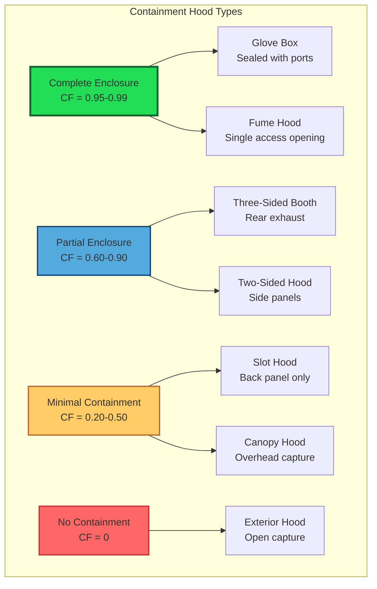

Containment represents the primary strategy for controlling airborne contaminants at the source. The fundamental principle involves physically restricting the volume from which contaminated air can escape, thereby reducing the exhaust airflow required for effective control while improving overall system performance.

## Enclosing vs Capturing Hood Concepts

Industrial exhaust hoods operate on two distinct principles: enclosure and capture. Enclosing hoods surround the contaminant source partially or completely, creating a physical barrier that limits dispersion. The hood exhaust then removes contaminated air from within the confined space. Capturing hoods, conversely, rely on air velocity to draw contaminants from an open source into the hood inlet without physical barriers.

The effectiveness difference is substantial. An enclosing hood requires only sufficient airflow to maintain slight negative pressure and overcome thermal or process-induced air currents. A capturing hood must generate adequate capture velocity at the contaminant source, which typically demands 10 to 100 times more exhaust airflow depending on distance from the hood face.

For a capturing hood, the required volumetric flow rate follows:

$$Q = V_c \cdot A_s$$

where $Q$ is volumetric flow rate (cfm), $V_c$ is capture velocity at the source (fpm), and $A_s$ is the surface area at the capture distance (ft²). Because area increases with the square of distance, doubling the distance from hood to source quadruples the required airflow.

An enclosing hood requires only:

$$Q_e = V_f \cdot A_o + Q_p$$

where $Q_e$ is exhaust flow rate (cfm), $V_f$ is face velocity at openings (typically 60-200 fpm), $A_o$ is total open area (ft²), and $Q_p$ represents process air additions from thermal plumes or mechanical disturbances.

## Partial vs Complete Enclosure

Complete enclosures fully surround the contaminant source except for necessary access openings. Examples include laboratory fume hoods, glove boxes, and blasting cabinets. These provide maximum containment but limit accessibility and may not accommodate all processes.

Partial enclosures utilize walls, baffles, or barriers on three or more sides to restrict contaminant dispersion while maintaining operational access. A three-sided booth with exhaust at the rear wall represents a common partial enclosure. The containment factor (CF) quantifies effectiveness:

$$CF = \frac{A_t - A_o}{A_t}$$

where $A_t$ is total area that would be open without enclosure, and $A_o$ is actual open area. A containment factor of 0.75 indicates 75% of potential openings are enclosed, typically reducing required airflow by 60-80% compared to a capturing hood.

## Containment Effectiveness Factors

Multiple factors determine actual containment performance beyond geometric configuration:

**Cross-drafts** represent the primary enemy of containment. Room air currents exceeding 50-100 fpm can overcome hood exhaust at typical face velocities, allowing contaminants to escape. Positioning hoods away from doorways, windows, and building HVAC diffusers proves critical.

**Thermal effects** from hot processes create buoyant plumes with significant momentum. The induced volumetric flow in a thermal plume is:

$$Q_t = 9.4 \cdot T_p^{1/3} \cdot H^{5/3}$$

where $Q_t$ is plume flow (cfm), $T_p$ is heat release (BTU/min), and $H$ is height above source (ft). Hood exhaust must exceed this plume flow to maintain containment.

**Process momentum** from grinding, spray operations, or material handling imparts directional velocity to particles and vapors. Enclosure walls positioned perpendicular to the dominant momentum vector provide maximum effectiveness.

**Turbulence** within the enclosure can create eddies that transport contaminants toward openings. Smooth airflow patterns with minimal obstructions improve containment.

## Air Curtains and Baffles

Air curtains generate a moving air plane across an opening to supplement physical containment. Supply air discharged through a slot creates a high-velocity sheet that deflects contaminants back into the enclosed space. The required air curtain velocity is:

$$V_{ac} = 1.5 \cdot V_d + V_{cross}$$

where $V_{ac}$ is air curtain velocity (fpm), $V_d$ is contaminant dispersal velocity (fpm), and $V_{cross}$ represents cross-draft velocity (fpm). The factor 1.5 provides a safety margin.

Air curtains consume significant energy and introduce additional airflow that the exhaust system must handle. They prove most effective for maintaining thermal separation or excluding external drafts rather than primary containment.

Baffles—fixed plates or adjustable panels within the hood—direct airflow and improve capture effectiveness. A baffle positioned behind a contaminant source creates a low-pressure zone that draws air across the source toward the exhaust. Baffles also reduce turbulence and dead zones where contaminants might accumulate.

## Booth and Enclosure Ventilation

Spray booths and similar enclosures require uniform airflow distribution to prevent contaminant buildup and ensure consistent capture. The key design parameters include:

| Parameter | Paint Booth | Powder Coating | Welding Booth | Laboratory Hood |
|-----------|-------------|----------------|---------------|-----------------|
| Face velocity (fpm) | 100-150 | 150-200 | 100-150 | 80-120 |
| Air distribution | Downdraft or crossdraft | Downdraft preferred | Rear exhaust | Rear exhaust |
| Filtration | Dry or water wash | Cartridge filters | Fume filters | HEPA if required |
| Makeup air | Heated, 100% replacement | Heated, 100% replacement | Tempered, 90-100% | None (general HVAC) |
| Explosion protection | Class I Division 2 | Grounding required | Not typically required | Chemical-specific |

Downdraft booths exhaust through floor gratings, providing excellent control for heavier-than-air vapors and overspray. Crossdraft designs exhaust through one wall while introducing makeup air from the opposite side, creating a horizontal air sweep suitable for larger objects or walk-through configurations.

## Work Practices and Containment

Even optimal hood design fails without proper work practices. The operator must:

**Position work within the enclosure**, not at the opening plane. Each inch the source moves toward the opening reduces containment effectiveness. As a guideline, work should remain at least 6 inches inside the hood face.

**Minimize obstructions** between the source and exhaust. Each obstacle creates turbulence and dead zones. Tools and materials should be stored outside the direct airflow path.

**Control process variables** that affect contaminant generation. Lower temperatures, reduced agitation, and covered containers all reduce the challenge to the ventilation system.

**Verify hood performance** regularly using smoke tubes, anemometers, or electronic monitors. Static pressure measurements at standardized locations provide ongoing verification that exhaust flow remains adequate.

The relationship between containment and work practice is multiplicative, not additive. A well-designed hood operated improperly performs worse than a marginal hood used correctly. Training programs must emphasize that the hood is a system component requiring active operator engagement, not a passive safety device that functions automatically regardless of use patterns.

Containment principles provide the foundation for energy-efficient, effective industrial exhaust ventilation. By minimizing the volume from which contaminants can escape through physical barriers, airflow requirements decrease dramatically while control reliability increases substantially.
