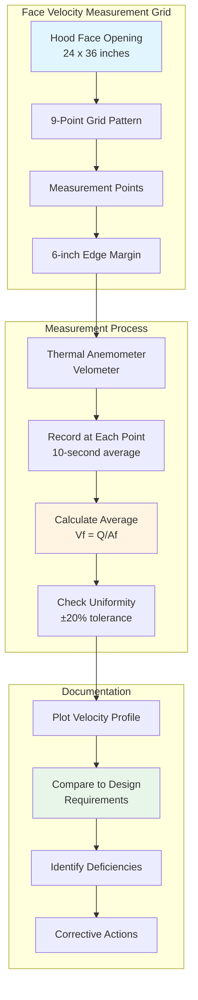

Face velocity represents the average air velocity measured across the hood opening perpendicular to the face plane. This critical parameter determines the hood's ability to capture and contain contaminants at the source. Face velocity directly influences both capture efficiency and energy consumption, making it a fundamental design consideration for industrial local exhaust ventilation systems.

## Face Velocity Definition and Measurement

Face velocity ($V_f$) is calculated as the volumetric flow rate divided by the hood face area:

$$V_f = \frac{Q}{A_f}$$

where $Q$ is the exhaust flow rate (CFM) and $A_f$ is the hood face area (ft²).

Measurement requires dividing the hood face into equal areas using a grid pattern, with readings taken at the center of each grid section. The minimum number of measurement points depends on hood size, typically ranging from 9 points for small hoods to 25+ points for large openings. Measurements must be taken at least 6 inches from hood edges to avoid edge effects and turbulence.

## Recommended Face Velocities by Application

Face velocity requirements vary significantly based on contaminant characteristics, generation rate, and toxicity. ACGIH Industrial Ventilation Manual provides guidance for various applications.

| Hood Type | Application | Face Velocity (FPM) | Rationale |
|-----------|-------------|---------------------|-----------|
| Bench-Mounted Enclosure | Light vapor, low toxicity | 60-100 | Minimal air currents, low generation rate |
| Laboratory Fume Hood | Chemical handling | 80-120 | Standard ANSI/AIHA Z9.5 requirement |
| High-Hazard Fume Hood | Highly toxic materials | 100-150 | Enhanced containment for toxic substances |
| Spray Booth (Open Face) | Solvent spraying | 100-150 | Overspray capture, moderate toxicity |
| Grinding/Polishing Hood | Particulate generation | 150-200 | High-velocity particles require higher capture |
| Welding Hood | Fume and particulate | 100-150 | Hot thermal plume assistance |
| Acid/Corrosive Hood | Corrosive vapor handling | 100-125 | Enhanced containment, material protection |
| Radioisotope Hood | Radioactive material | 125-150 | Maximum containment required |

These values assume minimal cross-drafts. Higher face velocities may be required when ambient air currents exceed 50 FPM or when hood placement cannot avoid traffic patterns.

## Face Velocity Uniformity

Uniform face velocity distribution ensures consistent capture performance across the entire hood opening. ANSI/AIHA Z9.5 specifies that no individual measurement point should deviate more than ±20% from the average face velocity. This requirement prevents dead zones and preferential flow paths that compromise containment.

Non-uniform velocity profiles typically result from:

- Improper plenum design with inadequate flow distribution
- Asymmetric duct connections creating unbalanced flow
- Obstructions near the hood face (equipment, stored materials)
- Damaged or missing baffles in the plenum chamber
- Excessive duct velocity causing flow imbalance at the connection

The uniformity coefficient ($U_c$) quantifies velocity distribution:

$$U_c = 1 - \frac{\sqrt{\sum_{i=1}^{n}(V_i - V_{avg})^2/n}}{V_{avg}}$$

where $V_i$ represents individual velocity measurements and $V_{avg}$ is the average face velocity. A uniformity coefficient above 0.80 indicates acceptable performance.

## Relationship to Capture Efficiency

Face velocity directly affects capture efficiency through its influence on the velocity field extending from the hood face. The effective capture zone extends approximately 1.0 to 1.5 hood diameters in front of the opening for flanged hoods, with higher face velocities extending this zone further.

Capture efficiency ($\eta_c$) increases with face velocity according to empirical relationships, but excessive velocities create turbulence that can disrupt capture patterns. The optimal face velocity balances adequate capture with energy efficiency and process compatibility.

For slot hoods, the relationship between face velocity and capture distance follows:

$$V_x = V_f \left(\frac{A_f}{A_x}\right)$$

where $V_x$ is the velocity at distance $x$ from the hood and $A_x$ is the cross-sectional area of the flow field at that distance.

## Face Velocity Measurement Diagram

## Testing and Verification Methods

ANSI/ASHRAE Standard 110 provides the standardized test method for laboratory fume hood performance, including face velocity measurement. Key testing protocols include:

**Initial Acceptance Testing**: Conducted upon installation with all systems balanced and commissioned. Requires testing at design face velocity with verification of uniformity across the opening.

**Periodic Performance Testing**: Annual testing recommended for general applications, quarterly for high-hazard operations. Includes face velocity measurement, smoke pattern visualization, and tracer gas containment testing.

**Continuous Monitoring**: Modern systems employ permanent velocity sensors with alarm systems to alert users when face velocity falls below acceptable limits. Sensors should be located to measure representative flow without obstructing the hood opening.

## OSHA and ANSI Requirements

OSHA 29 CFR 1910.1450 (Laboratory Standard) requires employers to ensure laboratory fume hoods function properly but does not specify numerical face velocity values. OSHA relies on consensus standards for technical requirements.

ANSI/AIHA Z9.5 establishes 80-120 FPM as the recommended face velocity range for general-purpose laboratory fume hoods, with the specific value determined by:

- Contaminant toxicity and exposure limits
- Quantity of material handled
- Heat release from processes within the hood
- Presence of cross-drafts and air currents
- User practices and hood configuration

The standard requires verification that face velocity remains within ±20% of the target value across all measurement points and that continuous monitoring systems provide alarm notification when velocity deviates beyond acceptable limits.

NFPA 45 (Fire Protection for Laboratories Using Chemicals) references the same 80-120 FPM range and requires annual performance testing to verify continued compliance. Documentation of all testing must be maintained for inspection and regulatory compliance verification.

Proper face velocity selection, measurement, and maintenance ensure industrial exhaust hoods provide effective worker protection while optimizing energy consumption and system performance throughout the operational lifecycle
