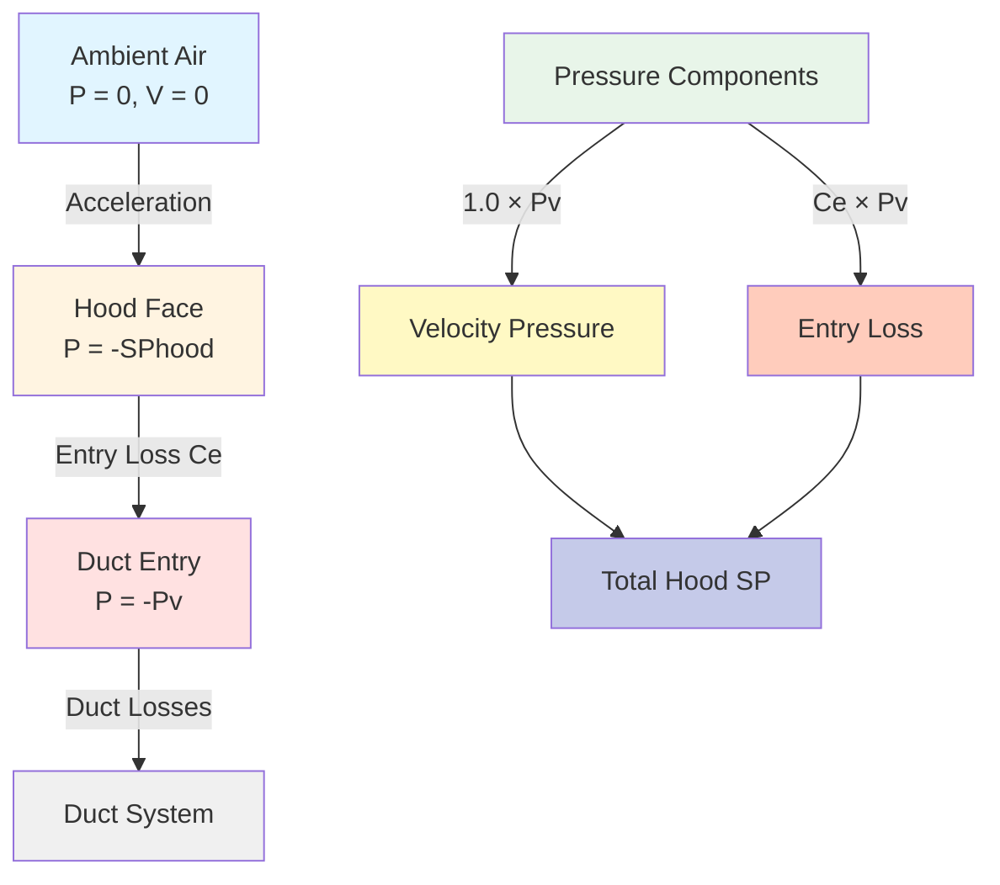

# Hood Static Pressure in Industrial Exhaust Systems

Hood static pressure represents the fundamental pressure differential required to induce airflow from the ambient environment into a local exhaust ventilation (LEV) hood. This parameter directly governs capture efficiency and determines the energy required for contaminant control. Understanding hood static pressure from first principles enables accurate system design and troubleshooting.

## Physical Principles of Hood Static Pressure

The static pressure at a hood entry point reflects the sum of all energy losses as air accelerates from rest into the duct system. According to Bernoulli's equation applied to this flow scenario:

$$P_{hood} = P_{velocity} + P_{loss}$$

Where the velocity pressure converts kinetic energy requirements into pressure terms:

$$P_{velocity} = \frac{\rho V^2}{2}$$

For standard air at 70°F and sea level, this simplifies to:

$$P_{v} = \left(\frac{V}{4005}\right)^2 \text{ inches w.g.}$$

where $V$ is in feet per minute.

The hood entry loss coefficient quantifies the efficiency of the transition from ambient conditions to duct flow. The complete hood static pressure equation becomes:

$$SP_{hood} = P_{v} \left(1 + C_{e}\right)$$

where $C_{e}$ represents the hood entry loss coefficient, a dimensionless parameter ranging from 0.05 for well-designed tapered entries to 1.78 for sharp-edged openings.

## ACGIH Hood Static Pressure Methodology

The American Conference of Governmental Industrial Hygienists (ACGIH) establishes the industry-standard approach for hood static pressure determination. This methodology accounts for hood geometry, approach conditions, and flow characteristics.

For unflanged circular openings, the entry loss coefficient is 0.93, reflecting substantial turbulence at sharp edges. Adding a flange reduces this to 0.82 by eliminating flow separation around the hood perimeter. Tapered entries with included angles below 60 degrees achieve coefficients as low as 0.05, representing near-ideal flow conditions.

Slot hoods present additional complexity due to aspect ratio effects. The ACGIH Industrial Ventilation Manual provides correction factors for slot length-to-width ratios exceeding 4:1, where flow distribution becomes non-uniform.

## Pressure Component Analysis

Hood static pressure comprises three distinct physical mechanisms:

**Acceleration Pressure**: Energy required to accelerate stagnant air to duct velocity. This component equals one velocity pressure and is unavoidable in any hood design.

**Form Loss**: Energy dissipated as turbulence due to flow separation and vortex formation at hood boundaries. Sharp edges create maximum form loss, while streamlined shapes minimize this component.

**Friction Loss**: Energy lost to viscous shear within the hood entry region. For properly designed hoods with length-to-diameter ratios below 1.0, friction losses remain negligible compared to form losses.

## Hood Type Pressure Loss Comparison

Different hood configurations produce vastly different pressure requirements for equivalent capture velocities. The following table quantifies these differences based on ACGIH data:

| Hood Type | Entry Coefficient (Ce) | Total SP Factor | Relative Energy |
|-----------|------------------------|-----------------|-----------------|
| Plain opening (unflanged) | 0.93 | 1.93 | 100% |
| Plain opening (flanged) | 0.82 | 1.82 | 94% |
| Tapered entry (60° included angle) | 0.25 | 1.25 | 65% |
| Bell mouth entry (r/D = 0.2) | 0.05 | 1.05 | 54% |
| Slot hood (unflanged, AR < 4) | 1.78 | 2.78 | 144% |
| Slot hood (flanged, AR < 4) | 1.30 | 2.30 | 119% |
| Canopy hood (side open) | 0.40 | 1.40 | 73% |
| Enclosing hood (80% enclosed) | 0.50 | 1.50 | 78% |

The relative energy column indicates fan power requirements normalized to an unflanged plain opening, assuming identical airflow rates. A bell mouth entry reduces fan energy by 46% compared to a sharp-edged opening.

## Calculation Methodology

Determining hood static pressure follows this systematic approach:

1. **Calculate duct velocity** from required volumetric flow rate and duct area: $V = Q / A$

2. **Determine velocity pressure** using the standard air relationship: $P_{v} = (V/4005)^2$

3. **Select hood entry coefficient** from ACGIH tables based on hood geometry and boundary conditions

4. **Compute hood static pressure**: $SP_{hood} = P_{v}(1 + C_{e})$

5. **Verify face velocity** meets capture requirements for the specific contaminant and generation rate

For example, consider a flanged circular hood requiring 1,000 cfm through an 8-inch diameter duct:

$$V = \frac{1000 \text{ cfm}}{(\pi/4)(8/12)^2 \text{ ft}^2} = 2,865 \text{ fpm}$$

$$P_{v} = \left(\frac{2865}{4005}\right)^2 = 0.51 \text{ inches w.g.}$$

$$SP_{hood} = 0.51(1 + 0.82) = 0.93 \text{ inches w.g.}$$

## Practical Design Implications

Hood static pressure directly impacts system performance and operating costs. A reduction of 0.25 inches w.g. in hood static pressure translates to approximately 12% fan energy savings for typical LEV systems operating at 2-4 inches w.g. total static pressure.

Design strategies to minimize hood static pressure include:

- Implementing tapered or bell mouth entries wherever spatial constraints permit
- Adding flanges to all hood openings to eliminate edge flow separation
- Maintaining smooth transitions without abrupt area changes
- Sizing hood openings to achieve target face velocities at minimum volumetric flow rates

System balancing must account for hood static pressure variations between multiple hoods on a common manifold. Hoods with higher entry losses require proportionally higher branch static pressures to maintain design airflow rates.

Measurement of actual hood static pressure provides critical diagnostic information. Measured values exceeding calculated predictions by more than 15% indicate flow obstructions, improper hood geometry, or duct leakage upstream of the measurement point.

## Conclusion

Hood static pressure calculation forms the foundation of industrial exhaust system design. The physics-based approach quantifies energy requirements from fundamental fluid mechanics principles, enabling optimization of both capture effectiveness and energy efficiency. Proper application of ACGIH methodology ensures reliable system performance across diverse industrial applications.
