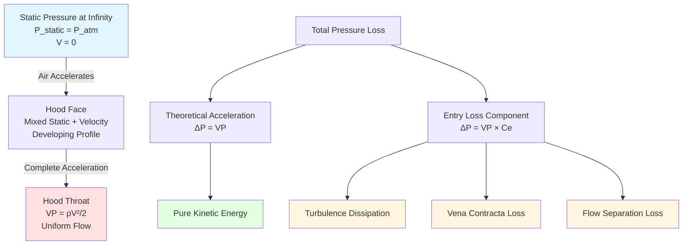

## Physical Basis of Acceleration Losses

When air enters an industrial exhaust hood, it accelerates from near-zero velocity in the surrounding workspace to the capture velocity required for contaminant control. This acceleration requires energy input from the fan system, manifesting as a pressure loss component in the hood static pressure calculation.

The acceleration loss represents the kinetic energy imparted to the airstream. Unlike friction losses that convert mechanical energy to heat, acceleration losses convert static pressure to velocity pressure. This fundamental distinction affects how we calculate total system losses.

## Velocity Pressure Relationship

The velocity pressure represents the kinetic energy per unit volume of the moving airstream:

$$VP = \frac{\rho V^2}{2}$$

Where:
- $VP$ = velocity pressure (Pa or in. w.g.)
- $\rho$ = air density (kg/m³ or lb/ft³)
- $V$ = air velocity (m/s or ft/min)

For standard air at 20°C (68°F) and sea level, this simplifies to:

$$VP = \left(\frac{V}{4005}\right)^2 \text{ (in SI units, V in m/s)}$$

$$VP = \left(\frac{V}{4005}\right)^2 \text{ (in IP units, V in ft/min)}$$

The exact constant depends on unit selection. In industrial ventilation practice using feet per minute and inches of water gauge:

$$VP = \left(\frac{V}{4005}\right)^2$$

## Hood Entry Loss Components

The total pressure loss at hood entry consists of two components:

$$\Delta P_{entry} = VP + VP \cdot C_e$$

Where:
- $\Delta P_{entry}$ = total hood entry loss
- $VP$ = velocity pressure at hood throat
- $C_e$ = entry loss coefficient (dimensionless)

This can be rewritten as:

$$\Delta P_{entry} = VP(1 + C_e)$$

The first term ($VP$) represents the pure acceleration loss—the minimum theoretical energy required to accelerate air from rest. The second term ($VP \cdot C_e$) represents additional losses due to turbulence, flow separation, and non-uniform velocity profiles at the hood entry.

## Entry Loss Coefficients by Hood Type

ACGIH Industrial Ventilation Manual provides entry loss coefficients based on hood geometry and design:

| Hood Type | Entry Coefficient ($C_e$) | Total Factor $(1 + C_e)$ | Flow Characteristics |
|-----------|---------------------------|--------------------------|----------------------|
| Plain opening (sharp edge) | 0.93 | 1.93 | Severe flow separation at edges |
| Flanged opening | 0.49 | 1.49 | Reduced separation with flange |
| Bell mouth (r/D = 0.2) | 0.04 | 1.04 | Smooth acceleration, minimal separation |
| Tapered entry (60° included angle) | 0.25 | 1.25 | Gradual acceleration |
| Slot hood (unflanged) | 1.78 | 2.78 | High turbulence at slot edges |
| Slot hood (flanged) | 0.49 | 1.49 | Flange reduces edge losses |

These coefficients reflect experimental data from full-scale hood testing. The plain opening represents the worst case, where sharp edges create vortices and flow separation. The bell mouth entry approaches the theoretical minimum, with the small additional loss due to boundary layer development.

## Physical Interpretation of Entry Coefficients

The entry coefficient quantifies energy dissipation mechanisms:

**Vena Contracta Formation**: At sharp-edged openings, the streamlines cannot negotiate the corner. The flow contracts to a smaller effective area inside the hood, then expands again. This contraction-expansion cycle dissipates energy through turbulent mixing.

**Flow Separation**: Poor entry geometry causes flow to separate from hood surfaces, creating recirculation zones. Energy dissipates in these turbulent regions.

**Velocity Profile Non-Uniformity**: Ideal acceleration assumes uniform velocity. Real flows develop non-uniform profiles, with higher velocities near the center. This non-uniformity increases the kinetic energy per unit mass flow compared to uniform flow.

## Acceleration Pressure Loss Diagram

## Calculation Example

Consider a plain circular opening hood with 12-inch diameter, exhausting 2000 CFM:

**Step 1**: Calculate throat velocity:

$$V = \frac{Q}{A} = \frac{2000 \text{ CFM}}{\pi(6/12)^2} = \frac{2000}{0.7854} = 2546 \text{ ft/min}$$

**Step 2**: Calculate velocity pressure:

$$VP = \left(\frac{2546}{4005}\right)^2 = 0.404 \text{ in. w.g.}$$

**Step 3**: Apply entry loss coefficient ($C_e = 0.93$ for plain opening):

$$\Delta P_{entry} = VP(1 + C_e) = 0.404(1 + 0.93) = 0.78 \text{ in. w.g.}$$

The acceleration component ($VP$) is 0.404 in. w.g., while the entry loss adds another 0.376 in. w.g., nearly doubling the total entry loss.

## Design Implications

**Hood Selection Impact**: Choosing a flanged hood over a plain opening reduces the entry loss coefficient from 0.93 to 0.49. For the example above, this reduces total entry loss from 0.78 to 0.60 in. w.g., a 23% reduction. Over the system's operating life, this translates to significant energy savings.

**Bell Mouth Optimization**: When space permits, bell mouth entries approach theoretical efficiency. The coefficient drops to 0.04, making total entry loss essentially equal to the unavoidable velocity pressure. This design is critical for high-velocity hoods where entry losses can dominate system resistance.

**Slot Hood Considerations**: Unflanged slot hoods exhibit the highest entry coefficients (1.78) due to three-dimensional flow separation at the slot perimeter. Always specify flanges for slot hoods to reduce this coefficient to 0.49.

## Relationship to Total Hood Static Pressure

The acceleration loss forms part of the hood static pressure (HSP):

$$HSP = VP(1 + C_e + \sum C_{duct})$$

Where $\sum C_{duct}$ includes downstream losses from duct entry, expansions, and other fittings. The acceleration term $(1 + C_e)$ typically represents 60-80% of total HSP for well-designed hoods with short takeoffs.

## ACGIH Design Method Application

ACGIH hood design tables incorporate these acceleration factors into hood static pressure values. When selecting a hood from ACGIH tables, the listed HSP already includes the appropriate entry loss coefficient for that hood type. Additional losses from duct transitions or non-standard configurations must be added separately.

For custom hood designs, calculate acceleration losses explicitly using the coefficients above, validated against ACGIH experimental data where possible. Always account for actual installation conditions, as nearby obstructions or non-standard orientations can increase effective entry coefficients beyond tabulated values.
